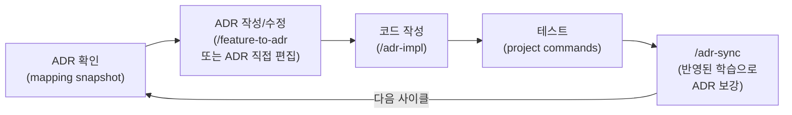

# ALPS Writer

[](https://www.npmjs.com/package/alps-writer)

ALPS Writer는 두 가지 형태로 제공됩니다.

1. **MCP server** (`alps-writer` on npm) — Claude Desktop, Cursor, Kiro 등 MCP 호환 클라이언트에서 ALPS (PRD)를 대화형으로 작성.
2. **Claude Code plugin** (이 저장소) — MCP server에 더해 ADR 변환·동기화 명령, ADR drift를 잡는 hook까지 묶어 ALPS → ADR → 코드 → 테스트 사이클을 강제.

## Features

- 9-section ALPS (PRD) template with structured XML templates and conversation guides
- Interactive Q&A workflow — AI asks focused questions, never auto-generates
- Document management — create, save, load, and export as clean Markdown
- Section dependency tracking — ensures referenced sections are reviewed first
- **ALPS → ADR conversion** — Section 7 feature를 `docs/adr/<category>/NNNN-*.md`로 자동 변환
- **PreToolUse hook** — 코드가 매핑된 ADR보다 새로우면 경고하거나 차단 (`ALPS_ADR_ENFORCE=block`)
- Works with Claude Desktop, Claude Code, Cursor, Kiro, and any MCP-compatible client

## Quick Start (Claude Code Plugin)

이 저장소를 Claude Code marketplace로 등록하면 MCP server + commands + hooks가 한 번에 설치됩니다.

```
/plugin marketplace add haandol/alps-writer-mcp
/plugin install alps-writer@alps-writer
```

### 개발 사이클



매 사이클마다 ADR이 코드를 따라 같이 진화하는 것이 목표입니다. 결정이 바뀌면 새 ADR을 추가하는 게 정상이고, 같은 카테고리 안에 ADR이 여럿 있는 것도 정상입니다. **같은 logical decision의 진화 history**가 여러 ADR로 분산되었을 때만 `/adr-rollup`으로 그 묶음을 단일 "현재 상태" ADR로 통합합니다.

### 명령어

| 명령                       | 역할                                                               |
| -------------------------- | ------------------------------------------------------------------ |
| `/alps-init`               | 신규 ALPS 문서 작성 (또는 기존 문서 이어쓰기)                      |
| `/adr-cycle [id]`          | 사이클 단일 진입점. 현재 상태 보고 다음 단계 선택                  |
| `/feature-to-adr [id]`     | ALPS Section 7 feature를 ADR 초안으로 변환 + 매핑 시드             |
| `/adr-impl <id>`           | ADR을 코드로 구현 (테스트 포함)                                    |
| `/adr-sync [id] [--quick]` | 코드와 ADR drift 검증·수정, 학습 반영                              |
| `/adr-rollup <id>`         | 같은 logical decision의 evolution history가 분산된 ADR 묶음만 통합 |

### Hook 동작

세 hook이 메인 Claude Code 세션을 지원합니다 — **외부 LLM 호출 없이**, 메인 모델이 텍스트를 직접 분류하고 의사결정합니다.

| Hook               | 시점                 | 역할                                                                        |
| ------------------ | -------------------- | --------------------------------------------------------------------------- |
| `SessionStart`     | 세션 시작 시 한 번   | ADR-first 사이클 규칙을 모델 컨텍스트에 주입                                |
| `UserPromptSubmit` | 매 사용자 발화       | `docs/adr/.mapping.json` 스냅샷을 모델 컨텍스트에 주입 (의도 분류는 모델이) |
| `PreToolUse`       | Edit/Write/MultiEdit | 매핑 누락·stale ADR·미커버 source 영역 감지 → warn (또는 block)             |

기본 모드는 `warn`. 강제력을 높이려면 셸에서 `ALPS_ADR_ENFORCE=block`을 export하면 hook이 stale/미매핑 source 수정 시 exit 2로 차단합니다 (모델 컨텍스트로 사유 전달 → self-correct).

### 매핑 파일

`docs/adr/.mapping.json`이 ALPS feature ↔ ADR ↔ 코드 경로의 single source of truth입니다. 스키마는 [`templates/adr/mapping.schema.json`](./templates/adr/mapping.schema.json) 참조. `/feature-to-adr`이 자동 갱신합니다.

## Quick Start (MCP only)

플러그인 없이 MCP server만 사용하려면:

```json
{
  "mcpServers": {
    "alps-writer": {
      "command": "npx",
      "args": ["-y", "alps-writer"]
    }
  }
}
```

### Client Setup

| Client             | Config location                                                                                     |
| ------------------ | --------------------------------------------------------------------------------------------------- |
| **Claude Desktop** | Settings > Developer > Edit Config (`claude_desktop_config.json`)                                   |
| **Claude Code**    | `claude mcp add alps-writer -- npx -y alps-writer`                                                  |
| **Cursor**         | Settings > Features > MCP Servers > + Add new global MCP server                                     |
| **Kiro**           | `Cmd+Shift+P` > "Kiro: Open user MCP config (JSON)" (`~/.kiro/settings/mcp.json`)                   |
| **Kiro CLI**       | `kiro-cli mcp add --name alps-writer --command npx --args "-y" --args "alps-writer" --scope global` |

### Environment Variables

| Variable          | Description                                                   | Default      |
| ----------------- | ------------------------------------------------------------- | ------------ |
| `ALPS_OUTPUT_DIR` | Directory for document files (`.alps.xml`, exported markdown) | `<cwd>/prd/` |

Config example with `ALPS_OUTPUT_DIR`:

```json
{
  "mcpServers": {
    "alps-writer": {
      "command": "npx",
      "args": ["-y", "alps-writer"],
      "env": {
        "ALPS_OUTPUT_DIR": "~/Documents/alps"
      }
    }
  }
}
```

## Available Tools

### Template Tools

| Tool                     | Description                                            |
| ------------------------ | ------------------------------------------------------ |
| `get_alps_overview`      | Get the ALPS template overview with conversation guide |
| `list_alps_sections`     | List all available template sections                   |
| `get_alps_section`       | Get a specific template section by number (1-9)        |
| `get_alps_full_template` | Get the complete template with all sections            |
| `get_alps_section_guide` | Get conversation guide for writing a section           |

### Document Management Tools

| Tool                       | Description                                 |
| -------------------------- | ------------------------------------------- |
| `init_alps_document`       | Create a new ALPS document (`.alps.xml`)    |
| `load_alps_document`       | Load an existing document to resume editing |
| `save_alps_section`        | Save content to a specific subsection       |
| `read_alps_section`        | Read current content of a section           |
| `get_alps_document_status` | Get status of all sections                  |
| `export_alps_markdown`     | Export as clean Markdown                    |

## Workflow

The server guides AI through a structured workflow:

1. **Initialize** — `init_alps_document()` or `load_alps_document()`
2. **Overview** — `get_alps_overview()` to get the conversation guide
3. **For each section (1-9):**
   - `get_alps_section_guide(N)` — get questions and criteria
   - `get_alps_section(N)` — get the template structure
   - Ask focused questions (1-2 at a time)
   - `save_alps_section(N, ...)` — save after user confirmation
4. **Export** — `export_alps_markdown()` for the final document

## ALPS Sections

| #   | Section                     | Dependencies |
| --- | --------------------------- | ------------ |
| 1   | Overview                    | —            |
| 2   | MVP Goals and Key Metrics   | —            |
| 3   | Demo Scenario               | Section 2    |
| 4   | High-Level Architecture     | —            |
| 5   | Design Specification        | Section 6    |
| 6   | Requirements Summary        | —            |
| 7   | Feature-Level Specification | Section 6    |
| 8   | MVP Metrics                 | Section 2, 6 |
| 9   | Out of Scope                | —            |

## Development

### Running from Source

```bash
git clone https://github.com/haandol/alps-writer-mcp.git
cd alps-writer-mcp
pnpm install
pnpm build
```

Then configure your MCP client:

```json
{
  "mcpServers": {
    "alps-writer": {
      "command": "node",
      "args": ["/path/to/alps-writer-mcp/dist/index.js"]
    }
  }
}
```

### Commands

```bash
pnpm install    # Install dependencies
pnpm dev        # Run with tsx (watch mode)
pnpm build      # Build for production
pnpm start      # Run built version
```

## License

MIT
