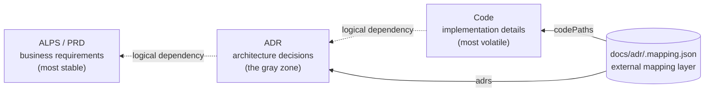
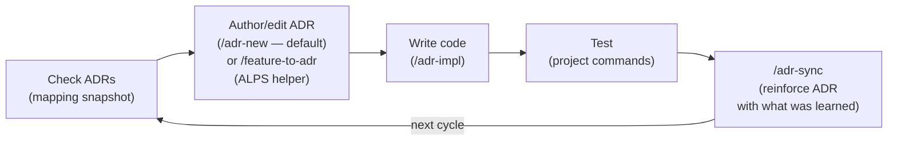

# ALPS Writer Plugins

[](https://www.npmjs.com/package/alps-writer)
[](./LICENSE)

This repository is a Claude Code **marketplace** that ships two independent plugins:

| Plugin                  | Scope                                                                                                                     | Depends on                       |
| ----------------------- | ------------------------------------------------------------------------------------------------------------------------- | -------------------------------- |
| **`alps-writer`** (PRD) | Write ALPS (PRD) documents conversationally via an MCP server. Bridges Section 7 features to ADRs with `/feature-to-adr`. | adr-writer (only for the bridge) |
| **`adr-writer`** (ADR)  | ADR-driven development: author with `/adr-new`, implement with `/adr-impl`, sync with `/adr-sync`, drift hooks.           | nothing — fully standalone       |

The two are split so that **adr-writer never references ALPS** — once a feature is imported, the ADR lifecycle is entirely independent of any PRD. The only coupling is one-way (`alps-writer → adr-writer`), via the `/feature-to-adr` bridge.

The PRD plugin's MCP server is also published standalone on npm as [`alps-writer`](https://www.npmjs.com/package/alps-writer) — usable in Claude Desktop, Cursor, Kiro, or any MCP client without the plugin.

## Table of contents

- [What is ALPS?](#what-is-alps)
- [Dependency model — PRD → ADR → code](#dependency-model--prd--adr--code)
- [Repository layout](#repository-layout)
- [Features](#features)
- [Quick Start (Claude Code plugins)](#quick-start-claude-code-plugins)
- [Quick Start (MCP only)](#quick-start-mcp-only)
- [Development](#development)
- [Contributing](#contributing)
- [License](#license)

## What is ALPS?

**ALPS** (Agentic Lean Product Spec) is a PRD format built for agentic development. A traditional PRD assumes a human reader who fills in gaps from intuition; ALPS assumes an AI agent that needs an unambiguous specification to write reliable code.

It addresses two recurring failure modes:

- **No standard format** — every team invents a different PRD shape, so agents waste tokens guessing what the document asserts.
- **Quality bound to the author's skill** — a less experienced writer produces a PRD the agent over-interprets, and code quality follows.

ALPS fixes the format (9 sections, explicit dependencies, vertical-slice features) and inverts the authoring loop: the **agent asks focused questions, the human answers**, with no section saved without confirmation. Out of Scope is a first-class section so the agent knows what _not_ to build.

See [`plugins/alps-writer/templates/alps/about-alps.md`](./plugins/alps-writer/templates/alps/about-alps.md) for the full design rationale, the role of each section, and how ALPS feeds into the ADR-driven cycle.

## Dependency model — PRD → ADR → code

ALPS (PRD), ADRs, and code form a one-way dependency chain. Each layer depends on the layer above it **logically**, but **never references it physically**.



The dotted arrows are **logical** — only `.mapping.json` (the solid arrows) holds physical references. Renames and ADR restructures (split / rollup / supersede) are absorbed by the mapping file, so neither code nor ADR bodies need to change in lockstep with the other.

- **Logical dependency (dotted arrows)**: code is written to satisfy ADRs; ADRs are written to satisfy the PRD. When an inner layer changes, outer layers may need to change. The reverse never happens — if a code refactor forces an ADR rewrite, the ADR was carrying implementation detail it shouldn't have.
- **No physical references in either direction**:
  - **ADR → code**: ADRs reference folders, never files / functions / line numbers (see [Code reference depth — folders only](./plugins/adr-writer/templates/adr/README.md#코드-참조-깊이--폴더-단위까지만)). Otherwise every rename or refactor forces ADR edits.
  - **Code → ADR**: code does not embed ADR IDs or paths in comments, constants, or imports. ADR numbers move (split, rollup, supersede); if those IDs are baked into code, restructuring ADRs forces matching code edits even when the decision is unchanged. When the **decision itself** changes, code changes — that's the entire point of the dependency.
  - **ADR → PRD**: ADRs link to PRD features, but never copy user stories or acceptance criteria. Linking only.
- **Linking lives in an external mapping layer**: `docs/adr/.mapping.json` is the single place that records ADR ↔ code-path ↔ ALPS-feature relationships. Both sides stay clean; renames and restructures are absorbed by the mapping file. The `PreToolUse` hook reads this mapping (not the code itself) to find the relevant ADR for an edit.

**Stability gradient as the litmus test**: change frequency must slope one way — `Code >> ADR >> PRD`. If a change in the volatile layer drags the stable layer with it, an arrow is drawn the wrong way and something needs to be pushed back to its proper layer.

This split is mirrored in the packaging: **alps-writer** owns the PRD layer, **adr-writer** owns the ADR layer, and the `.mapping.json` that links them lives in the user's own `docs/adr/` — never inside either plugin.

## Repository layout

```
alps-writer-plugins/                 # marketplace root (this repo)
├── .claude-plugin/marketplace.json  # registers both plugins
└── plugins/
    ├── alps-writer/                 # PRD plugin + the published npm MCP server
    │   ├── .claude-plugin/plugin.json
    │   ├── package.json             # → published to npm as `alps-writer`
    │   ├── src/                     # MCP server (TypeScript)
    │   ├── skills/                  # /alps-init, /feature-to-adr
    │   └── templates/alps/
    └── adr-writer/                  # ADR plugin (standalone, ALPS-agnostic)
        ├── .claude-plugin/plugin.json
        ├── skills/                  # /adr-new, /adr-impl, /adr-sync, /adr-rollup, /adr-manage
        ├── agents/                  # adr-reviewer subagent
        ├── hooks/                   # ADR-drift hooks
        └── templates/adr/
```

## Features

**alps-writer (PRD)**

- 9-section ALPS (PRD) template with structured XML templates and conversation guides
- Interactive Q&A workflow — AI asks focused questions, never auto-generates
- Document management — create, save, load, and export as clean Markdown
- Section dependency tracking — ensures referenced sections are reviewed first
- **ALPS → ADR bridge** — `/feature-to-adr` imports Section 7 features into ADRs by delegating to adr-writer's `/adr-new`
- Works with Claude Desktop, Claude Code, Cursor, Kiro, and any MCP-compatible client (MCP server only)

**adr-writer (ADR)**

- **ADR-driven development cycle** — author ADRs directly with `/adr-new`, implement them with `/adr-impl`, and keep them in sync with `/adr-sync`
- **ADR-drift hooks** — warn or block (`ALPS_ADR_ENFORCE=block`) when code is newer than its mapped ADR
- Fully standalone — no ALPS PRD required

## Quick Start (Claude Code plugins)

Register this repository as a Claude Code marketplace, then install whichever plugins you want. They are independent — install one or both.

```
/plugin marketplace add haandol/alps-writer-plugins
/plugin install alps-writer@alps-writer   # PRD authoring (MCP server + /alps-init, /feature-to-adr)
/plugin install adr-writer@alps-writer    # ADR cycle (/adr-new, /adr-impl, /adr-sync, hooks)
```

> `/feature-to-adr` (in alps-writer) delegates ADR authoring to `/adr-new` (in adr-writer), so install **both** if you want the ALPS → ADR bridge. adr-writer on its own works without any ALPS PRD.

### Development cycle



ADRs are the primary artifact this plugin manages. The default authoring path is `/adr-new <category>` — write the decision directly, with or without an ALPS PRD. `/feature-to-adr` is a helper layered on top: when you already have an ALPS Section 7 feature, it converts each feature into a Proposed ADR in one pass.

The goal is for ADRs to evolve alongside the code each cycle. Adding a new ADR when a decision changes is normal, and having multiple ADRs in the same category is normal too. Only when **the evolution history of a single logical decision** is scattered across several ADRs do you use `/adr-rollup` to consolidate that group into a single "current state" ADR.

### Slash commands

**alps-writer**

| Command                | Role                                                                                                             |
| ---------------------- | ---------------------------------------------------------------------------------------------------------------- |
| `/alps-init`           | Author a new ALPS document (or resume an existing one)                                                           |
| `/feature-to-adr [id]` | _Bridge_: import an ALPS Section 7 feature into a Proposed ADR by delegating to `/adr-new` (requires adr-writer) |

**adr-writer**

| Command                    | Role                                                                                                  |
| -------------------------- | ----------------------------------------------------------------------------------------------------- |
| `/adr-new <category>`      | Author a new ADR directly — the default path, no ALPS PRD required                                    |
| `/adr-impl [id]`           | Implement an ADR in code (including tests). With no `id`, lists Proposed ADRs and asks which to build |
| `/adr-sync [id] [--quick]` | Detect/repair drift between code and ADR, and absorb new learnings                                    |
| `/adr-rollup <id>`         | Consolidate only ADR groups whose evolution history of one logical decision is split                  |

### Hook behavior

Two hooks support the main Claude Code session — **with no external LLM calls**; the main model classifies text and makes decisions itself.

| Hook               | When it fires        | Role                                                                                                                                                  |
| ------------------ | -------------------- | ----------------------------------------------------------------------------------------------------------------------------------------------------- |
| `UserPromptSubmit` | Every user message   | Inject the ADR-first directive + `docs/adr/.mapping.json` snapshot every turn (survives session compaction, unlike a one-shot SessionStart injection) |
| `PreToolUse`       | Edit/Write/MultiEdit | Detect missing mappings, stale ADRs, and uncovered source areas → warn (or block)                                                                     |

Default mode is `warn`. To enforce more strictly, export `ALPS_ADR_ENFORCE=block` in your shell — the hook will then block edits to stale or unmapped sources with exit 2 (passing the reason through the model context so it can self-correct).

### Mapping file

`docs/adr/.mapping.json` is the single source of truth for the ADR ↔ code path (and optional ALPS feature) relationships. See the schema at [`plugins/adr-writer/templates/adr/mapping.schema.json`](./plugins/adr-writer/templates/adr/mapping.schema.json). `/adr-new` fills the ADR ↔ code-path fields; `/feature-to-adr` additionally backfills the ALPS link fields (`alpsDocument`, `alpsFeatureId`).

## Quick Start (MCP only)

To use the MCP server without the plugin:

```json
{
  "mcpServers": {
    "alps-writer": {
      "command": "npx",
      "args": ["-y", "alps-writer"]
    }
  }
}
```

### Client setup

| Client             | Config location                                                                                     |
| ------------------ | --------------------------------------------------------------------------------------------------- |
| **Claude Desktop** | Settings > Developer > Edit Config (`claude_desktop_config.json`)                                   |
| **Claude Code**    | `claude mcp add alps-writer -- npx -y alps-writer`                                                  |
| **Cursor**         | Settings > Features > MCP Servers > + Add new global MCP server                                     |
| **Kiro**           | `Cmd+Shift+P` > "Kiro: Open user MCP config (JSON)" (`~/.kiro/settings/mcp.json`)                   |
| **Kiro CLI**       | `kiro-cli mcp add --name alps-writer --command npx --args "-y" --args "alps-writer" --scope global` |

### Environment variables

| Variable           | Scope            | Description                                                                                                | Default                  |
| ------------------ | ---------------- | ---------------------------------------------------------------------------------------------------------- | ------------------------ |
| `ALPS_OUTPUT_DIR`  | alps-writer MCP  | Directory for document files (`.alps.xml`, exported markdown). `PRD_OUTPUT_DIR` also accepted (legacy).    | `<cwd>/prd/`             |
| `ALPS_ADR_ENFORCE` | adr-writer hooks | `warn` (default) surfaces drift to stderr; `block` makes `PreToolUse` deny edits to stale/unmapped source. | `warn`                   |
| `ALPS_ADR_MAPPING` | adr-writer hooks | Path (relative to project root) to the ADR mapping file consumed by hooks.                                 | `docs/adr/.mapping.json` |

Config example with `ALPS_OUTPUT_DIR`:

```json
{
  "mcpServers": {
    "alps-writer": {
      "command": "npx",
      "args": ["-y", "alps-writer"],
      "env": {
        "ALPS_OUTPUT_DIR": "~/Documents/alps"
      }
    }
  }
}
```

### MCP tools

**Template tools**

| Tool                     | Description                                            |
| ------------------------ | ------------------------------------------------------ |
| `get_alps_overview`      | Get the ALPS template overview with conversation guide |
| `list_alps_sections`     | List all available template sections                   |
| `get_alps_section`       | Get a specific template section by number (1–9)        |
| `get_alps_full_template` | Get the complete template with all sections            |
| `get_alps_section_guide` | Get the conversation guide for writing a section       |

**Document management tools**

| Tool                       | Description                                 |
| -------------------------- | ------------------------------------------- |
| `init_alps_document`       | Create a new ALPS document (`.alps.xml`)    |
| `load_alps_document`       | Load an existing document to resume editing |
| `save_alps_section`        | Save content to a specific subsection       |
| `read_alps_section`        | Read the current content of a section       |
| `get_alps_document_status` | Get the status of all sections              |
| `export_alps_markdown`     | Export as clean Markdown                    |

## Development

### Running from source

```bash
git clone https://github.com/haandol/alps-writer-plugins.git
cd alps-writer-plugins
pnpm install
pnpm build           # builds the alps-writer MCP server
```

Then configure your MCP client to point at the local build:

```json
{
  "mcpServers": {
    "alps-writer": {
      "command": "node",
      "args": ["/path/to/alps-writer-plugins/plugins/alps-writer/dist/index.js"]
    }
  }
}
```

### Build scripts

This is a pnpm workspace. The MCP server lives in `plugins/alps-writer/`; root scripts proxy to it.

```bash
pnpm install        # Install dependencies (whole workspace)
pnpm build          # Build the alps-writer MCP server (--filter alps-writer)
pnpm lint           # ESLint the MCP server
pnpm format         # Prettier across the repo

# Or work inside the package directly:
pnpm --filter alps-writer dev     # Run with tsx (watch mode)
pnpm --filter alps-writer start   # Run the built version
```

## Contributing

Contributions are welcome. Before opening a PR:

1. Read [`CONTRIBUTING.md`](./CONTRIBUTING.md) for commit message convention (Conventional Commits), branch naming, and code style.
2. Open an issue first for substantial changes so we can align on direction.
3. Make sure `pnpm lint` and `pnpm format:check` pass.
4. Keep commits atomic — one logical change per commit.

Bug reports and feature requests: [GitHub Issues](https://github.com/haandol/alps-writer-plugins/issues).

## License

[MIT](./LICENSE)
