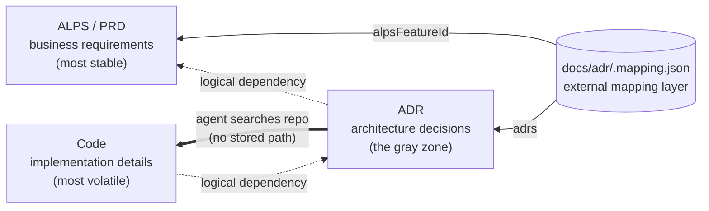
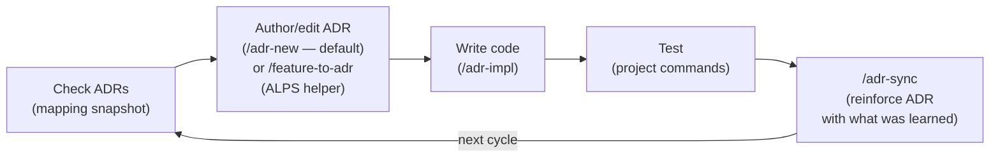

# ALPS Writer Plugins

[](./LICENSE)

This repository is a Claude Code **marketplace** that ships two independent plugins. Both install from the marketplace alone — **no npm, no npx, no separate build step** for end users. The alps-writer MCP server is bundled (dependencies inlined) and committed at `plugins/alps-writer/dist/`, so installing the plugin is everything you need.

| Plugin                  | Scope                                                                                                                               | Depends on                       |
| ----------------------- | ----------------------------------------------------------------------------------------------------------------------------------- | -------------------------------- |
| **`alps-writer`** (PRD) | Write ALPS (PRD) documents conversationally via a bundled MCP server. Bridges Section 7 features to ADRs with `/feature-to-adr`.    | adr-writer (only for the bridge) |
| **`adr-writer`** (ADR)  | ADR-driven development: author with `/adr-new`, implement with `/adr-impl`, sync with `/adr-sync`; an ADR-first hook on every turn. | nothing — fully standalone       |

The two are split so that **adr-writer never references ALPS** — once a feature is imported, the ADR lifecycle is entirely independent of any PRD. The only coupling is one-way (`alps-writer → adr-writer`), via the `/feature-to-adr` bridge.

## Table of contents

- [What is ALPS?](#what-is-alps)
- [Dependency model — PRD → ADR → code](#dependency-model--prd--adr--code)
- [Repository layout](#repository-layout)
- [Features](#features)
- [Quick Start (Claude Code plugins)](#quick-start-claude-code-plugins)
- [Using the MCP server in other clients](#using-the-mcp-server-in-other-clients)
- [Development](#development)
- [Contributing](#contributing)
- [License](#license)

## What is ALPS?

**ALPS** (Agentic Lean Product Spec) is a PRD format built for agentic development. A traditional PRD assumes a human reader who fills in gaps from intuition; ALPS assumes an AI agent that needs an unambiguous specification to write reliable code.

It addresses two recurring failure modes:

- **No standard format** — every team invents a different PRD shape, so agents waste tokens guessing what the document asserts.
- **Quality bound to the author's skill** — a less experienced writer produces a PRD the agent over-interprets, and code quality follows.

ALPS fixes the format (9 sections, explicit dependencies, vertical-slice features) and inverts the authoring loop: the **agent asks focused questions, the human answers**, with no section saved without confirmation. Out of Scope is a first-class section so the agent knows what _not_ to build.

See [`plugins/alps-writer/templates/alps/about-alps.md`](./plugins/alps-writer/templates/alps/about-alps.md) for the full design rationale, the role of each section, and how ALPS feeds into the ADR-driven cycle.

## Dependency model — PRD → ADR → code

ALPS (PRD), ADRs, and code form a one-way dependency chain. Each layer depends on the layer above it **logically**, but **never references it physically**.



The dotted arrows are **logical**. `.mapping.json` (the solid arrows) records only the ALPS-feature ↔ ADR link. The ADR → code link is **not stored anywhere** — an agent finds the code an ADR governs by reading the ADR and searching the repo (the double arrow). This is deliberate: a large refactor would otherwise force you to chase stored code paths through every ADR, dragging the stable layer behind the volatile one.

- **Logical dependency (dotted arrows)**: code is written to satisfy ADRs; ADRs are written to satisfy the PRD. When an inner layer changes, outer layers follow — a PRD change propagates to ADRs and code; an ADR decision change propagates to code. The reverse never happens — if a code refactor forces an ADR rewrite, the ADR was carrying implementation detail it shouldn't have; if an ADR edit forces a PRD rewrite, the ADR was holding a PRD reference it shouldn't have.
- **No physical references in any direction** — not just ADR↔code, but ADR↔PRD too:
  - **ADR → code**: ADR bodies don't reference files / functions / line numbers — at most a folder when unavoidable (see [Code reference depth — folders only](./plugins/adr-writer/templates/adr/README.md#코드-참조-깊이--폴더-단위까지만)), and the mapping stores no code paths at all. The code an ADR governs is located by reading the ADR and searching the repo, so a rename or refactor never forces an ADR or mapping edit.
  - **Code → ADR**: code does not embed ADR IDs or paths in comments, constants, or imports. ADR numbers move (split, rollup, supersede); if those IDs are baked into code, restructuring ADRs forces matching code edits even when the decision is unchanged. When the **decision itself** changes, code changes — that's the entire point of the dependency.
  - **ADR → PRD**: ADR bodies (Context and Related included) do **not** embed ALPS paths, section numbers, or feature-ids, and never copy user stories or acceptance criteria. An ADR _absorbs_ the PRD's motivation but does not _point at_ it — when a PRD feature is split / renumbered / restructured, a physical reference would force ADR edits even though the decision is unchanged.
  - **PRD → ADR**: the ALPS document never names specific ADR IDs or paths. It is the most stable contract and is unaware of its downstream artifacts.
- **Linking lives in an external mapping layer**: `docs/adr/.mapping.json` is the single place that records the ALPS-feature ↔ ADR link (`alpsDocument` / `alpsFeatureId` / `adrs`). It deliberately does **not** store code paths — the ADR ↔ code link is resolved on demand by searching the repo. The PRD and ADR bodies stay clean; ADR restructures (split / rollup / supersede) are absorbed by the mapping file, and code refactors touch neither the mapping nor the ADRs.

**Stability gradient as the litmus test**: change frequency must slope one way — `Code >> ADR >> PRD`. If a change in the volatile layer drags the stable layer with it, an arrow is drawn the wrong way and something needs to be pushed back to its proper layer. "Code is source of truth" therefore applies only to **implementation facts** (API shapes, field names, Status) — the **gray-zone decisions** (rationale, domain rules, state transitions, fallbacks) remain the ADR's authority, and code that contradicts them is a decision change to record in the ADR, not a fact to copy back from code.

This split is mirrored in the packaging: **alps-writer** owns the PRD layer, **adr-writer** owns the ADR layer, and the `.mapping.json` that links them lives in the user's own `docs/adr/` — never inside either plugin.

## Repository layout

```
alps-writer-plugins/                 # marketplace root (this repo)
├── .claude-plugin/marketplace.json  # registers both plugins
└── plugins/
    ├── alps-writer/                 # PRD plugin (bundles its own MCP server)
    │   ├── .claude-plugin/plugin.json   # mcpServers → node dist/index.js
    │   ├── package.json             # private; build tooling for the bundle
    │   ├── src/                     # MCP server source (TypeScript)
    │   ├── dist/                    # committed bundle (index.js + assets) — runs as-is
    │   ├── skills/                  # /alps-init, /feature-to-adr
    │   └── templates/alps/
    └── adr-writer/                  # ADR plugin (standalone, ALPS-agnostic)
        ├── .claude-plugin/plugin.json
        ├── skills/                  # /adr-new, /adr-impl, /adr-sync, /adr-rollup
        ├── agents/                  # adr-reviewer subagent
        ├── hooks/                   # ADR-first directive hook (UserPromptSubmit)
        └── templates/adr/
```

## Features

**alps-writer (PRD)**

- 9-section ALPS (PRD) template with structured XML templates and conversation guides
- Interactive Q&A workflow — AI asks focused questions, never auto-generates
- Document management — create, save, load, and export as clean Markdown
- Section dependency tracking — ensures referenced sections are reviewed first
- **ALPS → ADR bridge** — `/feature-to-adr` imports Section 7 features into ADRs by delegating to adr-writer's `/adr-new`
- Works with Claude Desktop, Claude Code, Cursor, Kiro, and any MCP-compatible client (MCP server only)

**adr-writer (ADR)**

- **ADR-driven development cycle** — author ADRs directly with `/adr-new`, implement them with `/adr-impl`, and keep them in sync with `/adr-sync`
- **ADR-first hook** — every user turn re-injects the ADR-first directive + current `docs/adr/.mapping.json` snapshot, so the agent checks ADRs before changing behavior
- Fully standalone — no ALPS PRD required

## Quick Start (Claude Code plugins)

Register this repository as a Claude Code marketplace, then install whichever plugins you want. They are independent — install one or both.

```
/plugin marketplace add haandol/alps-writer-plugins
/plugin install alps-writer@alps-writer   # PRD authoring (MCP server + /alps-init, /feature-to-adr)
/plugin install adr-writer@alps-writer    # ADR cycle (/adr-new, /adr-impl, /adr-sync, hooks)
```

> `/feature-to-adr` (in alps-writer) delegates ADR authoring to `/adr-new` (in adr-writer), so install **both** if you want the ALPS → ADR bridge. adr-writer on its own works without any ALPS PRD.

### Development cycle



ADRs are the primary artifact the adr-writer plugin manages. The default authoring path is `/adr-new <category>` — write the decision directly, with or without an ALPS PRD. `/feature-to-adr` (alps-writer) is a bridge layered on top: when you already have an ALPS Section 7 feature, it imports each feature into a Proposed ADR by delegating to `/adr-new`.

The goal is for ADRs to evolve alongside the code each cycle. Adding a new ADR when a decision changes is normal, and having multiple ADRs in the same category is normal too. Only when **the evolution history of a single logical decision** is scattered across several ADRs do you use `/adr-rollup` to consolidate that group into a single "current state" ADR.

### Usage walkthroughs

**A. PRD-first — start from an ALPS spec (both plugins)**

1. `/alps-init` → answer the focused questions section by section; the agent saves each only after you confirm.
2. After Section 7 (feature specs), run `/feature-to-adr` → it walks each feature and hands it to `/adr-new`, producing a `Proposed` ADR per feature under `docs/adr/<category>/` and seeding `docs/adr/.mapping.json`.
3. `/adr-impl <id>` → implement an accepted-in-spirit ADR in code + tests. On success it flips the ADR to `Accepted`.
4. `/adr-sync` at the end of a cycle → fold what you learned back into the ADRs and repair any drift.

`/feature-to-adr` is a **one-time import**: it converts each Section 7 feature into an ADR once. After that the decision is managed at the ADR level — if the PRD later changes, edit the affected ADR directly (or supersede it with a new one) rather than re-importing.

**B. ADR-only — no PRD (adr-writer standalone)**

1. `/adr-new <category>` → describe the decision directly (refactor, infra choice, new feature direction). No ALPS document required.
2. `/adr-impl <id>` → build it in code.
3. As you keep working, the ADR-first hook re-injects the ADR map every turn so the agent checks ADRs before changing behavior. Run `/adr-sync` to reconcile ADRs with shipping code.

In both flows the hook runs automatically once adr-writer is installed — every user turn re-injects the ADR map and the ADR-first directive.

### Slash commands

**alps-writer**

| Command                | Role                                                                                                             |
| ---------------------- | ---------------------------------------------------------------------------------------------------------------- |
| `/alps-init`           | Author a new ALPS document (or resume an existing one)                                                           |
| `/feature-to-adr [id]` | _Bridge_: import an ALPS Section 7 feature into a Proposed ADR by delegating to `/adr-new` (requires adr-writer) |

**adr-writer**

| Command                    | Role                                                                                                  |
| -------------------------- | ----------------------------------------------------------------------------------------------------- |
| `/adr-new <category>`      | Author a new ADR directly — the default path, no ALPS PRD required                                    |
| `/adr-impl [id]`           | Implement an ADR in code (including tests). With no `id`, lists Proposed ADRs and asks which to build |
| `/adr-sync [id] [--quick]` | Detect/repair drift between code and ADR, and absorb new learnings                                    |
| `/adr-rollup <id>`         | Consolidate only ADR groups whose evolution history of one logical decision is split                  |

### Hook behavior

One hook supports the main Claude Code session — **with no external LLM calls**; the main model classifies text and makes decisions itself.

| Hook               | When it fires      | Role                                                                                                                                                  |
| ------------------ | ------------------ | ----------------------------------------------------------------------------------------------------------------------------------------------------- |
| `UserPromptSubmit` | Every user message | Inject the ADR-first directive + `docs/adr/.mapping.json` snapshot every turn (survives session compaction, unlike a one-shot SessionStart injection) |

The directive tells the model: when a request adds or changes behavior, read the relevant ADRs (or author one with `/adr-new`) before touching code. Classification is left to the main model — the hook never blocks an edit; keeping the PRD → ADR → code flow intact is the model's job, prompted every turn.

### Mapping file

`docs/adr/.mapping.json` records the ALPS-feature ↔ ADR link only — it stores no code paths, and no artifact references another in its own body. See the schema at [`plugins/adr-writer/templates/adr/mapping.schema.json`](./plugins/adr-writer/templates/adr/mapping.schema.json). `/adr-new` creates the category entry (`feature`, `adrs`); `/feature-to-adr` additionally backfills the ALPS link fields (`alpsDocument`, `alpsFeatureId`, `dependsOn`). The code an ADR governs is found by reading the ADR and searching the repo, not stored here.

## Using the MCP server in other clients

Inside Claude Code, installing the alps-writer plugin wires up the MCP server automatically — nothing to configure. To use the same server in another MCP client (Claude Desktop, Cursor, Kiro, …), point it at the bundled `dist/index.js`. Build it once from source:

```bash
git clone https://github.com/haandol/alps-writer-plugins.git
cd alps-writer-plugins
pnpm install && pnpm build      # produces plugins/alps-writer/dist/index.js
```

Then register the absolute path:

```json
{
  "mcpServers": {
    "alps-writer": {
      "command": "node",
      "args": ["/path/to/alps-writer-plugins/plugins/alps-writer/dist/index.js"]
    }
  }
}
```

The bundle inlines its dependencies, so it runs with a plain Node.js >= 20 — no `npm install` in the target location.

### Environment variables

| Variable           | Scope           | Description                                                                                             | Default                  |
| ------------------ | --------------- | ------------------------------------------------------------------------------------------------------- | ------------------------ |
| `ALPS_OUTPUT_DIR`  | alps-writer MCP | Directory for document files (`.alps.xml`, exported markdown). `PRD_OUTPUT_DIR` also accepted (legacy). | `<cwd>/prd/`             |
| `ALPS_ADR_MAPPING` | adr-writer hook | Path (relative to project root) to the ADR mapping file read by the ADR-first hook.                     | `docs/adr/.mapping.json` |

Config example with `ALPS_OUTPUT_DIR`:

```json
{
  "mcpServers": {
    "alps-writer": {
      "command": "node",
      "args": ["/path/to/alps-writer-plugins/plugins/alps-writer/dist/index.js"],
      "env": {
        "ALPS_OUTPUT_DIR": "~/Documents/alps"
      }
    }
  }
}
```

### MCP tools

**Template tools**

| Tool                     | Description                                            |
| ------------------------ | ------------------------------------------------------ |
| `get_alps_overview`      | Get the ALPS template overview with conversation guide |
| `list_alps_sections`     | List all available template sections                   |
| `get_alps_section`       | Get a specific template section by number (1–9)        |
| `get_alps_full_template` | Get the complete template with all sections            |
| `get_alps_section_guide` | Get the conversation guide for writing a section       |

**Document management tools**

| Tool                       | Description                                 |
| -------------------------- | ------------------------------------------- |
| `init_alps_document`       | Create a new ALPS document (`.alps.xml`)    |
| `load_alps_document`       | Load an existing document to resume editing |
| `save_alps_section`        | Save content to a specific subsection       |
| `read_alps_section`        | Read the current content of a section       |
| `get_alps_document_status` | Get the status of all sections              |
| `export_alps_markdown`     | Export as clean Markdown                    |

## Development

This is a pnpm workspace. The MCP server lives in `plugins/alps-writer/`; root scripts proxy to it.

```bash
pnpm install        # Install dependencies (whole workspace)
pnpm build          # Bundle the alps-writer MCP server into plugins/alps-writer/dist/
pnpm lint           # ESLint the MCP server
pnpm format         # Prettier across the repo

# Or work inside the package directly:
pnpm --filter alps-writer dev     # Run with tsx (watch mode)
pnpm --filter alps-writer start   # Run the built bundle
```

> **The bundle is committed.** `plugins/alps-writer/dist/` is checked into git (esbuild output with dependencies inlined) so the plugin runs from a marketplace install with no build step. **Whenever you change `src/`, run `pnpm build` and commit the regenerated `dist/`.**

## Contributing

Contributions are welcome. Before opening a PR:

1. Read [`CONTRIBUTING.md`](./CONTRIBUTING.md) for commit message convention (Conventional Commits), branch naming, and code style.
2. Open an issue first for substantial changes so we can align on direction.
3. Make sure `pnpm lint` and `pnpm format:check` pass.
4. Keep commits atomic — one logical change per commit.

Bug reports and feature requests: [GitHub Issues](https://github.com/haandol/alps-writer-plugins/issues).

## License

[MIT](./LICENSE)
