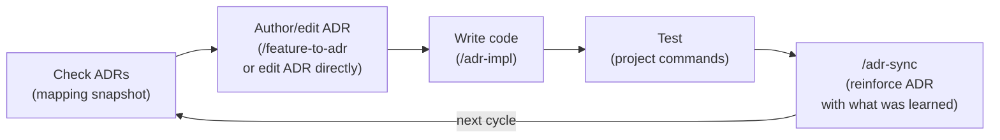

# ALPS Writer

[](https://www.npmjs.com/package/alps-writer)
[](./LICENSE)

ALPS Writer is available in two forms:

1. **MCP server** (`alps-writer` on npm) — write ALPS (PRD) documents conversationally in Claude Desktop, Cursor, Kiro, or any MCP-compatible client.
2. **Claude Code plugin** (this repository) — bundles the MCP server with ADR conversion/sync commands and ADR-drift hooks to enforce the ALPS → ADR → code → test cycle.

## Table of contents

- [What is ALPS?](#what-is-alps)
- [Features](#features)
- [Quick Start (Claude Code Plugin)](#quick-start-claude-code-plugin)
- [Quick Start (MCP only)](#quick-start-mcp-only)
- [Development](#development)
- [Contributing](#contributing)
- [License](#license)

## What is ALPS?

**ALPS** (Agentic Lean Product Spec) is a PRD format built for agentic development. A traditional PRD assumes a human reader who fills in gaps from intuition; ALPS assumes an AI agent that needs an unambiguous specification to write reliable code.

It addresses two recurring failure modes:

- **No standard format** — every team invents a different PRD shape, so agents waste tokens guessing what the document asserts.
- **Quality bound to the author's skill** — a less experienced writer produces a PRD the agent over-interprets, and code quality follows.

ALPS fixes the format (9 sections, explicit dependencies, vertical-slice features) and inverts the authoring loop: the **agent asks focused questions, the human answers**, with no section saved without confirmation. Out of Scope is a first-class section so the agent knows what _not_ to build.

See [`templates/alps/about-alps.md`](./templates/alps/about-alps.md) for the full design rationale, the role of each section, and how ALPS feeds into the ADR-driven cycle.

## Features

- 9-section ALPS (PRD) template with structured XML templates and conversation guides
- Interactive Q&A workflow — AI asks focused questions, never auto-generates
- Document management — create, save, load, and export as clean Markdown
- Section dependency tracking — ensures referenced sections are reviewed first
- **ALPS → ADR conversion** _(plugin)_ — automatically converts Section 7 features into `docs/adr/<category>/NNNN-*.md`
- **ADR-drift hooks** _(plugin)_ — warn or block (`ALPS_ADR_ENFORCE=block`) when code is newer than its mapped ADR
- Works with Claude Desktop, Claude Code, Cursor, Kiro, and any MCP-compatible client

## Quick Start (Claude Code Plugin)

Register this repository as a Claude Code marketplace and the MCP server, slash commands, and hooks are installed together.

```
/plugin marketplace add haandol/alps-writer-mcp
/plugin install alps-writer@alps-writer
```

### Development cycle



The goal is for ADRs to evolve alongside the code each cycle. Adding a new ADR when a decision changes is normal, and having multiple ADRs in the same category is normal too. Only when **the evolution history of a single logical decision** is scattered across several ADRs do you use `/adr-rollup` to consolidate that group into a single "current state" ADR.

### Slash commands

| Command                    | Role                                                                                 |
| -------------------------- | ------------------------------------------------------------------------------------ |
| `/alps-init`               | Author a new ALPS document (or resume an existing one)                               |
| `/adr-cycle [id]`          | Single entry point for the cycle — reports current state and picks the next step     |
| `/feature-to-adr [id]`     | Convert an ALPS Section 7 feature into an ADR draft and seed the mapping             |
| `/adr-impl <id>`           | Implement an ADR in code (including tests)                                           |
| `/adr-sync [id] [--quick]` | Detect/repair drift between code and ADR, and absorb new learnings                   |
| `/adr-rollup <id>`         | Consolidate only ADR groups whose evolution history of one logical decision is split |

### Hook behavior

Three hooks support the main Claude Code session — **with no external LLM calls**; the main model classifies text and makes decisions itself.

| Hook               | When it fires         | Role                                                                                              |
| ------------------ | --------------------- | ------------------------------------------------------------------------------------------------- |
| `SessionStart`     | Once at session start | Inject ADR-first cycle rules into the model context                                               |
| `UserPromptSubmit` | Every user message    | Inject the `docs/adr/.mapping.json` snapshot into the model context (the model classifies intent) |
| `PreToolUse`       | Edit/Write/MultiEdit  | Detect missing mappings, stale ADRs, and uncovered source areas → warn (or block)                 |

Default mode is `warn`. To enforce more strictly, export `ALPS_ADR_ENFORCE=block` in your shell — the hook will then block edits to stale or unmapped sources with exit 2 (passing the reason through the model context so it can self-correct).

### Mapping file

`docs/adr/.mapping.json` is the single source of truth for ALPS feature ↔ ADR ↔ code path relationships. See the schema at [`templates/adr/mapping.schema.json`](./templates/adr/mapping.schema.json). `/feature-to-adr` updates it automatically.

## Quick Start (MCP only)

To use the MCP server without the plugin:

```json
{
  "mcpServers": {
    "alps-writer": {
      "command": "npx",
      "args": ["-y", "alps-writer"]
    }
  }
}
```

### Client setup

| Client             | Config location                                                                                     |
| ------------------ | --------------------------------------------------------------------------------------------------- |
| **Claude Desktop** | Settings > Developer > Edit Config (`claude_desktop_config.json`)                                   |
| **Claude Code**    | `claude mcp add alps-writer -- npx -y alps-writer`                                                  |
| **Cursor**         | Settings > Features > MCP Servers > + Add new global MCP server                                     |
| **Kiro**           | `Cmd+Shift+P` > "Kiro: Open user MCP config (JSON)" (`~/.kiro/settings/mcp.json`)                   |
| **Kiro CLI**       | `kiro-cli mcp add --name alps-writer --command npx --args "-y" --args "alps-writer" --scope global` |

### Environment variables

| Variable          | Description                                                   | Default      |
| ----------------- | ------------------------------------------------------------- | ------------ |
| `ALPS_OUTPUT_DIR` | Directory for document files (`.alps.xml`, exported markdown) | `<cwd>/prd/` |

Config example with `ALPS_OUTPUT_DIR`:

```json
{
  "mcpServers": {
    "alps-writer": {
      "command": "npx",
      "args": ["-y", "alps-writer"],
      "env": {
        "ALPS_OUTPUT_DIR": "~/Documents/alps"
      }
    }
  }
}
```

### MCP tools

**Template tools**

| Tool                     | Description                                            |
| ------------------------ | ------------------------------------------------------ |
| `get_alps_overview`      | Get the ALPS template overview with conversation guide |
| `list_alps_sections`     | List all available template sections                   |
| `get_alps_section`       | Get a specific template section by number (1–9)        |
| `get_alps_full_template` | Get the complete template with all sections            |
| `get_alps_section_guide` | Get the conversation guide for writing a section       |

**Document management tools**

| Tool                       | Description                                 |
| -------------------------- | ------------------------------------------- |
| `init_alps_document`       | Create a new ALPS document (`.alps.xml`)    |
| `load_alps_document`       | Load an existing document to resume editing |
| `save_alps_section`        | Save content to a specific subsection       |
| `read_alps_section`        | Read the current content of a section       |
| `get_alps_document_status` | Get the status of all sections              |
| `export_alps_markdown`     | Export as clean Markdown                    |

## Development

### Running from source

```bash
git clone https://github.com/haandol/alps-writer-mcp.git
cd alps-writer-mcp
pnpm install
pnpm build
```

Then configure your MCP client to point at the local build:

```json
{
  "mcpServers": {
    "alps-writer": {
      "command": "node",
      "args": ["/path/to/alps-writer-mcp/dist/index.js"]
    }
  }
}
```

### Build scripts

```bash
pnpm install        # Install dependencies
pnpm dev            # Run with tsx (watch mode)
pnpm build          # Build for production
pnpm start          # Run the built version
pnpm lint           # ESLint
pnpm format         # Prettier
```

## Contributing

Contributions are welcome. Before opening a PR:

1. Read [`CONTRIBUTING.md`](./CONTRIBUTING.md) for commit message convention (Conventional Commits), branch naming, and code style.
2. Open an issue first for substantial changes so we can align on direction.
3. Make sure `pnpm lint` and `pnpm format:check` pass.
4. Keep commits atomic — one logical change per commit.

Bug reports and feature requests: [GitHub Issues](https://github.com/haandol/alps-writer-mcp/issues).

## License

[MIT](./LICENSE)
