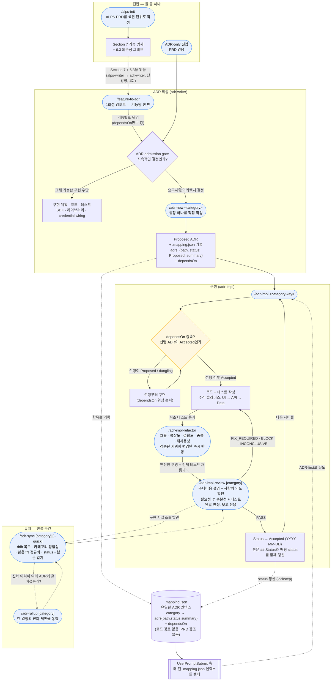
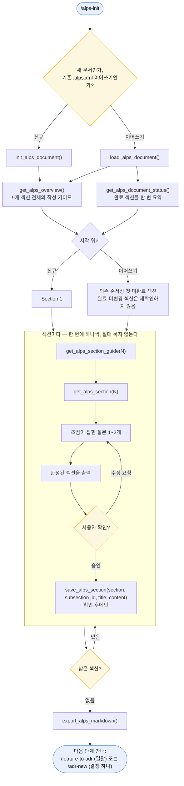
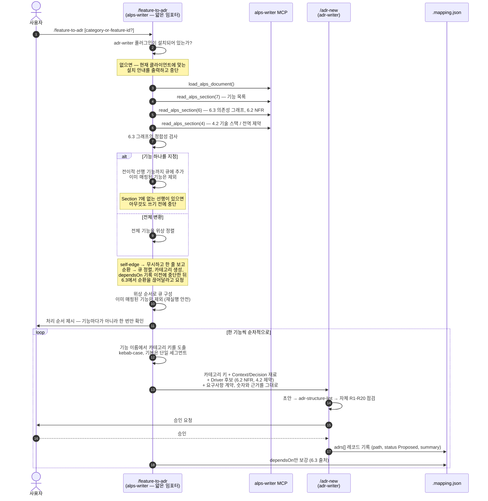
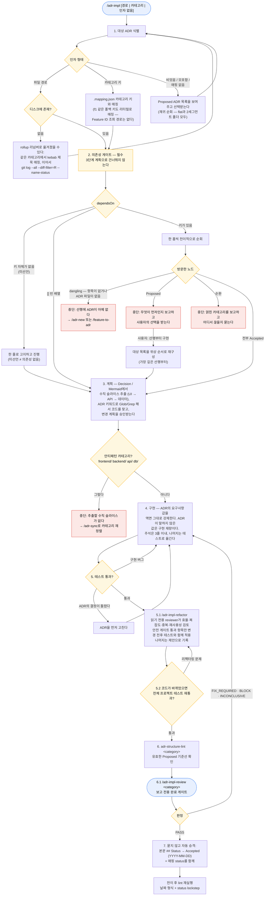
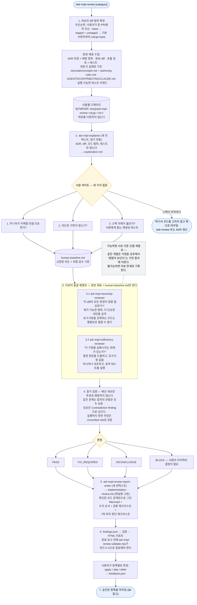
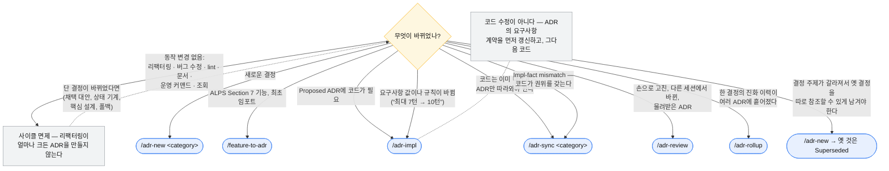
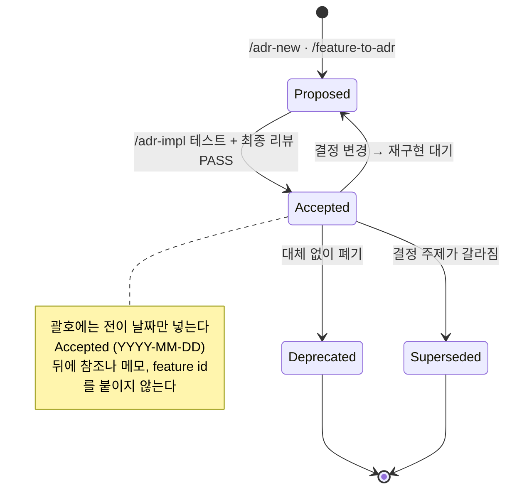
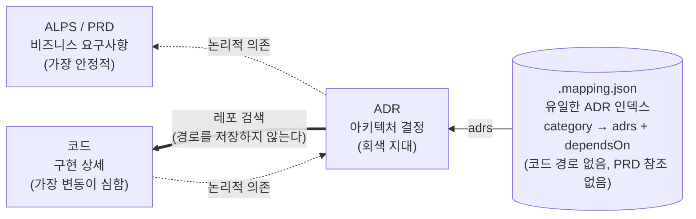

# ADR 프로세스 개요 (다이어그램)

이 문서는 `alps-writer`에서 `adr-writer`로 이어지는 개발 사이클 전체를 Mermaid로 한눈에 보여준다. 산문 설명은 [`usage.md`](./usage.md), 의존성 규칙의 근거는 [`dependency-model.md`](./dependency-model.md)를 본다.

핵심 불변식:

- **`.mapping.json`이 유일한 ADR 인덱스다** — 카테고리마다 각 ADR을 `{path, status, summary}`로 한 번씩 보유하고 `dependsOn`을 기록한다. README는 ADR 목록을 두지 않으며(개념 색인만), UserPromptSubmit 훅이 매 턴 이 인덱스를 렌더한다.
- **adr-writer는 독립적이다** — 매핑은 코드 경로도, PRD 참조도 저장하지 않는다. `/feature-to-adr`는 **최초 1회 임포트**를 위해서만 ALPS를 읽고, 그 이후 결정은 ADR 레이어에서 관리된다.
- **의존성은 한 방향(PRD → ADR → 코드)으로만 흐르며**, 어떤 산출물도 본문에서 다른 산출물을 직접 가리키지 않는다.
- **ADR admission gate가 생성보다 먼저다.** 요구사항 계약, 지속적인 시스템·데이터·보안 경계, 외부 제공자·모델과 fallback, 키 설계, 알고리즘과 트레이드오프만 ADR 레이어로 올린다. 같은 계약과 경계를 유지한 채 교체할 수 있는 라이브러리, SDK, 프레임워크, credential/auth adapter, 모듈 구조는 코드 레이어에 둔다.
- **ADR 본문 = 현재 상태, decision-log.md = 주요 변경 이력.** ADR은 현재 코드를 서술하는 요구사항 문서이고, 그 진화의 타임라인은 카테고리별 `decision-log.md`가 보존한다(관례 파일이며 인덱스에 등록하지 않는다). 진화는 기본적으로 제자리 수정 + 로그 한 줄이고, supersede는 결정 주제 자체가 갈라졌을 때만 쓴다.
- **ADR 완결성의 기준은 재생성 테스트다** — "코드를 전부 지우고 이 ADR만 남았을 때, 요구사항을 지키는 코드를 이것만으로 다시 세울 수 있는가?" 구현과 구조, 이름은 달라져도 된다(ADR에 없으므로 재량이다). 하지만 **결과가 지켜야 하는 계약은 하나도 빠져서는 안 된다.** 그래서 요구사항 값(최대 턴 수, 사용량 쿼터, 보존 기간, 상한, 목표치)은 숫자와 근거를 그대로 ADR에 넣고, 구현 튜닝 값(커넥션 풀, 백오프, 캐시 TTL)은 넣지 않는다. 판단 기준은 `templates/adr/authoring-rules.md`의 "Concrete numbers"를 본다.

목차 — 사이클을 처음부터 끝까지 한 번 보고, 이어서 단계별로 한 장씩:

| §                                                   | 다이어그램         | 답하는 질문                                                |
| --------------------------------------------------- | ------------------ | ---------------------------------------------------------- |
| [1](#1-전체-라이프사이클)                           | 전체 라이프사이클  | PRD부터 유지 단계까지, 어떤 커맨드가 언제 실행되는가       |
| [2](#2-alps-init-내부-섹션-단위-작성-루프)          | `/alps-init`       | ALPS 9개 섹션이 어떻게 작성되고, 왜 순서가 어긋나는가      |
| [3](#3-feature-to-adr-내부-1회성-임포트-핸드셰이크) | `/feature-to-adr`  | alps-writer → adr-writer 경계를 넘는 것과 넘지 않는 것     |
| [4](#4-adr-impl-내부-선행-의존성-게이트)            | `/adr-impl`        | 대상을 어떻게 찾고, 의존성 게이트를 왜 건너뛸 수 없는가    |
| [5](#5-adr-impl-review-내부-적대적-리뷰)            | `/adr-impl-review` | 격리와 사람 게이트가 어떻게 반증 기반 판정을 만들어내는가  |
| [6](#6-이-변경은-어느-커맨드-소유인가)              | 라우팅             | 어떤 이견이나 변경 요청이 들어왔을 때 어느 커맨드가 맡는가 |
| [7](#7-adr-status-전이)                             | Status             | Proposed / Accepted / Superseded 사이를 누가 옮기는가      |
| [8](#8-의존성-모델과-결합-지점)                     | PRD → ADR → 코드   | 연결이 어디에 살고, 어디에는 의도적으로 두지 않는가        |

## 1. 전체 라이프사이클

**읽는 법**

- **진입점은 둘이지만 ADR 생성보다 admission gate가 먼저다.** PRD-first는 `/feature-to-adr`가 `/adr-new`에 위임하고, ADR-only는 직접 결정을 제시한다. 두 경로 모두 요구사항 계약이나 지속적인 아키텍처 경계를 바꾸는 결정만 ADR로 만들며, SDK·라이브러리·credential wiring처럼 교체 가능한 구현 수단은 코드와 테스트로 내려보낸다.
- **`/feature-to-adr`는 얇은 1회성 임포터다.** Section 7과 6.3을 읽고, 이름 기반 정규 카테고리 키를 만들고, 작성 자체는 `/adr-new`에 위임하고, 매핑에는 `dependsOn`만 보강한다. 단일 기능을 지정해도 아직 변환되지 않은 선행 기능까지 위상 순서로 큐에 넣어 dangling 상태를 저장하지 않는다. 나중에 PRD가 바뀌면 재임포트하지 않고 해당 ADR을 직접 수정한다(또는 supersede한다).
- **새 초안은 한 번 검증하고, 두 번 리뷰하지 않는다.** `/adr-new`는 `adr-reviewer`가 적용하는 것과 같은 규칙(R1-R20)으로 작성하므로, 결정론적 하네스를 돌린 뒤 판단 규칙에 대한 자체 점검을 수행한다 — 방금 제대로 해낸 것을 대부분 되풀이할 리뷰어를 띄우지 않는다. `/adr-review`는 그 작성 컨텍스트가 사라진 자리에 독립적인 읽기를 공급한다. **손으로 고친, 다른 세션에서 바뀐, 물려받은** ADR이 그 대상이며, 작성 직후 자동으로가 아니라 요청 시에 실행된다.
- **의존성 게이트는 필수다.** `/adr-impl`은 곧장 코딩으로 가지 않는다. `dependsOn`을 전이적으로 순회하고, 선행이 `Proposed`이거나 dangling이면 그것을 위상 순서로 먼저 구현한다.
- **구현 완료 전 검증된 리팩터링을 수행한다.** 최초 테스트가 통과하면 `/adr-impl-refactor`의 읽기 전용 리뷰어가 실행 효율, 복잡도, 결합도, 중복과 현재 코드에 근거한 재사용 기회를 독립적으로 찾는다. 독립 reviewer가 없으면 제안만 남기고 자동 반영하지 않는다. 실제 변경이 없으면 동일 targeted test를 반복하지 않는다.
- **최종 리뷰가 완료를 판정한다.** `/adr-impl-review`는 `Proposed` 상태의 최종 diff를 설명하고, 사람의 의도를 확인한 뒤, 필요성·충분성 리뷰를 독립적으로 수행한다. `PASS`일 때만 Status가 `Accepted`가 되며, 다른 판정은 `Proposed`를 유지한 채 수정과 재검증으로 돌아간다. `[Impl-fact mismatch]`는 `/adr-sync`로 라우팅하지만, 깊은 sync는 모든 작은 변경의 기본 종료 단계가 아니다.
- **진화 이력은 ADR 본문이 아니라 decision log에 산다.** ADR 본문은 현재 상태만 서술하고, 같은 결정이 진화하면 제자리에서 덮어쓴다. 주요 전이(채택 대안 교체, 핵심 알고리즘이나 아키텍처 변경, Driver 반전)는 카테고리별 `decision-log.md`에 최신순 한 줄로 남긴다 — `/adr-impl`과 `/adr-sync`가 추가하거나 수확하고, `/adr-rollup`은 통합 과정에서 체인의 주요 전이를 로그로 수확하고 현재 상태 통합 ADR만 남긴다. 로그는 관례 파일이므로 `.mapping.json`에 등록하지 않고 하네스도 검사하지 않는다. supersede(새 ADR)는 결정 주제가 갈라질 때만 일어나며, 진화 체인은 기본적으로 누적하지 않는다.
- **`/adr-impl`은 카테고리 키로 대상을 찾는다.** Feature ID는 어디에도 저장하지 않으며, 숫자만으로 된 폴백 키(`f1`)조차 평범한 리터럴 카테고리 키로 해석한다.
- **훅이 사이클을 지탱한다.** 매 턴 `.mapping.json` 인덱스 스냅샷과 ADR-first 지시를 다시 주입하므로, 긴 세션에서도(컨텍스트 압축을 지나서도) 흐름이 유지된다.
- **독립적인 순수 리팩터링 요청은 ADR 작성에서 면제된다.** 동작을 바꾸지 않는 구조 변경은 규모가 얼마나 크든 새 ADR을 만들지 않는다. 다만 `/adr-impl` 안에서는 방금 만든 구현의 완료 품질을 높이기 위해 검증된 저위험 리팩터링 단계를 자동 실행한다. 이 단계도 결정을 바꾸지 않으며, 채택 대안·상태 기계·핵심 설계·외부 의존성 폴백을 바꾼다면 리팩터링이 아니라 동작 변경이므로 해당 ADR을 먼저 갱신한다.

## 2. /alps-init 내부: 섹션 단위 작성 루프

PRD 레이어는 커맨드 하나지만, 실제로는 9개 섹션과 섹션마다 놓인 확인 게이트다. MCP 서버가 섹션별 가이드와 템플릿을 내주고, 에이전트는 1~2개를 질문하고, 결과를 보여주고, 사용자가 승인한 것만 저장한다.

**작성 순서** — `1 → 2 → 3 → 4 → 6 → 5 → 7 → 8 → 9`. 섹션 번호와 최종 문서 순서는 그대로다(5는 Design, 6은 Requirements). _질문하는_ 순서만 어긋나는데, Section 5가 Section 6.1이 정의하는 Feature ID(F1, F2, …)를 재사용하기 때문이다. 질문 순서가 숫자 순서에서 벗어나는 곳은 여기 한 군데뿐이다.

기존 문서는 `get_alps_document_status` 결과를 읽고 이 순서에서 첫 미완료 섹션부터 이어간다. 완료된 섹션은 한 번 요약하되, 사용자가 전체 재검토를 요청하거나 선행 내용이 바뀐 경우가 아니면 다시 승인받지 않는다.

| §   | 섹션                      | §   | 섹션                        |
| --- | ------------------------- | --- | --------------------------- |
| 1   | Overview                  | 6   | Requirements Summary        |
| 2   | MVP Goals and Key Metrics | 7   | Feature-Level Specification |
| 3   | Demo Scenario             | 8   | MVP Metrics                 |
| 4   | High-Level Architecture   | 9   | Out of Scope                |
| 5   | Design Specification      |     |                             |

**Section 7은 특별히 조심해야 하는 예외다.** 각 Feature 서브섹션(7.1, 7.2, …)을 **개별로** 확인하고 저장한다 — 앞 Feature와 작거나 비슷해 보여도 여러 Feature를 한 번에 제시하거나 확인받거나 저장하지 않는다. Section 7은 ADR 레이어가 임포트하는 대상이기도 해서, 여기서 그냥 지나간 Feature는 아무도 검토하지 않은 결정이 된다.

## 3. /feature-to-adr 내부: 1회성 임포트 핸드셰이크

alps-writer가 adr-writer에 넘기는 유일한 지점이며, 의도적으로 얇다. ALPS를 읽고, 카테고리 키를 정하고, 작성은 위임한다. _ADR을 어떻게 쓰는지_ 에 관한 모든 것은 `/adr-new`에 남는다.

**이 핸드셰이크가 지키는 불변식.**

- **PRD는 한 번만 임포트한다.** ADR이 존재한 뒤로 그 결정은 ADR 레이어에서 관리된다 — 이후 PRD 변경은 재임포트가 아니라 ADR을 수정(또는 supersede)해서 흡수한다. 재실행 시 이미 매핑된 기능을 큐에서 빼는 이유가 이것이다.
- **매핑은 항상 의존성으로 닫혀 있다.** 한 기능만 요청해도 매핑에 없는 전이적 선행 기능을 먼저 변환한다. Section 7에서 선행 기능을 찾지 못하면 중단하며, 다음 단계가 거부할 dangling `dependsOn`을 중간 상태로 저장하지 않는다.
- **임포터는 도메인 경계를 발명하지 않는다.** ALPS에는 기능보다 상위의 개념이 없으므로, 2세그먼트 `<context>/<feature>` 키는 두 경우에만 쓴다. Section 7이 이미 기능을 그룹으로 묶고 있을 때(PRD가 경계를 주장한 경우), 또는 사용자가 명시적으로 그룹화를 요청할 때다. 그 외에는 flat이 기본이며, 이것이 "adr-writer는 ALPS를 참조하지 않는다"를 참으로 유지한다.
- **Feature ID는 절대 키가 되지 않는다.** `F1` / `F-AUTH-01`이 있어도 키는 기능 이름에서 나오고, ID는 어디에도 저장하지 않는다. 이름이 숫자뿐인 기능은 소문자 id(`f1`)를 평범한 리터럴 키로 쓰는 것이지, ID를 보존하는 필드가 아니다.
- **그대로 넘어가는 것**: 근거를 포함한 요구사항 값(상한, 쿼터, 보존 기간, 목표치)과 비수치 요구사항(허용 값 집합과 전이, 필수 여부, 가시성, 유일성, 단위). 여기서 숫자를 "적절히"로 일반화하면 파이프라인에서 영구히 잃는다. ADR은 PRD를 되짚어 가리키지 않기 때문이다.

## 4. /adr-impl 내부: 선행 의존성 게이트

대상 확정과 의존성 게이트는 이 커맨드가 코드를 생각하기 전에 반드시 끝내는 두 가지다. 게이트는 ADR이 하나뿐일 때조차 생략하거나 미룰 수 없다.

- **의존성 순서가 입력 순서를 이긴다.** 대상이 여럿일 때 — 사용자가 `checkout, identity/login, cart`를 직접 고른 경우든 게이트가 선행을 추가한 경우든 — 항상 위상 정렬해서 가장 깊은 선행부터 구현하고, 그 순서를 한 줄로 사용자에게 보여준다.
- **요구사항 값 변경은 코드 수정이 아니다.** "최대 7턴 → 10턴"은 상수 하나처럼 보이지만 시스템 동작 요구사항이 바뀐 것이다. ADR의 요구사항 계약을 먼저 갱신하고(제자리 수정, 그리고 최소 major이므로 `decision-log.md` 한 줄도), 테스트와 최종 리뷰가 통과한 뒤 다시 `Accepted`로 승격한다.
- **자동 리팩터링은 보수적이다.** 공개 계약, 스키마, 의존성, 상태 전이, 권한, 필수 검증, 동시성, 트랜잭션, 폴백과 오류 의미를 건드리는 항목은 즉시 반영하지 않는다. 독립 reviewer가 없으면 제안 전용이며, 실제 변경이 없으면 기준선 테스트를 재사용한다.
- **Status는 사실을 기록하며 의도를 기록하지 않는다** — 최초 테스트, 리팩터링 뒤 필요한 전체 테스트, 최종 구현 리뷰가 모두 통과하기 전에는 승격하지 않는다.

## 5. /adr-impl-review 내부: 적대적 리뷰

이 리뷰의 힘은 에이전트 사이에 무엇을 공유하지 않는지에서 나온다. 네 개의 서브에이전트(설명자 · 리뷰어 둘 · 리포트 작성자)가 각각 새 컨텍스트에서 돌고, 어떤 리뷰어도 설명 문서나 다른 리뷰어의 결과를 보지 않는다.

- **언제나 보고 전용이다.** 리뷰 산출물만 쓰고, 코드와 ADR과 매핑은 건드리지 않는다.
- **ADR이 동작 스펙이고, 리뷰어들은 구조적으로 그것을 옳다고 전제한다** — 그래서 불완전한 ADR도 그들에게는 완전한 것으로 읽힌다. 사람 게이트의 3번 질문이 그 간극이 드러날 수 있는 유일한 자리이며, 명시적 확인 전에는 리뷰를 시작하지 않는 이유가 이것이다.
- **source-of-truth 구분이 카테고리를 결정한다.** enum 식별자 이름이 다른 것은 `Impl-fact mismatch`(ADR을 고친다)이고, 허용 집합이나 전이 규칙이 다른 것은 `Spec violation`(코드를 고친다)이다.

## 6. 이 변경은 어느 커맨드 소유인가

모든 finding과 들어오는 모든 요청은 하나의 소유자로 귀결된다. 이것을 잘못 보내면 변동이 심한 레이어가 안정적인 레이어를 끌고 다니게 된다.

`/adr-impl-review`의 finding 카테고리별 라우팅:

| Finding                            | 소유자                                                                                                                                           |
| ---------------------------------- | ------------------------------------------------------------------------------------------------------------------------------------------------ |
| `Unnecessary change`               | 코드를 제거하고 관련 테스트를 다시 실행                                                                                                          |
| `Simpler alternative` · `Refactor` | ADR 결정이 바뀌지 않음을 확인한 뒤 단순화                                                                                                        |
| `Spec violation` · `Best practice` | 코드를 고친다                                                                                                                                    |
| `Decision changed in code`         | 사용자가 선택: `/adr-impl`(같은 사이클에서 코드를 다시 작업) 또는 `/adr-sync`(코드는 그대로) — 정의상 major이므로 `decision-log.md` 한 줄도 함께 |
| `Undecided behavior`               | ADR에 추가(`/adr-impl`, `/adr-sync`)하거나 코드에서 제거. 정말 별개의 결정이면 `/adr-new`                                                        |
| `Impl-fact mismatch`               | `/adr-sync <category>` — 구현 사실에 대해서는 코드가 권위를 갖는다                                                                               |
| `Test gap`                         | 실패를 잡아내는 테스트를 **먼저** 추가하고, 그다음 수정                                                                                          |
| `Unverified risk`                  | 먼저 재현하거나 위험을 명시적으로 감수한다 — 바로 고치지 않는다                                                                                  |
| `Contradiction`                    | 두 전제 중 어느 것이 성립하는지 사람이 정하기 전에는 아무것도 고치지 않는다                                                                      |

## 7. ADR Status 전이

Status는 사람이 손으로 정하는 값이 아니라 사이클이 자동으로 갱신하는 값이다. 상세 규칙은 `docs/adr/concepts.md`의 "Status" + "Automatic transition rules"를 본다.

- `Proposed` — 제안되었고 아직 구현되지 않았다. 날짜를 갖지 않는다(작성 날짜는 본문 상단 `Date:`에 있다).
- `Accepted (YYYY-MM-DD)` — 구현 완료 + 테스트 통과 + 최종 구현 리뷰 PASS. 괄호에는 **전이 날짜만** 들어간다(하네스가 `date-only`로 검증한다).
- `Deprecated (YYYY-MM-DD)` — 대체 없이 폐기되었다.
- `Superseded by [ADR XXXX](link)` — 새 ADR로 대체되었다(날짜 대신 후속 ADR 링크).

## 8. 의존성 모델과 결합 지점

PRD → ADR → 코드는 논리적 단방향 의존성이다. 세 산출물 중 어느 것도 본문에서 다른 것을 물리적으로 가리키지 않으며, 연결은 정확히 한 곳 `.mapping.json`(category → ADR + `dependsOn`)에만 산다. 매핑은 PRD 참조도, 코드 경로도 갖지 않는다.

- **PRD↔ADR은 저장되지 않는다** — adr-writer는 ALPS를 참조하지 않는다. ADR은 최초 임포트에서 PRD의 동기를 흡수하고, 그 뒤로는 그것을 가리키지 않는다(가드레일 R15 / `adr-invariants.sh`의 검사 (b)).
- **ADR↔코드도 본문에서 가리키지 않는다** — ADR이 다스리는 코드는 그때마다 결정의 키워드로 레포를 검색해서 찾는다. 리팩터링이 ADR이나 매핑을 끌고 다니는 일이 없다.
- **안정성 기울기**: 변경 빈도는 `코드 >> ADR >> PRD`를 따라야 한다. 변동이 심한 레이어의 변경이 안정적인 레이어를 끌고 온다면, 화살표가 잘못 그려진 것이다.
