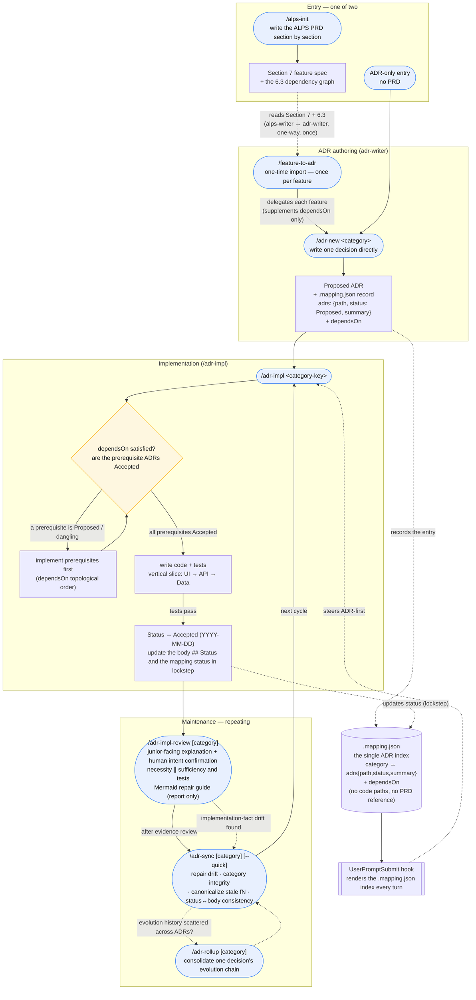
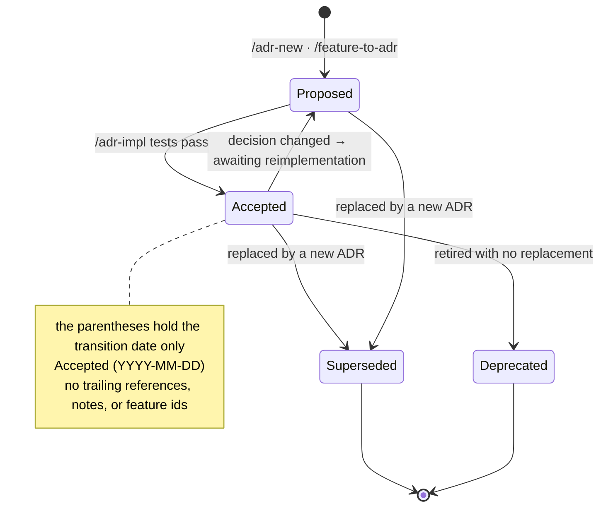
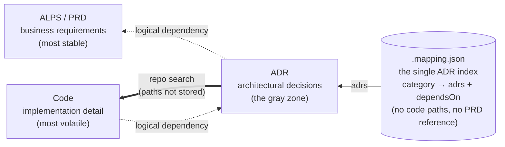

# ADR process overview (diagrams)

This document lays out the whole development cycle from `alps-writer` to `adr-writer` at a glance in Mermaid. For the prose explanation see [`usage.md`](./usage.md); for the rationale behind the dependency rules see [`dependency-model.md`](./dependency-model.md).

Core invariants:

- **`.mapping.json` is the single ADR index** — it holds each ADR once per category as `{path, status, summary}` and records `dependsOn`. The README keeps no ADR list (only the conceptual index), and the UserPromptSubmit hook renders this index every turn.
- **adr-writer is standalone** — the mapping stores neither code paths nor a PRD reference. `/feature-to-adr` reads the ALPS only for **a single initial import**, after which the decision is managed at the ADR level.
- **Dependencies run one way (PRD → ADR → code)**, and no artifact points at another directly in its body.
- **The ADR body = current state, decision-log.md = the major-change history.** An ADR is a requirements document describing the current code, while the timeline of its evolution is preserved by the per-category `decision-log.md` (a convention file, not indexed). Evolution defaults to edit-in-place plus the log, and supersede is reserved for a forked decision topic.
- **The standard for ADR completeness is the regeneration test** — "if all the code were deleted and only this ADR survived, could requirement-honoring code be rebuilt from it alone?" Implementation, structure, and names may differ (they are not in the ADR, so they are discretionary), but **not one of the contracts the result must honor may be missing.** So requirement values (max turns, usage quotas, retention periods, caps, targets) go into the ADR with their number and basis verbatim, while implementation tuning values (connection pools, backoff, cache TTL) do not. For the criteria see `templates/adr/authoring-rules.md` "Concrete numbers".

## 1. The whole lifecycle

**How to read it**

- **Two entry points.** PRD-first starts at `/alps-init` and crosses into the ADR layer via `/feature-to-adr` (the only point where alps-writer hands off to adr-writer — one way). ADR-only starts straight at `/adr-new` with no PRD.
- **`/feature-to-adr` is a thin, one-time importer.** It reads Section 7 plus 6.3, builds name-based canonical category keys, delegates the authoring to `/adr-new`, and supplements only `dependsOn` in the mapping. If the PRD changes later, it is not re-imported; the ADR is edited directly (or superseded).
- **The dependency gate is mandatory.** `/adr-impl` does not go straight to coding: it walks `dependsOn` transitively, and if a prerequisite is `Proposed` or dangling, it implements that first in topological order. Status becomes `Accepted` only after the tests pass (a record of fact, not of intent).
- **Post-implementation review is disproof-based and report-only.** `/adr-impl-review` explains the actual diff so a junior can follow it, confirms the human's intent, then runs the necessity and sufficiency reviewers in parallel without sharing results. Necessity attacks removable changes; sufficiency attacks missing ADR decisions and counterexamples with targeted tests. It finishes by producing a junior-facing Markdown guide with Mermaid diagrams drawn only from real code relationships, plus the fix order and completion criteria. `[Impl-fact mismatch]` is an implementation fact where the code is authoritative, so it routes to `/adr-sync`.
- **Evolution history lives in the decision log, not the ADR body.** The ADR body describes only the current state, and when the same decision evolves it is overwritten in place. Major transitions (replacing the adopted alternative, changing the core algorithm or architecture, inverting a Driver) are left as one reverse-order line in the per-category `decision-log.md` — `/adr-impl` and `/adr-sync` append or harvest into it, and `/adr-rollup` harvests a chain's major transitions into the log during consolidation and keeps only the current-state consolidated ADR. The log is a convention file, so it is not registered in `.mapping.json` and the harness does not check it. A supersede (a new ADR) happens only when the decision topic forks — evolution chains are not accumulated by default.
- **`/adr-impl` finds its target by category key.** The Feature ID is stored nowhere, and even a number-only fallback key (`f1`) is interpreted as an ordinary literal category key.
- **The hook sustains the cycle.** Re-injecting the `.mapping.json` index snapshot and the ADR-first directive every turn keeps the flow intact even in long sessions (through compaction).
- **Refactoring is exempt from the cycle.** A structural change that does not alter behavior gets no ADR, however large — the coding agent's planning step plans the change scope and caller impact as it goes, and freezing that plan into the stable ADR layer would let refactors drag the ADR along. Bug fixes, lint/formatting, documentation edits, ops commands, and information lookups are exempt for the same reason. But if a "refactor" changes the decision itself (replacing the adopted alternative, a state machine, a key design, an external-dependency fallback), that is a behavior change, so update the relevant ADR.

## 2. ADR Status transitions

Status is not a value a human sets by hand but one the cycle updates automatically. For the detailed rules see `docs/adr/concepts.md` "Status" + "Automatic transition rules".

- `Proposed` — proposed, not yet implemented. Carries no date (the authoring date lives in the `Date:` at the top of the body).
- `Accepted (YYYY-MM-DD)` — implemented plus tests passing. The parentheses hold **the transition date only** (the harness verifies this as `date-only`).
- `Deprecated (YYYY-MM-DD)` — retired with no replacement.
- `Superseded by [ADR XXXX](link)` — replaced by a new ADR (the successor link instead of a date).

## 3. The dependency model and coupling points

PRD → ADR → code is a logical one-way dependency. None of the three artifacts physically points at another in its body; the linkage lives in exactly one place, `.mapping.json` (category → ADR + `dependsOn`). The mapping holds neither a PRD reference nor code paths.

- **PRD↔ADR is not stored** — adr-writer does not reference ALPS. An ADR absorbs the PRD's motivation at the initial import and never points at it afterward (guardrail R15 / check (b) in `adr-invariants.sh`).
- **ADR↔code is not pointed at from the body either** — the code an ADR governs is found by searching the repo with the decision's keywords each time. A refactor never drags the ADR or the mapping along.
- **The stability gradient**: change frequency must follow `code >> ADR >> PRD`. If a change in a volatile layer drags a stable one, an arrow is drawn wrong.
