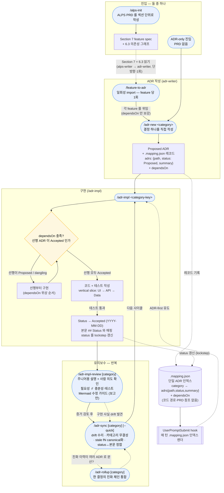
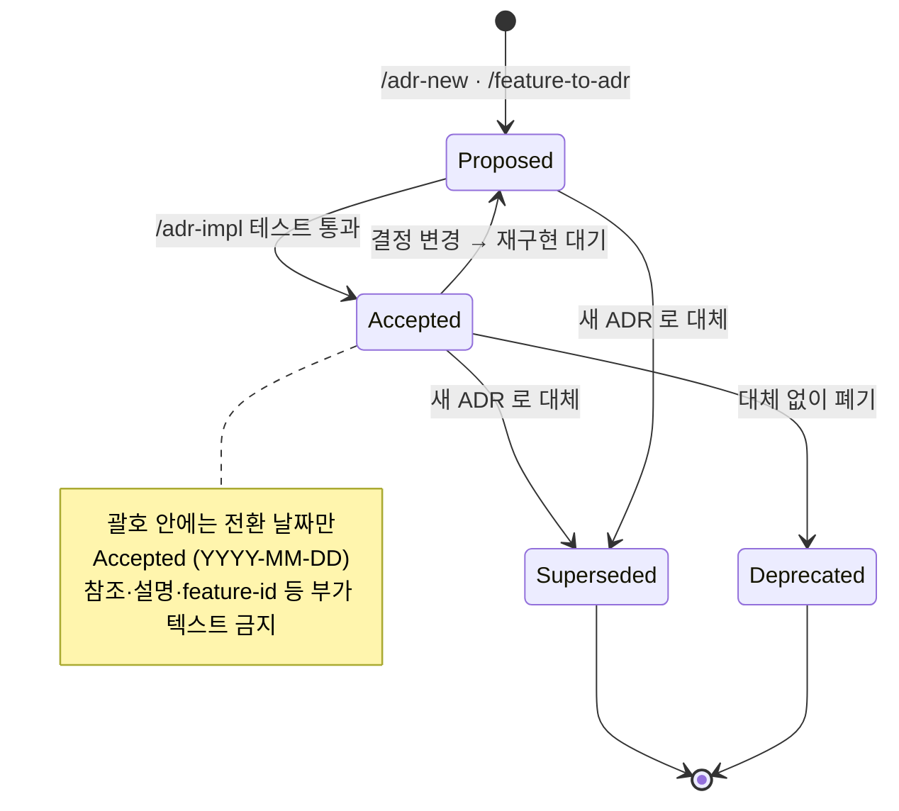
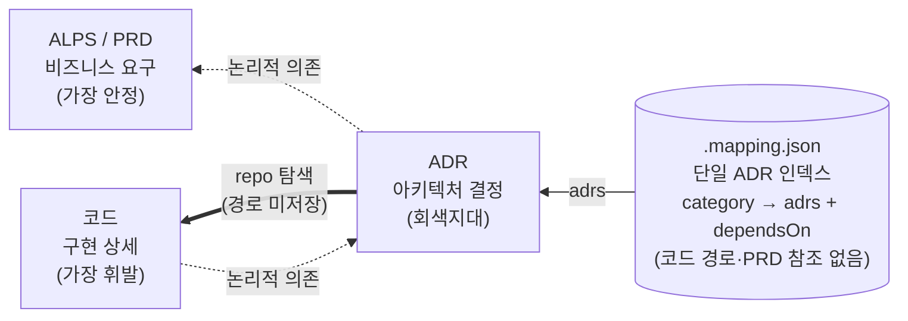

# ADR 프로세스 개요 (다이어그램)

이 문서는 `alps-writer` → `adr-writer` 로 이어지는 전체 개발 사이클을 Mermaid 로 한눈에 정리한 것이다. 서술형 설명은 [`usage.md`](./usage.md), 의존성 규칙의 근거는 [`dependency-model.md`](./dependency-model.md) 를 참조한다.

핵심 불변식:

- **`.mapping.json` 은 단일 ADR 인덱스**다 — 카테고리별로 각 ADR 을 `{path, status, summary}` 로 한 번씩 담고 `dependsOn` 을 기록한다. README 는 ADR 목록을 두지 않으며(개념 인덱스만), UserPromptSubmit hook 이 이 인덱스를 매 턴 렌더한다.
- **adr-writer 는 standalone** 이다 — 매핑은 코드 경로도 PRD 참조도 저장하지 않는다. `/feature-to-adr` 가 ALPS 를 읽는 것은 **최초 1회 import** 뿐이고, 그 뒤 결정은 ADR 레벨에서 관리된다.
- **의존은 단방향(PRD → ADR → 코드)** 이고, 어느 산출물도 다른 산출물을 본문에서 직접 가리키지 않는다.
- **ADR 본문 = 현재 상태, decision-log.md = 주요 변경 이력.** ADR 은 현재 코드를 설명하는 요구사항 문서이고, 진화의 시간축은 카테고리별 `decision-log.md`(컨벤션 파일, 미인덱스)가 보존한다. 진화는 edit-in-place + 로그가 기본이며 supersede 는 결정 주제 분기에만 예약된다.

## 1. 전체 라이프사이클

**읽는 법**

- **두 진입점.** PRD-first 는 `/alps-init` 에서 시작해 `/feature-to-adr` 로 ADR 레이어에 넘어간다(alps-writer 가 adr-writer 에 넘기는 유일한 지점 — 단방향). ADR-only 는 PRD 없이 `/adr-new` 에서 바로 시작한다.
- **`/feature-to-adr` 는 얇은 일회성 importer** 다. Section 7 + 6.3 을 읽어 이름 기반 canonical 카테고리 키를 만들고 작성은 `/adr-new` 에 위임하며, 매핑에는 `dependsOn` 만 보강한다. PRD 가 나중에 바뀌면 재import 하지 않고 해당 ADR 을 직접 편집(또는 supersede)한다.
- **의존성 게이트는 필수.** `/adr-impl` 은 곧장 코딩으로 가지 않고 `dependsOn` 을 전이적으로 따라가, 선행이 `Proposed`/dangling 이면 그것부터 위상 순서로 구현한다. Status 는 테스트 통과 후에만 `Accepted` 로 바뀐다(의도가 아니라 사실의 기록).
- **구현 후 검토는 반증 기반이며 보고 전용이다.** `/adr-impl-review`는 실제 diff를 주니어도 이해할 수 있게 설명하고 사람의 의도를 확인한 뒤, 서로 결과를 공유하지 않는 필요성·충분성 reviewer를 병렬 실행한다. 필요성은 제거 가능한 변경을, 충분성은 ADR 결정 누락과 반례를 targeted test로 공격한다. 마지막에는 실제 코드 관계만 그린 Mermaid와 수정 순서·완료 조건을 포함한 주니어용 Markdown 가이드를 만든다. `[Impl-fact mismatch]`는 코드가 권위인 구현 사실이므로 `/adr-sync`로 라우팅한다.
- **진화 이력은 ADR 본문이 아니라 decision-log 에 산다.** ADR 본문은 현재 상태만 서술하고, 같은 결정이 진화하면 edit-in-place 로 덮어쓴다. major 전환(채택 대안 교체·핵심 알고리즘/아키텍처 변경·Driver 반전)은 카테고리별 `decision-log.md` 에 역순 한 줄로 남긴다 — `/adr-impl`·`/adr-sync` 가 append/harvest 하고, `/adr-rollup` 은 통합 시 체인의 major 전환을 로그로 harvest 한 뒤 현재 상태 통합본만 남긴다. 로그는 컨벤션 파일이라 `.mapping.json` 에 등록하지 않고 하네스가 검사하지 않는다. supersede(새 ADR)는 결정 주제가 분기할 때만 — evolution chain 을 기본으로 쌓지 않는다.
- **`/adr-impl` 은 카테고리 키로 대상을 찾는다.** Feature ID 는 어디에도 저장하지 않으며, 번호뿐인 fallback 키(`f1`)도 평범한 리터럴 카테고리 키로 해석된다.
- **hook 이 사이클을 지탱한다.** 매 턴 `.mapping.json` 인덱스 스냅샷과 ADR-first 지시를 재주입해 긴 세션(compaction)에서도 흐름이 유지된다.

## 2. ADR Status 전이

Status 는 사람이 손으로 정하는 값이 아니라 사이클이 자동으로 갱신하는 값이다. 자세한 규칙은 `docs/adr/README.md` "상태" + "자동 전환 규칙".

- `Proposed` — 제안됨, 아직 미구현. 날짜를 붙이지 않는다(작성일은 본문 최상단 `Date:`).
- `Accepted (YYYY-MM-DD)` — 구현 + 테스트 통과. 괄호에는 **전환 날짜만** 넣는다(하네스가 `date-only` 로 검증).
- `Deprecated (YYYY-MM-DD)` — 대체 없이 폐기.
- `Superseded by [ADR XXXX](link)` — 새 ADR 로 대체(날짜 대신 후속 링크).

## 3. 의존성 모델 & 결합점

PRD → ADR → 코드 는 논리적 단방향 의존이다. 세 산출물 어느 것도 다른 것을 본문에서 물리적으로 가리키지 않고, 연결은 `.mapping.json`(카테고리 → ADR + `dependsOn`) 한 곳에만 둔다. 매핑은 PRD 참조도 코드 경로도 담지 않는다.

- **PRD↔ADR 는 저장하지 않는다** — adr-writer 는 ALPS 를 참조하지 않는다. ADR 은 PRD 의 동기를 최초 import 때 흡수할 뿐, 이후 가리키지 않는다(방어선 R15 / `adr-invariants.sh` 검사 (b)).
- **ADR↔코드 도 본문에서 가리키지 않는다** — ADR 이 다스리는 코드는 결정 키워드로 repo 를 그때그때 탐색해 찾는다. 리팩터링이 ADR·매핑을 끌고 다니지 않는다.
- **안정성 기울기**: 변경 빈도는 `코드 >> ADR >> PRD` 를 따라야 한다. 휘발 레이어의 변경이 안정 레이어를 끌고 다니면 화살표가 잘못 그려진 것이다.
