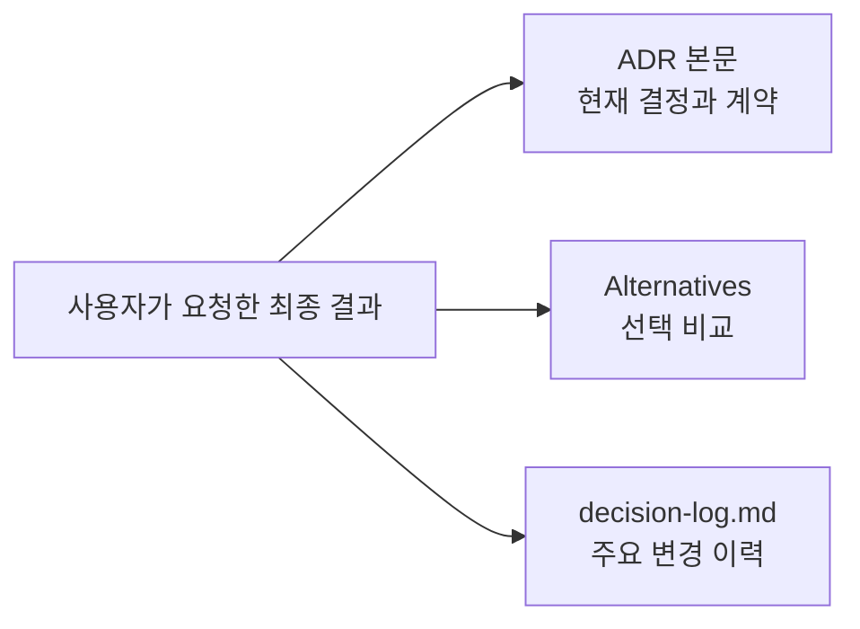

# ADR 0001: ADR 본문에는 최종 결정 상태만 기록

Date: 2026-08-15

## Status

Accepted (2026-08-15)

## Context

ADR을 수정할 때 현재 결정이 과거 식별자나 전환 과정과 함께 서술되는 경우가 있다. 이런 비교 서술은 현재 계약을 찾기 어렵게 만들고, 구현에 필요하지 않은 중간 단계를 본문에 누적한다.

ADR 본문은 현재 유효한 결정과 요구사항을 독립적으로 설명해야 한다. 선택 과정과 주요 변경 이력은 각각 Alternatives와 decision-log가 담당한다.

## Decision Drivers

- 독자는 과거 상태를 해석하지 않고 현재 구현 계약을 바로 파악할 수 있어야 한다.
- ADR 수정이 반복되어도 본문 길이가 변경 횟수에 비례해 증가하지 않아야 한다.
- 실제 금지 규칙과 폐기된 선택지를 설명하는 부정문을 구분해야 한다.
- 선택 근거와 주요 변경 이력의 추적 가능성은 유지해야 한다.

## Decision

ADR 본문의 현재 상태 서술은 사용자가 요청한 최종 결과를 직접 단정하는 문장으로 기록한다.

### Requirement contract

- Context, Decision, requirement contract, Consequences와 매핑 summary는 현재 유효한 결과를 직접 서술한다.
- 폐기된 식별자, 이전 값, 전환 단계와 변경 작업 자체는 현재 계약에 필요하지 않으면 ADR 본문에서 제거한다.
- 현재 선택을 표현하기 위해 과거 선택을 함께 나열하는 비교 문장을 사용하지 않는다.
- 실제로 금지된 상태 전이, 보안 제한, 허용 값 집합처럼 현재도 지켜야 하는 부정형 요구사항은 유지한다.
- 채택되지 않은 선택과 비교 근거는 Alternatives에 기록한다.
- 주요 결정 변경의 이전 상태와 변경 이유는 decision-log에 기록한다.

### Alternatives

1. **시간 순서 표현만 제거**
   - 장점: 기존 current-state 규칙을 조금만 확장하면 된다.
   - 단점: 과거 선택을 부정문으로 끌고 오는 비교 서술이 계속 남는다.

2. **최종 상태 직접 서술과 기록 위치 분리**
   - 장점: 본문은 짧고 현재 계약에 집중하며 선택 근거와 주요 이력도 보존한다.
   - 단점: 작성·동기화·롤업·리뷰 경로가 동일한 분류 기준을 사용해야 한다.

3. **현재 선택과 이전 선택을 본문에 함께 기록**
   - 장점: 한 문서에서 전환 맥락을 모두 볼 수 있다.
   - 단점: 수정이 반복될수록 본문이 길어지고 현재 계약과 이력이 섞인다.

## Consequences

### Positive

- ADR 본문이 현재 구현 계약을 짧고 직접적으로 전달한다.
- 변경 횟수가 늘어도 본문은 현재 상태의 크기를 유지한다.
- Alternatives와 decision-log의 책임이 명확해진다.

### Negative

- 작성자는 부정형 문장이 현재 요구사항인지 과거 선택의 흔적인지 판단해야 한다.
- 기존 ADR을 수정할 때 불필요한 비교 서술을 함께 정리해야 한다.

### Risks

- 간결화를 이유로 실제 금지 규칙이나 요구사항을 제거할 수 있다. 리뷰는 현재도 지켜야 하는 계약을 우선 보존해야 한다.

## Related

- 없음
