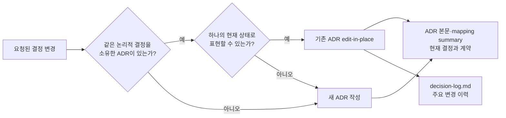

# ADR 0001: ADR 본문에는 최종 결정 상태만 기록

Date: 2026-08-15

## Status

Accepted (2026-08-15)

## Context

ADR을 수정할 때 현재 결정이 과거 식별자나 전환 과정과 함께 서술되는 경우가 있다. 이런 비교 서술은 현재 계약을 찾기 어렵게 만들고, 구현에 필요하지 않은 중간 단계를 본문에 누적한다.

같은 논리적 결정의 채택 대안이나 Decision Driver가 바뀔 때마다 새 ADR을 만들면 결정의 개수가 아니라 변경 횟수만큼 문서가 늘어난다. 외부 모델은 유지하면서 제공자를 Amazon Bedrock에서 OpenAI API로 바꾸거나 이전 제공자로 되돌리는 변경도 모델·제공자 경계라는 하나의 결정이 계속 진화하는 경우다.

ADR 본문은 현재 유효한 결정과 요구사항을 독립적으로 설명해야 한다. 선택 과정과 주요 변경 이력은 각각 Alternatives와 decision-log가 담당한다.

## Decision Drivers

- 독자는 과거 상태를 해석하지 않고 현재 구현 계약을 바로 파악할 수 있어야 한다.
- 같은 논리적 결정은 채택 대안이나 변경 방향과 무관하게 하나의 안정된 식별자를 유지해야 한다.
- ADR 수와 본문 길이가 결정의 수정·원복 횟수에 비례해 증가하지 않아야 한다.
- 실제 금지 규칙과 폐기된 선택지를 설명하는 부정문을 구분해야 한다.
- 선택 근거와 주요 변경 이력의 추적 가능성은 유지해야 한다.

## Decision

ADR 작성 경로는 새 파일을 만들기 전에 기존 ADR이 같은 논리적 결정 주제를 소유하는지 확인한다. 결정 주제는 현재 채택한 제품명이나 대안이 아니라 ADR이 답하는 질문, 소유하는 요구사항 계약과 시스템 경계로 식별한다.

기존 ADR 하나를 현재 상태로 다시 서술할 수 있으면 그 ADR을 edit-in-place로 갱신한다. 채택 대안 교체, Decision Driver 반전, 외부 제공자 변경과 이전 선택으로의 원복은 별도 결정이 동시에 유효해지는 분기가 아니므로 기존 경로와 번호를 유지하는 major edit-in-place다. 본문과 매핑 summary에는 현재 결과만 기록하고 주요 변경 이유는 decision-log에 남긴다.

새 ADR은 기존 ADR이 그 결정 주제를 소유하지 않거나, 결정 주제가 분기되어 이전 결정과 새 결정이 각각 현재 상태의 독립 기록으로 동시에 존재해야 할 때만 만든다.

### Requirement contract

- ADR admission gate를 통과한 요청은 새 ADR 생성 전에 `.mapping.json` summary와 관련 ADR 본문을 읽어 기존 결정 소유자를 찾는다.
- 기존 결정 일치 여부는 현재 대안, 제공자 이름이나 변경 방향이 아니라 결정이 답하는 질문, 요구사항 계약과 시스템·데이터·보안·외부 경계로 판정한다.
- 같은 결정이 다른 대안으로 바뀌거나 이전 대안으로 원복되어도 하나의 현재 상태 기록으로 표현할 수 있으면 기존 ADR을 갱신한다.
- 기존 Accepted ADR의 결정이 바뀌면 본문과 mapping summary를 먼저 현재 상태로 갱신하고 Status를 Proposed로 전환한 뒤 구현한다.
- 새 ADR이나 supersede는 기존 결정 소유자가 없거나, 이전 결정과 새 결정이 독립된 현재 상태 기록으로 공존해야 하는 분기에만 허용한다.
- Context, Decision, requirement contract, Consequences와 매핑 summary는 현재 유효한 결과를 직접 서술한다.
- 폐기된 식별자, 이전 값, 전환 단계와 변경 작업 자체는 현재 계약에 필요하지 않으면 ADR 본문에서 제거한다.
- 현재 선택을 표현하기 위해 과거 선택을 함께 나열하는 비교 문장을 사용하지 않는다.
- 실제로 금지된 상태 전이, 보안 제한, 허용 값 집합처럼 현재도 지켜야 하는 부정형 요구사항은 유지한다.
- 채택되지 않은 선택과 비교 근거는 Alternatives에 기록한다.
- 주요 결정 변경의 이전 상태와 변경 이유는 decision-log에 기록한다.

### Alternatives

1. **시간 순서 표현만 제거**
   - 장점: 기존 current-state 규칙을 조금만 확장하면 된다.
   - 단점: 과거 선택을 부정문으로 끌고 오는 비교 서술이 계속 남는다.

2. **최종 상태 직접 서술과 기록 위치 분리**
   - 장점: 본문은 짧고 현재 계약에 집중하며 선택 근거와 주요 이력도 보존한다.
   - 단점: 새 ADR 생성 전에 기존 결정 소유자를 판정해야 한다.

3. **현재 선택과 이전 선택을 본문에 함께 기록**
   - 장점: 한 문서에서 전환 맥락을 모두 볼 수 있다.
   - 단점: 수정이 반복될수록 본문이 길어지고 현재 계약과 이력이 섞인다.

4. **대안 변경과 원복마다 새 ADR 작성**
   - 장점: 각 변경 시점의 전체 본문을 별도 문서로 보존한다.
   - 단점: 같은 결정이 여러 번호로 분산되고 현재 권위 문서를 찾기 어려워진다.

## Consequences

### Positive

- ADR 본문이 현재 구현 계약을 짧고 직접적으로 전달한다.
- 같은 결정의 변경과 원복이 반복되어도 ADR 식별자와 문서 수가 안정적으로 유지된다.
- Alternatives와 decision-log의 책임이 명확해진다.

### Negative

- 작성자는 부정형 문장이 현재 요구사항인지 과거 선택의 흔적인지 판단해야 한다.
- 작성자는 새 결정을 만들기 전에 기존 ADR의 논리적 결정 주제를 비교해야 한다.
- 기존 ADR을 수정할 때 불필요한 비교 서술을 함께 정리해야 한다.

### Risks

- 제품명이나 변경 방향만 비교하면 같은 결정을 다른 결정으로 오인할 수 있다. 리뷰는 ADR이 답하는 질문과 소유 경계를 기준으로 동일성을 판정해야 한다.
- 간결화를 이유로 실제 금지 규칙이나 요구사항을 제거할 수 있다. 리뷰는 현재도 지켜야 하는 계약을 우선 보존해야 한다.

## Related

- 없음
