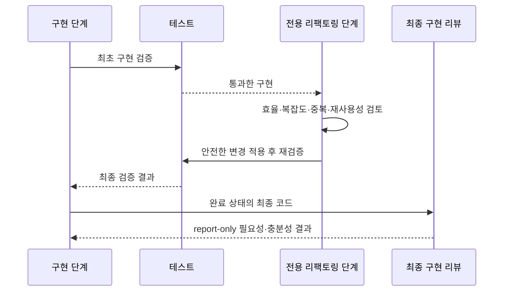

# ADR 0001: 검증된 저위험 리팩토링 자동 반영

Date: 2026-08-15

## Status

Accepted (2026-08-15)

## Context

구현 리뷰는 ADR 충족 여부와 변경의 필요성은 깊게 검토하지만, 실행 효율과 적정 수준의 재사용성을 독립된 관점으로 다루지 않는다. 현재 `Refactor` 분류도 충분성 검토의 부수 항목이며 리뷰 명령은 report-only라서, 명백하고 안전한 정리도 다음 작업으로 미뤄진다.

모든 리팩토링을 자동 적용하면 공개 계약이나 상태 전이처럼 겉보기보다 넓은 동작을 바꿀 수 있다. 반대로 모든 항목을 제안으로만 남기면 작은 중복 제거와 불필요한 반복 작업도 누적된다. 구현 완료 판정 전에 안전성이 입증된 개선만 반영하고, 최종 구현 리뷰는 그 결과를 기준으로 판단해야 한다.

## Decision Drivers

- 최종 구현 리뷰는 실제로 전달될 최종 코드를 대상으로 해야 한다.
- 자동 변경은 ADR의 결정과 사용자 관찰 동작을 보존해야 한다.
- 리뷰는 실행 효율, 복잡도, 결합도, 중복과 현재 존재하는 재사용 기회를 구체적인 코드 근거로 판단해야 한다.
- 재사용성 검토가 미래의 가상 요구를 위한 추상화로 확대되면 안 된다.
- 자동 변경에 실패해도 구현과 검증 흐름을 불안정하게 만들면 안 된다.

## Decision

구현 흐름에 전용 리팩토링 단계를 둔다. 이 단계의 독립 검토자는 구현 diff와 관련 코드 및 테스트를 읽고 실행 효율, 불필요한 반복 작업, 복잡도, 결합도, 중복, 현재 코드에 이미 존재하는 동일 의미의 재사용 기회를 평가한다.

검토자는 각 항목을 `즉시 반영 가능` 또는 `제안 전용`으로 분류한다. 구현 주체는 즉시 반영 가능 항목만 적용하고 관련 테스트를 다시 실행한다. 이후 전체 구현 검증을 통과한 코드만 구현 완료 상태로 전환하며, 기존의 필요성·충분성 최종 리뷰는 변경된 최종 코드를 report-only로 검토한다.

### Requirement contract

- 자동 반영은 ADR의 결정, 요구사항 계약, 사용자 관찰 동작과 공개 계약을 바꾸지 않아야 한다.
- 자동 반영 후보는 변경 범위가 국소적이고 신뢰도가 높으며, 관련 테스트가 변경 전후 모두 통과해야 한다.
- 공개 API나 wire form, 데이터 스키마, 외부 의존성, 허용 상태와 상태 전이, 권한과 가시성, 필수 검증, 동시성, 트랜잭션, 오류 의미를 건드리는 항목은 자동 반영하지 않는다.
- 크리티컬한 문제도 자동 반영 안전 조건을 우회하지 않는다. 안전 조건을 충족하지 못하면 우선순위가 높은 제안으로 남긴다.
- 실행 효율 개선은 중복 작업 제거처럼 효과가 코드에서 직접 확인되거나 재현 가능한 근거가 있을 때만 자동 반영한다. 근거 없는 미세 최적화는 제안하지 않는다.
- 재사용 추출은 현재 범위에 동일한 의미의 중복이 실제로 존재하고 호출부가 단순해질 때만 고려한다. 한 호출자나 미래의 가상 사용처를 위한 범용 추상화는 만들지 않는다.
- 자동 변경 후 테스트가 실패하거나 변경 범위가 예상보다 넓어지면 해당 변경을 유지하지 않고 제안 전용 항목으로 내린다.
- 제안 전용 항목은 우선순위, 기대 효과, 위험, 예상 변경 범위와 검증 방법을 포함해야 한다.
- 최종 구현 리뷰의 독립 검토자들은 리팩토링 검토 결과에 기대지 않고 변경된 최종 코드와 원본 근거로 판단해야 한다.

### Alternatives

#### 기존 충분성 검토에 리팩토링과 자동 수정을 합친다

- 장점: 역할과 실행 단계가 늘지 않는다.
- 단점: 충분성 검토가 계약 위반 탐색과 코드 개선을 동시에 수행해 초점이 흐려진다. report-only 원칙과 독립 검토 결과도 깨진다.

#### 선택 가능한 독립 리팩토링 명령만 제공한다

- 장점: 사용자가 원하는 때만 비용을 지불한다.
- 단점: 기본 구현 흐름에서 쉽게 누락된다. 최종 리뷰가 개선 전 코드에 대해 실행될 수 있다.

#### 전용 단계를 구현 흐름에 넣고 최종 리뷰는 report-only로 유지한다

- 장점: 안전한 개선을 완료 판정 전에 반영한다. 필요성·충분성 검토의 독립성과 기존 책임을 유지한다.
- 단점: 추가 검토와 재검증으로 실행 시간과 모델 사용량이 늘어난다.

## Consequences

### Positive

- 명백한 중복과 불필요한 반복 작업이 다음 작업으로 누적되지 않는다.
- 재사용성 검토가 현재 코드의 실제 중복에 제한돼 과도한 추상화를 억제한다.
- 최종 구현 리뷰가 리팩토링까지 반영된 전달 대상 코드를 검증한다.
- 위험하거나 넓은 개선은 근거와 검증 방법을 갖춘 제안으로 남는다.

### Negative

- 구현 흐름에 별도 검토와 테스트 재실행 비용이 추가된다.
- 자동 반영 가능 여부를 보수적으로 판단하면 적용 가능한 개선도 제안으로 남을 수 있다.

### Risks

- 검토자가 동작 보존을 과신하면 안전하지 않은 변경을 자동 후보로 분류할 수 있다. 명시적 제외 조건과 변경 전후 테스트로 이 위험을 제한한다.
- 테스트가 약한 영역에서는 자동 반영 범위가 작아진다. 이 경우 검증을 추측하지 않고 제안 전용으로 내린다.

## Related

- Related ADRs: none
