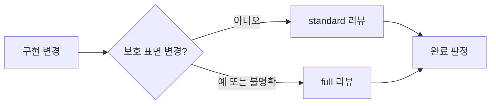

# ADR 0001: 위험에 비례하는 구현 검토와 저위험 리팩토링

Date: 2026-08-15

## Status

Accepted (2026-08-15)

## Context

구현 완료 전 검토는 ADR 충족 여부, 불필요한 변경, 누락된 동작과 검증 강도를 다룬다. 공개 계약이나 상태 전이를 바꾸는 구현에는 독립적인 다관점 검토가 필요하지만, 보호 표면을 건드리지 않는 국소 구현까지 동일한 보고서와 시각화 절차를 강제하면 검토 비용이 변경 위험과 무관해진다.

검토 강도는 낮추더라도 완료 판정의 근거와 저위험 리팩토링 안전 조건은 유지해야 한다.

## Decision Drivers

- 계약과 보호 표면 변경은 독립적인 필요성·충분성 검토가 필요하다.
- 국소 변경은 전체 보고서 생성 비용 없이도 검증할 수 있어야 한다.
- 자동 리팩토링은 ADR과 사용자 관찰 동작을 보존해야 한다.
- 검증하지 못한 경로는 어떤 리뷰 모드에서도 통과로 처리하면 안 된다.
- 리뷰 비용과 발견 효과를 비교할 수 있어야 한다.

## Decision

구현 리뷰를 **standard**와 **full** 두 모드로 운영한다.

`full`은 요구사항 계약, 공개 API나 wire form, 데이터 스키마, 상태와 전이, 권한과 가시성, 보안 경계, 외부 fallback, 동시성·트랜잭션·오류 의미 또는 여러 모듈에 걸친 변경에 적용한다. 독립 explainer, 사람의 의도 확인, 필요성·충분성 검토, 재현 증거와 상세 repair artifact를 유지한다.

`standard`는 위 보호 표면을 바꾸지 않는 국소 구현과 기존 결정의 강화에 적용한다. ADR decision ledger, 관련 테스트, 한 번의 독립 충분성 검토와 간결한 결과를 요구하지만 별도 report writer, HTML, 필수 Mermaid는 요구하지 않는다. 분류가 모호하면 `full`을 선택한다.

자동 리팩토링은 두 모드 모두에서 독립 검토가 확인한 국소적이고 동작 보존적인 후보만 적용한다.

### Requirement contract

- 요구사항 값이나 규칙, 공개 계약, 스키마, 상태 전이, 권한, 보안, fallback, 동시성, 트랜잭션 또는 오류 의미가 바뀌면 `full`을 사용한다.
- 여러 bounded context나 광범위한 모듈을 변경하거나 사용자가 전체 검토를 요청하면 `full`을 사용한다.
- `standard`는 decision ledger의 모든 행이 구현됐고 관련 테스트가 통과하며 필수 수정과 미검증 위험이 없을 때만 통과한다.
- `full`은 독립적인 필요성·충분성 검토와 사람의 spec-fitness 확인을 모두 완료해야 한다.
- 어떤 모드에서도 실행하지 못한 핵심 경로나 테스트를 `PASS`로 바꾸지 않는다.
- 자동 반영 후보는 국소적이고 신뢰도가 높으며 ADR 결정과 사용자 관찰 동작을 보존해야 한다.
- 공개 계약, 데이터, 상태, 권한, 검증, 동시성, 트랜잭션, fallback, 자원 수명 또는 오류 의미를 건드리는 리팩토링은 자동 반영하지 않는다.
- 자동 변경 전후 관련 테스트가 통과해야 하며 실패하거나 범위가 넓어지면 제안으로 남긴다.
- 리뷰 결과는 모드, 실행 시간, 관점별 발견 건수, 미검증 위험과 실행한 테스트 수를 기록한다.

### Alternatives

1. **모든 변경에 full 리뷰 적용**
   - 장점: 한 가지 강한 절차만 운영한다.
   - 단점: 작은 변경도 다수의 agent와 상세 artifact 비용을 지불한다.

2. **구현자가 임의로 검토 단계를 선택**
   - 장점: 가장 빠른 경로를 선택할 수 있다.
   - 단점: 위험한 변경이 가벼운 검토로 내려갈 수 있다.

3. **보호 표면 기준으로 standard와 full을 선택**
   - 장점: 안전 경계를 유지하면서 비용을 실제 위험에 맞춘다.
   - 단점: 모드 분류와 fallback 규칙을 지속적으로 검증해야 한다.

## Consequences

### Positive

- 보호 표면 변경은 기존의 적대적 검토 강도를 유지한다.
- 국소 구현은 불필요한 report writer, HTML과 시각화 비용을 피한다.
- 리뷰 비용과 발견 효과를 모드별로 비교할 수 있다.
- 저위험 리팩토링의 자동 반영 조건은 유지된다.

### Negative

- 두 리뷰 경로를 문서와 테스트에서 함께 유지해야 한다.
- 경계 사례는 보수적으로 full 리뷰에 들어간다.

### Risks

- standard 범위가 넓어질 수 있다. 보호 표면 조건과 불명확하면 full이라는 기본값으로 제한한다.

## Related

- 없음
