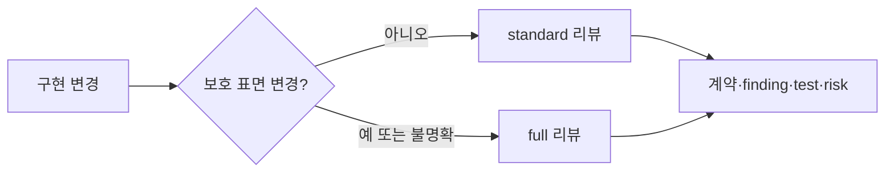

# ADR 0001: 위험에 비례하는 구현 검토와 저위험 리팩토링

Date: 2026-08-15

## Status

Accepted (2026-08-17)

## Context

구현 완료 전 검토는 ADR 충족 여부, 불필요한 변경, 누락된 동작과 검증 강도를 다룬다. 공개 계약이나 상태 전이를 바꾸는 구현에는 독립적인 다관점 검토가 필요하지만, 보호 표면을 건드리지 않는 국소 구현까지 동일한 보고서와 시각화 절차를 강제하면 검토 비용이 변경 위험과 무관해진다.

full 리뷰에서도 모든 PASS 결과에 긴 repair guide, 고정 개수의 다이어그램과 구현 선택 판정을 요구하면 사용자는 실제 위험보다 보고서 형식을 더 많이 읽게 된다. ADR이 정하지 않은 구현 재량은 필요할 때 드러나야 하지만, 여러 agent가 같은 목록을 반복 추출하거나 모든 기본값에 근거와 대안을 요구하면 검토가 새로운 프레임워크가 된다.

구현 전 승인한 ADR을 기준선으로 사용하고, 구현 후에는 계약 대조와 테스트 증거를 항상 유지해야 한다. 상세 설명, 다이어그램과 구현 선택은 판정에 기여할 때만 추가해야 한다.

계약 대조가 자유 형식 요약에 머물면 사용자는 어떤 요구사항이 구현됐고 어떤 항목이 검증되지 않았는지 다시 ADR과 diff에서 조합해야 한다. 구현 재량도 선택한 값과 중요성만 보여주면 그 선택이 ADR 의도와 양립하는지 판단하기 어렵다. 구현 리뷰는 ADR의 각 계약 행을 사람이 읽을 수 있는 달성 상태로 연결하고, ADR이 의도적으로 열어둔 중요한 구현 선택은 의도 적합성과 함께 설명해야 한다.

독립 검토는 provider의 다중 agent orchestration 지원에 의존한다. 지원하지 않는 환경에서도 검토 계약은 중단되지 않아야 하며, 독립 컨텍스트가 없다는 사실을 숨기거나 자동 리팩토링의 안전 조건을 낮춰서는 안 된다.

## Decision Drivers

- 계약과 보호 표면 변경은 provider fallback에서도 강도를 낮추지 않는 독립적인 필요성·충분성 검토가 필요하다.
- 사용자는 승인된 ADR의 각 계약 행별 달성 상태, finding, 테스트와 잔여 위험을 전체 diff 없이 파악할 수 있어야 한다.
- 상세 설명과 다이어그램은 독자가 실제로 재구성해야 할 흐름이 있을 때만 생성해야 한다.
- 구현 재량은 런타임, 운영, 비용이나 향후 변경에 중요한 항목만 한 번 추출하고 ADR 의도와의 적합성을 설명해야 한다.
- 사람에게는 검토 결과를 항상 제공하되 충족된 행과 구현 재량마다 별도 판정을 요구하지 않아야 한다.

## Decision

구현 리뷰를 **standard**와 **full** 두 모드로 운영한다.

`full`은 요구사항 계약, 공개 API나 wire form, 데이터 스키마, 상태와 전이, 권한과 가시성, 보안 경계, 외부 fallback, 동시성·트랜잭션·오류 의미 또는 여러 모듈에 걸친 변경에 적용한다. 구현 전에 승인된 ADR을 기준선으로 사용하고 독립 필요성·충분성 검토와 재현 증거를 유지한다.

`standard`는 위 보호 표면을 바꾸지 않는 국소 구현과 기존 결정의 강화에 적용한다. ADR decision ledger, 관련 테스트, 한 번의 독립 충분성 검토와 간결한 결과를 요구한다. 분류가 모호하면 `full`을 선택한다.

두 모드의 기본 결과는 verdict, ADR contract coverage, findings, tests와 residual risks다. `full`도 finding이 없으면 이 기본 결과로 끝낼 수 있다.

ADR contract coverage는 Decision과 requirement contract의 각 독립 행을 그대로 추적한다. 각 행은 `PROVEN`, `VIOLATED`, `UNVERIFIED`, `CONTRADICTED` 중 하나의 상태와 ADR 근거, 구현 내용, 코드 또는 실행 증거, 검증한 테스트를 가진다. `PROVEN`은 실행하거나 확인한 증거가 해당 계약을 지지하고 현재 반례를 찾지 못했다는 뜻이며 수학적 완전 증명을 뜻하지 않는다.

리뷰는 이 coverage를 **Evidence Package**의 첫 화면으로 제공한다. 사람은 각 요구사항이 무엇으로 달성됐는지, 어떤 행이 위반되거나 검증되지 않았는지 전체 diff를 재구성하지 않고 확인할 수 있어야 한다. 완료 보고는 항상 이 package를 사용자에게 보여주지만 `PROVEN` 행마다 별도 승인을 요구하지 않는다. `VIOLATED`, `UNVERIFIED`, `CONTRADICTED`와 계약 변경만 finding과 escalation 경로로 확장한다.

다이어그램은 상태, 비동기 호출, 외부 경계, 실패·rollback 또는 여러 구성 요소의 관계를 문장보다 명확하게 설명할 때만 추가한다. 개수나 종류를 고정하지 않는다. 모든 diagram node와 edge는 실제 코드 근거를 가져야 한다.

상세 repair guide는 `FIX_REQUIRED`나 `BLOCK` finding이 있거나 사용자가 요청할 때만 만든다. 이때 수정 순서, 변경 범위와 완료 기준을 finding에 연결한다.

구현 리뷰는 sufficiency 검토의 code-outward pass에서 **Notable implementation choices**를 한 번만 추출한다. 런타임 동작, 실패 처리, 운영, 비용 또는 향후 변경에 중요한 구현 재량만 `선택된 값이나 동작`, `코드 근거`, `ADR 의도와 양립하는 이유`, `왜 중요한가`로 기록한다. 의도 적합성은 선택의 역사적 이유를 추측하지 않고 해당 선택이 어떤 계약과 경계를 보존하는지 설명한다. admission gate를 통과하는 항목은 `Undecided behavior` finding으로 올린다. 근거나 대안을 코드에서 알 수 없다는 이유만으로 위험으로 만들지 않으며, 안전이나 계약에 영향을 주는 미확정 사항만 `Unverified risk`로 처리한다.

HTML은 Evidence Package의 계약별 달성 상태와 구현 선택을 먼저 표시하고 findings의 판정과 메모를 지원할 수 있다. 계약 coverage와 Notable implementation choices는 읽기 전용이며 개별 판정을 요구하지 않는다.

자동 리팩토링은 두 모드 모두에서 독립 검토가 확인한 국소적이고 동작 보존적인 후보만 적용한다. `/adr-impl`은 계약을 바꾸지 않는 증거 기반 결함을 자동 수정하고 같은 검토를 다시 실행한다. ADR 계약 변경, 모순된 전제, 중대한 미검증 위험 또는 파괴적 범위 변경만 사용자에게 판단을 요청한다.

하위 agent를 사용할 수 없을 때 `/adr-review`와 `/adr-impl-review`는 메인 세션에서 관점별 패스를 분리하고 독립 컨텍스트 부재를 결과에 기록한다. `/adr-impl-refactor`는 모든 후보를 `PROPOSE_ONLY`로 남긴다.

### Requirement contract

- 요구사항 값이나 규칙, 공개 계약, 스키마, 상태 전이, 권한, 보안, fallback, 동시성, 트랜잭션 또는 오류 의미가 바뀌면 `full`을 사용한다.
- 여러 bounded context나 광범위한 모듈을 변경하거나 사용자가 전체 검토를 요청하면 `full`을 사용한다.
- 새 ADR이나 변경된 ADR은 구현 전에 Decision, Decision Drivers, requirement contract와 regeneration checklist를 사용자에게 한 번 제시한다.
- `standard`는 decision ledger의 모든 행이 구현됐고 관련 테스트가 통과하며 필수 수정과 미검증 위험이 없을 때만 통과한다.
- `full`은 승인된 ADR을 기준으로 독립적인 필요성·충분성 검토와 증거 검증을 완료해야 한다.
- 모든 리뷰 결과는 verdict, ADR contract coverage, findings, tests와 residual risks를 포함한다.
- ADR contract coverage는 Decision과 requirement contract의 각 독립 행을 누락 없이 한 행씩 포함한다.
- 각 contract coverage 행은 `PROVEN`, `VIOLATED`, `UNVERIFIED`, `CONTRADICTED` 상태와 ADR 근거, 구현 내용, 증거와 검증한 테스트를 포함한다.
- `PASS`는 모든 contract coverage 행이 `PROVEN`이고 필수 테스트가 통과하며 미해결 finding과 중대한 미검증 위험이 없을 때만 허용한다.
- 완료 보고는 Evidence Package를 사람에게 항상 제공하되 `PROVEN` 행마다 승인이나 판정을 요구하지 않는다.
- 다이어그램은 판정에 필요한 흐름이나 관계를 문장보다 명확하게 설명할 때만 포함하며 개수나 종류를 강제하지 않는다.
- 상세 repair guide는 수정이 필요한 finding이 있거나 사용자가 요청할 때만 생성한다.
- Notable implementation choices는 sufficiency 검토에서 한 번만 추출하고 선택된 값이나 동작, 코드 근거, ADR 의도와 양립하는 이유와 중요성을 기록한다.
- admission gate를 통과한 구현 선택은 `Undecided behavior` finding으로 처리한다.
- 코드에서 선택의 역사적 근거나 대안을 알 수 없다는 이유만으로 `Unverified risk`를 만들지 않는다.
- 안전이나 계약에 영향을 주는 미확정 구현 동작은 `Unverified risk`로 처리한다.
- HTML은 contract coverage와 Notable implementation choices를 findings보다 먼저 읽기 전용으로 표시하고 개별 판정을 요구하지 않는다.
- 현재 provider가 Amazon Bedrock으로 식별되면 하위 agent를 dispatch하지 않고 fallback을 사용한다.
- 하위 agent 요청이 알려진 validation error로 거부되면 같은 세션에서 재시도하지 않는다.
- 메인 세션 fallback은 관점별 패스를 분리하고 독립 컨텍스트 부재를 결과에 기록한다.
- `/adr-impl-refactor`는 독립 read-only reviewer가 없을 때 모든 후보를 `PROPOSE_ONLY`로 남긴다.
- 구현 후에는 ADR이 구현 전 승인 이후 바뀌지 않은 한 재생성 가능성이나 사용자 의도를 다시 묻지 않는다.
- `/adr-impl`은 증거가 있고 계약을 바꾸지 않는 코드·테스트 수정과 국소 리팩토링을 자동 적용하고 같은 검토를 다시 실행한다.
- 어떤 모드에서도 실행하지 못한 핵심 경로나 테스트를 `PASS`로 바꾸지 않는다.
- 자동 반영 후보는 국소적이고 신뢰도가 높으며 ADR 결정과 사용자 관찰 동작을 보존해야 한다.
- 공개 계약, 데이터, 상태, 권한, 검증, 동시성, 트랜잭션, fallback, 자원 수명 또는 오류 의미를 건드리는 리팩토링은 자동 반영하지 않는다.
- 자동 변경 전후 관련 테스트가 통과해야 하며 실패하거나 범위가 넓어지면 제안으로 남긴다.
- 리뷰 결과는 모드, 실행 시간, 관점별 발견 건수, 미검증 위험과 실행한 테스트 수를 기록한다.

#### 관찰 가능한 검증 기준

- 같은 ADR 계약을 리뷰하면 각 독립 계약 행이 Evidence Package에 정확히 한 번 나타나고 상태, 구현 내용, ADR 근거, 증거와 테스트를 함께 보여준다.
- 하나라도 `PROVEN`이 아닌 coverage 행이 있으면 artifact validator가 `PASS`를 거부한다.
- 중요한 구현 재량이 있으면 Markdown과 HTML이 선택 내용, 코드 근거, ADR 의도와 양립하는 이유와 중요성을 읽기 전용으로 보여준다.
- 사람은 Evidence Package에서 요구사항별 달성 내용을 확인할 수 있고 `PROVEN` 행이나 구현 재량마다 판정을 요구받지 않는다.

### Alternatives

1. **모든 full 리뷰에 고정 보고서와 다이어그램 적용**
   - 장점: 산출물 형식이 항상 같다.
   - 단점: 실제 finding이 없는 변경도 최대 설명 비용을 지불한다.

2. **구현 선택을 여러 agent가 독립적으로 추출하고 사용자가 모두 판정**
   - 장점: 선택 누락 가능성을 낮춘다.
   - 단점: 같은 정보를 반복 생성하고 구현 재량까지 승인 절차로 만든다.

3. **계약 검증은 항상 유지하고 상세 산출물은 필요할 때만 확장**
   - 장점: 완료 안전성을 유지하면서 기본 검토량을 줄인다.
   - 단점: 상세 설명이 필요한지 모델이 판단해야 한다.

4. **계약 coverage를 자유 형식 요약으로만 제공**
   - 장점: 리뷰 artifact 구조가 단순하다.
   - 단점: 사용자가 누락된 요구사항과 증거를 ADR 및 diff에서 다시 대조해야 한다.

## Consequences

### Positive

- 보호 표면 변경은 기존의 독립 검토와 계약 대조 강도를 유지한다.
- PASS 결과와 단순 finding은 짧은 보고서로 검토할 수 있다.
- 사용자는 요구사항별 달성 내용과 검증 근거를 Evidence Package에서 바로 확인할 수 있다.
- 다이어그램과 repair guide는 실제 이해 비용을 줄일 때만 생성된다.
- 구현 선택이 ADR로 올라가지 않으면서도 중요한 재량과 ADR 의도 적합성을 확인할 수 있다.
- 구현 선택을 한 번만 추출하고 별도 판정을 제거해 prompt와 renderer 유지비가 줄어든다.
- 저위험 리팩토링과 자동 수정의 안전 조건은 유지된다.

### Negative

- 보고서 형태가 finding과 변경 특성에 따라 달라진다.
- coverage 행을 ADR 계약 행과 정확히 대응시키는 정규화 비용이 생긴다.
- diagram과 상세 guide 필요성을 모델이 판단해야 한다.
- 읽기 전용 구현 선택 목록은 사용자별 판정 상태를 저장하지 않는다.

### Risks

- 모델이 필요한 diagram을 생략할 수 있다. 상태, 비동기, 외부 경계와 실패 복구가 판정에 중요하면 diagram을 추가하도록 기준을 명시한다.
- 모델이 여러 계약을 한 coverage 행으로 묶어 일부 누락을 숨길 수 있다. ADR의 독립 계약 행과 coverage 행을 일대일로 검증한다.
- 구현 선택 목록이 사소한 표현을 나열할 수 있다. 런타임, 운영, 비용과 향후 변경에 중요한 항목만 허용한다.
- 상세 guide가 필요한 finding을 짧게 끝낼 수 있다. `FIX_REQUIRED`와 `BLOCK`에는 finding별 변경 범위와 완료 기준을 요구한다.

## Related

- 없음
