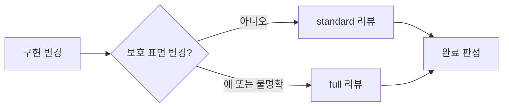

# ADR 0001: 위험에 비례하는 구현 검토와 저위험 리팩토링

Date: 2026-08-15

## Status

Accepted (2026-08-16)

## Context

구현 완료 전 검토는 ADR 충족 여부, 불필요한 변경, 누락된 동작과 검증 강도를 다룬다. 공개 계약이나 상태 전이를 바꾸는 구현에는 독립적인 다관점 검토가 필요하지만, 보호 표면을 건드리지 않는 국소 구현까지 동일한 보고서와 시각화 절차를 강제하면 검토 비용이 변경 위험과 무관해진다.

구현이 끝난 뒤 ADR의 재생성 가능성과 사용자 의도를 다시 확인하면 작성 단계에서 이미 승인한 계약을 반복해서 묻게 된다. 완료 검토가 발견한 모든 항목을 사용자 선택에 맡기면 명확한 코드·테스트 결함도 자동으로 고치지 못하고 구현 흐름이 중단된다.

검토 강도는 낮추더라도 완료 판정의 근거와 저위험 리팩토링 안전 조건은 유지해야 한다. 사용자 의도와 ADR 완전성은 구현 전에 확정하고, 구현 후 검토는 그 승인된 계약을 기준으로 스스로 반증·수정·재검증해야 한다.

독립 검토는 실행 중인 provider가 다중 agent orchestration을 지원한다는 전제에 의존한다. Amazon Bedrock 경로처럼 이 기능을 제공하지 않는 환경에서 하위 agent를 낙관적으로 실행하면 요청 본문 검증 단계에서 실패하고, 같은 요청을 재시도해도 검토 격리가 회복되지 않는다. 이런 환경에서도 검토 계약은 중단되지 않아야 하지만, 독립 컨텍스트가 없다는 사실을 숨기거나 자동 리팩토링의 안전 조건을 낮춰서는 안 된다.

## Decision Drivers

- 계약과 보호 표면 변경은 독립적인 필요성·충분성 검토가 필요하다.
- 국소 변경은 전체 보고서 생성 비용 없이도 검증할 수 있어야 한다.
- 구현 전 승인한 ADR 계약을 구현 후 일상적으로 다시 확인하지 않아야 한다.
- 자동 리팩토링과 증거 기반 수정은 ADR과 사용자 관찰 동작을 보존하며 사용자 판정 없이 재검증해야 한다.
- 검증하지 못한 경로는 통과로 처리하지 않고, provider가 지원하지 않거나 이미 거부한 orchestration 요청은 반복하지 않으며 리뷰 비용과 발견 효과를 측정할 수 있어야 한다.

## Decision

구현 리뷰를 **standard**와 **full** 두 모드로 운영한다.

`full`은 요구사항 계약, 공개 API나 wire form, 데이터 스키마, 상태와 전이, 권한과 가시성, 보안 경계, 외부 fallback, 동시성·트랜잭션·오류 의미 또는 여러 모듈에 걸친 변경에 적용한다. 구현 전에 승인된 ADR을 기준선으로 사용하고 독립 필요성·충분성 검토, 재현 증거와 상세 repair artifact를 유지한다.

`standard`는 위 보호 표면을 바꾸지 않는 국소 구현과 기존 결정의 강화에 적용한다. ADR decision ledger, 관련 테스트, 한 번의 독립 충분성 검토와 간결한 결과를 요구하지만 별도 report writer, HTML, 필수 Mermaid는 요구하지 않는다. 분류가 모호하면 `full`을 선택한다.

자동 리팩토링은 두 모드 모두에서 독립 검토가 확인한 국소적이고 동작 보존적인 후보만 적용한다.

`/adr-impl` 완료 경로에서 검토가 찾은 증거 기반 코드·테스트 결함과 국소 리팩토링은 구현 세션이 자동으로 수정하고 테스트와 같은 리뷰 모드를 다시 실행한다. 사용자 판단은 ADR 계약을 바꾸는 선택, 서로 모순된 전제, 재현하지 못한 중대한 위험 또는 파괴적인 범위 변경에만 요청한다. 검토가 통과하면 사용자의 추가 승인을 기다리지 않고 `Accepted`로 전환하며, 마지막 보고에 적용한 수정과 검증 결과를 요약한다.

독립적으로 호출한 `/adr-impl-review`는 report-only를 유지한다. 이 경우 결과와 권장 조치를 보고하지만, `/adr-impl`의 pre-promotion 호출처럼 사용자 판정을 완료 조건으로 요구하지 않는다.

검토를 위임하기 전에 현재 provider가 다중 agent orchestration을 지원하는지 판단한다. Amazon Bedrock으로 식별된 세션은 하위 agent가 없는 환경으로 취급해 dispatch하지 않는다. provider 정보가 사전에 드러나지 않아 하위 agent 요청이 `validation_error`와 `Invalid 'input': value did not match any expected variant`로 거부되면 같은 요청이나 다른 하위 agent로 재시도하지 않고 그 세션에서 orchestration을 사용할 수 없는 것으로 확정한다.

하위 agent를 사용할 수 없을 때 `/adr-review`는 ADR별 검토를 메인 세션의 분리된 순차 패스로 수행하고, `/adr-impl-review`는 필요성·충분성 관점을 서로의 결과를 읽지 않는 별도 패스로 수행한 뒤 같은 보고 계약을 지킨다. 두 경로 모두 독립 컨텍스트를 사용하지 못했다는 제한을 결과에 기록한다. `/adr-impl-refactor`는 독립 read-only reviewer가 없으면 메인 세션이 후보를 분석하되 모든 항목을 `PROPOSE_ONLY`로 남기고 자동 적용하지 않는다.

사용자 전역 설정은 플러그인이 수정하지 않는다. Bedrock 사용자가 validation error 자체를 예방하려면 세션 시작 전에 Codex의 `multi_agent` 기능을 비활성화하고 새 세션을 시작하도록 운영 문서에서 안내한다.

### Requirement contract

- 요구사항 값이나 규칙, 공개 계약, 스키마, 상태 전이, 권한, 보안, fallback, 동시성, 트랜잭션 또는 오류 의미가 바뀌면 `full`을 사용한다.
- 여러 bounded context나 광범위한 모듈을 변경하거나 사용자가 전체 검토를 요청하면 `full`을 사용한다.
- 새 ADR이나 변경된 ADR은 구현 전에 Decision, Decision Drivers, requirement contract와 regeneration checklist를 사용자에게 제시해 의도와 완전성을 한 번 확인한다.
- `standard`는 decision ledger의 모든 행이 구현됐고 관련 테스트가 통과하며 필수 수정과 미검증 위험이 없을 때만 통과한다.
- `full`은 승인된 ADR을 기준으로 독립적인 필요성·충분성 검토와 증거 검증을 완료해야 한다.
- 현재 provider가 Amazon Bedrock으로 식별되면 하위 agent를 dispatch하지 않고 subagent unavailable fallback을 사용한다.
- 하위 agent 요청이 `validation_error`와 `Invalid 'input': value did not match any expected variant`로 거부되면 같은 세션에서 하위 agent 요청을 재시도하지 않는다.
- `/adr-review`와 `/adr-impl-review`의 메인 세션 fallback은 관점별 패스를 분리하고 독립 컨텍스트 부재를 결과에 기록한다.
- `/adr-impl-refactor`는 독립 read-only reviewer가 없을 때 모든 후보를 `PROPOSE_ONLY`로 남기고 자동 적용하지 않는다.
- 플러그인은 사용자 Codex 설정을 자동 변경하지 않으며, Bedrock 예방 설정과 새 세션 요구사항을 운영 문서에 제공한다.
- 구현 후에는 ADR이 구현 전 승인 이후 바뀌지 않은 한 재생성 가능성이나 사용자 의도를 다시 묻지 않는다.
- `/adr-impl`은 증거가 있고 계약을 바꾸지 않는 코드·테스트 수정과 국소 리팩토링을 자동 적용하고 같은 검토를 다시 실행한다.
- ADR 변경, 모순된 전제, 중대한 미검증 위험 또는 파괴적 변경이 필요할 때만 사용자 판단을 요청한다.
- 어떤 모드에서도 실행하지 못한 핵심 경로나 테스트를 `PASS`로 바꾸지 않는다.
- 자동 반영 후보는 국소적이고 신뢰도가 높으며 ADR 결정과 사용자 관찰 동작을 보존해야 한다.
- 공개 계약, 데이터, 상태, 권한, 검증, 동시성, 트랜잭션, fallback, 자원 수명 또는 오류 의미를 건드리는 리팩토링은 자동 반영하지 않는다.
- 자동 변경 전후 관련 테스트가 통과해야 하며 실패하거나 범위가 넓어지면 제안으로 남긴다.
- 리뷰 결과는 모드, 실행 시간, 관점별 발견 건수, 미검증 위험과 실행한 테스트 수를 기록한다.

### Alternatives

1. **모든 변경에 full 리뷰 적용**
   - 장점: 한 가지 강한 절차만 운영한다.
   - 단점: 작은 변경도 다수의 agent와 상세 artifact 비용을 지불한다.

2. **구현자가 임의로 검토 단계를 선택**
   - 장점: 가장 빠른 경로를 선택할 수 있다.
   - 단점: 위험한 변경이 가벼운 검토로 내려갈 수 있다.

3. **보호 표면 기준으로 standard와 full을 선택**
   - 장점: 안전 경계를 유지하면서 비용을 실제 위험에 맞춘다.
   - 단점: 모드 분류와 fallback 규칙을 지속적으로 검증해야 한다.

4. **full 리뷰에서 구현 후 사람의 의도 확인을 필수화**
   - 장점: 구현 결과를 본 뒤 사용자가 계약을 다시 판단할 수 있다.
   - 단점: 구현 전에 승인한 ADR을 반복 확인하고 자동 완료를 막는다.

5. **지원 여부와 무관하게 하위 agent를 먼저 실행하고 실패 시 재시도**
   - 장점: provider capability를 사전에 판단할 필요가 없다.
   - 단점: 지원하지 않는 provider에서 사용자가 validation error를 반복해서 보고, 재시도로 검토 격리는 회복되지 않는다.

6. **Bedrock에서는 검토 명령 전체를 차단**
   - 장점: 독립 검토가 불가능한 환경에서 검토 강도를 과장하지 않는다.
   - 단점: 메인 세션으로 수행할 수 있는 계약 대조와 테스트 검증까지 잃는다.

## Consequences

### Positive

- 보호 표면 변경은 기존의 적대적 검토 강도를 유지한다.
- 국소 구현은 불필요한 report writer, HTML과 시각화 비용을 피한다.
- 리뷰 비용과 발견 효과를 모드별로 비교할 수 있다.
- 저위험 리팩토링의 자동 반영 조건은 유지된다.
- 구현 후 반복 확인 없이 증거 기반 수정과 재검증을 마치고 완료할 수 있다.
- Bedrock 세션은 알려진 비호환 요청을 피하면서 메인 세션 검토를 계속할 수 있다.
- 독립 reviewer가 없는 리팩토링은 제안으로만 남아 자동 변경의 안전 경계를 유지한다.

### Negative

- 두 리뷰 경로를 문서와 테스트에서 함께 유지해야 한다.
- 경계 사례는 보수적으로 full 리뷰에 들어간다.
- 구현 전 ADR 확인이 부실하면 구현 후 리뷰는 잘못된 계약을 정확히 구현했다고 판정할 수 있다.
- 메인 세션 fallback은 실제 독립 컨텍스트보다 반증력이 낮으며 결과에 그 제한이 남는다.

### Risks

- standard 범위가 넓어질 수 있다. 보호 표면 조건과 불명확하면 full이라는 기본값으로 제한한다.
- 자동 수정이 ADR 계약을 바꾸는 변경까지 흡수할 수 있다. 계약 변경·모순·중대한 미검증 위험은 자동 수정 범위에서 제외한다.
- provider 식별 정보가 세션에 드러나지 않으면 첫 하위 agent 요청에서 validation error가 한 번 발생할 수 있다. 운영 문서의 Bedrock 설정으로 요청 생성 자체를 예방하고, 오류 이후에는 재시도하지 않는다.

## Related

- 없음
