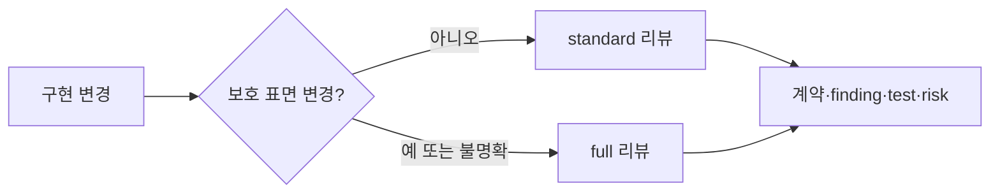

# ADR 0001: 위험에 비례하는 구현 검토와 저위험 리팩토링

Date: 2026-08-15

## Status

Accepted (2026-08-28)

## Context

구현 완료 전 검토는 ADR 충족 여부, 불필요한 변경, 누락된 동작과 검증 강도를 다룬다. 공개 계약이나 상태 전이를 바꾸는 구현에는 독립적인 다관점 검토가 필요하지만, 보호 표면을 건드리지 않는 국소 구현까지 동일한 보고서와 시각화 절차를 강제하면 검토 비용이 변경 위험과 무관해진다.

full 리뷰에서도 모든 PASS 결과에 긴 repair guide, 고정 개수의 다이어그램과 구현 선택 판정을 요구하면 사용자는 실제 위험보다 보고서 형식을 더 많이 읽게 된다. ADR이 정하지 않은 구현 재량은 필요할 때 드러나야 하지만, 여러 agent가 같은 목록을 반복 추출하거나 모든 기본값에 근거와 대안을 요구하면 검토가 새로운 프레임워크가 된다.

구현 전 승인한 ADR을 기준선으로 사용하고, 구현 후에는 계약 대조와 테스트 증거를 항상 유지해야 한다. 상세 설명, 다이어그램과 구현 선택은 판정에 기여할 때만 추가해야 한다.

하지만 다이어그램 사용을 막연한 선택으로만 두고 계약 coverage 표부터 보여주면, 해당 구현을 처음 보는 개발자는 요청 흐름과 실패 지점을 머릿속에서 다시 조립한 뒤에야 증거를 읽을 수 있다. 쉬운 설명은 증거를 줄이는 일이 아니라 결론과 시스템 관계를 먼저 보여주고 상세 증거를 그 뒤에 두는 일이어야 한다.

계약 대조가 자유 형식 요약에 머물면 사용자는 어떤 요구사항이 구현됐고 어떤 항목이 검증되지 않았는지 다시 ADR과 diff에서 조합해야 한다. 구현 재량도 선택한 값과 중요성만 보여주면 그 선택이 ADR 의도와 양립하는지 판단하기 어렵다. 구현 리뷰는 ADR의 각 계약 행을 사람이 읽을 수 있는 달성 상태로 연결하고, ADR이 의도적으로 열어둔 중요한 구현 선택은 의도 적합성과 함께 설명해야 한다.

구현 선택 자체가 교체 가능한 재량이어도 그 동작이 provider 보장, 입력 출처, 순서, 유일성이나 trust boundary 같은 외부 전제에 의존할 수 있다. 그 전제가 틀릴 때 계약이나 안전이 깨지는데 검증 근거가 없다면 정상 구현 재량으로 숨기지 않고 완료를 막아야 한다.

리뷰에서 ADR의 빈칸처럼 보이는 항목도 모두 사용자 질문으로 올리면 에이전트가 도메인 지식과 저장소 문맥으로 해결할 수 있는 판단까지 HITL이 된다. 리뷰는 명시 계약의 논리적 결과, 프로젝트 관례와 권위 있는 도메인 기본값을 먼저 분리하고, 여러 제품 선택지가 남는 gap만 사용자가 답할 수 있는 decision packet으로 만들어야 한다.

구현 리뷰의 계약은 필요한 관점, 증거와 완료 판정이다. named agent, generic subagent, main-session pass, 병렬 또는 순차 실행은 그 계약을 실현하는 방법이다. 특정 orchestration 방법을 고정하면 provider capability와 모델 개선이 바뀐 뒤에도 절차가 검토 목적보다 오래 남는다.

리뷰 하네스가 없어져도 ADR, 코드, 테스트와 프로젝트 문서만으로 결정과 구현 상태를 읽을 수 있어야 한다. 하네스는 이 자료에서 일시적인 Evidence Package를 파생하며, 서브에이전트 수, 모델 계열, 실행 순서와 중간 분석을 영속 권위로 만들지 않는다.

## Decision Drivers

- 계약과 보호 표면 변경은 실행 경로와 provider가 달라도 강도를 낮추지 않는 필요성·충분성 관점과 증거 검토가 필요하며, 그 관점을 확보할 orchestration은 현재 모델이 판단해야 한다.
- 사용자는 승인된 ADR의 각 계약 행별 달성 상태, finding, 테스트와 잔여 위험을 전체 diff 없이 파악하되 충족된 행과 구현 재량마다 별도 판정을 요구받지 않아야 한다.
- 해당 구현을 처음 보는 주니어 개발자가 결론, 영향, 필요한 조치와 남은 위험을 상세 증거보다 먼저 이해할 수 있어야 하며, 관계를 재구성해야 하는 리뷰는 근거 있는 Mermaid를 사용하되 단순 PASS에 고정 형식 비용을 만들지 않아야 한다.
- 구현 재량은 런타임, 운영, 비용이나 향후 변경에 중요한 항목만 한 번 추출해 ADR 의도 적합성을 설명하고, 계약 핵심 경로가 의존하는 외부 전제까지 검증해 틀릴 때 계약·안전이 깨지는 미검증 전제는 완료를 막아야 한다.
- 플러그인 제거 후에도 ADR, 코드, 테스트와 프로젝트 문서가 각각 자기 추상화 수준의 질문에 답할 수 있어야 한다.

## Decision

구현 리뷰를 **standard**와 **full** 두 모드로 운영한다.

`full`은 요구사항 계약, 공개 API나 wire form, 데이터 스키마, 상태와 전이, 권한과 가시성, 보안 경계, 외부 fallback, 동시성·트랜잭션·오류 의미 또는 여러 모듈에 걸친 변경에 적용한다. 구현 전에 승인된 ADR을 기준선으로 사용하고 독립적으로 도출한 필요성·충분성 관점과 재현 증거를 유지한다.

`standard`는 위 보호 표면을 바꾸지 않는 국소 구현과 기존 결정의 강화에 적용한다. ADR decision ledger, 관련 테스트, 충분성 관점과 간결한 결과를 요구한다. 분류가 모호하면 `full`을 선택한다.

두 모드의 기본 결과는 verdict, ADR contract coverage, findings, tests와 residual risks다. `full`도 finding이 없으면 이 기본 결과로 끝낼 수 있다.

ADR contract coverage는 Decision과 requirement contract의 각 독립 행을 그대로 추적한다. 각 행은 `PROVEN`, `VIOLATED`, `UNVERIFIED`, `CONTRADICTED` 중 하나의 상태와 ADR 근거, 구현 내용, 코드 또는 실행 증거, 검증한 테스트를 가진다. `PROVEN`은 실행하거나 확인한 증거가 해당 계약을 지지하고 현재 반례를 찾지 못했다는 뜻이며 수학적 완전 증명을 뜻하지 않는다.

리뷰는 **Evidence Package**를 한눈에 보기와 계약별 증거로 구성한다. 한눈에 보기는 verdict, 사용자 또는 운영 영향, 필요한 다음 조치와 남은 위험을 평이한 언어로 답한다. ADR contract coverage는 그 다음 첫 증거 section으로 제공한다. 사람은 각 요구사항이 무엇으로 달성됐는지, 어떤 행이 위반되거나 검증되지 않았는지 전체 diff를 재구성하지 않고 확인할 수 있어야 한다. 완료 보고는 항상 이 package를 사용자에게 보여주지만 `PROVEN` 행마다 별도 승인을 요구하지 않는다. `VIOLATED`, `UNVERIFIED`, `CONTRADICTED`와 계약 변경만 finding과 escalation 경로로 확장한다.

사람용 구현 리뷰와 refactor 결과는 해당 코드를 처음 보는 주니어 개발자를 독자로 가정한다. 피할 수 없는 도메인·기술 용어는 처음 한 번만 짧게 설명하고, finding 제목은 내부 category나 symbol보다 사용자·운영 증상을 먼저 말한다. 규칙 ID, 경로, symbol과 정확한 증거는 상세 section에 유지한다.

다음 중 하나라도 있으면 근거 있는 Mermaid를 포함한다.

- 세 개 이상의 참여자, 처리 단계, 상태 또는 구성 요소 관계
- 비동기 또는 cross-system 요청·이벤트 흐름
- 상태 전이, 실패, 재시도, rollback 또는 fallback
- 데이터 관계 변경이나 여러 call site에 걸친 refactor

요청·이벤트 흐름은 `sequenceDiagram`, 상태는 `stateDiagram-v2`, 분기·의존·실패 흐름은 `flowchart`, 데이터 관계는 `erDiagram`을 우선한다. 가장 작은 유용한 다이어그램을 선택하고 독자가 확인할 핵심을 한 문장으로 적는다. 단일 파일의 국소 PASS처럼 한두 문장으로 관계가 분명하면 생략할 수 있다. 개수나 종류를 고정하지 않으며 모든 node와 edge는 실제 코드나 ADR 근거를 가져야 한다.

사람용 보고서의 각 문장은 verdict, 계약, 근거, 영향, 조치 또는 위험 중 하나에 기여해야 한다. 칭찬, 장면 설정, 사용자 요청 반복, 결론 재진술, 근거 없는 일반론과 미래 추측, 같은 발견과 근거의 반복, 내용 없는 heading을 제거한다.

상세 repair guide는 `FIX_REQUIRED`나 `BLOCK` finding이 있거나 사용자가 요청할 때만 만든다. 이때 수정 순서, 변경 범위와 완료 기준을 finding에 연결한다.

구현 리뷰는 sufficiency 검토의 code-outward pass에서 **Notable implementation choices**를 한 번만 추출한다. 런타임 동작, 실패 처리, 운영, 비용 또는 향후 변경에 중요한 구현 재량만 `선택된 값이나 동작`, `코드 근거`, `ADR 의도와 양립하는 이유`, `왜 중요한가`로 기록한다. 의도 적합성은 선택의 역사적 이유를 추측하지 않고 해당 선택이 어떤 계약과 경계를 보존하는지 설명한다. admission gate를 통과하는 항목은 `Undecided behavior` finding으로 올린다. 근거나 대안을 코드에서 알 수 없다는 이유만으로 위험으로 만들지 않으며, 안전이나 계약에 영향을 주는 미확정 사항만 `Unverified risk`로 처리한다.

리뷰는 구현자의 내부 사고과정을 재구성하지 않는다. 대신 provider 보장, input provenance, ordering, uniqueness, trust boundary, platform behavior처럼 코드가 의존하는 외부 검증 가능한 전제만 확인한다. 전제가 코드, 테스트, 설정이나 권위 있는 외부 계약으로 확인되면 증거로 사용한다. 확인되지 않았고 틀릴 경우 ADR 계약 행이나 안전 속성을 위반할 수 있으면 `Unverified risk`로 기록하고 해당 coverage를 `UNVERIFIED`로 유지해 `PASS`를 금지한다. finding에는 전제, 틀릴 때 영향받는 계약·안전 속성과 부족한 검증을 명시한다.

ADR completeness gap을 발견하면 먼저 명시 계약에서 도출되는 의무인지, 저장소 관례나 권위 있는 도메인 규칙으로 정할 수 있는 가역적 기본값인지 판단한다. Derived obligation은 부모 coverage 행의 검증 의무로 포함하고, domain default는 Notable implementation choice로 기록한다. 여러 domain-valid 결과가 남거나 제품 정책·금액·권한·규제·보존기간·비가역 데이터·public contract·durable fallback을 정해야 할 때만 blocking contract issue로 처리한다. 이때 단순히 질문이 필요하다고 보고하지 않고 추천안과 근거, 현실적인 대안, 영향과 정확한 ADR 계약 문구를 하나의 Decision request로 제공한다.

HTML은 Evidence Package의 계약별 달성 상태와 구현 선택을 먼저 표시하고 findings의 판정과 메모를 지원할 수 있다. 계약 coverage와 Notable implementation choices는 읽기 전용이며 개별 판정을 요구하지 않는다.

리뷰가 요구하는 것은 관점과 증거의 분리이지 고정된 agent topology가 아니다. 모델은 현재 capability, 변경 위험과 컨텍스트 크기를 보고 named agent, generic read-only subagent, main-session pass 또는 이들의 조합을 선택한다. `full`은 필요성·충분성 관점을 각각 원본 ADR, diff, 코드와 테스트에서 도출하고 종합 전까지 한 관점의 결론을 다른 관점의 입력으로 사용하지 않는다. `standard`는 충분성 관점과 decision ledger를 유지한다. 설명 작성과 보고서 합성도 별도 agent가 필요한 계약이 아니다.

자동 리팩토링은 국소적이고 동작 보존적인 후보만 적용한다. 후보가 `APPLY_NOW`가 되려면 정확한 코드 근거, 보호 표면 비변경, 작은 변경 범위와 전후 테스트가 필요하다. 이 검증을 별도 subagent가 수행했는지는 판정 조건이 아니다. 모델은 독립 컨텍스트가 이득이면 사용하고, 그렇지 않으면 메인 세션에서 근거를 재검증한다. `/adr-impl`은 계약을 바꾸지 않는 증거 기반 결함을 자동 수정하고 같은 검토를 다시 실행한다. ADR 계약 변경, 모순된 전제, 중대한 미검증 위험 또는 파괴적 범위 변경만 사용자에게 판단을 요청한다.

실행 환경이 일부 orchestration 기능을 지원하지 않으면 모델은 사용 가능한 경로로 같은 관점과 증거 계약을 완수한다. 분리된 관점이나 호출 경로를 확보하지 못한 사실이 판정 신뢰도에 영향을 주면 review limits에 기록한다. 지원하지 않는 호출을 반복하지 않지만 provider 이름, agent 수, 모델 계열과 reasoning tier를 완료 계약으로 고정하지 않는다.

### Requirement contract

- 요구사항 값이나 규칙, 공개 계약, 스키마, 상태 전이, 권한, 보안, fallback, 동시성, 트랜잭션 또는 오류 의미가 바뀌면 `full`을 사용한다.
- 여러 bounded context나 광범위한 모듈을 변경하거나 사용자가 전체 검토를 요청하면 `full`을 사용한다.
- 새 ADR이나 변경된 ADR은 구현 전에 Decision, Decision Drivers, requirement contract와 regeneration checklist를 사용자에게 한 번 제시한다.
- `standard`는 decision ledger의 모든 행이 구현됐고 관련 테스트가 통과하며 필수 수정과 미검증 위험이 없을 때만 통과한다.
- `full`은 승인된 ADR을 기준으로 필요성·충분성 관점을 각각 도출하고 증거 검증을 완료해야 한다.
- 모든 리뷰 결과는 verdict, ADR contract coverage, findings, tests와 residual risks를 포함한다.
- 모든 사람용 리뷰 결과는 verdict, 사용자·운영 영향, 필요한 조치와 남은 위험을 담은 한눈에 보기로 시작한다.
- 사람용 리뷰와 refactor 결과는 해당 구현을 처음 보는 주니어 개발자가 이해할 수 있는 평이한 언어를 사용하고, 피할 수 없는 용어는 처음 한 번만 설명한다.
- ADR contract coverage는 Decision과 requirement contract의 각 독립 행을 누락 없이 한 행씩 포함한다.
- 각 contract coverage 행은 `PROVEN`, `VIOLATED`, `UNVERIFIED`, `CONTRADICTED` 상태와 ADR 근거, 구현 내용, 증거와 검증한 테스트를 포함한다.
- `PASS`는 모든 contract coverage 행이 `PROVEN`이고 필수 테스트가 통과하며 미해결 finding과 중대한 미검증 위험이 없을 때만 허용한다.
- 완료 보고는 Evidence Package를 사람에게 항상 제공하되 `PROVEN` 행마다 승인이나 판정을 요구하지 않는다.
- 세 개 이상의 참여자·단계·상태·구성 요소 관계, 비동기·cross-system 흐름, 상태 전이, 실패·재시도·rollback·fallback, 데이터 관계 변경 또는 여러 call site refactor가 있으면 가장 작은 유용한 Mermaid를 포함한다.
- 각 Mermaid 뒤에는 독자가 확인할 핵심을 한 문장으로 적고, 전체 텍스트는 Mermaid 렌더링 없이도 판정 가능해야 한다.
- 단일 파일의 국소 PASS처럼 관계가 한두 문장으로 분명하면 다이어그램을 생략할 수 있고, 개수나 종류를 고정하지 않는다.
- 상세 repair guide는 수정이 필요한 finding이 있거나 사용자가 요청할 때만 생성한다.
- Notable implementation choices는 sufficiency 검토에서 한 번만 추출하고 선택된 값이나 동작, 코드 근거, ADR 의도와 양립하는 이유와 중요성을 기록한다.
- admission gate를 통과한 구현 선택은 `Undecided behavior` finding으로 처리한다.
- 코드에서 선택의 역사적 근거나 대안을 알 수 없다는 이유만으로 `Unverified risk`를 만들지 않는다.
- 안전이나 계약에 영향을 주는 미확정 구현 동작은 `Unverified risk`로 처리한다.
- 구현 재량과 계약 핵심 경로가 의존하는 provider 보장, 입력 출처, 순서, 유일성, trust boundary와 platform behavior 같은 외부 전제를 검토한다.
- 외부 전제가 미검증이고 틀릴 경우 계약이나 안전을 위반할 수 있으면 `Unverified risk`로 처리하고 영향받는 coverage를 `UNVERIFIED`로 유지한다.
- `Unverified risk`는 전제, 전제가 틀릴 때 영향받는 계약·안전 속성과 부족한 검증을 명시하며 내부 사고과정을 요구하지 않는다.
- ADR completeness gap은 derived obligation, project/domain default, product decision으로 분류한 뒤 escalation한다.
- Derived obligation은 부모 contract coverage에 연결하고 project/domain default는 구현 재량으로 기록한다.
- Product decision gap은 추천안과 근거, 2~3개 대안, 영향과 정확한 ADR 문구를 포함한 Decision request로 묶는다.
- HTML은 contract coverage와 Notable implementation choices를 findings보다 먼저 읽기 전용으로 표시하고 개별 판정을 요구하지 않는다.
- 사람용 보고서에서 칭찬, 장면 설정, 사용자 요청 반복, 근거 없는 일반론, 미래 추측, 같은 결론·발견·근거의 반복과 내용 없는 heading을 제거한다.
- 필요성·충분성 관점은 종합 전까지 서로의 결론을 입력으로 사용하지 않는다.
- named agent, generic subagent, main-session pass, 병렬·순차 실행과 모델 선택은 현재 모델의 일시적 orchestration 판단이다.
- 지원하지 않는 orchestration 호출은 반복하지 않으며, 사용 가능한 실행 경로로 같은 review contract를 완수한다.
- orchestration 제약이 관점 분리나 증거 강도를 낮추면 review limits에 기록한다.
- `/adr-impl-refactor`의 `APPLY_NOW` 판정은 subagent 사용 여부가 아니라 국소 범위, 동작 보존, 정확한 근거와 전후 테스트로 결정한다.
- 하네스는 private chain-of-thought, 내부 점수 근거나 탐색 transcript를 요구하거나 영속화하지 않는다.
- 하네스를 제거해도 ADR, 코드, 테스트와 프로젝트 문서만으로 결정, 계약과 구현 상태를 읽을 수 있어야 한다.
- Evidence Package와 중간 review artifact는 파생 가능하고 폐기 가능한 읽기 화면이며 구현 권위가 아니다.
- 구현 후에는 ADR이 구현 전 승인 이후 바뀌지 않은 한 재생성 가능성이나 사용자 의도를 다시 묻지 않는다.
- `/adr-impl`은 증거가 있고 계약을 바꾸지 않는 코드·테스트 수정과 국소 리팩토링을 자동 적용하고 같은 검토를 다시 실행한다.
- 어떤 모드에서도 실행하지 못한 핵심 경로나 테스트를 `PASS`로 바꾸지 않는다.
- 자동 반영 후보는 국소적이고 신뢰도가 높으며 ADR 결정과 사용자 관찰 동작을 보존해야 한다.
- 공개 계약, 데이터, 상태, 권한, 검증, 동시성, 트랜잭션, fallback, 자원 수명 또는 오류 의미를 건드리는 리팩토링은 자동 반영하지 않는다.
- 자동 변경 전후 관련 테스트가 통과해야 하며 실패하거나 범위가 넓어지면 제안으로 남긴다.
- 리뷰 결과는 모드, 실행 시간, 관점별 발견 건수, 미검증 위험과 실행한 테스트 수를 기록한다.

#### 관찰 가능한 검증 기준

- 같은 ADR 계약을 리뷰하면 각 독립 계약 행이 Evidence Package에 정확히 한 번 나타나고 상태, 구현 내용, ADR 근거, 증거와 테스트를 함께 보여준다.
- 하나라도 `PROVEN`이 아닌 coverage 행이 있으면 artifact validator가 `PASS`를 거부한다.
- 복수 참여자와 실패·재시도가 있는 fixture는 한눈에 보기와 근거 있는 Mermaid를 생성하고, 단일 파일 PASS fixture는 불필요한 다이어그램 없이 끝난다.
- 구현을 처음 보는 개발자는 한눈에 보기와 다이어그램만으로 verdict, 영향, 다음 조치와 위험을 설명할 수 있고, 상세 표에서 각 결론의 근거를 추적할 수 있다.
- 중요한 구현 재량이 있으면 Markdown과 HTML이 선택 내용, 코드 근거, ADR 의도와 양립하는 이유와 중요성을 읽기 전용으로 보여준다.
- 계약·안전에 영향을 주는 숨은 외부 전제를 fixture에 두면 reviewer가 이를 `Unverified risk`로 드러내고 `PASS`하지 않는다.
- 하나는 프로젝트·도메인 기본값으로 자동 해소되고 다른 하나는 제품 정책으로 남는 fixture에서 reviewer가 두 경로를 구분한다.
- 사람은 Evidence Package에서 요구사항별 달성 내용을 확인할 수 있고 `PROVEN` 행이나 구현 재량마다 판정을 요구받지 않는다.

### Alternatives

1. **모든 full 리뷰에 고정 보고서와 다이어그램 적용**
   - 장점: 산출물 형식이 항상 같다.
   - 단점: 실제 finding이 없는 변경도 최대 설명 비용을 지불한다.

2. **구현 선택을 여러 agent가 독립적으로 추출하고 사용자가 모두 판정**
   - 장점: 선택 누락 가능성을 낮춘다.
   - 단점: 같은 정보를 반복 생성하고 구현 재량까지 승인 절차로 만든다.

3. **계약 검증은 항상 유지하고 상세 산출물은 필요할 때만 확장**
   - 장점: 완료 안전성을 유지하면서 기본 검토량을 줄인다.
   - 단점: 상세 설명이 필요한지 모델이 판단해야 한다.

4. **계약 coverage를 자유 형식 요약으로만 제공**
   - 장점: 리뷰 artifact 구조가 단순하다.
   - 단점: 사용자가 누락된 요구사항과 증거를 ADR 및 diff에서 다시 대조해야 한다.

5. **고정된 agent 수와 모델 계열을 review contract로 지정**
   - 장점: 실행 모양이 일정하다.
   - 단점: provider와 모델 capability가 바뀌어도 오래된 orchestration 비용이 남는다.

6. **필수 관점과 증거만 고정하고 orchestration은 모델에 위임**
   - 장점: 사용자-visible 판정은 유지하면서 현재 모델과 실행 환경에 맞는 최소 경로를 선택할 수 있다.
   - 단점: 같은 리뷰도 agent 수와 실행 순서가 달라질 수 있다.

## Consequences

### Positive

- 보호 표면 변경은 기존의 독립 검토와 계약 대조 강도를 유지한다.
- PASS 결과와 단순 finding은 짧은 보고서로 검토할 수 있다.
- 사용자는 요구사항별 달성 내용과 검증 근거를 Evidence Package에서 바로 확인할 수 있다.
- 구현을 처음 보는 주니어 개발자도 결론과 시스템 흐름을 먼저 읽고 필요한 증거로 내려갈 수 있다.
- 관계가 복잡한 리뷰는 Mermaid로 흐름을 외부화하고, 단순 리뷰는 같은 형식 비용을 지불하지 않는다.
- 구현 선택이 ADR로 올라가지 않으면서도 중요한 재량과 ADR 의도 적합성을 확인할 수 있다.
- 구현 선택을 한 번만 추출하고 별도 판정을 제거해 prompt와 renderer 유지비가 줄어든다.
- 저위험 리팩토링과 자동 수정의 안전 조건은 유지된다.
- 모델은 현재 capability와 변경 위험에 맞는 최소 orchestration을 선택할 수 있다.
- 플러그인 제거와 모델 교체가 ADR·코드·테스트의 권위 구조를 바꾸지 않는다.

### Negative

- 보고서 형태가 finding과 변경 특성에 따라 달라진다.
- coverage 행을 ADR 계약 행과 정확히 대응시키는 정규화 비용이 생긴다.
- diagram과 상세 guide 필요성을 모델이 판단해야 한다.
- 보고서 작성자는 다이어그램 트리거와 생략 조건을 판정해야 한다.
- 읽기 전용 구현 선택 목록은 사용자별 판정 상태를 저장하지 않는다.
- 같은 review contract라도 모델과 실행 환경에 따라 agent 수와 실행 순서가 달라질 수 있다.

### Risks

- 모델이 필요한 diagram을 생략할 수 있다. 참여자·단계·상태·경계·실패 흐름의 명시적 트리거를 적용한다.
- 모델이 시각화를 장식으로 남발할 수 있다. 트리거가 없으면 생략하고 모든 node와 edge를 코드 또는 ADR 근거에 연결한다.
- 쉬운 설명이 모호한 요약으로 퇴화할 수 있다. 한눈에 보기는 증거를 삭제하지 않고 verdict, 영향, 조치와 위험만 먼저 배치한다.
- 모델이 여러 계약을 한 coverage 행으로 묶어 일부 누락을 숨길 수 있다. ADR의 독립 계약 행과 coverage 행을 일대일로 검증한다.
- 구현 선택 목록이 사소한 표현을 나열할 수 있다. 런타임, 운영, 비용과 향후 변경에 중요한 항목만 허용한다.
- reviewer가 코드가 의존하는 외부 전제를 놓칠 수 있다. 계약·안전 결과가 달라지는 숨은 전제 시나리오를 behavior eval로 반복 검증한다.
- 상세 guide가 필요한 finding을 짧게 끝낼 수 있다. `FIX_REQUIRED`와 `BLOCK`에는 finding별 변경 범위와 완료 기준을 요구한다.
- orchestration 자유가 관점 누락으로 이어질 수 있다. artifact validator와 behavior eval은 agent 호출 형태가 아니라 coverage, 관점, 증거와 판정을 검증한다.

## Related

- 없음
