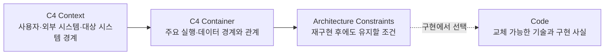

# ADR 0001: PRD 아키텍처를 시스템 경계와 지속 제약으로 제한

Date: 2026-08-15

## Status

Accepted (2026-09-02)

## Context

ALPS PRD의 High-Level Architecture는 제품과 시스템의 전체 경계를 설명해야 한다. C4 Context와 Container는 사용자, 외부 시스템과 주요 실행 경계를 한눈에 보여주지만, 이 Section에 프레임워크·SDK·ORM·내부 배포 도구까지 함께 기록하면 코드에서 다시 찾을 수 있는 구현 사실이 PRD로 올라온다.

PRD가 보존해야 하는 것은 같은 코드를 재현하는 목록이 아니다. 코드를 모두 지워도 같은 제품·시스템 조건을 지키는 구현을 다시 만들 수 있게 하는 경계와 제약이다. Component와 Code 수준의 구조, 교체 가능한 기술 목록과 구현 이름은 코드에서 복구할 수 있으므로 PRD에 남기지 않는다.

## Decision Drivers

- PRD만 읽어도 사용자, 외부 시스템, 대상 시스템의 경계를 파악할 수 있어야 한다.
- PRD만 읽어도 대상 시스템을 구성하는 주요 실행·배포 단위와 관계를 파악할 수 있어야 한다.
- 코드를 다시 작성해도 유지해야 하는 규모, 필수 플랫폼, 외부 시스템, 데이터·보안·배포 경계가 손실되면 안 된다.
- 구현 세부사항 변경이 PRD 변경으로 전파되지 않아야 한다.
- 코드와 dependency metadata에서 복구할 수 있는 기술 선택을 PRD가 중복 소유하면 안 된다.

## Decision

ALPS PRD의 High-Level Architecture는 C4 모델의 Context와 Container 다이어그램으로 시스템 경계를 표현하고, 별도의 Architecture Constraints에 재구현 후에도 유지해야 할 조건만 기록한다.

### Requirement contract

- High-Level Architecture는 Mermaid `C4Context` 다이어그램과 `C4Container` 다이어그램을 각각 하나 이상 포함한다.
- Context 다이어그램은 사람, 외부 시스템, 대상 시스템과 그 관계를 표현한다.
- Container 다이어그램은 애플리케이션과 데이터 저장소 등 주요 실행·데이터 경계, 책임과 관계를 표현한다.
- ALPS PRD의 C4 다이어그램은 `C4Context`와 `C4Container`만 사용한다. `C4Component`, `C4Dynamic`, `C4Deployment` 및 Code 수준 다이어그램은 생성하지 않는다.
- Container 내부의 모듈, 클래스, 함수, 파일, 메서드, 라이브러리와 프레임워크 등 코드 수준 상세는 PRD에 기록하지 않는다.
- Section 4.2 `Architecture Constraints`는 규모 가정, 사용자 접근 채널, 필수 플랫폼·외부 provider, 데이터 위치, 보안·신뢰 경계, 배포 제약처럼 개발자가 임의로 바꾸면 제품 또는 시스템 조건을 위반하는 항목만 기록한다.
- 프레임워크, SDK, ORM, 내부 데이터베이스 제품, 자격증명 연결 방식, CI 도구와 기타 교체 가능한 기술 선택은 Section 4.2에 기록하지 않는다.
- 사용자가 특정 기술을 의무화한 경우에는 제품 이름 자체가 아니라 그 선택이 고정하는 외부 경계나 지속 제약과 근거를 기록한다.
- 추가 Architecture Constraint가 없으면 다른 Section을 채우기 위한 기술 추천을 만들지 않고, 4.1 이외의 추가 제약이 없음을 명시한다.
- 사용자 흐름이나 기능 의존성처럼 C4 레벨을 표현하지 않는 목적별 Mermaid 다이어그램은 이 제한의 대상이 아니다.

### Alternatives

1. **Context만 필수, Container는 선택으로 유지**
   - 장점: 작은 시스템의 문서 작성량이 적다.
   - 단점: 시스템 내부의 주요 실행 단위와 외부 연동 경계가 문서마다 누락될 수 있다.

2. **Context, Container와 지속적인 Architecture Constraints만 기록**
   - 장점: 시스템 경계와 재구현 조건을 보존하면서 코드에서 복구 가능한 기술 목록을 중복하지 않는다.
   - 단점: 작성자가 지속 제약과 교체 가능한 구현 선택을 구분해야 한다.

3. **Context, Container와 Technology Stack 목록을 함께 기록**
   - 장점: 계획 시점의 기술 선택을 한 문서에서 볼 수 있다.
   - 단점: dependency와 코드에서 복구할 수 있는 사실이 PRD에 중복되고 구현 변경이 PRD drift를 만든다.

## Consequences

### Positive

- 모든 ALPS PRD가 시스템 경계와 주요 실행 단위를 동일한 해상도로 보여준다.
- 사용자는 구현 세부사항을 읽지 않고도 전체 구조, 외부 연동과 지속 제약을 검증할 수 있다.
- PRD와 코드 사이의 해상도 경계가 명확해진다.
- 프레임워크와 SDK 교체가 PRD 수정을 요구하지 않는다.

### Negative

- 단일 프로세스처럼 단순한 제품도 Context와 Container를 별도로 표현해야 한다.
- 기존 Full ALPS 문서의 Technology Stack을 다시 편집할 때 지속 제약과 구현 선택을 분류해야 할 수 있다.

### Risks

- Container 다이어그램에 모듈이나 클래스가 들어가면 이름만 C4 Container인 Component 다이어그램이 될 수 있다. 작성 가이드와 회귀 테스트가 허용 범위를 명시해야 한다.
- 기술 제품을 모두 구현 디테일로 제외하면 필수 provider나 규제 플랫폼 경계를 잃을 수 있다. 제품 이름보다 그 선택이 고정하는 경계, 계약과 근거를 기준으로 보존한다.

## Related

- 없음
