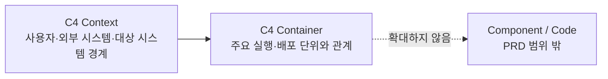

# ADR 0001: PRD 아키텍처를 C4 Context와 Container로 제한

Date: 2026-08-15

## Status

Accepted (2026-08-15)

## Context

ALPS PRD의 High-Level Architecture는 제품과 시스템의 전체 경계를 설명해야 한다. 현재 템플릿은 C4 Context를 필수로 두지만 Container는 선택 사항이라, 실행 단위와 외부 연동을 연결한 상위 구조가 문서마다 빠질 수 있다.

반대로 Component와 Code 수준까지 PRD에 포함하면 기능 내부 구조와 구현 이름이 상위 문서로 올라온다. 이는 PRD가 사용자의 문제와 시스템 경계를 독립적으로 설명해야 한다는 추상화 단계 원칙을 깨고, 구현 변경 때마다 PRD를 수정하게 만든다.

## Decision Drivers

- PRD만 읽어도 사용자, 외부 시스템, 대상 시스템의 경계를 파악할 수 있어야 한다.
- PRD만 읽어도 대상 시스템을 구성하는 주요 실행·배포 단위와 관계를 파악할 수 있어야 한다.
- 구현 세부사항 변경이 PRD 변경으로 전파되지 않아야 한다.
- 기술 지식이 적은 사용자도 두 개의 일관된 시각 자료로 전체 구조를 검증할 수 있어야 한다.

## Decision

ALPS PRD의 High-Level Architecture는 C4 모델의 Context와 Container 다이어그램을 모두 필수로 사용한다.

### Requirement contract

- Section 4.1은 Mermaid `C4Context` 다이어그램과 `C4Container` 다이어그램을 각각 하나 이상 포함한다.
- Context 다이어그램은 사람, 외부 시스템, 대상 시스템과 그 관계를 표현한다.
- Container 다이어그램은 애플리케이션, 데이터 저장소 등 주요 실행·배포 단위와 기술 책임 및 관계를 표현한다.
- ALPS PRD의 C4 다이어그램은 `C4Context`와 `C4Container`만 사용한다. `C4Component`, `C4Dynamic`, `C4Deployment` 및 Code 수준 다이어그램은 생성하지 않는다.
- Container 내부의 모듈, 클래스, 함수, 파일, 메서드 등 코드 수준 상세는 PRD에 기록하지 않는다.
- 사용자 흐름이나 기능 의존성처럼 C4 레벨을 표현하지 않는 목적별 Mermaid 다이어그램은 이 제한의 대상이 아니다.

### Alternatives

1. **Context만 필수, Container는 선택으로 유지**
   - 장점: 작은 시스템의 문서 작성량이 적다.
   - 단점: 시스템 내부의 주요 실행 단위와 외부 연동 경계가 문서마다 누락될 수 있다.

2. **Context와 Container만 필수로 사용**
   - 장점: 전체 시스템 경계와 주요 실행 단위를 일관되게 검증하면서 구현 상세를 배제한다.
   - 단점: 매우 단순한 제품도 두 개의 다이어그램을 작성해야 한다.

3. **C4의 Context, Container, Component, Code를 모두 사용**
   - 장점: 하나의 문서에서 상세 구조까지 추적할 수 있다.
   - 단점: PRD가 코드 수준 책임을 침범하고 구현 변경에 취약해진다.

## Consequences

### Positive

- 모든 ALPS PRD가 시스템 경계와 주요 실행 단위를 동일한 해상도로 보여준다.
- 사용자는 구현 세부사항을 읽지 않고도 전체 구조와 외부 연동을 검증할 수 있다.
- PRD와 코드 사이의 해상도 경계가 명확해진다.

### Negative

- 단일 프로세스처럼 단순한 제품도 Context와 Container를 별도로 표현해야 한다.
- 기존 PRD를 다시 편집할 때 누락된 Container 다이어그램을 추가해야 할 수 있다.

### Risks

- Container 다이어그램에 모듈이나 클래스가 들어가면 이름만 C4 Container인 Component 다이어그램이 될 수 있다. 작성 가이드와 회귀 테스트가 허용 범위를 명시해야 한다.

## Related

- 없음
