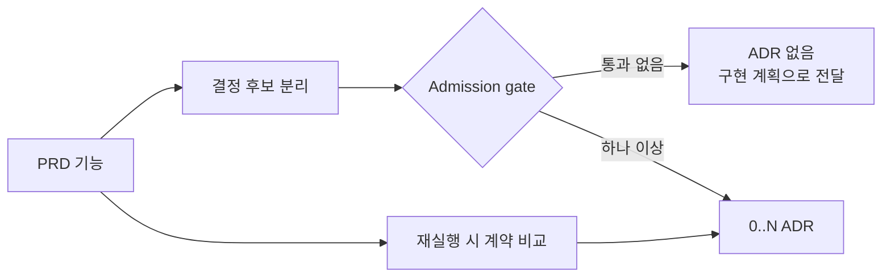

# ADR 0001: PRD 기능을 admission-aware ADR 결정으로 전달

Date: 2026-08-15

## Status

Accepted (2026-08-15)

## Context

하나의 사용자 기능에는 아키텍처 결정이 없을 수도 있고 여러 개 있을 수도 있다. 기능마다 ADR 하나를 강제하면 교체 가능한 구현 수단도 ADR이 되거나 서로 독립적인 결정이 한 문서에 합쳐진다.

PRD의 기능 의존성은 구현 순서를 설명하지만 모든 기능이 ADR category를 갖는 것은 아니다. 또한 PRD의 요구사항 계약이 바뀐 뒤 기존 ADR을 자동으로 건너뛰면 상위 요구사항과 구현 기준이 분리된다.

## Decision Drivers

- ADR admission gate가 기능 수와 무관하게 적용돼야 한다.
- 한 ADR은 하나의 논리적 결정만 기록해야 한다.
- 기능 구현 의존성과 ADR 결정 의존성을 구분해야 한다.
- PRD의 요구사항 값과 규칙이 handoff 과정에서 손실되면 안 된다.
- adr-writer는 PRD를 직접 읽지 않는 독립성을 유지해야 한다.

## Decision

PRD 기능 handoff는 기능마다 **0개 이상의 ADR 결정**을 만든다.

Importer는 기능의 사용자 요구, 제약과 기술 설명에서 서로 독립적인 결정 후보를 식별하고 각 후보에 admission gate를 적용한다. 통과하는 결정이 없으면 ADR을 만들지 않는다. 여러 결정이 통과하면 같은 기능 category 아래에 별도 ADR로 작성한다.

기능 의존성은 구현 계획의 입력으로 유지한다. `dependsOn`에는 실제 ADR 결정의 선행 category만 기록하며, 기능 의존성을 보존하기 위해 placeholder ADR을 만들지 않는다.

PRD 요구사항 계약은 handoff 시 ADR에 전달되는 통제된 중복이다. PRD를 다시 읽는 importer는 이미 mapping된 기능도 현재 ADR 계약과 비교하고 차이를 보고한다. 변경된 계약이나 결정은 기존 ADR의 current state를 갱신하거나 별도 결정 ADR을 추가한 뒤 코드로 전달한다. ADR 본문과 mapping에는 PRD 경로나 기능 식별자를 남기지 않는다.

### Requirement contract

- 기능 하나는 admission 결과에 따라 ADR 0개, 1개 또는 여러 개를 가질 수 있다.
- 서로 독립적으로 변경 가능한 결정은 하나의 ADR에 합치지 않는다.
- 교체 가능한 라이브러리, SDK, framework, credential wiring과 module layout은 기능에 포함돼도 ADR을 만들지 않는다.
- ADR 대상 결정이 없는 기능을 dependency target으로 표현하기 위해 placeholder ADR을 만들지 않는다.
- `dependsOn`은 실제 ADR 결정 간 prerequisite만 기록하고 모든 target category는 mapping에 존재해야 한다.
- PRD에서 확인한 요구사항 값, 허용 집합, 전이, 필수성, 권한, 가시성, 순서, 유일성과 단위는 basis와 함께 ADR 계약으로 전달한다.
- 이미 mapping된 기능을 다시 처리할 때 importer는 조용히 건너뛰지 않고 현재 PRD 계약과 ADR 계약의 차이를 보고한다.
- PRD 변경은 ADR을 먼저 현재 상태로 갱신한 뒤 코드에 반영한다.
- ADR 본문과 `.mapping.json`은 PRD 경로, 구간 번호와 기능 식별자를 저장하지 않는다.

### Alternatives

1. **기능마다 ADR 하나 생성**
   - 장점: 기능과 ADR 수가 단순하게 대응한다.
   - 단점: ADR이 필요 없는 기능과 여러 결정을 가진 기능을 표현하지 못한다.

2. **PRD를 최초 한 번만 가져오고 이후 변경은 수동 전달**
   - 장점: importer가 단순하고 adr-writer 독립성이 강하다.
   - 단점: PRD 변경이 ADR에 반영되지 않아도 탐지할 경로가 없다.

3. **0..N 결정 handoff와 importer-side 재조정**
   - 장점: admission gate와 one-decision 원칙을 지키면서 PRD 변경을 탐지한다.
   - 단점: importer가 결정 후보 분리와 계약 비교를 수행해야 한다.

## Consequences

### Positive

- 기능 수가 ADR 수를 결정하지 않는다.
- placeholder와 다중 결정 ADR이 줄어든다.
- PRD 변경을 handoff 경계에서 다시 확인할 수 있다.
- adr-writer는 PRD를 직접 읽지 않는다.

### Negative

- importer가 기능마다 결정 후보와 기존 ADR을 비교해야 한다.
- 기능 의존성과 ADR 의존성을 별도로 설명해야 한다.

### Risks

- 결정 후보 분리가 누락될 수 있다. importer는 통과·제외 후보와 이유를 사용자에게 보여준다.

## Related

- [ADR admission gate](../../adr-authoring/decision-boundary/0001-admit-only-architectural-decisions.md)
