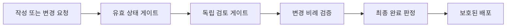

# ADR 0001: 안전하고 비례적인 개발 게이트

Date: 2026-08-15

## Status

Accepted (2026-08-15)

## Context

개발 흐름은 PRD 작성, ADR 변환, 구현, 리팩토링, 최종 리뷰, 동기화, 배포 검증으로 이어진다. 각 단계의 안전 규칙은 강하지만 일부 경로는 다음 단계가 거부할 중간 상태를 저장하거나, 독립 검토를 사용할 수 없는데도 자동 변경을 허용한다. 최종 리뷰가 구현 결함을 발견한 뒤에도 완료 상태가 남을 수 있고, 저장소 규칙이 요구하는 PR 리뷰를 원격 저장소가 강제하지 않는 문제도 있다.

반대로 상태가 바뀌지 않았는데 같은 검사를 반복하거나, 완료된 PRD 구간을 다시 승인받거나, 작은 변경마다 깊은 동기화를 수행하는 비용도 누적된다. 안전 게이트를 줄이지 않으면서 검증을 실제 변경과 위험에 비례시켜야 한다.

## Decision Drivers

- 어떤 단계도 다음 단계가 명백히 거부할 무효 상태를 영속화하면 안 된다.
- 자동 변경은 독립적인 검토와 변경 전후 검증이 모두 가능할 때만 허용해야 한다.
- 완료 상태와 배포 가능 상태는 모든 필수 검증 결과와 일치해야 한다.
- 동일한 저장소 상태를 반복 검사하거나 완료된 내용을 재승인하는 비용은 제거해야 한다.
- 문서로 선언한 협업 규칙은 우회 가능한 로컬 관례가 아니라 원격 저장소에서도 강제돼야 한다.

## Decision

개발 흐름을 **상태 유효성, 독립성, 완료 판정, 비례적 검증, 배포 보호**의 다섯 게이트로 운영한다.

의존성을 포함한 문서 변환은 참조 대상이 존재하는 닫힌 상태만 저장한다. 독립적인 읽기 전용 검토를 사용할 수 없으면 리팩토링은 제안만 만들고 자동 반영하지 않는다. 구현 완료 상태는 최종 필요성·충분성 리뷰에서 필수 수정 사항이 없을 때만 유지한다.

검증은 저장소 상태가 실제로 바뀐 경우에만 반복한다. 변경이 없는 리팩토링 검토는 기존 기준선 결과를 재사용하고, 깊은 ADR 동기화는 drift 근거가 있거나 주기적 감사가 필요할 때 수행한다. 기존 PRD를 재개할 때는 완료된 구간을 요약하고 의존 순서를 만족하는 첫 미완료 구간부터 진행한다.

최종 구현 리뷰는 실행 시간, 필요성·충분성 관점별 발견 건수, 미검증 위험과 실제 실행한 테스트 수를 산출물에 기록한다. 충분한 대표 이력이 쌓이기 전에는 경량 리뷰 경로를 도입하지 않으며, 도입 여부는 별도 결정으로 다룬다.

동작을 기존 결정에 맞게 복구하는 버그 수정만 ADR 작성에서 제외한다. 요구사항 값, 허용 상태, 전이, 권한, 가시성, 필수성, 핵심 알고리즘이나 fallback을 바꾸는 수정은 이름이 버그 수정이어도 결정 변경으로 처리한다.

`main` 배포는 pull request와 필수 CI를 원격 저장소 규칙으로 강제한다. 로컬 hook은 빠른 피드백을 제공하지만 배포 권한의 최종 경계가 아니다.

### Requirement contract

- 단일 대상을 변환하더라도 모든 선행 참조가 현재 존재하거나 같은 변환 묶음에서 먼저 생성돼야 한다. 그렇지 않으면 저장 전에 중단한다.
- 독립 검토 컨텍스트를 사용할 수 없는 리팩토링 단계는 자동 변경을 적용하지 않고 제안만 남긴다.
- 최종 구현 리뷰가 필수 수정 사항을 확인하면 해당 구현은 완료 상태로 남지 않아야 한다.
- 동작이 바뀌지 않은 검증 기준선은 재사용할 수 있다. 자동 변경이 한 건도 없으면 같은 대상 테스트를 다시 실행하지 않는다.
- 깊은 ADR 동기화는 drift, 넓은 구조 변경, 수동 문서 변경 또는 주기적 감사 근거가 있을 때 수행한다.
- PRD 재개는 완료 상태를 읽고 첫 미완료 구간부터 시작한다. 사용자가 전체 재검토를 요청한 경우에만 완료 구간을 다시 승인받는다.
- 작성 순서는 섹션 번호가 아니라 의존 순서를 따른다.
- 자동화 prompt가 중요한 안전 분류를 수행하면 정적 문구 검사와 별도로 실제 행동 시나리오를 둔다.
- 최종 구현 리뷰는 비용과 발견 효과를 비교할 수 있는 실행 시간 및 발견 건수 지표를 남긴다. 이 지표 자체는 현재 완료 게이트를 약화하지 않는다.
- 필수 구조 검사는 도구 자신의 예제와 fixture를 제품 코드의 역참조로 오인하지 않으면서 실제 제품 코드의 위반은 계속 탐지해야 한다.
- `main`은 pull request와 필수 CI 성공 없이 갱신할 수 없어야 한다. 긴급 우회 권한은 저장소 관리자로 제한한다.

### Alternatives

#### 현재의 모든 게이트와 반복 검사를 그대로 유지한다

- 장점: 변경되는 규칙이 없다.
- 단점: 무효 중간 상태와 완료 상태 불일치는 남고, 반복 검사와 재승인 비용도 계속 발생한다.

#### 검증 단계를 줄이고 CI만 최종 기준으로 사용한다

- 장점: 로컬 흐름이 단순하고 빠르다.
- 단점: 잘못된 문서 상태와 안전하지 않은 자동 변경이 배포 직전까지 진행되며, CI가 판단할 수 없는 ADR 계약과 독립성 문제를 놓친다.

#### 상태 게이트는 강화하고 검증은 실제 변경과 위험에 비례시킨다

- 장점: 잘못된 상태가 다음 단계로 넘어가지 않고, 안전성과 무관한 반복 비용을 줄인다.
- 단점: 상태 전이와 검증 조건이 명시적으로 관리돼야 하며 행동 평가와 원격 저장소 설정이 추가된다.

## Consequences

### Positive

- 모든 영속 상태가 다음 단계의 기본 불변식을 만족한다.
- 독립 검토가 없는 환경에서 자동 수정 위험이 사라진다.
- 완료 상태와 실제 리뷰 결과가 일치한다.
- 작은 변경과 PRD 재개에서 불필요한 실행 및 확인 비용이 줄어든다.
- 문서화된 pull request 규칙이 원격 저장소에서 실제로 강제된다.

### Negative

- 일부 단일 기능 변환은 선행 기능까지 범위가 확대되거나 사용자 확인을 기다린다.
- 최종 리뷰 결과에 따라 상태 전이가 한 번 더 발생할 수 있다.
- 행동 평가는 외부 모델 비용 때문에 CI가 아닌 릴리스 검증 절차로 운영해야 한다.

### Risks

- 도구 자체 파일을 검사 대상에서 제외하는 과정에서 실제 제품 코드까지 과도하게 제외할 수 있다. 실제 위반 fixture를 유지해 탐지력을 검증한다.
- 위험 기반 검증이 임의 판단으로 약화될 수 있다. 검증 생략 조건은 “저장소 상태가 바뀌지 않음”처럼 기계적으로 확인 가능한 경우로 제한한다.

## Related

- [검증된 저위험 리팩토링 자동 반영](../../adr-cycle/implementation-review/0001-validated-low-risk-refactoring.md)
