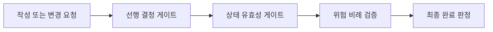

# ADR 0001: 안전하고 비례적인 개발 게이트

Date: 2026-08-15

## Status

Accepted (2026-08-15)

## Context

개발 흐름은 ADR 작성, 선행 결정 확인, 구현, 검증, 완료 판정으로 이어진다. 각 단계가 독립적으로 안전해도 선행 결정이 구현되지 않은 상태에서 downstream 구현을 허용하거나, 변경 위험과 무관하게 동일한 검증 비용을 요구하면 전체 흐름은 신뢰하기 어렵다.

개발 게이트는 잘못된 상태를 다음 단계로 넘기지 않으면서 검증 비용을 변경 위험과 실제 저장소 변경에 비례시켜야 한다.

## Decision Drivers

- 선행 결정이 구현되지 않은 상태에서 downstream 구현이 완료 상태가 되면 안 된다.
- 완료 상태는 테스트와 필수 구현 리뷰 결과를 반영해야 한다.
- 검증 강도는 계약과 보호 표면의 변경 위험에 비례해야 한다.
- 저장소 상태가 바뀌지 않았으면 동일한 검증을 반복하지 않아야 한다.
- drift 근거가 없는 작은 변경에 깊은 동기화를 강제하면 안 된다.

## Decision

개발 흐름을 **선행 결정, 상태 유효성, 위험 비례 검증, 완료 판정**의 네 게이트로 운영한다.

선행 ADR이 있는 구현은 모든 prerequisite가 `Accepted`일 때만 진행한다. 사용자가 downstream 구현을 먼저 요청해도 완료 가능한 구현으로 취급하지 않는다. 선행 기능에 ADR 대상 결정이 없다면 그 기능 의존성은 구현 계획에서 다루고, ADR 의존성을 만들기 위해 빈 ADR을 생성하지 않는다.

검증은 보호 표면과 변경 범위에 따라 표준 또는 전체 구현 리뷰를 선택한다. 저장소 상태가 바뀌지 않은 검증 기준선은 재사용하고, 깊은 ADR 동기화는 drift 근거가 있거나 주기적 감사가 필요할 때 수행한다.

### Requirement contract

- `dependsOn`의 모든 선행 category는 현재 mapping에 존재하고 target 구현 전에 `Accepted`여야 한다.
- `Proposed` 또는 dangling prerequisite가 있으면 downstream 구현을 완료 경로로 진행하지 않는다.
- 기능 구현 의존성은 ADR 대상 결정의 의존성과 구분한다. ADR 대상 결정이 없는 기능을 표현하기 위해 placeholder ADR을 만들지 않는다.
- 구현 리뷰 모드는 계약, 공개 표면, 상태, 권한, 보안, 데이터, 외부 fallback, 동시성 및 변경 범위의 위험으로 선택한다.
- 최종 구현 리뷰가 필수 수정이나 미검증 위험을 남기면 구현은 완료 상태가 될 수 없다.
- 동작이 바뀌지 않은 검증 기준선은 재사용할 수 있다. 자동 변경이 없으면 같은 대상 테스트를 다시 실행하지 않는다.
- 깊은 ADR 동기화는 drift, 넓은 구조 변경, 수동 ADR 변경 또는 주기적 감사 근거가 있을 때 수행한다.

### Alternatives

1. **모든 구현에 동일한 전체 게이트 적용**
   - 장점: 실행 경로가 하나다.
   - 단점: 국소 변경에도 최대 검토 비용을 지불한다.

2. **사용자 확인으로 선행 게이트 우회 허용**
   - 장점: downstream scaffold를 빠르게 작성할 수 있다.
   - 단점: 일부 동작이 비어 있는 구현이 완료 경로에 들어갈 수 있다.

3. **선행 상태는 엄격히 막고 검증 강도만 위험에 비례**
   - 장점: 무효 상태는 차단하면서 작은 변경의 비용을 줄인다.
   - 단점: 리뷰 모드 선택 기준을 명시하고 검증해야 한다.

## Consequences

### Positive

- downstream 구현은 구현된 선행 결정 위에서만 완료된다.
- ADR이 필요 없는 기능 의존성 때문에 placeholder ADR이 생기지 않는다.
- 작은 변경은 표준 리뷰를 사용하고 보호 표면 변경은 전체 리뷰를 유지한다.
- 완료 상태와 실제 검증 결과가 일치한다.

### Negative

- 선행 구현이 끝나기 전에는 downstream 작업이 대기할 수 있다.
- 리뷰 모드 분류가 잘못되면 검증이 과하거나 부족할 수 있다.

### Risks

- 구현자가 변경 위험을 낮게 분류할 수 있다. 보호 표면 조건 중 하나라도 해당하면 전체 리뷰를 선택한다.

## Related

- [구현 리뷰](../../adr-cycle/implementation-review/0001-validated-low-risk-refactoring.md)
- [PRD 기능을 ADR 결정으로 전달](../../alps-authoring/spec-handoff/0001-admission-aware-feature-handoff.md)
