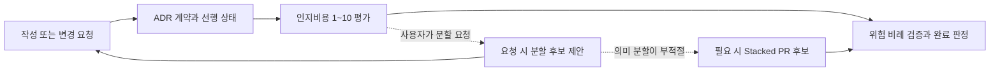

# ADR 0001: 안전하고 비례적인 개발 워크플로우

Date: 2026-08-15

## Status

Accepted (2026-08-17)

## Context

개발 흐름은 ADR 작성, 선행 결정 확인, 구현, 검증, 완료 판정으로 이어진다. 각 단계가 독립적으로 안전해도 선행 결정이 구현되지 않은 상태에서 downstream 구현을 허용하거나, 변경 위험과 무관하게 동일한 검증 비용을 요구하면 전체 흐름은 신뢰하기 어렵다.

ADR의 의도와 재생성 가능성을 구현 후에 다시 확인하면 작성·수정 단계의 승인이 완료 게이트에서 반복된다. 반대로 구현 검토가 찾은 명확한 결함마다 사용자 선택을 기다리면 에이전트가 스스로 수정하고 완료할 수 없다.

개발 게이트는 잘못된 상태를 다음 단계로 넘기지 않으면서 검증 비용을 변경 위험과 실제 저장소 변경에 비례시켜야 한다. 의도 확인은 구현 전에 끝내고, 구현 후에는 승인된 계약에 대한 자동 검토와 수정으로 완료 여부를 판정해야 한다.

ALPS와 ADR 플러그인은 요구사항을 AI를 통해 코드로 전환하고 그 과정의 인지부하를 관리하도록 돕는 워크플로우다. 모델이 스스로 처리할 수 있는 판단까지 고정 절차, 상태와 승인 단계로 만들면 모델이 개선된 뒤에도 사용자가 같은 절차 비용을 계속 부담한다. 인지부하 관리는 안전 경계를 늘리는 프레임워크가 아니라, 작업의 이해 비용을 짧게 평가하고 필요할 때 더 작은 의미 단위로 나눌 수 있게 하는 안내여야 한다.

Feature나 ADR을 의미상 더 나누면 vertical slice 또는 one-ADR-one-decision 경계가 깨질 수 있다. 이 경우 하나의 결정이 만드는 큰 구현 diff를 단일 PR로 전달하면 리뷰 순간의 인지부하는 여전히 높다. 구현 전달 단계를 dependency 순서의 Stacked PR로 나누면 상위 문서 경계를 바꾸지 않고 각 리뷰가 하나의 구현 질문에 집중할 수 있다.

## Decision Drivers

- 선행 결정과 승인된 ADR 계약이 유효하지 않은 상태에서 downstream 구현이 완료 상태가 되면 안 된다.
- 완료 상태는 변경 위험에 비례한 테스트와 구현 리뷰를 반영하고 해결 가능한 발견을 자동 수정해야 한다.
- 저장소 상태가 바뀌지 않으면 검증을 반복하지 않고, 일반 대화가 ADR 인덱스 전체를 소비하지 않으며, drift 근거 없는 작은 변경에 깊은 동기화를 강제하지 않아야 한다.
- 인지부하 평가는 피처와 ADR을 비교하고 분할 후보를 찾을 만큼 일관되어야 한다. 의미상 분할할 수 없는 큰 구현은 ALPS나 ADR을 인위적으로 쪼개지 않고 코드 전달 단계에서 리뷰 가능한 단위로 나눌 수 있어야 하며, 이 지원이 새 상태, 승인 단계나 완료 게이트를 만들면 안 된다.
- 모델이 더 잘 판단하게 되면 prompt에서 축소하거나 제거할 수 있도록 평가 결과를 영속 권위나 구조적 프레임워크로 만들지 않아야 한다.

## Decision

개발 흐름은 **필수 안전 경계**와 **선택적 이해 지원**을 분리한다.

필수 안전 경계는 ADR-first 계약, 선행 결정 유효성, 테스트와 위험 비례 완료 검토처럼 잘못된 결과를 완료 상태로 만들지 않기 위해 필요한 규칙만 유지한다. 인지부하 평가는 이 경계와 별개인 읽기 보조 정보이며 저장, 승인, 구현이나 상태 전환을 막지 않는다.

ALPS Feature와 ADR을 제시하거나 구현 계획을 세울 때 현재 내용을 기준으로 **예상 인지비용을 1~10점**으로 표시한다. 모델은 다음 다섯 축을 각각 `0~2`로 내부 평가해 합산하고, 합계가 0이면 1점으로 표시한다.

1. **개념 범위** — 서로 다른 사용자 행동이나 결정의 수
2. **계약 밀도** — 요구사항 값, 상태, 권한, 불변식과 실패 보장의 수와 상호작용
3. **상태·흐름 복잡도** — 분기, 상태 전이, 비동기 흐름, 재시도와 부분 실패
4. **경계 결합도** — bounded context, 데이터 경계, 외부 시스템과 사용자 접점의 연결
5. **불확실성·검증 부담** — 미확정 전제, 오류·동시성·마이그레이션 위험과 검증하기 어려운 경로

축별 점수와 근거는 출력하지 않는다. 기본 출력은 `인지비용: N/10` 한 줄이다. 점수는 정밀한 측정값이나 품질 판정이 아니라 현재 독자가 예상할 이해 비용의 휴리스틱이며, 내용이 바뀌면 다시 계산한다.

7점 이상은 분할을 검토할 수 있다는 신호지만 자동으로 추가 설명, 승인 단계나 분할안을 출력하지 않는다. 사용자가 분할을 요청하면 최대 세 개의 더 작은 인지 단위 후보를 제안한다. ALPS Feature는 독립적으로 시연 가능한 사용자 행동 경계가 있을 때만 Section 6과 Section 7의 피처 분할을 제안한다. ADR은 여러 독립 결정이 섞였을 때만 ADR 분할을 제안한다. 어떤 경우에도 frontend/backend 같은 기술 계층으로 vertical slice를 분할하지 않는다.

하나의 본질적으로 어려운 결정은 하나의 ADR로 유지한다. 사용자가 인지부하 감소나 작업 분할을 요청했고 Feature 또는 ADR 분할이 적절하지 않으면, `/adr-impl`은 같은 ADR을 구현하는 dependency-ordered Stacked PR 후보를 제안할 수 있다. 각 PR은 하나의 review question과 그 단계를 검증하는 테스트에 집중한다. 전체 Stack은 하나의 승인된 ADR 계약을 공동으로 구현하며 PR별 ADR이나 placeholder ADR을 만들지 않는다.

Stacked PR은 점수 임계값만으로 자동 생성하지 않는다. Stack 계획, 브랜치 관계와 리뷰 진행 상태는 구현 전달을 위한 일시적 정보이며 ALPS, ADR, `.mapping.json`이나 별도 registry에 저장하지 않는다. 실제 PR 생성은 사용자가 게시를 요청하고 현재 GitHub 환경이 지원할 때만 수행한다. 지원하지 않으면 같은 구현 단계 계획을 유지하되 GitHub Stack 절차를 강제하지 않는다.

`SessionStart` 훅은 세션 시작·재개·초기화와 context compaction 복구 시점에만 짧은 ADR admission 지시를 주입한다. 일반 사용자 메시지마다 다시 실행하지 않는다. `.mapping.json` 내용은 훅에 포함하지 않으며, 요청이 admission gate를 통과한 경우에만 메인 세션이 전체 mapping과 plausible ADR 본문을 읽어 기존 결정 소유자와 선행 상태를 판정한다. mapping 파일이 없으면 훅은 조용히 종료하고, 파일이 존재하지만 JSON 파싱에 실패하면 ADR 작업 전에 복구하도록 경고한다.

새 ADR을 작성하거나 기존 ADR의 결정·요구사항 계약을 바꾸면 구현 전에 현재 Decision, Decision Drivers, requirement contract와 regeneration checklist를 제시하고 사용자에게 의도 일치를 한 번 확인받는다. 이 승인은 command가 아니라 정확한 ADR revision에 귀속된다. `/adr-new`나 `/feature-to-adr`에서 승인한 ADR 내용이 바뀌지 않았다면 `/adr-impl`은 그 기준선을 재사용하고 의도·재생성 질문을 다시 하지 않는다. 승인 후 ADR이 바뀌지 않았다면 구현 완료 뒤에도 같은 질문을 반복하지 않는다.

선행 ADR이 있는 구현은 모든 prerequisite가 `Accepted`일 때만 진행한다. 사용자가 downstream 구현을 먼저 요청해도 완료 가능한 구현으로 취급하지 않는다. 완료된 PRD handoff는 이전된 각 Feature에 실제 requirement contract 소유 ADR을 두므로 구현에 필요한 Feature prerequisite를 category `dependsOn`으로 보존한다. 단순 코드 재사용과 작업 편의 순서는 dependency로 저장하지 않으며 빈 placeholder ADR을 생성하지 않는다.

검증은 보호 표면과 변경 범위에 따라 표준 또는 전체 구현 리뷰를 선택한다. 저장소 상태가 바뀌지 않은 검증 기준선은 재사용하고, 깊은 ADR 동기화는 drift 근거가 있거나 주기적 감사가 필요할 때 수행한다.

구현 검토가 계약을 바꾸지 않는 증거 기반 코드·테스트 결함이나 국소 리팩토링을 찾으면 구현 세션이 자동으로 수정하고 테스트와 같은 검토 모드를 다시 실행한다. ADR 계약 변경, 모순된 전제, 중대한 미검증 위험 또는 파괴적 범위 변경만 사용자에게 판단을 요청한다. 검토가 통과하면 추가 승인 없이 `Accepted`로 전환하고 최종 보고에 자동 수정 항목과 검증 결과를 요약한다.

### Requirement contract

- 새 ADR이나 결정이 변경된 ADR은 구현 전에 현재 결정, Drivers, requirement contract와 regeneration checklist를 사용자가 한 번 승인해야 한다.
- 승인된 ADR revision이 바뀌지 않으면 command 경계를 넘어 같은 의도 기준선을 재사용한다. ADR 내용이 바뀐 경우에만 새 revision 승인을 받는다.
- `dependsOn`의 모든 선행 category는 현재 mapping에 존재하고 target 구현 전에 `Accepted`여야 한다.
- `Proposed` 또는 dangling prerequisite가 있으면 downstream 구현을 완료 경로로 진행하지 않는다.
- 완료된 PRD handoff의 이전 대상 Feature는 실제 requirement contract 소유 ADR을 가지며 구현에 필요한 Feature prerequisite는 category `dependsOn`으로 보존한다.
- 단순 코드 재사용과 작업 편의 순서는 `dependsOn`으로 저장하지 않고, dependency 표현을 위한 빈 placeholder ADR을 만들지 않는다.
- 구현 리뷰 모드는 계약, 공개 표면, 상태, 권한, 보안, 데이터, 외부 fallback, 동시성 및 변경 범위의 위험으로 선택한다.
- 최종 구현 리뷰가 필수 수정이나 미검증 위험을 남기면 구현은 완료 상태가 될 수 없다.
- 증거가 있고 ADR 계약을 바꾸지 않는 구현·테스트 결함과 국소 리팩토링은 자동 수정 후 재검증한다.
- 구현 후 사용자 판단은 ADR 계약 변경, 모순, 중대한 미검증 위험 또는 파괴적 변경에만 요청한다.
- 구현 전 승인 이후 ADR 계약이 바뀌지 않았으면 spec-fitness와 regeneration 질문을 반복하지 않는다.
- 동작이 바뀌지 않은 검증 기준선은 재사용할 수 있다. 자동 변경이 없으면 같은 대상 테스트를 다시 실행하지 않는다.
- 깊은 ADR 동기화는 drift, 넓은 구조 변경, 수동 ADR 변경 또는 주기적 감사 근거가 있을 때 수행한다.
- ALPS Feature와 ADR의 예상 인지비용은 개념 범위, 계약 밀도, 상태·흐름 복잡도, 경계 결합도, 불확실성·검증 부담의 다섯 축을 각 0~2점으로 내부 평가해 1~10점으로 표시한다.
- 인지비용의 기본 출력은 `인지비용: N/10` 한 줄이며 점수 근거나 축별 계산을 함께 출력하지 않는다.
- 7점 이상이어도 자동 분할, 추가 설명, 추가 승인, 저장 중단이나 구현 중단을 수행하지 않는다.
- 사용자가 분할을 요청한 경우에만 최대 세 개의 의미 단위 후보를 제시한다.
- Feature 분할은 독립적으로 시연 가능한 사용자 행동을 기준으로 Section 6과 Section 7을 함께 조정하며 기술 계층으로 나누지 않는다.
- ADR 분할은 여러 독립 결정이 섞였을 때만 제안한다. 하나의 어려운 결정은 하나의 ADR로 유지하고 설명 순서나 구현 단계만 나눌 수 있다.
- 사용자가 분할을 요청했지만 Feature와 ADR의 의미 경계를 유지해야 하면, 하나의 ADR 구현을 dependency-ordered Stacked PR 후보로 제안할 수 있다.
- 각 Stacked PR 후보는 하나의 review question과 해당 단계의 검증에 집중하며, 전체 Stack은 하나의 승인된 ADR 계약을 구현한다.
- 인지비용 점수만으로 Stacked PR을 자동 생성하지 않는다. 실제 PR 생성은 사용자가 게시를 요청하고 현재 GitHub 환경이 지원할 때만 수행한다.
- Stack 계획, 브랜치 관계와 리뷰 상태는 ALPS 문서, ADR 본문, `.mapping.json`, status 또는 별도 registry에 저장하지 않는다.
- 개별 Stack layer는 ADR을 완료 상태로 만들지 않는다. 전체 Stack이 최종 테스트와 구현 리뷰를 통과한 뒤에만 ADR을 `Accepted`로 전환한다.
- 인지비용 점수는 ALPS 문서, ADR 본문, `.mapping.json`, 상태 또는 별도 권위 문서에 저장하지 않는다. 현재 내용을 바탕으로 대화에서 다시 계산하는 일시적 안내다.
- 인지비용 점수는 품질, 구현 가능성, 승인 여부나 완료 상태를 판정하지 않는다.
- 인지부하 관리를 위해 새 mandatory checkpoint, 승인 모드, status, registry 또는 blocking threshold를 만들지 않는다.
- 훅은 세션 시작·재개·초기화와 context compaction 복구 시점에만 compact admission directive를 주입하고, 일반 사용자 메시지마다 실행하지 않는다.
- 훅은 mapping의 category, path, status, summary를 렌더하지 않는다.
- admission gate를 통과한 요청은 코드 변경 전에 전체 `.mapping.json`과 plausible ADR 본문을 읽어 기존 소유자와 `dependsOn` 상태를 확인한다.
- `.mapping.json`이 없으면 훅은 추가 context를 주입하지 않으며, 파일이 손상되어 파싱할 수 없으면 ADR 작업 전에 복구 경고를 표시한다.

### Alternatives

1. **모든 구현에 동일한 전체 게이트 적용**
   - 장점: 실행 경로가 하나다.
   - 단점: 국소 변경에도 최대 검토 비용을 지불한다.

2. **사용자 확인으로 선행 게이트 우회 허용**
   - 장점: downstream scaffold를 빠르게 작성할 수 있다.
   - 단점: 일부 동작이 비어 있는 구현이 완료 경로에 들어갈 수 있다.

3. **선행 상태는 엄격히 막고 검증 강도만 위험에 비례**
   - 장점: 무효 상태는 차단하면서 작은 변경의 비용을 줄인다.
   - 단점: 리뷰 모드 선택 기준을 명시하고 검증해야 한다.

4. **구현 후 모든 발견과 의도를 사용자에게 다시 확인**
   - 장점: 사용자가 마지막 순간에 모든 선택을 통제한다.
   - 단점: 이미 승인된 ADR과 명확한 수정까지 반복 확인해 자동 완료를 막는다.

5. **인지부하를 고정 단계와 강제 checkpoint로 제어**
   - 장점: 모든 작업이 동일한 세부 절차를 따른다.
   - 단점: 모델이 이미 처리할 수 있는 판단까지 절차로 고정하고 워크플로우를 프레임워크로 만든다.

6. **인지비용을 휴리스틱으로 표시하고 요청 시에만 분할 후보 제시**
   - 장점: 이해 비용을 짧게 드러내면서 사용자가 필요할 때만 작업 단위를 조정할 수 있다.
   - 단점: 점수는 모델 판단에 의존하므로 절대적 측정값으로 사용할 수 없다.

7. **의미 분할이 부적절한 구현을 선택적 Stacked PR로 전달**
   - 장점: Feature와 ADR 경계를 유지하면서 큰 구현 diff의 리뷰 부담을 시간과 질문별로 나눌 수 있다.
   - 단점: 의존 PR의 순서와 base 관계를 관리해야 하며 GitHub 환경에 따라 사용할 수 없다.

## Consequences

### Positive

- downstream 구현은 구현된 선행 결정 위에서만 완료된다.
- 이전된 Feature의 구현 prerequisite가 ADR-only 흐름에서도 보존되고 빈 placeholder ADR은 생기지 않는다.
- 작은 변경은 표준 리뷰를 사용하고 보호 표면 변경은 전체 리뷰를 유지한다.
- 완료 상태와 실제 검증 결과가 일치한다.
- 구현 후 반복 승인 없이 검토 발견을 수정하고 완료 결과를 받을 수 있다.
- ADR과 무관한 턴은 전체 ADR 인덱스를 반복해서 소비하지 않는다.
- 사용자는 Feature나 ADR의 예상 이해 비용을 한 줄로 확인하고 필요할 때 분할을 요청할 수 있다.
- 하나의 Feature와 ADR로 유지해야 하는 구현도 요청 시 review question별 Stacked PR 후보로 전달할 수 있다.
- 인지부하 관리가 문서 상태나 강제 절차로 굳지 않아 모델 개선에 따라 prompt를 단순화할 수 있다.

### Negative

- 선행 구현이 끝나기 전에는 downstream 작업이 대기할 수 있다.
- 리뷰 모드 분류가 잘못되면 검증이 과하거나 부족할 수 있다.
- 구현 전 ADR 승인이 형식적으로 수행되면 잘못된 계약을 기준으로 자동 완료할 수 있다.
- admission을 통과한 뒤 mapping을 읽으라는 지시를 모델이 따르지 않으면 기존 결정 소유자나 선행 상태를 놓칠 수 있다.
- 같은 작업을 모델마다 다르게 채점할 수 있고 점수 자체가 새로운 검토 대상이 될 수 있다.
- Stacked PR은 아래 PR의 변경과 리뷰 지연이 위 PR에 전파되어 전달 순서를 관리해야 한다.

### Risks

- 구현자가 변경 위험을 낮게 분류할 수 있다. 보호 표면 조건 중 하나라도 해당하면 전체 리뷰를 선택한다.
- 자동 수정 범위가 넓어질 수 있다. 계약 변경·모순·중대한 미검증 위험과 파괴적 변경은 반드시 사용자 판단으로 분리한다.
- on-demand mapping 조회가 누락될 수 있다. 훅과 행동 eval은 admitted 요청에서 코드보다 먼저 전체 mapping과 plausible ADR을 읽는지를 검증한다.
- 점수가 정밀한 생산성 지표처럼 사용될 수 있다. 점수는 비영속 휴리스틱이며 품질이나 완료 판정에 사용하지 않는다.
- 높은 점수만 보고 vertical slice나 하나의 결정을 잘못 분할할 수 있다. 분할 제안은 사용자 행동 경계와 one-ADR-one-decision 기준을 먼저 적용한다.
- Stack을 기술 계층이나 파일 수로 나누면 작은 PR이 여러 개여도 인지부하가 줄지 않는다. 각 layer는 하나의 review question과 dependency 순서를 가져야 한다.
- GitHub Stack 지원 여부와 인터페이스는 변할 수 있다. 워크플로우는 provider 명령을 계약으로 고정하지 않고 실행 시 capability를 확인한다.

## Related

- [구현 리뷰](../../adr-cycle/implementation-review/0001-validated-low-risk-refactoring.md)
- [PRD 기능을 ADR 결정으로 전달](../../alps-authoring/spec-handoff/0001-admission-aware-feature-handoff.md)
- [저장소 보호](../repository-protection/0001-protect-main-with-pr-and-ci.md)
