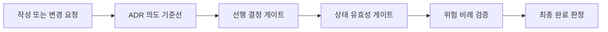

# ADR 0001: 안전하고 비례적인 개발 게이트

Date: 2026-08-15

## Status

Accepted (2026-08-15)

## Context

개발 흐름은 ADR 작성, 선행 결정 확인, 구현, 검증, 완료 판정으로 이어진다. 각 단계가 독립적으로 안전해도 선행 결정이 구현되지 않은 상태에서 downstream 구현을 허용하거나, 변경 위험과 무관하게 동일한 검증 비용을 요구하면 전체 흐름은 신뢰하기 어렵다.

ADR의 의도와 재생성 가능성을 구현 후에 다시 확인하면 작성·수정 단계의 승인이 완료 게이트에서 반복된다. 반대로 구현 검토가 찾은 명확한 결함마다 사용자 선택을 기다리면 에이전트가 스스로 수정하고 완료할 수 없다.

개발 게이트는 잘못된 상태를 다음 단계로 넘기지 않으면서 검증 비용을 변경 위험과 실제 저장소 변경에 비례시켜야 한다. 의도 확인은 구현 전에 끝내고, 구현 후에는 승인된 계약에 대한 자동 검토와 수정으로 완료 여부를 판정해야 한다.

## Decision Drivers

- 선행 결정이 구현되지 않은 상태에서 downstream 구현이 완료 상태가 되면 안 된다.
- 사용자는 새 ADR이나 변경된 ADR의 의도와 완전성을 구현 전에 한 번 확인해야 한다.
- 완료 상태는 테스트와 필수 구현 리뷰 결과를 반영하고 해결 가능한 발견을 자동 수정해야 한다.
- 검증 강도는 계약과 보호 표면의 변경 위험에 비례해야 한다.
- 저장소 상태가 바뀌지 않으면 검증을 반복하지 않고 drift 근거 없는 작은 변경에 깊은 동기화를 강제하지 않아야 한다.

## Decision

개발 흐름을 **의도 기준선, 선행 결정, 상태 유효성, 위험 비례 검증, 완료 판정**의 다섯 게이트로 운영한다.

새 ADR을 작성하거나 기존 ADR의 결정·요구사항 계약을 바꾸면 구현 전에 현재 Decision, Decision Drivers, requirement contract와 regeneration checklist를 제시하고 사용자에게 의도 일치를 한 번 확인받는다. 이 승인은 command가 아니라 정확한 ADR revision에 귀속된다. `/adr-new`나 `/feature-to-adr`에서 승인한 ADR 내용이 바뀌지 않았다면 `/adr-impl`은 그 기준선을 재사용하고 의도·재생성 질문을 다시 하지 않는다. 승인 후 ADR이 바뀌지 않았다면 구현 완료 뒤에도 같은 질문을 반복하지 않는다.

선행 ADR이 있는 구현은 모든 prerequisite가 `Accepted`일 때만 진행한다. 사용자가 downstream 구현을 먼저 요청해도 완료 가능한 구현으로 취급하지 않는다. 선행 기능에 ADR 대상 결정이 없다면 그 기능 의존성은 구현 계획에서 다루고, ADR 의존성을 만들기 위해 빈 ADR을 생성하지 않는다.

검증은 보호 표면과 변경 범위에 따라 표준 또는 전체 구현 리뷰를 선택한다. 저장소 상태가 바뀌지 않은 검증 기준선은 재사용하고, 깊은 ADR 동기화는 drift 근거가 있거나 주기적 감사가 필요할 때 수행한다.

구현 검토가 계약을 바꾸지 않는 증거 기반 코드·테스트 결함이나 국소 리팩토링을 찾으면 구현 세션이 자동으로 수정하고 테스트와 같은 검토 모드를 다시 실행한다. ADR 계약 변경, 모순된 전제, 중대한 미검증 위험 또는 파괴적 범위 변경만 사용자에게 판단을 요청한다. 검토가 통과하면 추가 승인 없이 `Accepted`로 전환하고 최종 보고에 자동 수정 항목과 검증 결과를 요약한다.

### Requirement contract

- 새 ADR이나 결정이 변경된 ADR은 구현 전에 현재 결정, Drivers, requirement contract와 regeneration checklist를 사용자가 한 번 승인해야 한다.
- 승인된 ADR revision이 바뀌지 않으면 command 경계를 넘어 같은 의도 기준선을 재사용한다. ADR 내용이 바뀐 경우에만 새 revision 승인을 받는다.
- `dependsOn`의 모든 선행 category는 현재 mapping에 존재하고 target 구현 전에 `Accepted`여야 한다.
- `Proposed` 또는 dangling prerequisite가 있으면 downstream 구현을 완료 경로로 진행하지 않는다.
- 기능 구현 의존성은 ADR 대상 결정의 의존성과 구분한다. ADR 대상 결정이 없는 기능을 표현하기 위해 placeholder ADR을 만들지 않는다.
- 구현 리뷰 모드는 계약, 공개 표면, 상태, 권한, 보안, 데이터, 외부 fallback, 동시성 및 변경 범위의 위험으로 선택한다.
- 최종 구현 리뷰가 필수 수정이나 미검증 위험을 남기면 구현은 완료 상태가 될 수 없다.
- 증거가 있고 ADR 계약을 바꾸지 않는 구현·테스트 결함과 국소 리팩토링은 자동 수정 후 재검증한다.
- 구현 후 사용자 판단은 ADR 계약 변경, 모순, 중대한 미검증 위험 또는 파괴적 변경에만 요청한다.
- 구현 전 승인 이후 ADR 계약이 바뀌지 않았으면 spec-fitness와 regeneration 질문을 반복하지 않는다.
- 동작이 바뀌지 않은 검증 기준선은 재사용할 수 있다. 자동 변경이 없으면 같은 대상 테스트를 다시 실행하지 않는다.
- 깊은 ADR 동기화는 drift, 넓은 구조 변경, 수동 ADR 변경 또는 주기적 감사 근거가 있을 때 수행한다.

### Alternatives

1. **모든 구현에 동일한 전체 게이트 적용**
   - 장점: 실행 경로가 하나다.
   - 단점: 국소 변경에도 최대 검토 비용을 지불한다.

2. **사용자 확인으로 선행 게이트 우회 허용**
   - 장점: downstream scaffold를 빠르게 작성할 수 있다.
   - 단점: 일부 동작이 비어 있는 구현이 완료 경로에 들어갈 수 있다.

3. **선행 상태는 엄격히 막고 검증 강도만 위험에 비례**
   - 장점: 무효 상태는 차단하면서 작은 변경의 비용을 줄인다.
   - 단점: 리뷰 모드 선택 기준을 명시하고 검증해야 한다.

4. **구현 후 모든 발견과 의도를 사용자에게 다시 확인**
   - 장점: 사용자가 마지막 순간에 모든 선택을 통제한다.
   - 단점: 이미 승인된 ADR과 명확한 수정까지 반복 확인해 자동 완료를 막는다.

## Consequences

### Positive

- downstream 구현은 구현된 선행 결정 위에서만 완료된다.
- ADR이 필요 없는 기능 의존성 때문에 placeholder ADR이 생기지 않는다.
- 작은 변경은 표준 리뷰를 사용하고 보호 표면 변경은 전체 리뷰를 유지한다.
- 완료 상태와 실제 검증 결과가 일치한다.
- 구현 후 반복 승인 없이 검토 발견을 수정하고 완료 결과를 받을 수 있다.

### Negative

- 선행 구현이 끝나기 전에는 downstream 작업이 대기할 수 있다.
- 리뷰 모드 분류가 잘못되면 검증이 과하거나 부족할 수 있다.
- 구현 전 ADR 승인이 형식적으로 수행되면 잘못된 계약을 기준으로 자동 완료할 수 있다.

### Risks

- 구현자가 변경 위험을 낮게 분류할 수 있다. 보호 표면 조건 중 하나라도 해당하면 전체 리뷰를 선택한다.
- 자동 수정 범위가 넓어질 수 있다. 계약 변경·모순·중대한 미검증 위험과 파괴적 변경은 반드시 사용자 판단으로 분리한다.

## Related

- [구현 리뷰](../../adr-cycle/implementation-review/0001-validated-low-risk-refactoring.md)
- [PRD 기능을 ADR 결정으로 전달](../../alps-authoring/spec-handoff/0001-admission-aware-feature-handoff.md)
