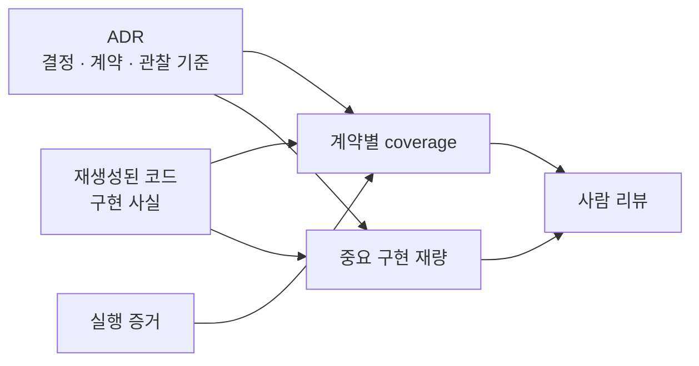
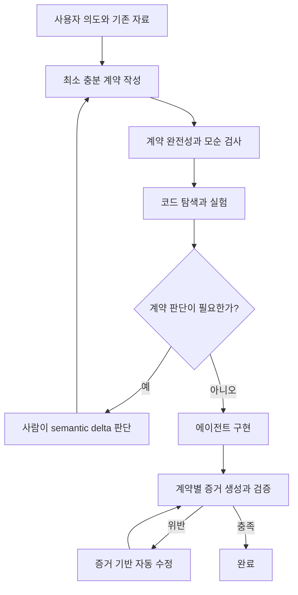
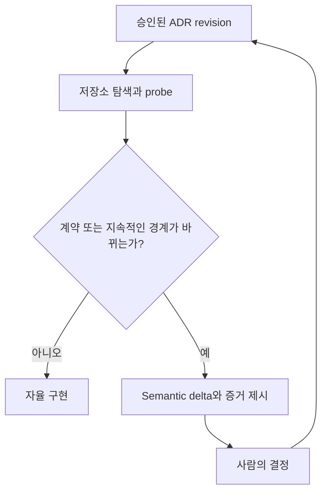
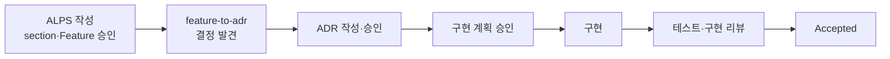
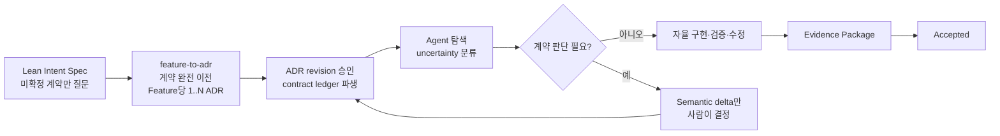

# AI-native 개발에서 HITL과 인지부하를 함께 줄이는 방법

## 문제 정의

AI 코딩 에이전트는 코드 생성 시간을 크게 줄였지만 개발자의 인지부하를
없애지는 않았다. 사람이 코드를 직접 작성할 때는 구현 과정에서 시스템에
대한 이해가 점진적으로 쌓였다. 반면 AI는 짧은 시간에 큰 변경을 만들기
때문에 이해, 검증, 의사결정이 한 시점에 집중된다.


따라서 AI-native 개발의 병목은 코드 생성 속도가 아니라 인간의
**comprehension bandwidth**, 즉 변경을 이해하고 신뢰할 수 있는 속도다.

이를 해결하지 않은 상태에서 Human-in-the-loop, 이하 HITL을 줄이면 검증되지
않은 코드가 빠르게 누적된다. 반대로 모든 단계에 사람의 승인과 상세 검토를
추가하면 AI를 사용하는 생산성 이점이 사라진다.

이 문서의 목표는 다음 두 문제를 하나의 문제로 다루는 것이다.

1. 사람이 이해해야 하는 정보량을 줄인다.
2. 사람의 개입을 계약상 판단이 필요한 순간으로 제한한다.
3. 생성된 코드가 ADR의 의도를 실제로 준수하는지 사람이 요구사항별로
   검토할 수 있게 한다.

## 핵심 주장

HITL 최소화와 인지부하 감소는 별개의 목표가 아니다.

사람이 코드 전체를 읽어야만 구현의 정합성을 확인할 수 있다면 HITL을 제거할
수 없다. 반대로 문서와 실행 증거만으로 구현의 정합성을 판정할 수 있다면,
사람은 코드 생성과 검증 과정에 계속 참여할 필요가 없다.

그러나 이를 위해 완벽한 문서나 구현 청사진을 미리 작성해서는 안 된다.

- 코드를 보기 전에는 알 수 없는 사실이 존재한다.
- 라이브러리, 내부 구조, 성능 특성은 구현과 실험 과정에서 드러난다.
- 모든 세부사항을 사전에 고정하면 문서 작성 비용이 코드 작성 비용을
  대체한다.
- 코드에서 쉽게 복구할 수 있는 사실까지 문서에 올리면 문서와 코드의
  drift가 늘어난다.

따라서 목표는 **완벽한 문서**가 아니라 다음 상태다.

> 구현 방법은 열어두되, 결과가 맞는지 틀린지는 문서만으로 판정할 수 있다.

이를 **contract-complete, implementation-open** 상태라고 정의한다.

이 상태에서 ADR은 세 가지 역할을 동시에 수행한다.

1. PRD와 코드 사이의 추상 레이어를 지킨다.
2. 코드를 여러 번 재생성해도 같은 요구사항을 준수하게 의도를 전달한다.
3. 재생성된 코드가 요구사항을 지켰는지 이후 구현 리뷰가 판정할 기준선을
   제공한다.

세 번째 역할은 ADR을 구현 설명서로 만들지 않는다. ADR은 무엇이 참이어야
하는지와 무엇을 관찰하면 준수 여부를 판정할 수 있는지만 기록한다. 실제 코드
위치, 테스트 명령과 구현 선택은 리뷰 시점에 파생한다.

이 관점에서 최적화할 대상은 HITL 횟수 자체가 아니라 **Human Decision
Surface**, 즉 사람이 직접 판단해야만 다음 단계로 갈 수 있는 결정의 범위다.

```text
Human Decision Surface
= 제품 의미를 바꾸는 결정
+ 지속적인 계약과 경계를 바꾸는 결정
+ 에이전트가 증명하지 못한 중대한 위험
```

구현 과정의 모든 활동을 사람에게 보여주는 대신, 이 표면 밖의 탐색, 구현,
테스트와 국소 수정을 에이전트가 닫힌 루프로 처리해야 한다.

## 문서의 완성 기준

문서는 동일한 코드를 재현할 만큼 상세할 필요가 없다. 서로 다른 구현이라도
반드시 같은 요구사항을 만족하도록 만드는 계약만 포함하면 된다.

문서에 답이 있어야 하는 질문은 다음과 같다.

- 사용자에게 어떤 결과가 관찰되어야 하는가?
- 반드시 지켜야 하는 값과 규칙은 무엇인가?
- 어떤 상태와 전이가 허용되거나 금지되는가?
- 누가 무엇을 보거나 실행할 수 있는가?
- 중복, 순서, 유일성과 단위는 어떻게 보장되는가?
- 외부 시스템 실패 시 무엇이 보장되어야 하는가?
- 무엇을 관찰하면 요구사항 충족 여부를 판정할 수 있는가?

반대로 다음 질문은 코드와 구현 과정에 남긴다.

- 어떤 라이브러리와 SDK를 사용하는가?
- 함수, 클래스와 모듈을 어떻게 나누는가?
- 내부 요청과 응답 타입은 어떤 모양인가?
- 어떤 캐시, retry, pool 크기와 내부 timeout을 사용하는가?
- 테스트 파일과 구현 파일을 어디에 배치하는가?

문서의 완성 여부는 다음 질문으로 판단한다.

> 이 문서로 구현 방법을 알 수 있는가?

이 질문은 필요 이상으로 강하다. 대신 다음 질문을 사용한다.

> 이 문서로 잘못된 구현을 식별할 수 있는가?

두 번째 질문에 답할 수 있으면 구현 세부사항은 에이전트에 위임할 수 있다.

ADR에는 한 질문을 더 적용한다.

> 각 요구사항을 독립적으로 읽고, 구현 리뷰에서 하나의 달성 상태를 부여할
> 수 있는가?

여러 값, 권한, 전이와 실패 보장을 한 행에 묶으면 일부만 구현된 상태가
가려진다. 따라서 각 계약 행은 하나의 검토 가능한 의무를 표현해야 한다.

## 최소 충분 계약

각 Feature 또는 ADR은 가능한 한 다음 네 종류의 계약으로 압축한다.

### Required guarantees

정상적인 결과에서 반드시 성립해야 하는 동작과 값이다.

예:

- 한 주문은 최대 한 번만 결제 완료 상태가 된다.
- 무료 플랜 사용자는 한 달에 파일을 5개까지 업로드할 수 있다.
- 승인된 문서 구간은 정확히 한 번 저장된다.

### Prohibitions

절대 허용하면 안 되는 상태와 동작이다.

예:

- 취소된 주문은 배송 상태로 전환할 수 없다.
- 권한이 없는 사용자는 다른 사용자의 비공개 문서를 볼 수 없다.
- 동일한 webhook을 두 번 받아도 결제가 중복 처리되면 안 된다.

### Failure guarantees

오류, 부분 실패와 외부 의존성 장애에서 보장해야 하는 결과다.

예:

- 결제 provider 호출이 실패하면 주문은 결제 완료 상태가 되지 않는다.
- 데이터 저장 실패 시 사용자에게 성공 응답을 반환하지 않는다.
- fallback도 실패하면 결과를 추측하지 않고 명시적인 실패를 반환한다.

### Observable evidence

계약 충족 여부를 어떤 결과로 판정할지 정의한다.

예:

- 같은 달의 여섯 번째 업로드 시도가 거부되고 저장된 파일 수는 5개다.
- 취소 상태에서 배송 전이를 요청하면 상태가 바뀌지 않는다.
- 동일한 webhook을 반복 전송해도 결제 레코드가 하나만 존재한다.

Observable evidence는 테스트 구현 지시가 아니다. 구현체와 무관하게 어떤
현상을 확인해야 하는지를 정의하는 검증 oracle이다.

각 Observable evidence 행은 하나의 계약 의무와 대응해야 한다. 테스트 파일,
명령, 함수, 클래스, 라이브러리, fixture와 내부 데이터 표현은 기록하지 않는다.
서로 다른 구현이라도 같은 결과를 관찰할 수 있어야 한다.

## ADR에서 사람 리뷰까지의 연결

ADR 본문과 구현 리뷰는 별개의 권위 문서가 아니다. ADR은 영속 계약이고,
리뷰의 Evidence Package는 ADR, 코드와 테스트에서 다시 만들 수 있는 일시적
읽기 화면이다.



사람에게는 다음 두 축을 함께 보여준다.

- **요구사항별 달성 내용**: ADR의 각 계약 행, 상태, 구현 내용, 코드 또는
  실행 증거와 검증 테스트
- **에이전트가 스스로 정한 구현 재량**: 선택한 값이나 동작, 코드 근거,
  ADR 의도와 양립하는 이유, 운영·비용·유지보수상 중요성

두 번째 축은 ADR을 수정하지 않는다. admission gate를 통과하는 선택은
`Undecided behavior`로 올리고, 교체 가능한 구현 선택만 읽기 전용으로
보여준다.

## 버티컬 슬라이스의 확장

현재의 버티컬 슬라이스는 하나의 사용자 행동을 UI, API와 데이터 계층 전체에
걸쳐 묶는다. 이는 관련 코드를 찾고 변경 범위를 이해하는 비용을 줄인다.

하지만 코드가 문서와 일치하는지 확인하려면 버티컬 슬라이스에 검증 증거가
추가되어야 한다.


이를 **proof-carrying vertical slice**라고 부를 수 있다.

```text
Proof-carrying vertical slice
= Product contract
+ Architecture decision
+ Proof obligations
+ Executable evidence
```

버티컬 슬라이스는 사용자 행동의 전체 경계를 유지한다. 구현과 리뷰를 작게
나눌 때도 frontend, backend, data 같은 기술 계층으로 나누지 않는다. 대신
다음과 같은 검증 질문으로 나눈다.

1. Happy path가 성립하는가?
2. 요구사항 값과 도메인 불변식이 보호되는가?
3. 권한과 상태 전이가 계약대로 제한되는가?
4. 실패와 fallback이 계약대로 동작하는가?
5. NFR을 만족하는 증거가 있는가?

각 구현 단계는 하나의 질문과 그 질문을 검증하는 테스트에 집중한다.

## 문서 작성과 코드 발견의 관계

문서 작성 시점에 모든 사실을 알 수 있다고 가정해서는 안 된다. 구현 과정에서
발견되는 미확정 사항은 성격에 따라 다르게 처리한다.

| 발견한 사항                             | 처리                              |
| --------------------------------------- | --------------------------------- |
| 요구사항 계약이나 지속적인 경계를 바꿈  | 사람에게 질문                     |
| 되돌릴 수 있는 내부 구현 선택           | 에이전트가 결정                   |
| 코드 탐색이나 실험으로 확인 가능        | 에이전트가 probe 또는 테스트 수행 |
| 기존 계약 안에서 여러 구현이 가능       | 에이전트가 선택                   |
| 파괴적이거나 되돌리기 어려움            | 사람에게 질문                     |
| 안전이나 계약에 영향을 주는 미검증 위험 | 사람에게 질문                     |

예를 들어 사용할 SDK, 내부 adapter와 retry 구현은 에이전트가 결정할 수 있다.
반면 조사 결과 선택한 provider로는 계약에 명시된 응답 시간을 만족할 수 없다면
계약 또는 외부 경계에 대한 판단이 필요하다.

이때 전체 문서를 다시 검토하게 하지 않고 semantic delta만 제시한다.

```text
발견
- 현재 provider에서는 p95 2초 응답 계약을 만족시키기 어렵다.

결정이 필요한 항목
- 응답 목표를 변경한다.
- 비동기 완료 모델을 허용한다.
- provider 경계를 변경한다.

영향받지 않는 계약
- 권한 정책
- 결과 정확성
- 실패 시 데이터 보존
```

사람은 구현 세부사항이 아니라 실제로 바뀌어야 하는 계약만 판단한다.

## 권장 실행 흐름



### 1. 최소 계약 작성

에이전트가 기존 대화, PRD와 저장소 문서를 사용해 초안을 만든다. 사람에게
모든 항목을 채우게 하지 않는다.

### 2. 계약 lint

코드를 만들기 전에 다음을 확인한다.

- 모호한 요구사항 값이 남아 있지 않은가?
- 상태 집합과 금지 전이가 빠지지 않았는가?
- 실패 보장에 관찰 가능한 결과가 있는가?
- Section 간 동일한 요구사항 값이 일치하는가?
- NFR에 metric 또는 release test가 있는가?
- 서로 모순되는 계약이 존재하지 않는가?

구조와 명확한 값 비교는 deterministic 도구가 처리하고 의미적 모순만 모델이
검토한다.

### 3. 코드 탐색과 실험

에이전트가 기존 코드, API, schema와 테스트를 읽고 필요한 경우 재현 실험을
수행한다. 이 단계의 목적은 구현 계획 승인이 아니라 계약으로 결정할 수 없는
사항이 있는지 찾는 것이다.

### 4. 예외 기반 HITL

사람에게는 계약 변경, 모순, 중대한 미검증 위험과 파괴적 범위만 전달한다.
계획, 파일 목록, 내부 구조와 교체 가능한 구현 수단은 승인받지 않는다.

### 5. 구현과 증거 생성

에이전트는 각 계약을 proof obligation으로 변환하고 적절한 증거를 생성한다.

| 계약 종류 | 대표 증거                       |
| --------- | ------------------------------- |
| 숫자 제한 | 경계값 테스트                   |
| 상태 전이 | 상태 전이 또는 property test    |
| 권한      | 역할별 접근 matrix              |
| 유일성    | 중복 및 동시성 테스트           |
| 실패 보장 | 장애 주입 또는 실패 경로 테스트 |
| fallback  | 외부 의존성 실패 시뮬레이션     |
| 성능 NFR  | benchmark 또는 release test     |

### 6. 자동 수정과 완료

계약을 바꾸지 않는 구현 오류, 테스트 누락과 국소 리팩토링은 에이전트가
자동 수정하고 같은 검증을 반복한다.

사람의 판단 없이 수정할 수 없는 finding만 다시 HITL로 보낸다.

## 현재 ALPS/ADR 워크플로우 적용안

현재 워크플로우는 다음 흐름을 사용한다.

```text
/alps-init
→ /feature-to-adr
→ /adr-impl
→ /adr-impl-refactor
→ /adr-impl-review
→ Accepted
```

이 흐름은 PRD, ADR과 코드의 abstraction ladder, 버티컬 슬라이스, 구현 후
자동 수정과 예외 기반 escalation을 이미 갖고 있다. 따라서 새 문서 계층을
추가하기보다 각 단계에서 routine approval을 줄이고 같은 계약 기준선을
재사용하도록 바꾸는 것이 중요하다.

### 1. `/alps-init`: section approval에서 intent exception으로 이동

현재 ALPS 작성은 section 또는 Feature 단위 확인을 기본으로 한다. 이는
아무런 입력이 없는 대화형 작성에는 유효하지만, 사용자가 brief, 기존 문서나
구조화된 요구사항을 제공한 경우에도 반복 승인이 발생할 수 있다.

작성 중인 내용을 다음 세 상태로 분류한다.

| 상태                | 의미                                                  | 처리                       |
| ------------------- | ----------------------------------------------------- | -------------------------- |
| `Source-backed`     | 사용자 입력이나 권위 자료에 명시되어 있음             | 자동 초안                  |
| `Agent-derived`     | 기존 계약 안에서 안전하고 되돌릴 수 있게 추론 가능    | 자동 초안, digest에만 표시 |
| `Decision required` | 요구사항 값, 제품 행동, 지속적인 경계가 결정되지 않음 | 사람에게 질문              |

사람은 모든 section의 문장을 승인하는 대신 다음 product intent baseline을
한 번 확인한다.

```text
Goal
Observable behavior
Required guarantees
Prohibitions
Failure guarantees
Non-goals
Unresolved decisions
```

대화만으로 요구사항을 발견하는 경우에는 기존의 atomic 질문 흐름을 유지할 수
있다. 반면 충분한 자료가 있으면 section별 confirmation을 기본 안전장치로
강제하지 않고 `Decision required` 항목만 질문한다.

이 변경은 문서 구조보다 ALPS authoring interaction의 승인 정책 변경이다.

### 2. `/feature-to-adr`: 구현 계약의 소유권을 완전 이전

`/feature-to-adr`는 Feature의 구현 관련 의도를 ADR 집합으로 완전 이전한다.
이전된 Feature는 최소 하나의 requirement contract owner ADR을 가지며, 서로
독립적인 durable decision은 추가 ADR로 분리한다. Replaceable implementation
means는 계속 admission gate에서 제외한다.

Lean Spec이 구현 방법을 비워두더라도 다음 항목은 handoff에서 손실되면 안
된다.

- requirement value와 basis
- 허용 상태와 금지 전이
- mandatory field, permission과 visibility
- ordering, uniqueness와 unit
- failure guarantee
- 외부 경계와 fallback
- 대안을 구분하는 NFR

Feature에서 발견한 라이브러리, 내부 구조와 tuning 선택은 ADR 후보로 올리지
않는다. 반대로 구현을 제약하는 계약과 경계는 문서가 짧다는 이유로 생략하지
않는다.

Handoff 완료 후 PRD는 legacy planning document다. 일반 구현과 리뷰는 ADR만
읽는다. 사용자가 변경된 PRD를 명시적으로 재import할 때만 현재 ADR과 semantic
comparison을 수행하며, 동일한 의미는 no-op이고 삭제된 계약은 자동 제거하지
않는다.

### 3. `/adr-impl`: routine plan approval을 exploration classification으로 대체

ADR revision이 이미 승인되었다면 저장소 탐색 후 구현 계획을 다시 승인받는
것은 기본 흐름이 아니어야 한다.



탐색 단계의 목적은 구현 계획을 승인받는 것이 아니라, 승인된 계약 안에서
구현을 완료할 수 있는지 확인하는 것이다.

다음 발견은 에이전트가 처리한다.

- 관련 코드와 기존 패턴 탐색
- 재사용 가능한 abstraction 판단
- 내부 모듈과 함수 구조 선택
- 되돌릴 수 있는 dependency와 adapter 선택
- 계약을 바꾸지 않는 schema 표현과 test fixture 설계

다음 발견만 semantic delta로 사람에게 전달한다.

- 사용자 관찰 행동을 바꿔야 함
- requirement value나 규칙을 바꿔야 함
- public contract 또는 persistent data semantics를 바꿔야 함
- 보안, 외부 provider 또는 fallback 경계를 바꿔야 함
- 파괴적 migration 또는 승인 범위 밖의 넓은 변경이 필요함
- 핵심 경로의 안전성을 검증할 수 없음

### 4. ADR에서 derived contract ledger 생성

ADR의 독립 계약 행과 Observable evidence를 derived contract ledger로
정규화한다. `D0`는 Decision, `R1..Rn`은 requirement contract의 최상위
행을 원문 순서대로 가리키는 일시적 식별자다. 현재 구현 리뷰는 최종 코드에서
이 ledger를 재생성한다. 같은 ledger를 구현 전부터 재사용하는 것은 후속
확장으로 남긴다.

```text
승인된 ALPS/ADR
→ Derived contract ledger
→ Repository exploration
→ Implementation
→ Tests
→ Implementation review
```

예:

```text
D0 Decision
결제는 중복 완료와 provider 실패에서 일관된 상태를 보존한다.

R1 Required
한 주문은 한 번만 결제 완료된다.

R2 Prohibition
취소된 주문은 배송 상태로 전환되지 않는다.

R3 Failure guarantee
Provider 실패 시 결제 완료 상태를 기록하지 않는다.

R4 NFR
결제 요청은 p95 2초 이내에 응답한다.
```

각 계약 행은 실행 중 다음 상태 중 하나를 가진다.

| 상태           | 의미                                          |
| -------------- | --------------------------------------------- |
| `PROVEN`       | 실행 증거가 계약을 지지함                     |
| `VIOLATED`     | 코드나 테스트가 계약 위반을 재현함            |
| `UNVERIFIED`   | 핵심 경로를 실행하거나 확인하지 못함          |
| `CONTRADICTED` | 권위 자료 또는 독립 검토의 전제가 서로 충돌함 |

이 ledger는 새 권위 문서가 아니다. ALPS, ADR, 코드와 테스트에서 다시 만들 수
있는 일시적 artifact이며 같은 ADR revision의 구현과 리뷰가 공유하는 작업
기준선이다.

### 5. Confidence 대신 uncertainty type으로 escalation 결정

`confidence 92%`처럼 의미가 불명확한 단일 수치로 HITL 여부를 정하지 않는다.
탐색과 검증에서 남은 불확실성을 유형별로 분류한다.

| Uncertainty type          | 기본 처리                                   |
| ------------------------- | ------------------------------------------- |
| Requirement               | 사람에게 질문                               |
| Product behavior          | 사람에게 질문                               |
| Security boundary         | 사람에게 질문                               |
| Persistent data semantics | 사람에게 질문                               |
| Destructive migration     | 사람에게 질문                               |
| Reversible architecture   | 에이전트 진행                               |
| Local implementation      | 에이전트 진행                               |
| Verification              | 추가 probe 후 중대한 미확정만 사람에게 질문 |

Uncertainty type은 ALPS나 ADR의 새 section으로 저장하지 않는다. 실행 중
escalation을 결정하는 derived metadata로 사용한다.

### 6. `/adr-impl-review`: Evidence Package를 기본 사용자 화면으로 사용

구현 리뷰는 기존처럼 decision ledger, 테스트, 필요성·충분성 검토와 evidence
verification을 수행한다. 사용자에게는 전체 diff보다 다음 결과를 먼저
보여준다.

```text
Feature: Email signup

Goal                         PROVEN
Duplicate prevention         PROVEN
Password plaintext ban       PROVEN
Existing login compatibility PROVEN
p95 latency 300ms            UNVERIFIED

Contract changes             NONE
Architecture changes         NONE
Automatic repairs            2
Human decision required      YES
```

각 coverage 행은 일시적 contract ID, 요구사항, 상태, ADR 근거, 구현이 달성한
내용, 코드·실행 증거와 테스트를 포함한다. Validator는 ADR에서 `D0/R1..Rn`
집합을 다시 파생해 누락, 중복과 임의 ID를 거부한다. `PASS`는 모든 행이
`PROVEN`이고 필수 테스트가 실제로 실행됐으며 blocking finding과 미검증
위험이 없을 때만 가능하다.

Notable implementation choices는 별도의 읽기 전용 목록으로 항상 중요한
항목만 보여준다.

```text
선택한 값 또는 동작
코드 근거
ADR 의도와 양립하는 이유
왜 중요한가
```

상세 diff와 reviewer 원문은 `VIOLATED`, `UNVERIFIED`, `CONTRADICTED`를
조사하거나 사용자가 요청할 때만 확장한다. coverage와 구현 선택에는 행별
승인을 요구하지 않는다.

`PROVEN`은 수학적 완전 증명을 의미하지 않는다. 실행한 테스트와 반례 탐색에서
현재 계약을 깨는 증거를 찾지 못했고 해당 계약 행이 실행 증거로 설명된다는
뜻이다.

### 7. Stacked PR을 승인 단위가 아니라 autonomous proof unit으로 사용

Stack을 다음과 같은 기술 계층으로 나누면 버티컬 슬라이스가 깨진다.

```text
DB schema
→ Domain logic
→ API
→ UI
```

각 layer가 사용자 행동을 독립적으로 증명하지 못하고, 전체 Stack을 이해해야
판정할 수 있기 때문이다.

대신 동일한 버티컬 슬라이스를 proof obligation 단위로 누적한다.

```text
Stack 1: 정상 사용자 행동을 end-to-end로 증명
Stack 2: 중복, 권한과 상태 불변식을 증명
Stack 3: 실패, rollback과 fallback을 증명
Stack 4: NFR을 증명
```

각 Stack layer는 사람이 순서대로 승인하는 checkpoint가 아니다. 에이전트가
자동 검증하고 실패 시 해당 범위로 rollback할 수 있는 작은 실행 단위다.
실제 원격 PR 게시와 자동 merge는 저장소 보호 정책과 명시적인 외부 작업
권한을 따른다.

### 8. 별도 Intent Ledger를 권위로 추가하지 않음

Exploration에서 얻은 모든 사실을 ALPS나 ADR에 추가하면 문서가 다시 구현
설명서가 된다.

| 정보                                       | 소유 위치                        |
| ------------------------------------------ | -------------------------------- |
| 사용자 의도와 제품 계약                    | ALPS                             |
| durable decision, rationale와 contract     | ADR                              |
| decision-changing assumption               | ADR Context 또는 Decision Driver |
| 구현 사실과 replaceable choice             | 코드와 테스트                    |
| exploration scope, plan과 evidence mapping | 일시적 artifact                  |

Agent가 변경할 수 있는 것은 구현 사실과 replaceable choice다. Goal, business
behavior, critical constraint와 non-goal은 승인된 계약을 갱신하지 않고
바꿀 수 없다.

### 적용 우선순위

가장 큰 효과가 예상되는 순서는 다음과 같다.

1. `/adr-impl`의 routine implementation-plan approval 제거
2. ALPS section별 승인을 exception-driven intent approval로 변경
3. ADR 승인 직후 derived contract ledger 생성
4. exploration 결과에 uncertainty type과 escalation policy 적용
5. 최종 사용자 출력을 contract coverage 중심 Evidence Package로 변경
6. Stacked PR을 autonomous proof unit으로 재정의

이 변경은 주로 기존 결정의 소유 범위 안에 있다.

- ALPS 승인 정책: `alps-authoring/authoring-interaction`
- PRD에서 ADR로의 계약 전달: `alps-authoring/spec-handoff`
- 구현 승인과 자동 완료 흐름: `delivery/development-flow`
- evidence와 review 결과: `adr-cycle/implementation-review`

따라서 실제 구현 시에는 같은 질문을 소유한 기존 ADR을 갱신하는 것이
기본이며, 별도 workflow ADR을 중복 생성하지 않는다.

## 리뷰 인터페이스

리뷰의 기본 화면은 파일 diff나 전체 문서가 아니라 계약 coverage와 중요한
구현 재량이어야 한다.

```text
Feature: 주문 취소

Required guarantees       5/5 proven
Prohibitions              3/3 proven
Failure guarantees        2/2 proven
NFR                       1/2 proven

Unverified
- 결제 취소 요청과 배송 시작이 동시에 발생하는 경로

Contract changes
- 없음

Automatic repairs
- 중복 취소 요청 테스트 추가
- rollback 누락 수정
```

사람은 다음 항목만 자세히 읽는다.

- `Unverified`
- `Violated`
- `Contradicted`
- `Contract changed`

코드와 전체 diff는 판정 근거가 필요할 때만 확장한다.

중요 구현 재량은 다음처럼 읽기 전용으로 이어진다.

| 선택한 값 또는 동작 | 코드 근거   | ADR 의도와 양립하는 이유            | 왜 중요한가               |
| ------------------- | ----------- | ----------------------------------- | ------------------------- |
| 고정 지연 재시도    | 재시도 경로 | 실패 결과와 유한 재시도 계약을 유지 | 복구 지연과 요청량에 영향 |

## Mental Model과 테스트

Mental Model은 영속적인 두 번째 명세가 아니라 권위 문서와 코드에서 파생하는
읽기 화면이어야 한다.

```text
사용자 행동
→ 변경되는 상태
→ 반드시 지켜야 하는 불변식
→ 외부 경계와 실패 동작
→ 각 항목을 검증하는 증거
```

테스트는 품질 검증뿐 아니라 구현을 압축해서 설명하는 수단이다. 테스트 이름은
구현 함수가 아니라 증명하는 행동을 표현해야 한다.

```text
좋음
- cancelled order cannot move to shipping
- duplicate webhook does not create a second payment

나쁨
- test transition 3
- webhook handler test
```

이 방식에서는 모든 코드를 읽지 않아도 핵심 계약, 대표 테스트와 실패 증거로
시스템의 현재 동작을 복구할 수 있다.

## HITL의 최종 경계

HITL은 다음 경우로 제한한다.

1. 요구사항 값이나 규칙이 비어 있다.
2. 두 권위 계약이 서로 모순된다.
3. 기존 계약을 변경해야 한다.
4. 계약 충족 여부를 검증할 방법이 없다.
5. 안전에 영향을 주는 중요한 경로를 실행하지 못했다.
6. 파괴적 변경이나 승인 범위 밖의 넓은 변경이 필요하다.

다음 사항은 HITL 대상이 아니다.

- 구현 계획과 파일 목록
- 내부 모듈 구조
- 교체 가능한 라이브러리와 SDK
- 테스트 추가
- 명확한 spec violation 수정
- 동작을 보존하는 국소 리팩토링
- 계약 내에서 선택 가능한 구현 대안

목표는 human-out-of-the-loop을 선언하는 것이 아니라 **human only at
ambiguity boundaries**를 달성하는 것이다.

## 권위 정보와 일시적 정보

인지부하를 줄이기 위해 모든 분석 결과를 영속화하면 또 다른 문서 체계와
동기화 비용이 생긴다.

영속해야 하는 정보:

- 사용자 의도와 제품 계약
- 채택된 아키텍처 결정과 근거
- 요구사항 값, 불변식, 상태와 권한
- 장기적으로 지켜야 하는 실패 보장

재생성 가능한 일시적 정보:

- 구현 계획
- 코드 탐색 결과
- 파일 scope
- contract-to-test 연결
- review ledger
- comprehension score
- 실행 로그와 중간 요약

계약 ledger와 evidence report는 권위 문서가 아니라 PRD, ADR, 코드와 테스트에서
재생성 가능한 derived artifact로 취급한다. 성능을 위해 캐시할 수 있지만
폐기하거나 다시 만들 수 있어야 한다.

## 측정 지표

AI 도입 효과는 생성량이나 cycle time만으로 평가하지 않는다.

### 계약 품질

- 구현 시작 시 미확정 계약 수
- 모호하거나 검증 불가능한 Acceptance Criteria 비율
- PRD와 ADR 간 계약 불일치 수

### 검증 가능성

- executable evidence가 있는 계약 비율
- 검증하지 못한 핵심 경로 수
- mutation 또는 counterexample에 의해 실제 결함을 감지한 테스트 비율

### HITL

- Feature당 사용자 질문 수
- 계약 판단으로 escalation된 비율
- 구현 선택 때문에 발생한 불필요한 승인 수
- 사용자 판단 없이 자동 수정된 finding 비율

### 인지부하

- 사람이 직접 읽어야 했던 계약 변경 수
- 전체 diff 대신 semantic diff로 판정한 비율
- 세션 재개 후 mental model 복구 시간
- 문서 모호성 때문에 다시 작성한 코드 비율

## 피해야 할 접근

### 완벽한 사전 명세

코드에서만 알 수 있는 내부 사실까지 문서화해 문서 작성이 구현을 대체한다.

### 파일 수와 코드 라인 수 중심 분할

개념과 검증 질문이 섞여 있으면 작은 diff도 이해하기 어렵다.

### 모든 단계의 사용자 승인

계약과 무관한 구현 재량까지 사람에게 넘겨 AI의 자율성을 제거한다.

### 모든 발견의 영속화

재생성 가능한 분석 결과가 새로운 권위와 동기화 부담이 된다.

### 테스트 통과를 완전한 증명으로 간주

실행한 사례에서 반례를 찾지 못했다는 증거일 뿐, 실행하지 않은 핵심 경로까지
보장하지는 않는다.

## 결론

AI-native 개발에서 인지부하와 HITL을 함께 줄이는 핵심은 더 많은 문서를 쓰는
것이 아니다.

1. 문서는 구현 청사진이 아니라 판정 가능한 최소 계약을 기록한다.
2. 구현 과정에서 알게 된 내부 사실은 가능한 한 코드와 테스트에 남긴다.
3. 에이전트는 계약별 proof obligation과 실행 증거를 만든다.
4. 리뷰는 파일 diff가 아니라 contract coverage와 semantic delta를 중심으로
   진행한다.
5. 사람은 모호한 계약, 계약 변경, 모순과 중대한 미검증 위험만 판단한다.
6. 에이전트의 자율성은 `무엇이 참이어야 하는가`, `무엇을 스스로 결정해도
되는가`, `언제 사람에게 escalation해야 하는가`로 정의한다.

최종적으로 지향하는 흐름은 다음과 같다.

```text
최소 계약
→ 자율적인 코드 탐색과 구현
→ 계약별 실행 증거
→ 증거 기반 자동 수정
→ 예외만 사람에게 전달
```

사람이 구현 전체를 이해해야 하는 구조에서는 HITL을 제거할 수 없다. 사람이
계약과 증거만으로 결과를 신뢰할 수 있을 때, AI 에이전트는 생성뿐 아니라
구현과 검증 과정도 자율적으로 수행할 수 있다.

## 현재 구조에서 실제로 바뀌는 것

이 절은 앞의 원칙을 현재 `alps-writer`와 `adr-writer`에 적용할 경우의
구체적인 변경점을 요약한다. 이번 변경은 ADR의 reviewability와 최종 Evidence
Package를 구현한다. exception-driven ALPS 작성, routine plan approval 제거,
구현 전 ledger 재사용과 autonomous proof unit은 후속 제안이다.

### 전체 흐름 비교

현재 흐름:



목표 흐름:



가장 큰 변화는 사람의 승인을 구현 단계마다 받는 대신, **제품 계약을 확정할
때 한 번 받고 이후에는 계약 변경이나 검증 불가능성이 발견될 때만 다시
호출하는 것**이다.

### 단계별 변경 요약

| 단계                 | 현재 구조                                                         | 변경 후 구조                                                                                  | 인지부하와 HITL 효과                               |
| -------------------- | ----------------------------------------------------------------- | --------------------------------------------------------------------------------------------- | -------------------------------------------------- |
| `/alps-init`         | Atomic이 기본이며 미완성 section과 Feature를 각각 확인하고 저장   | 입력을 `Source-backed`, `Agent-derived`, `Decision required`로 분류하고 미확정 계약만 질문    | 반복적인 문장 승인을 줄이고 제품 판단에만 집중     |
| Section 7            | 사용자 행동, 값, 규칙, edge case와 Acceptance Criteria 작성       | 기존 구조를 유지하되 Acceptance Criteria를 proof obligation의 입력으로 사용                   | 문서를 늘리지 않고 검증 가능성을 높임              |
| `/feature-to-adr`    | Feature 계약을 `1..N` ADR로 완전 이전하고 PRD를 legacy로 전환     | 승인된 ADR 계약에서 derived contract ledger를 생성                                            | 일반 구현에서 PRD를 다시 읽는 비용 제거            |
| `/adr-new`           | Decision, Drivers, contract와 regeneration checklist 승인         | 계약을 한 행 한 의무로 작성하고 Observable evidence를 포함해 이후 리뷰 기준선으로 사용        | 재생성 코드의 준수 여부를 요구사항별로 판정        |
| `/adr-impl` 탐색     | 관련 코드를 찾고 구현 계획을 작성한 뒤 사용자 승인                | 탐색과 구현 선택은 자동 진행하고 계약 또는 지속적인 경계가 바뀔 때만 semantic delta 제시      | routine plan approval 제거                         |
| `/adr-impl` 구현     | ADR 계약에 따라 구현하고 테스트 작성                              | 같은 계약 ledger의 각 행을 proof obligation으로 사용해 구현과 테스트를 닫음                   | 구현 범위와 검증 범위가 같은 기준을 사용           |
| `/adr-impl-refactor` | 검증된 국소 리팩토링만 자동 반영                                  | 현재 안전 경계를 유지                                                                         | 추가 HITL 없이 기존 자동화 활용                    |
| `/adr-impl-review`   | 구현 후 decision ledger를 만들고 contract coverage와 finding 검토 | 요구사항별 Evidence Package와 ADR 의도 적합성이 설명된 구현 재량을 읽기 전용으로 표시         | 사람이 전체 diff 없이 달성 내용과 자율 판단을 이해 |
| Stacked PR           | 사용자가 요청하면 review question별 전달 후보 제시                | Agent가 proof obligation별 autonomous unit으로 사용할 수 있게 하되 원격 게시 정책은 별도 유지 | 작은 자동 검증·rollback 단위 확보                  |
| 완료                 | Review PASS 후 자동 `Accepted`                                    | 동일하게 유지                                                                                 | 완료 시 추가 승인 없음                             |
| Merge                | 저장소 PR·CI 정책에 따름                                          | Evidence PASS를 merge eligibility로 사용하되 실제 자동 merge는 저장소 정책에 따름             | 검증과 publication 권한을 분리                     |

### 바뀌지 않는 것

이 제안은 abstraction ladder를 유지하되 handoff 이후의 현재 권위를 명확히 한다.

- ALPS는 handoff 전 사용자의 문제, 목표와 재현 가능한 제품 계약을 소유한다.
- 완료된 handoff 뒤 ALPS는 legacy planning document로 남는다.
- ADR은 이전된 구현 의도, admitted architecture decision, rationale와
  requirement contract를 단독 소유한다.
- 코드와 테스트는 구현 사실과 계약 enforcement를 소유한다.
- `/feature-to-adr`는 이전된 Feature에 최소 하나의 실제 contract owner를 두고
  독립 결정만 추가 ADR로 분리한다.
- 하나의 Feature는 UI, API와 data를 포함하는 버티컬 슬라이스로 유지한다.
- requirement value, 상태, 권한, 불변식과 실패 보장은 구현 재량으로 내리지
  않는다.
- replaceable library, SDK, adapter와 tuning value는 ADR로 올리지 않는다.
- 최종 구현 리뷰가 PASS하지 않으면 ADR을 `Accepted`로 전환하지 않는다.
- 계약 변경, 모순, 중대한 미검증 위험과 파괴적 변경은 계속 사람에게
  escalation한다.

즉 문서 계층이나 상태를 새로 추가하는 것이 아니라, 기존 권위 문서를 읽고
사용하는 실행 방식을 바꾼다.

### 새로 생기는 일시적 artifact

다음 정보는 작업 중 생성되지만 새로운 source of truth가 되지 않는다.

| Artifact                   | 역할                                                                   | 수명                            |
| -------------------------- | ---------------------------------------------------------------------- | ------------------------------- |
| Derived contract ledger    | ADR 계약을 검증 가능한 행으로 정규화                                   | ADR revision이 바뀔 때 재생성   |
| Exploration classification | 발견한 사항이 Agent 재량인지 Human 결정인지 분류                       | 해당 구현 세션                  |
| Uncertainty metadata       | requirement, security, migration, verification 등 escalation 유형 기록 | 해당 구현·리뷰 사이클           |
| Proof-obligation plan      | 각 계약 행을 어떤 테스트와 분석으로 검증할지 기록                      | 해당 구현·리뷰 사이클           |
| Evidence Package           | 계약 coverage, finding, 테스트와 residual risk 요약                    | 필요 시 재생성 또는 CI artifact |

이 artifact들은 ALPS, ADR, `.mapping.json`에 새로운 영속 필드로 저장하지
않는다. 재사용이 필요하면 ADR 내용 hash와 검토 대상 commit을 key로 삼는
폐기 가능한 cache 또는 CI artifact로 유지할 수 있다.

### 실제 수정 대상

실제 구현 시 주요 변경 대상은 다음과 같다.

#### `alps-writer`

- `skills/alps-init/SKILL.md`
  - atomic과 batch 외에 exception-driven authoring 규칙 추가
  - 충분한 source가 있으면 `Decision required` 항목만 질문
  - section별 승인 대신 product intent baseline 승인 지원
- `src/guides/01-09.md`
  - 질문을 모두 순차 실행하기보다 source-backed 여부를 먼저 판단
  - 빈 계약만 질문하도록 guide 조정
- `skills/feature-to-adr/SKILL.md`
  - 승인된 PRD와 ADR 계약으로 derived contract ledger 파생
  - handoff 결과에 미확정 계약과 verification 후보를 구분

#### `adr-writer`

- `templates/adr/`, `skills/adr-new/SKILL.md`
  - 한 계약 행에 하나의 검토 가능한 의무 기록
  - 각 의무에 구현 독립적인 Observable evidence 기록
- `skills/adr-impl/SKILL.md`
  - 완료 시 requirement-by-requirement Evidence Package를 사용자에게 제공
- `skills/adr-impl-review/SKILL.md`
  - `contractCoverage`를 필수 non-empty artifact로 생성
  - ADR에서 파생한 `D0/R1..Rn` 전체 집합의 누락과 중복을 검증
  - `PASS`는 모든 계약 행이 `PROVEN`이고 필수 테스트와 위험 조건을 만족할 때만 허용
  - 구현 선택에 ADR intent fit을 포함
- `skills/adr-impl-refactor/SKILL.md`
  - 현재의 국소적·동작 보존 자동 반영 정책 유지
- review agents, validator와 HTML renderer
  - 계약 행별 ID, ADR 근거, 상태, 구현 내용, 증거와 테스트 검증
  - coverage와 구현 재량을 findings보다 먼저 읽기 전용으로 표시
- eval scenarios
  - 모델 응답을 실제 artifact validator와 HTML renderer에 통과
  - routine plan approval을 요구하지 않는지 검증
  - low-risk exploration은 자율 진행하는지 검증
  - contract-changing discovery만 escalation하는지 검증
  - 기술 계층이 아닌 proof obligation으로 Stack을 나누는지 검증

### 갱신할 기존 ADR

이 변경은 완전히 새로운 결정 영역을 만들기보다 기존 ADR의 소유 질문을
변경한다.

| ADR category                           | 갱신할 내용                                                                         |
| -------------------------------------- | ----------------------------------------------------------------------------------- |
| `alps-authoring/authoring-interaction` | atomic 기본 승인에서 source-aware, exception-driven 승인으로 변경                   |
| `alps-authoring/spec-handoff`          | handoff에서 contract ledger와 미확정 계약 분류를 파생                               |
| `delivery/development-flow`            | routine plan approval 제거, exploration classification과 autonomous proof unit 추가 |
| `adr-cycle/implementation-review`      | 사전 ledger 재사용과 Evidence Package 중심 결과 추가                                |

각 ADR은 같은 질문과 경계를 계속 소유하므로 기존 ADR을 current state로
갱신하는 것이 기본이다. 구현 방식이나 prompt 세부사항만 바뀌고 계약이
그대로라면 ADR을 수정하지 않는다.

### 권장 도입 순서

전체 승인 모델을 한 번에 바꾸기보다 다음 순서로 도입한다.

1. **Evidence Package** — 이번 변경에서 구현
   - 현재 review 결과를 contract coverage와 exception 중심으로 압축한다.
   - 기존 안전 경계를 바꾸지 않아 가장 낮은 위험으로 인지부하를 줄인다.
2. **Derived contract ledger의 구현 전 재사용**
   - ADR 승인 직후 ledger를 만들고 구현과 리뷰가 함께 사용한다.
3. **Uncertainty classification**
   - exploration 결과를 Agent 재량과 Human decision으로 분류한다.
4. **Routine plan approval 제거**
   - 계약 변경이 없는 구현은 계획 승인 없이 진행한다.
5. **Exception-driven ALPS authoring**
   - 충분한 source가 있는 경우 section별 승인 대신 미확정 계약만 질문한다.
6. **Autonomous proof units**
   - 의미 분할이 어려운 큰 구현을 proof obligation별 실행·검증 단위로
     나눈다.

1단계부터 3단계까지는 현재의 승인과 상태 전환을 유지하면서도 리뷰 인지부하를
줄일 수 있다. 4단계와 5단계는 Human Decision Surface 자체를 줄이는 변경이므로
행동 eval과 실제 사용 시나리오로 안전성을 확인한 뒤 적용한다.

### 최종 변화 요약

```text
현재
사람이 section을 승인
→ 사람이 ADR을 승인
→ 사람이 구현 계획을 승인
→ Agent 구현
→ 사람이 결과를 이해

목표
사람이 제품 계약을 승인
→ Agent가 탐색·구현·검증·수정
→ 계약 변경이나 증명 불가능성이 있을 때만 사람 호출
→ 사람은 Evidence Package로 예외만 판단
```

결과적으로 줄어드는 것은 문서의 정확성이 아니라 **사람이 읽고 승인해야 하는
중간 표현의 수**다. ALPS와 ADR은 계속 정확한 계약을 보존하고, 구현 계획,
코드 탐색, proof mapping과 검증 세부사항은 에이전트가 재생성 가능한 형태로
처리한다.
