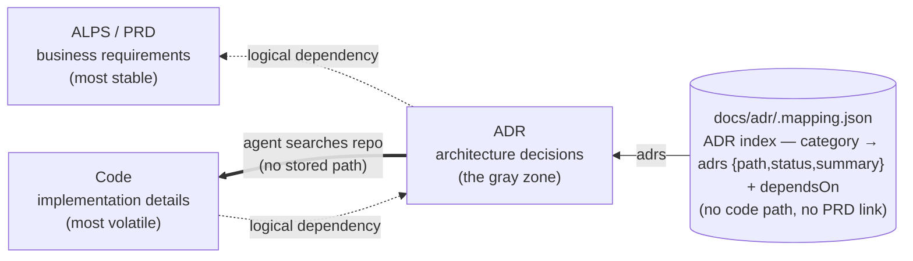

# Dependency model — PRD → ADR → code

ALPS (PRD), ADRs, and code form a one-way dependency chain. Each layer depends on the layer above it **logically**, but **never references it physically**.

The dotted arrows are **logical**. `.mapping.json` (the solid arrows) records the ADR index (category → ADRs) plus `dependsOn`, and stores neither code paths nor a PRD reference. The ADR → code link is **not stored anywhere** — an agent finds the code an ADR governs by reading the ADR and searching the repo (the double arrow). This is deliberate: a large refactor would otherwise force you to chase stored code paths through every ADR, dragging the stable layer behind the volatile one.

- **Logical dependency (dotted arrows)**: code is written to satisfy ADRs; ADRs are written to satisfy the PRD. When an inner layer changes, outer layers follow — a PRD change propagates to ADRs and code; an ADR decision change propagates to code. The reverse never happens — if a code refactor forces an ADR rewrite, the ADR was carrying implementation detail it shouldn't have; if an ADR edit forces a PRD rewrite, the ADR was holding a PRD reference it shouldn't have.
- **No physical references in any direction** — not just ADR↔code, but ADR↔PRD too:
  - **ADR → code**: ADR bodies don't reference files / functions / line numbers — at most a folder when unavoidable (see [Code reference depth — folders only](../plugins/adr-writer/templates/adr/authoring-rules.md#code-references--folder-level-only)), and the mapping stores no code paths at all. The code an ADR governs is located by reading the ADR and searching the repo, so a rename or refactor never forces an ADR or mapping edit.
  - **Code → ADR**: code does not embed ADR IDs or paths in comments, constants, or imports. ADR numbers move (split, rollup, supersede); if those IDs are baked into code, restructuring ADRs forces matching code edits even when the decision is unchanged. When the **decision itself** changes, code changes — that's the entire point of the dependency.
  - **ADR → PRD**: ADR bodies (Context and Related included) do **not** embed ALPS paths, section numbers, or feature-ids, and never copy user stories or acceptance criteria. An ADR _absorbs_ the PRD's motivation but does not _point at_ it — when a PRD feature is split / renumbered / restructured, a physical reference would force ADR edits even though the decision is unchanged.
  - **PRD → ADR**: the ALPS document never names specific ADR IDs or paths. It is the most stable contract and is unaware of its downstream artifacts.
- **Linking lives in an external mapping layer**: `docs/adr/.mapping.json` is the single ADR index (categories → `adrs` with path/status/summary) plus `dependsOn`; it stores no code paths and no PRD reference. It deliberately does **not** store code paths — the ADR ↔ code link is resolved on demand by searching the repo. The PRD and ADR bodies stay clean; ADR restructures (split / rollup / supersede) are absorbed by the mapping file, and code refactors touch neither the mapping nor the ADRs.

**Stability gradient as the litmus test**: change frequency must slope one way — `Code >> ADR >> PRD`. If a change in the volatile layer drags the stable layer with it, an arrow is drawn the wrong way and something needs to be pushed back to its proper layer. "Code is source of truth" therefore applies only to **implementation facts** (API shapes, field names, Status) — the **gray-zone decisions** (rationale, domain rules, state transitions, fallbacks) remain the ADR's authority, and code that contradicts them is a decision change to record in the ADR, not a fact to copy back from code.

This split is mirrored in the packaging: **alps-writer** owns the PRD layer, **adr-writer** owns the ADR layer as a standalone plugin, and the `.mapping.json` — the ADR index owned by the user's repo, holding no PRD link — lives in the user's own `docs/adr/`, never inside either plugin.
