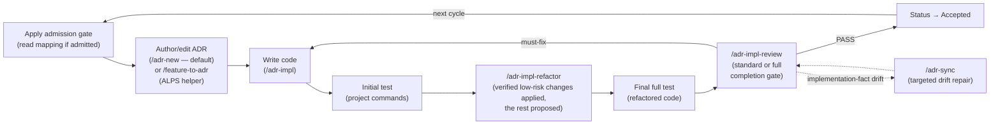
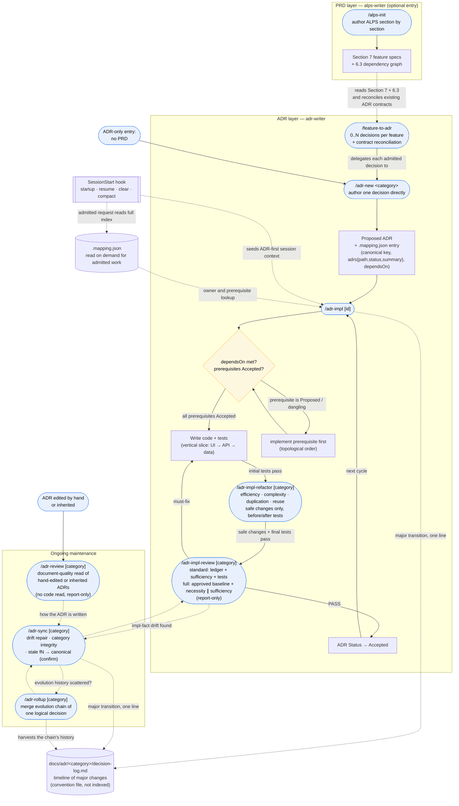

# Usage guide

This guide covers the full development cycle, the two entry flows (PRD-first and ADR-only), the shared skills, the ADR-first hook, and the mapping file. Invoke a skill as `$skill-name` in Codex or `/skill-name` in Claude Code.

For installation see the [README Quick Start](../README.md#quick-start). For the MCP server in other MCP clients see [MCP server](./mcp-server.md). For the same lifecycle, critical command paths, routing, and efficiency review as diagrams, see [ADR process overview](./adr-process.md).

## Development cycle



ADRs are the primary artifact the adr-writer plugin manages. The default authoring path is `/adr-new <category>` — write the decision directly, with or without an ALPS PRD. `/feature-to-adr` discovers zero, one, or several admitted decisions per Section 7 feature, reconciles existing contracts, and delegates each new decision to `/adr-new`.

The default for the same logical decision is edit-in-place plus a decision-log entry for a major transition. Add a new ADR when the topic is a distinct durable decision or the old decision must remain separately referenceable. Use `/adr-rollup` only when one logical decision's evolution history was already scattered across several ADRs.

## End-to-end flow — from ALPS to ADR management

The loop above is the steady-state summary. The full picture — from an ALPS PRD through decision discovery and reconciliation, dependency-gated implementation, and ongoing maintenance — is below.



**How to read it:**

- **Two entry points.** PRD-first starts at `/alps-init` and crosses into the ADR layer via `/feature-to-adr` (the only place `alps-writer` hands off to `adr-writer` — a one-way dependency; `adr-writer` never reads ALPS back). ADR-only skips the PRD box entirely and starts at `/adr-new`.
- **`/feature-to-adr` owns the controlled handoff.** It reads Section 7, NFRs, architecture constraints, and the feature dependency graph; discovers `0..N` durable decisions per feature; and delegates each admitted decision to `/adr-new`. Re-running it compares current PRD contracts with existing ADRs and reports intended-change candidates. Feature implementation dependencies become ADR `dependsOn` edges only when an actual ADR decision depends on another actual ADR decision.
- **The gate is mandatory.** `/adr-impl` never skips straight to coding — it reads `dependsOn`, walks prerequisites transitively, and refuses to build on a `Proposed` or dangling prerequisite until you implement it first (in topological order). Status flips to `Accepted` only after tests and final review pass — it records a fact, not an intent.
- **Stacked PR is a requested delivery fallback, not a new specification layer.** When the user asks to lower review load but splitting the Feature or ADR would break its semantic boundary, `/adr-impl` can keep the same approved ADR and offer dependency-ordered PR layers with one review question each. It never derives or publishes a Stack from the score alone, and no Stack state is stored in ALPS, ADRs, or `.mapping.json`.
- **Verified refactoring happens before completion.** After the initial implementation tests pass, `/adr-impl` invokes `/adr-impl-refactor`. Its independent read-only reviewer checks concrete execution efficiency, complexity, coupling, duplication, and reuse already justified by current same-semantics code. The main session applies only high-confidence local behavior-preserving candidates with before/after tests and leaves wider opportunities as proposals. If no isolated reviewer exists, all findings are proposal-only; if no code changed, the passing targeted baseline is reused.
- **The final review is risk-based, report-only, and completion-gating.** Localized changes that touch no protected surface use `standard`: decision ledger, isolated sufficiency review, and targeted tests. Requirement, public contract, schema, state, permission, security, fallback, concurrency, transaction, error-semantic, or broad changes use `full`: the implementation-before-approved baseline plus independent necessity and sufficiency reviews and the detailed repair artifact. Intent and regeneration completeness are approved before implementation, so neither mode repeats a routine human gate afterward. Unclear cases use `full`.
- **Maintenance is a separate, repeating phase.** `/adr-sync` reconciles ADRs with shipping code, repairs drift, checks category/`dependsOn` integrity, and proposes canonicalizing any legacy `fN` naming (applied only after you confirm). `/adr-rollup` is reached from sync only when one decision's evolution history is scattered across several ADRs. `/adr-review` sits alongside them on a different axis: it reads ADRs **as documents** against the authoring rules and never opens the code, so it is entered from a hand-edited or inherited ADR rather than from an implementation.
- **Evolution history lives in the decision log, not in the ADR body.** An ADR body describes the current state, so when the same decision evolves the default is to overwrite it in place — and if the transition is major (replacing the adopted alternative, changing the core algorithm or architecture, inverting a Driver), one line goes newest-first into the per-category `docs/adr/<category>/decision-log.md`. `/adr-impl` and `/adr-sync` write those lines; `/adr-rollup` harvests a scattered chain's history into the log and leaves one current-state ADR. The log is a **convention file** — it is not registered in `.mapping.json`, and the harness checks only that its ADR pointer still resolves on disk (a rollup renumber can orphan it and no other oracle sees it). Three layers preserve different things: ADR body = current state, `decision-log.md` = timeline of major changes, Git = the verbatim diff.
- **The hook runs underneath all of it.** `SessionStart` injects a compact ADR admission directive on startup, resume, clear, and compaction recovery. This preserves the cycle across replaced context without running on every user message. Only an admitted request reads the full mapping and plausible ADR bodies before code changes.

## Walkthroughs

### A. PRD-first — start from an ALPS spec (both plugins)

1. `/alps-init` → use atomic confirmation by default, or explicitly opt into batch confirmation for complete structured input. Batch items remain separate save units.
2. After Section 7, run `/feature-to-adr` → it discovers `0..N` decisions per feature, creates only admitted ADRs, and reports feature-only dependencies without placeholder ADRs.
3. `/adr-impl <category>` → implement an accepted-in-spirit ADR in code + tests.
4. `/adr-impl-refactor <category>` runs automatically inside implementation → apply only independently reviewed, verified local behavior-preserving improvements and keep the rest as proposals.
5. `/adr-impl-review <category>` selects `standard` or `full` from the protected surfaces changed. `PASS` promotes the ADR to `Accepted`; other verdicts keep it `Proposed`.
6. Run `/adr-sync` only when review finds implementation-fact drift, after broad refactors or manual ADR edits, or as a periodic audit.

Re-run `/feature-to-adr` when the PRD changes. It does not overwrite ADRs automatically: it compares the current contract, reports differences, and routes a confirmed change through the ADR-first implementation path. ADRs remain authoritative for code.

### B. ADR-only — no PRD (adr-writer standalone)

1. `/adr-new <category>` → apply the ADR admission gate, then describe a durable requirement or architectural decision directly. Replaceable libraries, SDKs, frameworks, and credential/auth wiring stay in code. No ALPS document required.
2. `/adr-impl <category>` → build it in code, run the automatic verified refactor pass and tests, then invoke the report-only adversarial review as the completion gate.
3. A passing `/adr-impl-review` promotes the ADR to `Accepted`; a must-fix verdict leaves it `Proposed`.
4. As you keep working, the ADR-first hook restores the compact admission gate when session context starts or is replaced. An admitted request reads the full ADR map before code changes. Run `/adr-sync` when drift evidence or periodic maintenance calls for it.

**Apply the ADR admission gate before the cycle.** A pure refactor is exempt, as are replaceable implementation changes such as swapping a library, SDK, framework, credential provider chain, signer, or adapter while preserving the same contracts and boundaries. A bug fix is exempt when it restores already intended behavior. A change to a requirement value, allowed state, transition, permission, key design, provider/model boundary, adopted algorithm, security trust boundary, or external-dependency fallback enters the cycle and updates the relevant ADR first.

### C. Inherited or hand-edited ADRs — review them as documents

Run `/adr-review [category]` when an ADR set arrives without the context of whoever wrote it: a repo you inherited, an ADR edited by hand, or one changed by another session. It reads the ADRs against the authoring rules (abstraction level, requirement preservation, alternatives) without opening the code and reports a punch list — it never edits the ADRs, the mapping, or code. It is deliberately **not** run right after `/adr-new`, which judges its own draft against the same rules.

In all flows the hook runs automatically once adr-writer is installed. Session startup, resume, clear, and compaction recovery inject the compact admission directive; admitted work reads the ADR map on demand.

## Slash commands

### alps-writer

| Command                | Role                                                                                                       |
| ---------------------- | ---------------------------------------------------------------------------------------------------------- |
| `/alps-init`           | Author or resume ALPS with atomic confirmation by default and explicit batch confirmation when appropriate |
| `/feature-to-adr [id]` | Discover `0..N` ADR decisions per feature, reconcile contracts, and delegate admitted new decisions        |

### adr-writer

| Command                                               | Role                                                                                                                                                                                                                                                       |
| ----------------------------------------------------- | ---------------------------------------------------------------------------------------------------------------------------------------------------------------------------------------------------------------------------------------------------------- |
| `/adr-new <category>`                                 | Apply the admission gate and author a durable decision directly; implementation-only choices create no ADR                                                                                                                                                 |
| `/adr-impl [category]`                                | Implement an ADR in code (including tests). On request, use Stacked PR delivery when semantic Feature/ADR splitting is inappropriate. With no argument, lists Proposed ADRs and asks which to build                                                        |
| `/adr-impl-refactor [category]`                       | Review concrete efficiency and proportionate reuse, apply only high-confidence local behavior-preserving refactors with before/after tests, and leave wider or weakly verified opportunities as proposals                                                  |
| `/adr-impl-review [category] [--mode standard\|full]` | Run the risk-selected completion review against the pre-approved ADR baseline; both modes show concise, read-only notable implementation choices, while full mode adds necessity review and only the diagrams or repair guidance justified by the evidence |
| `/adr-review [category]`                              | Review **hand-edited or inherited** ADRs as documents against the authoring rules — no code read, report-only. No arg → every ADR. Not run after `/adr-new`, which judges its own draft against the same rules                                             |
| `/adr-sync [category] [--quick]`                      | Detect/repair drift between code and ADR, and absorb new learnings                                                                                                                                                                                         |
| `/adr-rollup [category]`                              | Consolidate only ADR groups whose evolution history of one logical decision is split (no arg → all)                                                                                                                                                        |

## Hook behavior

One hook supports the main Claude Code session — **with no external LLM calls**; the main model classifies text and makes decisions itself.

| Hook           | When it fires                          | Role                                                                                                                                          |
| -------------- | -------------------------------------- | --------------------------------------------------------------------------------------------------------------------------------------------- |
| `SessionStart` | Startup, resume, clear, and compaction | Inject a compact ADR admission directive without mapping contents; admitted work reads `docs/adr/.mapping.json` on demand before code changes |

The directive tells the model to apply the ADR admission gate first. Only changes to durable requirements, boundaries, provider/model choices, key designs, algorithms, trust policies, or fallbacks read the full mapping and plausible ADR bodies before code; replaceable implementation means remain code-level. Classification is left to the main model — the hook never blocks an edit.

Claude Code auto-discovers the hook file and Codex registers it once in its own manifest. Both clients expose only `SessionStart`; there is no per-prompt `UserPromptSubmit` hook.

## Deterministic self-test

Three dependency-free scripts verify the cycle's artifacts without an LLM judgment call. Two cover ADR well-formedness; `adr-impl-review-validate.mjs` validates the decision ledger, concise notable implementation choices, the common review report, and any evidence-required repair guidance. Full mode may generate an interactive HTML report for findings; implementation choices remain read-only context. Claude Code uses named reviewer definitions when available; Codex loads the same definitions into generic subagents. On Amazon Bedrock, review skills treat subagents as unavailable, do not retry the known input validation error, continue document/implementation review as main-session passes, and keep refactoring proposal-only.

**A fresh draft is not reviewed twice.** `/adr-new` authors under the same rules the reviewer applies (R1-R20), so it self-checks at its step 6 and saves rather than spawning a reviewer — a review one turn after being handed the rules re-derives a judgment just made, and its punch list is mostly items the author already got right. `/adr-review` is the independent read, and it exists because that authoring context does not survive the session: an ADR **edited by hand or by another session** has nobody who knows what its author was told. Run it on request, on an inherited ADR set, or after hand-editing — not automatically after `/adr-new`.

```bash
node <adr-writer-plugin>/scripts/adr-structure-lint.mjs [category]   # structure + invariants
```

That one command covers both ADR-well-formedness scripts, since the lint invokes the oracle and folds its exit code in. See the full per-script check list in the [adr-writer README](../plugins/adr-writer/README.md#deterministic-self-test-harness).

## ADR index (.mapping.json)

`docs/adr/.mapping.json` is the single ADR index (categories → `adrs` objects `{path, status, summary}`) plus decision-level `dependsOn`. It stores no code paths, Feature IDs, or PRD references. `/feature-to-adr` writes an edge only when one admitted ADR decision actually requires another; feature-only ordering remains implementation guidance.
