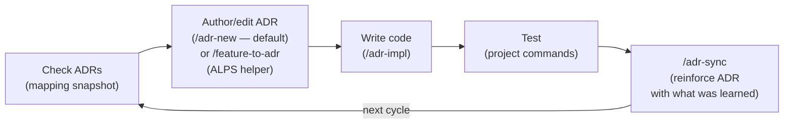
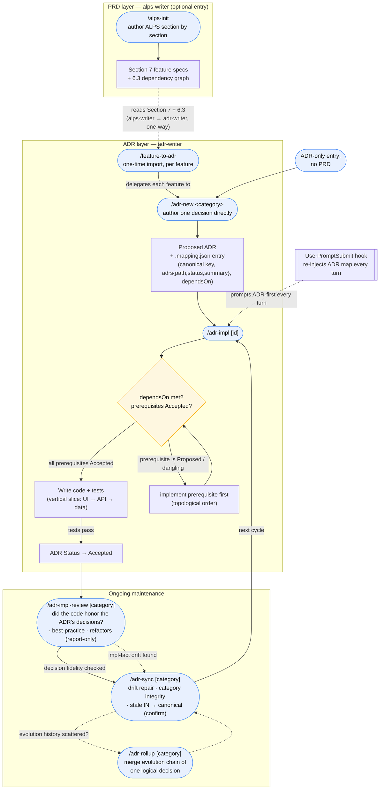

# Usage guide

This guide covers the full development cycle, the two entry flows (PRD-first and ADR-only), the shared skills, the ADR-first hook, and the mapping file. Invoke a skill as `$skill-name` in Codex or `/skill-name` in Claude Code.

For installation see the [README Quick Start](../README.md#quick-start). For the MCP server in other MCP clients see [MCP server](./mcp-server.md).

## Development cycle



ADRs are the primary artifact the adr-writer plugin manages. The default authoring path is `/adr-new <category>` — write the decision directly, with or without an ALPS PRD. `/feature-to-adr` (alps-writer) is a bridge layered on top: when you already have an ALPS Section 7 feature, it imports each feature into a Proposed ADR by delegating to `/adr-new`.

The goal is for ADRs to evolve alongside the code each cycle. Adding a new ADR when a decision changes is normal, and having multiple ADRs in the same category is normal too. Only when **the evolution history of a single logical decision** is scattered across several ADRs do you use `/adr-rollup` to consolidate that group into a single "current state" ADR.

## End-to-end flow — from ALPS to ADR management

The loop above is the steady-state summary. The full picture — from an ALPS PRD through the one-time import, the dependency-gated implementation, and the ongoing maintenance commands — is below. Rounded nodes are commands; the diamond is the `/adr-impl` prerequisite gate; the dashed box groups the ongoing maintenance commands that run repeatedly after the first build.



**How to read it:**

- **Two entry points.** PRD-first starts at `/alps-init` and crosses into the ADR layer via `/feature-to-adr` (the only place `alps-writer` hands off to `adr-writer` — a one-way dependency; `adr-writer` never reads ALPS back). ADR-only skips the PRD box entirely and starts at `/adr-new`.
- **`/feature-to-adr` is a thin importer.** It reads Section 7 features and the 6.3 dependency graph, derives a canonical category key from each feature _name_ (the Feature ID is not stored — adr-writer keeps no PRD reference; the key is name-derived and `/adr-impl` resolves by key), and delegates the actual authoring to `/adr-new`. It runs once per feature; later PRD changes are absorbed by editing the ADR, not re-importing.
- **The gate is mandatory.** `/adr-impl` never skips straight to coding — it reads `dependsOn`, walks prerequisites transitively, and refuses to build on a `Proposed` or dangling prerequisite until you implement it first (in topological order). Status flips to `Accepted` only after tests pass — it records a fact, not an intent.
- **Post-implementation review runs the opposite way.** Right after `/adr-impl`, `/adr-impl-review` treats the **ADR as the spec** and checks whether the code honored its decisions (report-only — it edits neither code nor ADR). `/adr-sync` treats the **code as authoritative** and repairs impl-fact drift in the ADR. When the former finds an `[Impl-fact mismatch]` (a fact where code is authoritative), it routes to the latter.
- **Maintenance is a separate, repeating phase.** `/adr-sync` reconciles ADRs with shipping code, repairs drift, checks category/`dependsOn` integrity, and proposes canonicalizing any legacy `fN` naming (applied only after you confirm). `/adr-rollup` is reached from sync only when one decision's evolution history is scattered across several ADRs.
- **The hook runs underneath all of it.** Every user turn, `UserPromptSubmit` re-injects the mapping snapshot and the ADR-first directive so the agent checks ADRs before changing behavior — this is what keeps the cycle intact across a long, compacted session.

## Walkthroughs

### A. PRD-first — start from an ALPS spec (both plugins)

1. `/alps-init` → answer the focused questions section by section; the agent saves each only after you confirm.
2. After Section 7 (feature specs), run `/feature-to-adr` → it walks each feature and hands it to `/adr-new`, producing a `Proposed` ADR per feature under `docs/adr/<category>/` and seeding `docs/adr/.mapping.json`.
3. `/adr-impl <id>` → implement an accepted-in-spirit ADR in code + tests. On success it flips the ADR to `Accepted`.
4. `/adr-sync` at the end of a cycle → fold what you learned back into the ADRs and repair any drift.

`/feature-to-adr` is a **one-time import**: it converts each Section 7 feature into an ADR once. After that the decision is managed at the ADR level — if the PRD later changes, edit the affected ADR directly (or supersede it with a new one) rather than re-importing.

### B. ADR-only — no PRD (adr-writer standalone)

1. `/adr-new <category>` → describe the decision directly (refactor, infra choice, new feature direction). No ALPS document required.
2. `/adr-impl <id>` → build it in code.
3. As you keep working, the ADR-first hook re-injects the ADR map every turn so the agent checks ADRs before changing behavior. Run `/adr-sync` to reconcile ADRs with shipping code.

In both flows the hook runs automatically once adr-writer is installed — every user turn re-injects the ADR map and the ADR-first directive.

## Slash commands

### alps-writer

| Command                | Role                                                                                                             |
| ---------------------- | ---------------------------------------------------------------------------------------------------------------- |
| `/alps-init`           | Author a new ALPS document (or resume an existing one)                                                           |
| `/feature-to-adr [id]` | _Bridge_: import an ALPS Section 7 feature into a Proposed ADR by delegating to `/adr-new` (requires adr-writer) |

### adr-writer

| Command                          | Role                                                                                                              |
| -------------------------------- | ----------------------------------------------------------------------------------------------------------------- |
| `/adr-new <category>`            | Author a new ADR directly — the default path, no ALPS PRD required                                                |
| `/adr-impl [id]`                 | Implement an ADR in code (including tests). With no `id`, lists Proposed ADRs and asks which to build             |
| `/adr-impl-review [id]`          | Review just-implemented code against its ADR — decision fidelity, best-practice patterns, refactors (report-only) |
| `/adr-sync [category] [--quick]` | Detect/repair drift between code and ADR, and absorb new learnings                                                |
| `/adr-rollup [category]`         | Consolidate only ADR groups whose evolution history of one logical decision is split (no arg → all)               |

## Hook behavior

One hook supports the main Claude Code session — **with no external LLM calls**; the main model classifies text and makes decisions itself.

| Hook               | When it fires      | Role                                                                                                                                                  |
| ------------------ | ------------------ | ----------------------------------------------------------------------------------------------------------------------------------------------------- |
| `UserPromptSubmit` | Every user message | Inject the ADR-first directive + `docs/adr/.mapping.json` snapshot every turn (survives session compaction, unlike a one-shot SessionStart injection) |

The directive tells the model: when a request adds or changes behavior, read the relevant ADRs (or author one with `/adr-new`) before touching code. Classification is left to the main model — the hook never blocks an edit; keeping the PRD → ADR → code flow intact is the model's job, prompted every turn.

## Deterministic self-test

Two dependency-free scripts under the adr-writer plugin verify ADR well-formedness without an LLM judgment call, so the reviewer subagent only spends tokens on judgment rules. Claude Code uses the named reviewer definitions when available; Codex loads the same definition into a generic read-only subagent because Codex plugin manifests do not package `agents/*.md` as named components. The skills invoke the scripts at their verification steps: `/adr-new` before the reviewer, `/adr-impl` after Status promotion, `/adr-sync` at the start of deep verification.

```bash
node <adr-writer-plugin>/scripts/adr-structure-lint.mjs [category]   # structure + invariants
```

`adr-structure-lint.mjs` checks per-ADR structure + mapping↔disk and status↔body consistency and folds in `adr-invariants.sh` (the repo-wide reverse-reference oracle). See the full per-script check list in the [adr-writer README](../plugins/adr-writer/README.md#deterministic-self-test-harness).

## ADR index (.mapping.json)

`docs/adr/.mapping.json` is the single ADR index (categories → `adrs` objects `{path, status, summary}`) plus `dependsOn` — it stores no code paths and no PRD reference, and no artifact references another in its own body. It is what the hook renders every turn, so the README keeps no separate ADR list. See the schema at [`plugins/adr-writer/templates/adr/mapping.schema.json`](../plugins/adr-writer/templates/adr/mapping.schema.json). `/adr-new` creates the category entry (`feature`, `adrs` with path + status + summary); `/feature-to-adr` additionally backfills only `dependsOn` (from ALPS 6.3). The code an ADR governs is found by reading the ADR and searching the repo, not stored here.
