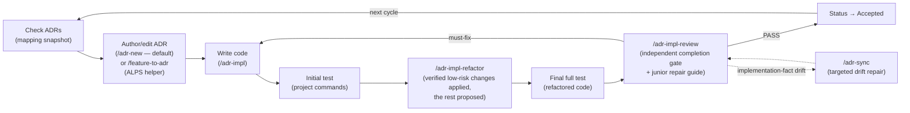
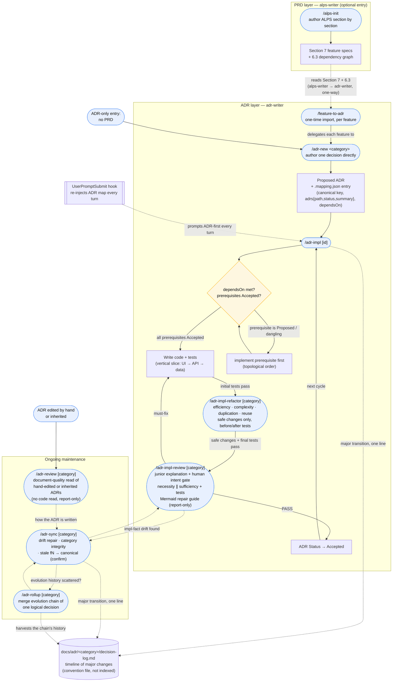

# Usage guide

This guide covers the full development cycle, the two entry flows (PRD-first and ADR-only), the shared skills, the ADR-first hook, and the mapping file. Invoke a skill as `$skill-name` in Codex or `/skill-name` in Claude Code.

For installation see the [README Quick Start](../README.md#quick-start). For the MCP server in other MCP clients see [MCP server](./mcp-server.md). For the same cycle drawn as eight diagrams — one per command's internals — see [ADR process overview](./adr-process.md).

## Development cycle



ADRs are the primary artifact the adr-writer plugin manages. The default authoring path is `/adr-new <category>` — write the decision directly, with or without an ALPS PRD. `/feature-to-adr` (alps-writer) is a bridge layered on top: when you already have an ALPS Section 7 feature, it imports each feature into a Proposed ADR by delegating to `/adr-new`.

The goal is for ADRs to evolve alongside the code each cycle. Adding a new ADR when a decision changes is normal, and having multiple ADRs in the same category is normal too. Only when **the evolution history of a single logical decision** is scattered across several ADRs do you use `/adr-rollup` to consolidate that group into a single "current state" ADR.

## End-to-end flow — from ALPS to ADR management

The loop above is the steady-state summary. The full picture — from an ALPS PRD through the one-time import, the dependency-gated implementation, and the ongoing maintenance commands — is below. Rounded nodes are commands; the diamond is the `/adr-impl` prerequisite gate; the dashed box groups the ongoing maintenance commands that run repeatedly after the first build.



**How to read it:**

- **Two entry points.** PRD-first starts at `/alps-init` and crosses into the ADR layer via `/feature-to-adr` (the only place `alps-writer` hands off to `adr-writer` — a one-way dependency; `adr-writer` never reads ALPS back). ADR-only skips the PRD box entirely and starts at `/adr-new`.
- **`/feature-to-adr` is a thin importer.** It reads Section 7 features and the 6.3 dependency graph, derives a canonical category key from each feature _name_ (the Feature ID is not stored — adr-writer keeps no PRD reference; the key is name-derived and `/adr-impl` resolves by key), and delegates the actual authoring to `/adr-new`. An argument-scoped run expands to any not-yet-converted prerequisites so it never stores a dangling `dependsOn`. It runs once per feature; later PRD changes are absorbed by editing the ADR, not re-importing.
- **The gate is mandatory.** `/adr-impl` never skips straight to coding — it reads `dependsOn`, walks prerequisites transitively, and refuses to build on a `Proposed` or dangling prerequisite until you implement it first (in topological order). Status flips to `Accepted` only after tests and final review pass — it records a fact, not an intent.
- **Verified refactoring happens before completion.** After the initial implementation tests pass, `/adr-impl` invokes `/adr-impl-refactor`. Its independent read-only reviewer checks concrete execution efficiency, complexity, coupling, duplication, and reuse already justified by current same-semantics code. The main session applies only high-confidence local behavior-preserving candidates with before/after tests and leaves wider opportunities as proposals. If no isolated reviewer exists, all findings are proposal-only; if no code changed, the passing targeted baseline is reused.
- **The final review is adversarial, report-only, and completion-gating.** Before Status promotion, `/adr-impl-review` explains the actual diff for a junior and pauses for human intent confirmation. It then runs isolated necessity and sufficiency reviewers in parallel. Only `PASS` permits `Accepted`; other verdicts keep the implementation `Proposed` until fixes and review rerun. `/adr-sync` remains the targeted route for `[Impl-fact mismatch]`, broad refactors/manual ADR edits, and periodic audits rather than a mandatory deep scan after every change.
- **Maintenance is a separate, repeating phase.** `/adr-sync` reconciles ADRs with shipping code, repairs drift, checks category/`dependsOn` integrity, and proposes canonicalizing any legacy `fN` naming (applied only after you confirm). `/adr-rollup` is reached from sync only when one decision's evolution history is scattered across several ADRs. `/adr-review` sits alongside them on a different axis: it reads ADRs **as documents** against the authoring rules and never opens the code, so it is entered from a hand-edited or inherited ADR rather than from an implementation.
- **Evolution history lives in the decision log, not in the ADR body.** An ADR body describes the current state, so when the same decision evolves the default is to overwrite it in place — and if the transition is major (replacing the adopted alternative, changing the core algorithm or architecture, inverting a Driver), one line goes newest-first into the per-category `docs/adr/<category>/decision-log.md`. `/adr-impl` and `/adr-sync` write those lines; `/adr-rollup` harvests a scattered chain's history into the log and leaves one current-state ADR. The log is a **convention file** — it is not registered in `.mapping.json`, and the harness checks only that its ADR pointer still resolves on disk (a rollup renumber can orphan it and no other oracle sees it). Three layers preserve different things: ADR body = current state, `decision-log.md` = timeline of major changes, Git = the verbatim diff.
- **The hook runs underneath all of it.** Every user turn, `UserPromptSubmit` re-injects the mapping snapshot and the ADR-first directive so the agent checks ADRs before changing behavior — this is what keeps the cycle intact across a long, compacted session.

## Walkthroughs

### A. PRD-first — start from an ALPS spec (both plugins)

1. `/alps-init` → answer the focused questions section by section; the agent saves each only after you confirm.
2. After Section 7 (feature specs), run `/feature-to-adr` → it walks each feature and hands it to `/adr-new`, producing a `Proposed` ADR per feature under `docs/adr/<category>/` and seeding `docs/adr/.mapping.json`.
3. `/adr-impl <category>` → implement an accepted-in-spirit ADR in code + tests.
4. `/adr-impl-refactor <category>` runs automatically inside implementation → apply only independently reviewed, verified local behavior-preserving improvements and keep the rest as proposals.
5. `/adr-impl-review <category>` runs as the completion gate → confirm the junior-readable explanation and review necessity and sufficiency independently. `PASS` promotes the ADR to `Accepted`; other verdicts keep it `Proposed`.
6. Run `/adr-sync` only when review finds implementation-fact drift, after broad refactors or manual ADR edits, or as a periodic audit.

`/feature-to-adr` is a **one-time import**: it converts each Section 7 feature into an ADR once. After that the decision is managed at the ADR level — if the PRD later changes, edit the affected ADR directly (or supersede it with a new one) rather than re-importing.

### B. ADR-only — no PRD (adr-writer standalone)

1. `/adr-new <category>` → apply the ADR admission gate, then describe a durable requirement or architectural decision directly. Replaceable libraries, SDKs, frameworks, and credential/auth wiring stay in code. No ALPS document required.
2. `/adr-impl <category>` → build it in code, run the automatic verified refactor pass and tests, then invoke the report-only adversarial review as the completion gate.
3. A passing `/adr-impl-review` promotes the ADR to `Accepted`; a must-fix verdict leaves it `Proposed`.
4. As you keep working, the ADR-first hook re-injects the ADR map every turn. Run `/adr-sync` when drift evidence or periodic maintenance calls for it.

**Apply the ADR admission gate before the cycle.** A pure refactor is exempt, as are replaceable implementation changes such as swapping a library, SDK, framework, credential provider chain, signer, or adapter while preserving the same contracts and boundaries. A bug fix is exempt when it restores already intended behavior. A change to a requirement value, allowed state, transition, permission, key design, provider/model boundary, adopted algorithm, security trust boundary, or external-dependency fallback enters the cycle and updates the relevant ADR first.

### C. Inherited or hand-edited ADRs — review them as documents

Run `/adr-review [category]` when an ADR set arrives without the context of whoever wrote it: a repo you inherited, an ADR edited by hand, or one changed by another session. It reads the ADRs against the authoring rules (abstraction level, requirement preservation, alternatives) without opening the code and reports a punch list — it never edits the ADRs, the mapping, or code. It is deliberately **not** run right after `/adr-new`, which judges its own draft against the same rules.

In all flows the hook runs automatically once adr-writer is installed — every user turn re-injects the ADR map and the ADR-first directive.

## Slash commands

### alps-writer

| Command                | Role                                                                                                             |
| ---------------------- | ---------------------------------------------------------------------------------------------------------------- |
| `/alps-init`           | Author a new ALPS document (or resume an existing one)                                                           |
| `/feature-to-adr [id]` | _Bridge_: import an ALPS Section 7 feature into a Proposed ADR by delegating to `/adr-new` (requires adr-writer) |

### adr-writer

| Command                          | Role                                                                                                                                                                                                           |
| -------------------------------- | -------------------------------------------------------------------------------------------------------------------------------------------------------------------------------------------------------------- |
| `/adr-new <category>`            | Apply the admission gate and author a durable decision directly; implementation-only choices create no ADR                                                                                                     |
| `/adr-impl [category]`           | Implement an ADR in code (including tests). With no argument, lists Proposed ADRs and asks which to build                                                                                                      |
| `/adr-impl-refactor [category]`  | Review concrete efficiency and proportionate reuse, apply only high-confidence local behavior-preserving refactors with before/after tests, and leave wider or weakly verified opportunities as proposals      |
| `/adr-impl-review [category]`    | Explain the diff, confirm intent, run independent necessity/sufficiency reviews and tests, and emit a Mermaid-rich junior repair guide (report-only)                                                           |
| `/adr-review [category]`         | Review **hand-edited or inherited** ADRs as documents against the authoring rules — no code read, report-only. No arg → every ADR. Not run after `/adr-new`, which judges its own draft against the same rules |
| `/adr-sync [category] [--quick]` | Detect/repair drift between code and ADR, and absorb new learnings                                                                                                                                             |
| `/adr-rollup [category]`         | Consolidate only ADR groups whose evolution history of one logical decision is split (no arg → all)                                                                                                            |

## Hook behavior

One hook supports the main Claude Code session — **with no external LLM calls**; the main model classifies text and makes decisions itself.

| Hook               | When it fires      | Role                                                                                                                                                  |
| ------------------ | ------------------ | ----------------------------------------------------------------------------------------------------------------------------------------------------- |
| `UserPromptSubmit` | Every user message | Inject the ADR-first directive + `docs/adr/.mapping.json` snapshot every turn (survives session compaction, unlike a one-shot SessionStart injection) |

The directive tells the model to apply the ADR admission gate first. Only changes to durable requirements, boundaries, provider/model choices, key designs, algorithms, trust policies, or fallbacks read or author an ADR before code; replaceable implementation means remain code-level. Classification is left to the main model — the hook never blocks an edit.

## Deterministic self-test

Three dependency-free scripts under the adr-writer plugin verify the cycle's artifacts without an LLM judgment call, so reviewer subagents only spend tokens on judgment rules. Two cover ADR well-formedness — `adr-invariants.sh` (the repo-wide reverse-reference oracle) and `adr-structure-lint.mjs` (per-ADR body + mapping + disk state, which folds the oracle in) — and the third, `adr-impl-review-validate.mjs`, gates `/adr-impl-review`'s own artifacts before its HTML report can be generated. Claude Code uses named reviewer definitions when available; Codex loads the matching definitions into generic subagents because Codex plugin manifests do not package `agents/*.md` as named components. The skills invoke the scripts at their verification steps: `/adr-new` before its own R1-R20 pass, `/adr-impl` before the completion review and again after Status promotion, `/adr-review` once for the whole sweep, `/adr-sync` at the start of deep verification, and `/adr-impl-review` before it reports completion.

**A fresh draft is not reviewed twice.** `/adr-new` authors under the same rules the reviewer applies (R1-R20), so it self-checks at its step 6 and saves rather than spawning a reviewer — a review one turn after being handed the rules re-derives a judgment just made, and its punch list is mostly items the author already got right. `/adr-review` is the independent read, and it exists because that authoring context does not survive the session: an ADR **edited by hand or by another session** has nobody who knows what its author was told. Run it on request, on an inherited ADR set, or after hand-editing — not automatically after `/adr-new`.

```bash
node <adr-writer-plugin>/scripts/adr-structure-lint.mjs [category]   # structure + invariants
```

That one command covers both ADR-well-formedness scripts, since the lint invokes the oracle and folds its exit code in. See the full per-script check list in the [adr-writer README](../plugins/adr-writer/README.md#deterministic-self-test-harness).

## ADR index (.mapping.json)

`docs/adr/.mapping.json` is the single ADR index (categories → `adrs` objects `{path, status, summary}`) plus `dependsOn` — it stores no code paths and no PRD reference, and no artifact references another in its own body. It is what the hook renders every turn, so the README keeps no separate ADR list. See the schema at [`plugins/adr-writer/templates/adr/mapping.schema.json`](../plugins/adr-writer/templates/adr/mapping.schema.json). `/adr-new` creates the category entry (`feature`, `adrs` with path + status + summary); `/feature-to-adr` additionally backfills only `dependsOn` (from ALPS 6.3). The code an ADR governs is found by reading the ADR and searching the repo, not stored here.
