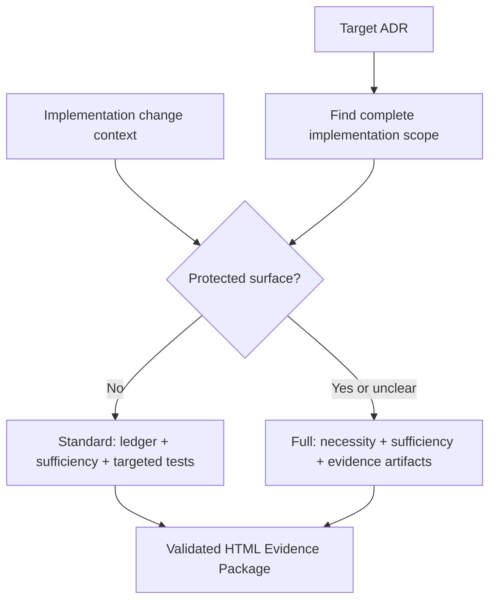

# adr-impl-review

Rather than approving the implementation outright, disprove it in the following order.



In full mode, the necessity and sufficiency perspectives are grounded separately and do not see each other's conclusions before synthesis (section 3). They may run in parallel or sequentially. Standard mode runs only the sufficiency perspective defined below. The user's intent and the ADR's regeneration checklist are settled before implementation; this command consumes that baseline and does not reopen it as a routine post-implementation gate.

This procedure is not a proof of mathematical necessity and sufficiency. It is **a disproof-based review that hunts for unnecessary changes and missing behavior from two different perspectives.** A passing test is only evidence that no counterexample was found among the cases actually executed — not a proof of completeness.

> **Language**: this skill and every other harness prompt are written in English. Write the human-facing review report in the language the user explicitly requests or currently uses. If the conversation does not establish a language, use the target ADR's dominant language. Keep stable artifact anchors and technical terms when translation would reduce precision. Any user-facing phrasing below is a guide, not a literal string.

Apply `${CLAUDE_PLUGIN_ROOT}/references/non-invasive-harness.md`: review mode,
required perspectives, evidence, and verdicts are contractual. Subagent count,
named/generic/main-session execution, parallelism, and model selection are chosen
by the current model.

The review has two independent outputs:

- **Implementation verdict** — whether the code and tests honor the ADR.
- **PR comprehension readiness** — whether the reader can explain the important
  behavior and causal path.

A `PASS` verdict never implies comprehension readiness. Do not open or send the
PR until the comprehension check is passed, but do not turn that check into an
ADR approval, Status transition, or code-correctness verdict.

## The abstraction ladder — which level owns each disagreement

Most findings in this review are a disagreement between the ADR and the code, and **every routing call below is really the question "which level owns this fact?"** So hold the principle (`authoring-rules.md` / `concepts.md` "The abstraction ladder") while reading the findings.

PRD, ADR, and code are the same system at three resolutions — like C4's context / container / component zoom — and each level exists to be **read alone**. The ADR's question is "why this decision, and what must the result honor?"; the code's is "how is it done?" That split decides every category:

| Disagreement                                          | Level that owns it          | Category                   | Route                                    |
| ----------------------------------------------------- | --------------------------- | -------------------------- | ---------------------------------------- |
| The ADR's contract is not honored in code             | ADR (the contract)          | `Spec violation`           | fix the code                             |
| Names, signatures, wire form, field names differ      | Code (implementation facts) | `Impl-fact mismatch`       | remove ADR detail via sync               |
| The code adds an ADR-worthy behavior no level decided | neither yet                 | `Undecided behavior`       | escalate only if contract choice remains |
| The code implemented a different coherent decision    | contested                   | `Decision changed in code` | escalate, then log it                    |

So the recurring judgment is **not "is the code good?" but "at which resolution does this belong?"** Two guards follow, and they are the same guards `/adr-new` writes under, seen from the other side:

- **Never absorb a contract violation as an implementation fact.** An allowed value set or transition rule differing is `Spec violation` (the ADR owns it); only the identifier name or representation is `Impl-fact mismatch`. Routing a set difference to `/adr-sync` silently rewrites the contract to match whatever the code did.
- **Never treat code that enforces a contract as removable.** Cap checks, transition guards, permission checks, and required-field validation are the code level's job of honoring the ADR level's contract, so "it passes without this" is not evidence.
- **Never promote implementation discretion into `Undecided behavior`.** Before raising extra code to the ADR, apply the ADR admission gate. Replaceable libraries, SDKs, frameworks, middleware, module layouts, credential provider chains, signers, authentication adapters, and tuning choices are expected code-level decisions when contracts and architecture/security boundaries stay unchanged. They are not findings merely because the ADR does not name them.
- **Do not hide material implementation discretion either.** The sufficiency pass records Notable implementation choices once from code outward. Keep only choices that affect runtime behavior, failure handling, operations, cost, or future maintenance, with the selected value or behavior, code evidence, why it fits the ADR intent, and why it matters. Explain intent fit only through the contract and boundaries the choice preserves; never invent historical rationale. Separately inspect externally checkable premises the choice relies on, such as provider guarantees, input provenance, ordering, uniqueness, trust boundaries, or platform behavior. Missing historical rationale or alternatives is not a risk by itself, but an unverified premise whose falsehood could violate safety or the ADR contract is an `Unverified risk`, not an ordinary implementation choice.

A note on scope: `/adr-impl-review` judges the **code** level against the ADR level. Whether the ADR itself is written at the right resolution is `/adr-review`'s question, and the implementation cycle confirms the decision and regeneration checklist before code begins. Never rewrite an ADR from inside this command to make a finding go away.

## Invariant principles

- **Report-only**: never auto-modify code, ADRs, or the mapping. Write only the Markdown/JSON/HTML review artifacts.
- **Independently grounded conclusions**: in full mode, necessity and sufficiency derive conclusions from the original ADR, complete implementation scope, separate change scope, code, tests, and approved baseline without reading each other's results before synthesis. In standard mode, preserve the same grounding for sufficiency. A fixed number or type of agent is not required.
- **The approved ADR is the behavioral spec**: right after implementation, the ADR's admitted decision and requirement contract are authoritative because the implementation cycle confirmed their intent and regeneration checklist before code began. Implementation facts such as API names and actual field names should not be in that spec; when they appear, separate them as `Impl-fact mismatch` and route them for removal. If review finds concrete evidence that the ADR baseline itself is incomplete or contradictory, return it as a blocking contract issue; do not perform a routine confirmation or silently fix the ADR inside impl-review.
- **Evidence over assertion**: every finding includes the applicable basis among an ADR quote, the actual diff or code location, and a reproduction procedure or execution result. Report a conjecture you could not reproduce only as `Unverified risk`. For an assumption risk, state the externally checkable premise, the contract or safety consequence if it is false, and the missing verification; never request or fabricate private chain-of-thought.
- **Escalation is exceptional**: ask for human judgment only when the approved contract must change, premises contradict, a material risk cannot be verified, or the repair would exceed the approved scope. Evidence-backed implementation and test defects are remediation work, not approval questions.

Before planning the review execution, read `${CLAUDE_PLUGIN_ROOT}/references/subagent-dispatch.md` completely. The role files under `${CLAUDE_PLUGIN_ROOT}/agents/` define reusable role contracts, not a mandatory topology. Choose the smallest available combination of named agents, generic read-only subagents, or main-session passes that preserves the selected mode's perspectives and evidence. Record an isolation limitation only when it materially affects confidence.

## 1. Fix the target, implementation scope, and change scope

ADR identification follows the same rules as `/adr-impl`.

- If it is a file path, use that ADR.
- If it is a category key, look it up in `docs/adr/.mapping.json`.
- With no argument, show the list of `Accepted` ADRs and take a selection.
- If it is a `Proposed` ADR invoked by `/adr-impl` after implementation, refactoring, and tests, treat it as the selected pre-promotion completion review and do not ask whether it is partial. For any other `Proposed` target, confirm once whether this is a partial-implementation review.

Determine the **change scope** by this priority:

1. A PR / commit range the user supplied, or `--base`.
2. The current staged + unstaged changes.
3. For a clean worktree, the merge-base diff between the current branch and the default branch.

The change scope explains before/after behavior and is the primary input to a
change-focused necessity pass. It is never the ceiling of the implementation review.

Independently build the **complete implementation scope** for the selected ADR:

1. Enumerate `D0` and every `R1..Rn` contract row from the ADR.
2. Extract domain terms, behaviors, states, boundaries, providers, and failure
   results from each row.
3. Search the repository from those terms, open the actual code, and trace
   direct and indirect callers and callees. Check differently named symbols,
   configuration, generated code, and surviving older paths where relevant.
4. Find every related ideal and edge-case test. Cross-check each contract row
   from decision to implementation and from implementation back to its entry
   points.
5. Record the confirmed production files, tests, and call paths as the
   implementation scope. A caller-provided file list is a starting floor, never
   a search limit.

Do not infer scope from the ADR category name or the current diff. If any
contract row or core call path cannot be fully narrowed, record the search
limit, mark the affected coverage `UNVERIFIED`, and return `INCONCLUSIVE` rather
than `PASS`.

If the change scope mixes several implementations and cannot be mapped onto the
ADR, do not guess about the necessity pass — get the base/range confirmed. The
complete implementation scope still comes from the ADR itself. After fixing
both scopes, prepare the following original material.

- The full ADR text and its entry in `.mapping.json`
- The complete implementation file/test inventory and confirmed direct and indirect call paths
- The raw diff and changed-file list as separate change context
- **The seeded rule docs the repo actually holds** — `docs/adr/concepts.md` (the abstraction ladder, the requirement gate, the source-of-truth split) and `docs/adr/authoring-rules.md`, falling back to `${CLAUDE_PLUGIN_ROOT}/templates/adr/`. These decide **which level owns a disagreement**, so a reviewer working from remembered defaults can route a contract violation as an implementation fact. A project may have hand-edited or pinned its copy, and if the stamp lags the installed plugin (`rules-doc-stale`) or `concepts.md` is missing because the repo predates the split (`rules-doc-layout-legacy`, in which case that material sits inside `README.md`), **say so in the final report's review limits** — the reviewers judged against those docs, so the reader needs to know which version.
- Whichever project conventions exist among `AGENTS.md`, `CONTRIBUTING.md`, `CLAUDE.md` — note these are the **project's own** conventions file, a different thing from `docs/adr/concepts.md` above
- An executable project test command

Create one review artifact directory and pass its path to every agent that follows. To avoid dirtying the repository, the default location is `${TMPDIR:-/tmp}/adr-impl-review-<adr-slug>-<timestamp>/`. Record the review start time when this directory is created. The final artifact records the selected mode and rationale, elapsed time, per-perspective finding counts, unverified-risk count, and executed test-command count.

### 1.1 Select the review mode

Use `full` when any of these surfaces changes: requirement values or rules, public API or wire form, schema or persistence, state or transitions, permissions or visibility, security boundaries, external fallback, concurrency, transactions, resource lifetime, or error semantics. Also use `full` when the complete implementation scope spans bounded contexts or broad modules, when the user requests a full review, or whenever classification is unclear.

Use `standard` only for localized implementation or reinforcement of an existing decision that changes none of those protected surfaces. An explicit `--mode standard` never overrides the criteria; upgrade it to `full` and explain why. An explicit `--mode full` is always honored.

Record `reviewMode` and the classification evidence in the artifacts.

### 1.2 Build the common implementation explanation

For both review modes, create the plain-language implementation explanation
using the `adr-impl-explainer` role contract. The model may use a named agent,
generic read-only subagent, or write it directly. Give that role only the ADR,
complete implementation scope, separate change scope, and related tests. Save the result as
`explanation.md`.

The explanation starts with `ADR intent`, followed by one to three
subject-specific top-level sections ordered by importance. Follow a verified
user, operator, request, state, or failure flow when one exists. Otherwise lead
with the most consequential behavior and result. Do not default to execution or
file order.

Only `ADR intent` and its first position are fixed. The later headings name the
actual behavior or situation. The internal paragraphs, lists, tables, examples,
optional subsections, diagrams, and length remain subject-specific.
Do not stop to show it or ask the user to reconfirm the implementation. Never
pass it to the necessity or sufficiency perspective.

When the review evidence is synthesized, prepare a comprehension check with one
to five medium-difficulty free-response questions. Ask only material questions
about the before/after behavior, causal path, ADR contract, failure or boundary
case, or important trade-off. Do not use filler, symbol-name trivia, or line
number recall.

For each question, keep these machine-readable fields:

- `id` — `Q1` through `Q5` in order
- `question` — the visible free-response prompt
- `answerCriteria` — the concepts and causal relationship a correct answer must contain
- `evidence` — the ADR, code, or test evidence used to grade it

The visible report contains only `id` and `question`. Do not expose
`answerCriteria` or `evidence` before the reader answers.

## Standard mode

For `standard`, execute this section and then continue at section 7. Sections 2-6 are the full-mode path.

1. Build a decision ledger containing every ADR decision and each independently reviewable requirement-contract row, including its implementation-independent observable evidence. The sufficiency pass also extracts Notable implementation choices once from the complete implementation scope.
2. Apply the `adr-impl-sufficiency-reviewer` role to the ADR, complete implementation scope, separate change scope, tests, project rule documents, and the ledger. Use a named agent, generic read-only subagent, or separately grounded main-session pass as appropriate. Record an isolation limitation only when it weakens the evidence.
3. Execute the related targeted tests and any minimal reproduction needed to account for every ledger row. An unexecuted core path makes the verdict `INCONCLUSIVE`, not `PASS`.
4. Verify and synthesize findings using section 4's evidence rules. Standard mode has no necessity pass, separate report-writing requirement, fixed Mermaid quota, or post-implementation spec-fitness gate.
5. Before writing the report, read `${CLAUDE_PLUGIN_ROOT}/references/review-report-writing.md` and `${CLAUDE_PLUGIN_ROOT}/references/reader-first-writing.md` completely. Write a concise `implementation-review.md` with these headings in this relative order: `At a glance`, `Review mode`, `Scope`, `ADR intent`, one or more subject-specific narrative headings, optional `Visual map`, `ADR contract coverage`, `Notable implementation choices`, `Findings`, `Tests`, `Residual risks`, and `Comprehension check`. `At a glance` states verdict, user or operational impact, next action, and remaining risk. `ADR intent` and the narrative sections are derived from `explanation.md`; order the narrative by reader importance and follow a verified user, operator, request, state, or failure flow when useful. Add the smallest grounded Mermaid before contract coverage when the shared guide's trigger applies. Under contract coverage, assign `D0` to the Decision and `R1..Rn` to every top-level Requirement contract bullet in source order. Show every ID exactly once with `PROVEN`, `VIOLATED`, `UNVERIFIED`, or `CONTRADICTED`, its exact ADR basis, how the implementation meets it, and the evidence and tests. End with one to five visible questions and the PR-readiness guidance from section 1.2. Write `findings.json` with `"reviewMode": "standard"`, `necessityFindingCount: 0`, a non-empty `atAGlance` object, the structured non-empty `contractCoverage` array, the structured `implementationChoices` array, the structured `comprehensionCheck` object, and the normal evidence fields.
6. Run the artifact validator. `PASS` requires every contract-coverage row to be `PROVEN`, all required targeted tests passing, no evidence-backed must-fix finding, and no unverified core risk. After validation succeeds, render `findings.json` to `<artifact-dir>/adr-impl-review-report.html`, then run `adr-impl-review-open.mjs`. The helper verifies that the file exists and is non-empty before attempting the environment's default local file opener. A standard review is incomplete until the HTML is valid. If the open attempt is unavailable or fails, keep the validated review result and surface the exact path plus the failure reason.

## Full mode

The rest of sections 2-6 applies only to `full`.

## 2. Build the review baseline without a post-implementation gate

Create `review-baseline.md` from:

- the current ADR and mapping summary
- the Decision, Decision Drivers, every numeric and non-numeric requirement row, explicit out-of-scope items, and recorded risk tolerance
- any decision-changing assumption recorded in Context or a Decision Driver, including what must be reconsidered if it is false
- the pre-implementation approval summary supplied by `/adr-impl`, when available
- a regeneration checklist marking where each contract is stated in the ADR
- the implementation-independent observable evidence recorded for each contract row

Self-check the baseline against `authoring-rules.md` R18a/R19. A missing contract that can be recovered from the already approved ADR wording is corrected in the baseline. Concrete evidence that the ADR itself is incomplete, contradictory, or requires a new product choice is a blocking contract issue routed to ADR authoring before any code repair; it is not a reason to ask the routine three confirmation questions again. When `/adr-impl-review` is invoked standalone and no approval summary exists, record that limit and use the current ADR as the review baseline.

Before declaring an ADR-completeness gap, apply the same resolution ladder as `/adr-impl`: derive obligations already required by an explicit contract, reuse established project conventions, apply authoritative domain rules, and accept reversible low-risk defaults below ADR resolution. Attach a derived obligation to its parent `D0` or `Rn` coverage row rather than inventing a new contract ID. Keep a domain default as a Notable implementation choice. Only a gap with multiple domain-valid outcomes or protected product-policy impact becomes a blocking contract issue.

For every blocking contract issue, return one consolidated **Decision request** to the caller. Each item states the missing decision, a recommended option with its domain basis, two or three realistic alternatives, user/data/security/operational impact, and exact ADR contract wording. Do not merely say "ask the user" and do not interrupt once per gap.

## 3. Derive the two review perspectives independently

Give both perspectives, in common, **only the original ADR, complete
implementation scope, separate change scope, tests, project rules, and
`review-baseline.md`.** Do not give either perspective `explanation.md` or the
other perspective's result. That is what keeps them from anchoring on an earlier
interpretation. The model may run them in parallel or sequentially and may use
zero, one, or several subagents.

### 3.1 The necessity review

Apply the `adr-impl-necessity-reviewer` role contract.

- The question: "is each review unit strictly necessary to achieve the ADR's goal?"
- Success condition: finding changes that can be removed or shrunk, with evidence.
- Forbidden: style preferences, a taste for future extensibility, unjustified "make it simpler". Also forbidden is filing **code that enforces a requirement the ADR records** (cap checks, counters, expiry handling, and likewise transition guards, permission checks, duplicate prevention, required-field validation) as unnecessary — whether it is a number, a value set, or a permission, that is contract.
- The core attempt: when a change scope exists, test each changed unit. For a
  standalone existing-implementation review with no meaningful change scope,
  test each ADR-related implementation unit. In both cases ask, "does the ADR
  and the approved review baseline still hold if this is deleted?"

### 3.2 The sufficiency review and tests

Apply the `adr-impl-sufficiency-reviewer` role contract.

- The question: "is there a counterexample that makes this implementation fail?"
- Success condition: accounting for every row of the ADR decision ledger, and reproducing omissions, boundaries, errors, races, and partial failures.
- **Compare requirement values value by value** — put each limit, quota, cycle, retention period, cap, and target the ADR records as its own ledger row and compare it directly against the number in the code. "There is limit logic" is not an accounting. A value mismatch or an unenforced value is a `Spec violation`. For a self-imposed value absent from the ADR, apply the admission gate: admitted requirement or boundary choices become `Undecided behavior`; replaceable choices go into Notable implementation choices; an unknown becomes `Unverified risk` only when it could affect safety or the ADR contract.
- **Compare non-numeric requirements item by item too** — allowed value sets, transition rules, mandatory fields, permissions, visibility, ordering, uniqueness, and units are each ledger rows as well. An added or removed set member, a forbidden transition becoming allowed, and mandatory → optional are all `Spec violation`. **Split enums** — a differing identifier name is `Impl-fact mismatch` (correct the ADR), while a differing allowed set or transition rule is `Spec violation` (correct the code).
- **Inspect hidden implementation premises** — for every material choice and every contract-critical call path, ask which externally checkable fact must hold for the implementation to preserve the ADR contract and safety. Verify provider guarantees, caller authentication, input provenance, ordering, uniqueness, trust boundaries, and platform behavior from code, tests, configuration, or an authoritative external contract. If a premise is not verified and its falsehood could break a contract row or safety property, emit `Unverified risk`, mark the affected coverage row `UNVERIFIED`, and do not return `PASS`. Do not reconstruct the implementer's private reasoning.
- **Resolve apparent requirement gaps before escalating** — connect a logical consequence to its explicit parent contract, recognize an established project/domain default as implementation discretion, and escalate only when several valid product behaviors remain or the missing rule affects money, permissions, legal/compliance behavior, retention, irreversible data, a public contract, or durable fallback. For an escalation, produce the complete Decision request instead of a bare ambiguity note.
- Tests: actually run the related tests, and use a minimal reproduction where possible. Go as far as checking **whether the tests actually catch defects** — if property or mutation tooling already exists in the project, run it restricted to the core invariants and record weak tests as `Test gap`; if static or security analysis (CodeQL and the like) is already configured, use it as evidence limited to this ADR's code scope. Do not install new tooling or modify product code, and pass out-of-scope vulnerabilities to `/security-review` only.
- **Do language-standard function documentation and executable cases preserve the explanation?** For every named function or method created or materially changed in handwritten code for the target behavior:
  - Require the repository's language-native documentation form (GoDoc, Python docstring, JSDoc/TSDoc, Rustdoc, JavaDoc/KDoc, or the local equivalent). It must state both why the function is needed and how it enforces the contract-relevant state, permission, ordering, failure, or fallback behavior. A missing comment, non-standard placement, or name/signature restatement is `Best practice` weighted `now`, produces `FIX_REQUIRED`, and is auto-repaired by the `/adr-impl` caller.
  - The comment should reuse the ADR's domain and requirement-contract vocabulary so the implementation is searchable by those terms, but it must never cite or mention the ADR itself. An ADR number, path, link, `ADR` source label, or wording such as "the ADR requires" in any code comment or docstring is `Best practice` weighted `now`; remove the reference while preserving the domain terms.
  - Do not apply the roughly-three-line guideline to a language-standard documentation comment that needs more space to state its why and how. Apply it only to ordinary inline comments. For an inline comment block over ~3 lines that enumerates behavior, check whether a test covers each case — a missing case is `Test gap`, a fully covered block is `Refactor` (shorten the inline comment to the why). Never propose deleting a comment whose cases are **not** covered, and never flag a comment that holds a why code cannot express, even beyond three lines.
  - For every implemented ADR behavior, require at least one ideal-case test and every relevant edge-case test. Select edge cases from the contract: requirement boundaries, empty or invalid input, forbidden transitions, failure and fallback, duplicates, reordering, concurrency, partial failure, or restart behavior when relevant. A missing ideal case or relevant edge case is `Test gap` and prevents `PASS`; unrelated edge categories are not required.
  - A test whose name does not read as the behavior it proves, or one asserting several unrelated behaviors, is `Refactor`, since the tests must remain executable documentation.
- Create temporary reproduction files only in the artifact directory, and never change repository files.

Choose the orchestration from current capability, risk, context size, latency,
and cost. Do not require a provider family, reasoning tier, fixed agent count,
or fixed parallelism. The observable requirement is that the two perspectives
are separately grounded and do not read each other's conclusions before
synthesis. Save their results as `necessity-review.md` and
`sufficiency-review.md`.

## 4. Evidence verification and synthesis

The main session does not merge the two reviews by vote. Verify findings with these rules.

1. Merge the same problem into one, but keep every source in `perspective`.
2. Do not hide mutually contradictory conclusions — record them as a `Contradiction` finding.
3. Confirm a high-impact finding only with a test, a reproduction, or an exact code/ADR comparison.
4. Downgrade to `Unverified risk` any claim you could not execute or whose call path you could not fully confirm.
5. Distinguish the fact that a test exists from the fact that a test detects the defect.
6. A necessity PASS means "no unnecessary change was found"; a sufficiency PASS means "no counterexample was found at present and the decision ledger is accounted for."
7. Normalize the decision ledger into contract coverage independently from findings. Derive deterministic IDs from the ADR: `D0` is the Decision and `R1..Rn` are every top-level bullet under `### Requirement contract` in source order. Every derived ID gets exactly one row with `contractId`, `requirement`, `status`, `adrBasis`, `implementation`, `evidence`, and `tests`; omissions, duplicates, and invented IDs are invalid. `D0.adrBasis` is `Decision`; each `Rn.adrBasis` is the complete source bullet verbatim. Use only `PROVEN`, `VIOLATED`, `UNVERIFIED`, or `CONTRADICTED`. `PROVEN` means the inspected or executed evidence supports the row and no counterexample was found; it is not a mathematical proof.
8. Before normalizing implementation choices, inspect their externally checkable premises. A premise confirmed by code, tests, configuration, or an authoritative external contract may remain part of the choice's evidence. If the premise is unverified and could violate safety or an ADR contract row when false, create an `Unverified risk`, mark the affected coverage `UNVERIFIED`, and block `PASS`. Do not infer private reasoning.
9. Normalize Notable implementation choices independently from findings. Every row has only a concrete selected value or behavior, code evidence, why it fits the ADR intent, and why it matters. Explain fit by naming the preserved contract or boundary, not by guessing why the implementer chose it. A row that changes a requirement contract or durable boundary is removed from the list and raised as `Undecided behavior`.

The synthesized verdict:

- `PASS`: there is no evidence-backed must-fix, every contract-coverage row is `PROVEN`, and the required targeted tests passed.
- `FIX_REQUIRED`: there is a finding requiring concrete follow-up in the code, the ADR, or the tests.
- `INCONCLUSIVE`: an important path could not be executed or the scope could not be fixed, so PASS/FIX cannot be judged honestly.
- `BLOCK`: a fork in the decision itself, or a structural collapse, requires a human architectural decision before any individual code fix.

## 5. Generate the concise evidence report

Once the independently grounded reviews and evidence verification are done,
apply the `adr-impl-review-report-writer` role contract. This step creates no new
conclusions. The model may use a named agent, generic subagent, or write the
report directly.

Give the report-writing role the original ADR, complete implementation scope,
separate change scope, `review-baseline.md`, the available
explanation/necessity/sufficiency artifacts, normalized Notable implementation
choices, and verified findings and test results. Save the result as
`implementation-review.md`.

The filename must be exactly `implementation-review.md`. Alternatives such as
`final-review.md` or `review.md` are not allowed. Whichever execution path writes
it, read and follow
`${CLAUDE_PLUGIN_ROOT}/agents/adr-impl-review-report-writer.md`.

Use progressive disclosure. Every report contains `At a glance`, `Review mode`,
`Scope`, `ADR intent`, at least one subject-specific narrative section, `ADR
contract coverage`, `Notable implementation choices`, `Findings`, `Tests`,
`Residual risks`, and `Comprehension check` by default. `Visual map` is
conditional on the shared report guide. The narrative headings and order follow
the reader's most important verified flow rather than a fixed tutorial template.
Include detailed repair guidance only for `FIX_REQUIRED`, `BLOCK`, or when the
user asks for it.

Before generating the human-facing report and chat summary, read
`${CLAUDE_PLUGIN_ROOT}/references/review-report-writing.md` completely. Include
the smallest grounded Mermaid when one of its relationship triggers applies,
using only relationships confirmed in the actual code. A local one-file PASS may
omit the diagram when the whole relationship is clear in one or two sentences.
Do not require a diagram count or type.

- Overall change structure: `flowchart`
- Core request/event flow: `sequenceDiagram`
- State transitions, if there is state: `stateDiagram-v2`
- Relationships, if the data model changed: `erDiagram`
- A separate `flowchart` when the failure, retry, and rollback flow is complex

Diagrams must provide a review map, not decoration. Tie each node to confirmed
code or ADR evidence, then add one `Notice:` sentence naming the review point.
Point clearly in the prose to where a finding occurs and the expected flow after
the fix. Never guess at an edge you could not confirm in the actual code. Never
use ASCII or box-drawing diagrams.

Render ADR contract coverage before findings as a read-only table with `Contract ID`, `Requirement`, `Status`, `ADR basis`, `How the implementation meets it`, `Evidence`, and `Tests`. Keep the ADR wording recognizable so the reader can trace each row without reopening the whole document. Never merge several obligations into one row.

Render Notable implementation choices as a read-only table with `Selected value or behavior`, `Code evidence`, `Why it fits the ADR intent`, and `Why it matters`. These rows are below ADR resolution and do not amend the ADR. If a row would alter the ADR contract or durable boundary, it must be an `Undecided behavior` finding instead.

Concise means short cells, not fewer columns. Never collapse ADR basis, implementation, evidence, and tests into fewer columns, and never replace the four-column implementation-choice table with prose. The human-facing package must preserve these separate fields even when there is only one row.

End the report with `Comprehension check`. Include one to five numbered
free-response questions from the structured check. State explicitly:

- the code verdict and comprehension readiness are separate;
- a `PASS` verdict does not prove the reader understands the implementation;
- the PR must not be opened or sent until every question is answered correctly
  without reading the answer criteria.

Do not put the answer criteria or evidence under the visible questions.

For each actionable finding in a conditional repair guide, include:

1. What the problem is and which user or operational symptom it manifests as
2. The difference between the ADR decision and the actual code
3. The order of files and symbols to read
4. The reproduction command and the current result
5. The fix steps and the scope not to touch
6. The expected behavior after the fix
7. The tests that must pass and the completion criteria
8. The confidence level and what has not been confirmed yet

Do not add a glossary, code-reading tour, merge checklist, or extra diagram unless it directly helps resolve a verified finding.

## 6. Generate the evidence page

Serialize the available role artifacts and the synthesized result into the following JSON.

```json
{
  "reviewMode": "full",
  "adr": "docs/adr/ordering/checkout/0001-checkout.md",
  "status": "Accepted (2026-07-10)",
  "verdict": "FIX_REQUIRED",
  "atAGlance": {
    "impact": "A cancelled checkout can still leave an upstream request running.",
    "action": "Pass the cancellation signal through the upstream client and rerun the cancellation test.",
    "risk": "Restart recovery remains unverified because no local queue was available."
  },
  "explanation": "/tmp/.../explanation.md",
  "report": "/tmp/.../implementation-review.md",
  "scope": ["src/checkout/handler.ts", "src/checkout/client.ts", "test/checkout.test.ts"],
  "changeScope": ["src/checkout/handler.ts"],
  "conventions": "AGENTS.md",
  "metrics": {
    "startedAt": "2026-08-15T06:30:00.000Z",
    "completedAt": "2026-08-15T06:35:42.000Z",
    "elapsedSeconds": 342,
    "necessityFindingCount": 1,
    "sufficiencyFindingCount": 0,
    "unverifiedRiskCount": 0,
    "testCommandCount": 2
  },
  "implementationChoices": [
    {
      "choice": "retry uses a 250 ms fixed delay",
      "evidence": "src/checkout/client.ts:42 — retryDelayMs: 250",
      "intentFit": "keeps retries bounded and preserves the ADR's explicit failure result",
      "whyItMatters": "changes recovery latency and upstream request rate"
    }
  ],
  "comprehensionCheck": {
    "prGuidance": "Do not open or send the PR until every comprehension question is answered correctly without reading the answer criteria.",
    "questions": [
      {
        "id": "Q1",
        "question": "Why does provider failure leave the payment pending rather than completed?",
        "answerCriteria": "The provider result is required before the idempotent completion boundary records success.",
        "evidence": "ADR R2; src/payments/settle.ts:42; provider failure test"
      }
    ]
  },
  "contractCoverage": [
    {
      "contractId": "R1",
      "requirement": "a payment is completed at most once",
      "status": "PROVEN",
      "adrBasis": "Requirement contract — Prohibitions",
      "implementation": "the settlement path rejects an existing idempotency key",
      "evidence": "src/payments/settle.ts:42 — exact code or execution evidence",
      "tests": "pnpm test -- settlement — PASS"
    }
  ],
  "findings": [
    {
      "category": "Unnecessary change",
      "perspective": "necessity",
      "summary": "the new event bus is not needed for this ADR",
      "confidence": "high",
      "adrQuote": "on cancellation, abort the upstream call",
      "code": "src/events/bus.ts:18 — the actual code fragment",
      "evidence": "the existing abort-signal path meets the same goal",
      "test": "pnpm test -- cancel",
      "testResult": "pass after excluding the new bus path",
      "fix": "remove the new event bus and its wiring"
    }
  ],
  "notes": "review limits or contradictions"
}
```

`reviewMode`, `atAGlance`, `metrics`, `contractCoverage`,
`implementationChoices`, `comprehensionCheck`, and `explanation` are mandatory
even for `PASS` with zero findings or zero choices. `atAGlance` contains
non-empty `impact`, `action`, and `risk`; use `None` only when that axis was
checked and is empty. `comprehensionCheck.questions` contains one to five
questions with non-empty `id`, `question`, `answerCriteria`, and `evidence`.
`contractCoverage` is non-empty because `D0` always represents the ADR Decision
even when there is no explicit requirement-contract subsection. The artifact
validator reads the ADR, derives `D0/R1..Rn`, rejects missing or duplicate IDs,
rejects missing or reordered explanation/check sections, rejects invalid quiz
counts or exposed answer criteria, and rejects `PASS` when tests were not
executed, a coverage row is not `PROVEN`, an unverified risk remains, or a
blocking finding remains. Count the raw findings each independent perspective
produced before deduplication, count `Unverified risk` entries after synthesis,
and count distinct test or reproduction commands actually executed. In standard
mode the necessity count is zero by definition.

Allowed categories:

- Necessity: `Unnecessary change`, `Simpler alternative`
- Sufficiency: `Spec violation`, `Decision changed in code`, `Undecided behavior`, `Impl-fact mismatch`, `Test gap`
- Shared quality: `Best practice`, `Refactor`
- Verification state: `Unverified risk`, `Contradiction`

Validate and build the HTML in both modes.

```bash
node ${CLAUDE_PLUGIN_ROOT}/scripts/adr-impl-review-validate.mjs <artifact-dir>
node ${CLAUDE_PLUGIN_ROOT}/scripts/adr-impl-review-report.mjs <findings.json> --out <artifact-dir>/adr-impl-review-report.html
node ${CLAUDE_PLUGIN_ROOT}/scripts/adr-impl-review-open.mjs <artifact-dir>/adr-impl-review-report.html
```

If the validator fails, do not report completion or generate the HTML. Fill the omissions it names in `implementation-review.md` or `findings.json` and re-run until the validator exits 0. In particular, fill `perspective`, `code`, `evidence`, `test`, and `testResult` for every finding, and where a test could not be run, write `NOT RUN — <reason>` rather than leaving it blank. If HTML rendering fails or produces an empty file, the review is also incomplete.

In both modes, run `adr-impl-review-open.mjs` immediately after the non-empty
check. The helper attempts the host's default local file opener exactly once and
prints `OPENED <path>` or `NOT_OPENED <path> — <reason>`. Do not silently skip
the command based on an assumption that the environment is headless. A
`NOT_OPENED` result for a valid artifact does not invalidate the review; state
the reason and provide the exact path. The ordinary main-session completion
response contains only the verdict, key impact/action/risk, applied fixes,
tests, lifecycle result, and the HTML path plus `OPENED` or `NOT_OPENED`
result. Do not copy any comprehension question, `answerCriteria`, grading
evidence, or answer request into that completion response. A pre-promotion
invocation by `/adr-impl` must not ask the user to rule `apply / skip / defer`
on `PROVEN` coverage rows, implementation choices, or ordinary evidence-backed
repairs; the caller owns remediation. Contract
coverage and Notable implementation choices are read-only context, not
individual approval items.

Do not automatically begin the comprehension check after the report or
lifecycle result. Keep the prepared questions and hidden grading data inside the
HTML/JSON artifacts. When the user does not explicitly request an interactive
comprehension check, leave PR comprehension readiness unverified and complete
the main-session response without a question.

Only when the user explicitly asks to run the comprehension check, load the
prepared artifact and ask one primary question at a time without revealing its
`answerCriteria` or `evidence` first. Grade meaning and causal understanding,
not exact wording.

- On a correct answer, briefly state why it is correct and ask the next question.
- On an incomplete or incorrect answer, state that the PR is not
  comprehension-ready, explain the missing concept with the stored evidence,
  and let the reader retry the same question. A retry does not create a sixth
  primary question.
- If a question is skipped or the session ends before all questions pass, keep
  PR comprehension readiness unverified.
- Only after every prepared question passes may the response say the PR is
  comprehension-ready.

This interactive check does not reopen the implementation verdict, block
evidence-backed remediation, or delay an otherwise valid ADR Status transition.
Do not persist quiz progress or pass/fail state in the ADR, mapping, repository,
or another registry.

## 7. Routing and integrated remediation

This command itself remains report-only. When `/adr-impl` invoked it as the pre-promotion completion gate, return findings in these two groups:

- **Auto-remediate in the caller**: `Unnecessary change`, `Simpler alternative`, `Refactor`, `Spec violation`, `Best practice` weighted `now`, `Test gap`, and confirmed `Impl-fact mismatch`, when the fix is evidence-backed, remains within the approved scope, and does not change the ADR contract. `/adr-impl` applies them, records what changed, reruns affected tests, and reruns the same review mode.
- **Escalate**: a changed/new ADR decision, contradictory premises, a material `Unverified risk`, destructive migration, or a broad repair outside the approved scope.

Detailed routes:

- `Unnecessary change` → remove the code and re-run related tests.
- `Simpler alternative` / `Refactor` → simplify only when the ADR decision and observable behavior remain unchanged.
- `Spec violation` / `Best practice` → fix the code; minor `next-cycle` advice may remain advisory when it does not affect PASS.
- `Decision changed in code` → the user decides between updating the ADR and reverting the code. **If they choose to update the ADR, the edit is not the whole job** — a decision change of this kind is **major** by definition (replacing the adopted alternative, inverting a Driver, changing a requirement value), so it also takes **one line in the category's `decision-log.md`**, which is what preserves the old approach's rationale once the body is overwritten to current state (`authoring-rules.md` "What to log — minor vs major"). Route the edit to whichever command owns it rather than doing it here: **`/adr-impl <category>`** when the code is being reworked in the same cycle (its step 1 does the edit-in-place, the log line, and the Status handling), or **`/adr-sync <category>`** when the code already stands and only the ADR must catch up (its "intended decision change" branch). Supersede with a new ADR via `/adr-new` only when the decision topic itself forked and the old decision must stay separately referenceable (`authoring-rules.md` "Changing an ADR — edit-in-place vs supersede").
- `Undecided behavior` → first confirm the behavior passes the ADR admission gate. If it is replaceable implementation discretion, close the finding with no ADR change. Otherwise the user decides whether to add the admitted decision to the ADR or remove it from the code. Adding it goes through the same owners — `/adr-impl` or `/adr-sync` for an in-place addition, `/adr-new` when it is a separate durable decision.
- A blocking ADR-completeness gap → return one consolidated Decision request with recommendation, basis, realistic alternatives, impact, and exact contract wording; the caller updates the ADR revision after the user's answer.
- `Impl-fact mismatch` → use `/adr-sync <category>` to remove the stale implementation detail, or correct it only when it is an admitted public/architectural contract.
- `Test gap` → add a test that detects the failure first, then fix the code.
- `Unverified risk` → reproduce or verify the concrete failure hypothesis or externally checkable premise first, or explicitly accept the risk. State which contract or safety property could fail if the premise is false. Do not fix it straight away.
- `Contradiction` → do not fix anything before a human decides which of the two premises holds.

Once automatic fixes are done, run `/adr-impl-review` again to close the selected review path. Full mode closes both necessity and sufficiency passes; standard mode closes its sufficiency pass. On `PASS`, the caller completes the Status transition and reports the fixes; no routine post-implementation approval remains. The comprehension check is not an approval, but it still governs whether the human should open or send the PR.

## Prohibited

- The explainer must not omit failure paths, state, or concurrency to "look simple."
- Never pass a reviewer the explanation document or the other reviewer's result.
- Never use ASCII or box-drawing diagrams instead of Mermaid in the junior-facing report.
- Never invent components or call relationships in Mermaid that were not confirmed in the actual code.
- Never put implementation chronology ahead of ADR intent and the most
  important verified user or operational behavior.
- Never use generic `Background`, `Intuition`, and `Code walkthrough` headings
  as a mandatory report template.
- Never invent a story, user reaction, measurement, project outcome, or causal
  relationship that the ADR, code, tests, configuration, or user did not establish.
- Never generate more than five primary comprehension questions or add filler to
  reach five.
- Never reveal a question's answer criteria or evidence before the reader
  answers.
- Never include a comprehension question, grading criterion, evidence, or answer
  request in the ordinary main-session completion response.
- Never start the interactive comprehension check unless the user explicitly
  requests it.
- Never call the PR comprehension-ready while a prepared question is failed,
  skipped, or unanswered.
- Never state that sufficiency is proven merely because the tests passed.
- Never report an unreproduced conjecture as though it were a confirmed finding.
- Never treat the current diff or a caller-provided file list as the ceiling of the ADR implementation scope.
- Never report either review mode complete without a validated, non-empty `adr-impl-review-report.html`.
- Never finish either review mode without running `adr-impl-review-open.mjs` once and reporting its `OPENED` or `NOT_OPENED` result.
- Never modify product code, ADRs, the mapping, or existing tests during the review.
