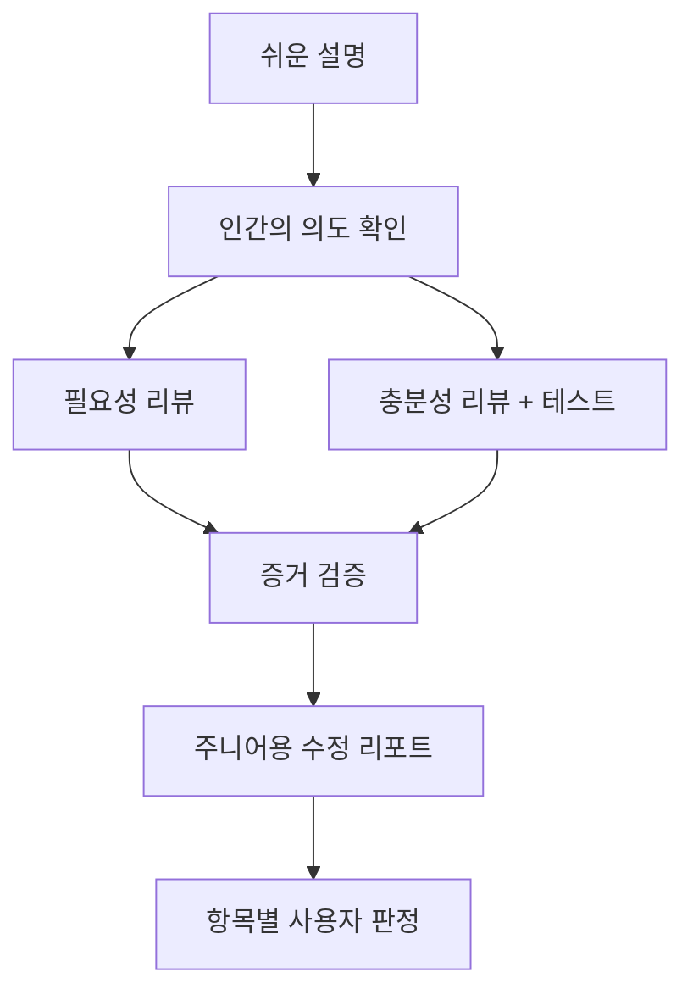

# adr-impl-review

구현 결과를 곧바로 승인하지 않고 다음 순서로 반증한다.



필요성·충분성 리뷰는 서로의 결과를 보지 않고 **병렬로** 실행한다 (3절).

이 절차는 수학적 필요충분성의 증명이 아니다. **불필요한 변경과 빠진 동작을 서로 다른 관점에서 찾는 반증 기반 검토**다. 테스트 통과는 현재 실행한 사례에서 반례를 찾지 못했다는 증거일 뿐 완전성의 증명이 아니다.

## 불변 원칙

- **보고 전용**: 코드·ADR·매핑을 자동 수정하지 않는다. Markdown/JSON/HTML 리뷰 산출물만 쓴다.
- **독립 컨텍스트**: 설명자, 필요성 리뷰어, 충분성 리뷰어를 각각 새 격리 컨텍스트에서 실행한다. 리뷰어에게 설명문이나 상대 리뷰 결과를 넘기지 않는다.
- **ADR이 행동 스펙**: 구현 직후에는 ADR의 결정이 권위다. 단 API 이름·실제 필드명 같은 구현 사실은 코드가 권위이므로 `Impl-fact mismatch`로 분리한다. 리뷰어 에이전트는 이 전제(ADR을 옳다고 봄)를 절대 깨지 않는다 — 명세 자체가 옳은지는 오직 2절 인간 게이트에서 사람이 묻고, 부족하면 impl-review 안에서 고치지 않고 밖으로(ADR 갱신·`adr-reviewer`) 라우팅한다.
- **주장보다 증거**: 모든 finding은 ADR 인용, 실제 diff/코드 위치, 재현 절차나 실행 결과 중 해당 근거를 포함한다. 재현하지 못한 추측은 `Unverified risk`로만 보고한다.
- **사람의 역할 분리**: 설명 확인은 “이해 가능하고 의도와 맞는가”의 게이트이지 코드가 옳다는 승인이 아니다.

## 1. 대상과 변경 범위 확정

ADR 식별은 `/adr-impl`과 같은 규칙을 따른다.

- 파일 경로면 해당 ADR을 사용한다.
- 카테고리 키면 `docs/adr/.mapping.json`에서 찾는다.
- 인자가 없으면 `Accepted` ADR 목록을 보여주고 선택받는다.
- `Proposed` ADR이면 부분 구현 검토인지 한 번 확인한다.

리뷰 대상 diff는 다음 우선순위로 정한다.

1. 사용자가 준 PR/commit range 또는 `--base`.
2. 현재 staged + unstaged 변경.
3. 깨끗한 worktree면 현재 브랜치와 기본 브랜치의 merge-base diff.

범위가 여러 구현을 섞어 ADR과 대응시킬 수 없으면 추측하지 말고 base/range를 확인받는다. 범위 확정 뒤 다음 원본 재료를 준비한다.

- ADR 전문과 `.mapping.json`의 해당 entry
- raw diff와 변경 파일 목록
- 변경 코드의 직접 call path와 관련 테스트
- `AGENTS.md`, `CONTRIBUTING.md`, `CLAUDE.md` 중 존재하는 프로젝트 규약
- 실행 가능한 프로젝트 테스트 명령

리뷰 산출물 디렉터리를 하나 만들고 경로를 이후 모든 에이전트에 전달한다. 저장소를 더럽히지 않도록 기본 위치는 `${TMPDIR:-/tmp}/adr-impl-review-<adr-slug>-<timestamp>/`로 한다.

## 2. 쉬운 구현 설명과 인간 게이트

`adr-impl-explainer`를 새 read-only subagent로 실행한다.

1. named agent를 사용할 수 있으면 `adr-impl-explainer`를 호출한다.
2. 없으면 `${CLAUDE_PLUGIN_ROOT}/agents/adr-impl-explainer.md` 전문을 지침으로 준 generic read-only subagent를 호출한다.
3. subagent 기능이 없을 때만 메인 세션이 같은 지침을 수행하고 격리 설명을 사용할 수 없었다고 밝힌다.

설명자에게는 ADR, raw diff, 변경 코드 범위, 관련 테스트만 준다. 결과를 `explanation.md`로 저장하고 사용자에게 보여준 뒤 다음 세 질문을 확인한다.

1. 설명이 주니어도 이해할 만큼 쉬운가? (이해 가능성)
2. 설명된 동작이 의도한 구현인가? (구현이 명세를 따랐는가)
3. 이 ADR 결정(명세) 자체가 실제 사용자 문제를 담고 있는가 — 빠진 요구·리스크·위험 허용 기준이 없는가? (명세 적합성)

앞의 두 질문은 "코드가 명세를 따랐는가"를 묻지만, 세 번째는 "명세가 옳은가"를 묻는다 — 필요충분을 만족한 코드라도 명세 자체가 불완전하면 나쁜 제품이 될 수 있어, 이 축은 사람만 판단할 수 있고 리뷰어 에이전트에 위임하지 않는다. 사용자가 고친 의도나 위험 허용 기준은 `human-baseline.md`에 기록한다. **명시적 확인 전에는 적대적 리뷰로 넘어가지 않는다.** 이해 불가면 설명을 고치고, 코드와 의도가 다르면 그 차이를 baseline에 남긴다. **명세 자체가 부족하면** impl-review 안에서 코드를 고치지 않고 baseline에 기록한 뒤 ADR 갱신(`/adr-new`·edit-in-place)이나 구현 전 `adr-reviewer`로 라우팅한다. 코드는 아직 고치지 않는다.

## 3. 독립 리뷰 두 개를 병렬 실행

두 리뷰어에게 공통으로 **원본 재료와 `human-baseline.md`만** 준다. `explanation.md`와 상대 리뷰 결과는 주지 않는다. 그래야 설명자의 해석이나 다른 리뷰어의 결론에 anchoring되지 않는다.

### 3.1 필요성 리뷰

`adr-impl-necessity-reviewer`를 실행한다.

- 질문: “이 diff의 각 변경이 ADR 목표 달성에 꼭 필요한가?”
- 성공 조건: 제거·축소 가능한 변경을 증거와 함께 찾는 것.
- 금지: 스타일 취향, 미래 확장 선호, 근거 없는 “더 단순하게”.
- 핵심 시도: 변경 단위마다 “이것을 삭제해도 ADR과 사용자 baseline이 유지되는가?”를 검사한다.

### 3.2 충분성 리뷰와 테스트

`adr-impl-sufficiency-reviewer`를 실행한다.

- 질문: “이 구현을 실패시키는 반례가 있는가?”
- 성공 조건: ADR 결정 원장을 모두 정산하고, 누락·경계·오류·경합·부분 실패를 재현하는 것.
- 테스트: 관련 테스트를 실제 실행하고, 가능하면 최소 재현을 사용한다. **테스트가 결함을 실제로 잡는지**까지 본다 — property/mutation 도구가 프로젝트에 이미 있으면 핵심 불변식에 한정해 돌려 약한 테스트를 `Test gap`으로, 정적/보안 분석(CodeQL 등)이 이미 구성돼 있으면 이 ADR 범위 코드에 한해 증거로 쓴다. 도구를 새로 설치하거나 제품 코드를 수정하지 않고, 범위 밖 취약점은 `/security-review`로만 넘긴다.
- 재현용 임시 파일은 산출물 디렉터리에만 만들고, 저장소 파일을 변경하지 않는다.

**두 리뷰어는 되도록 서로 다른 모델 계열로 돌린다** — 같은 모델 계열은 같은 가정을 공유해 둘 다 같은 결함을 놓치고 "좋아 보인다"에 거짓 합의하기 쉽다. 관점(필요성·충분성)뿐 아니라 판단 계열도 갈라야 반증력이 산다. 하네스가 model override를 지원하면 두 reviewer를 **서로 다른 제공자 계열의 최고 추론 모델**로, 각각 **최고 reasoning 등급**으로 실행한다. 특정 모델 ID를 여기 고정하지 않는다 — 모델은 이 스킬보다 빠르게 교체되므로, 호출 시점에 그 하네스에서 사용 가능한 최상위 추론 모델을 고른다. 단일 계열만 제공돼 다양화가 불가능하면 같은 계열의 최고 추론 모델로 두 reviewer를 모두 돌리되 **모델을 다양화하지 못했음과 각 reviewer가 실제 쓴 모델을 보고서에 기록한다**. 설명자는 기본 모델을 사용해도 된다.

각 클라이언트의 실행 순서는 다음과 같다.

1. named reviewer가 있으면 해당 agent를 호출한다.
2. 없으면 `${CLAUDE_PLUGIN_ROOT}/agents/<agent-name>.md` 전문을 읽어 generic read-only subagent에 전달한다.
3. subagent가 없으면 메인 세션이 두 관점을 **서로의 결과를 읽지 않는 별도 패스**로 수행하고 격리 한계를 밝힌다.

결과를 각각 `necessity-review.md`, `sufficiency-review.md`로 저장한다.

## 4. 증거 검증과 종합

메인 세션은 두 리뷰를 투표로 합치지 않는다. 다음 규칙으로 finding을 검증한다.

1. 같은 문제는 하나로 합치되 `perspective`에 출처를 모두 남긴다.
2. 서로 모순되는 결론은 숨기지 말고 `Contradiction` finding으로 남긴다.
3. high-impact finding은 테스트·재현 또는 정확한 코드/ADR 대조가 있어야 확정한다.
4. 실행하지 못했거나 call path를 끝까지 확인하지 못한 주장은 `Unverified risk`로 낮춘다.
5. 테스트가 존재한다는 사실과 테스트가 결함을 검출한다는 사실을 구분한다.
6. 필요성 PASS는 “불필요한 변경을 찾지 못함”, 충분성 PASS는 “현재 반례를 찾지 못하고 결정 원장을 정산함”을 뜻한다.

종합 verdict:

- `PASS`: evidence-backed must-fix가 없고, 결정 원장이 모두 구현됨이며, 필요한 targeted test가 통과했다.
- `FIX_REQUIRED`: 코드/ADR/테스트에 구체적 후속 조치가 필요한 finding이 있다.
- `INCONCLUSIVE`: 중요 경로를 실행할 수 없거나 범위를 확정하지 못해 PASS/FIX를 정직하게 판정할 수 없다.
- `BLOCK`: 결정 자체의 분기나 구조 붕괴로 개별 코드 수정 전에 사람의 아키텍처 결정이 필요하다.

## 5. 주니어용 수정 리포트 생성

독립 리뷰와 증거 검증이 끝나면 `adr-impl-review-report-writer`를 새 subagent로 실행한다. 이 단계는 결론을 새로 만들지 않고 검증된 finding을 **해당 코드를 처음 보는 주니어 개발자가 혼자 수정할 수 있는 문서**로 바꾼다.

1. named agent를 사용할 수 있으면 `adr-impl-review-report-writer`를 호출한다.
2. 없으면 `${CLAUDE_PLUGIN_ROOT}/agents/adr-impl-review-report-writer.md` 전문을 지침으로 준 generic subagent를 호출한다.
3. subagent 기능이 없으면 메인 세션이 같은 지침으로 작성한다.

report-writer에는 원본 ADR/diff, `human-baseline.md`, 세 에이전트 산출물, 검증된 finding과 테스트 결과를 모두 준다. 결과를 `implementation-review.md`로 저장한다.

파일명은 정확히 `implementation-review.md`여야 한다. `final-review.md`, `review.md` 같은 대체 이름을 허용하지 않는다. report-writer를 사용할 수 없어 메인 세션이 작성할 때도 먼저 `${CLAUDE_PLUGIN_ROOT}/agents/adr-impl-review-report-writer.md` 전문을 읽고 동일한 출력 구조를 따른다.

문서에는 실제 코드에서 확인한 관계만 사용한 Mermaid 다이어그램을 충분히 넣는다.

- 전체 변경 구조: `flowchart`
- 핵심 요청/이벤트 흐름: `sequenceDiagram`
- 상태가 있으면 상태 전이: `stateDiagram-v2`
- 데이터 모델 변경이 있으면 관계: `erDiagram`
- 실패·재시도·롤백 흐름이 복잡하면 별도 `flowchart`

다이어그램은 장식이 아니라 수정 지도를 제공해야 한다. 각 노드에는 실제 심볼 또는 파일명을 연결하고, finding이 발생하는 지점과 수정 후 기대 흐름을 문서 본문에서 명확히 가리킨다. 실제 코드로 확인하지 못한 edge를 추측해 그리지 않는다. ASCII/box-drawing 다이어그램은 사용하지 않는다.

각 finding에는 다음을 모두 포함한다.

1. 무엇이 문제이고 어떤 사용자/운영 증상으로 나타나는가
2. ADR 결정과 실제 코드의 차이
3. 읽어야 할 파일과 심볼 순서
4. 재현 명령과 현재 결과
5. 수정 단계와 건드리지 말아야 할 범위
6. 수정 후 기대 동작
7. 통과해야 할 테스트와 완료 조건
8. 확신도와 아직 확인하지 못한 내용

문서 끝에는 dependency 순서가 반영된 `수정 실행 순서`, `검증 체크리스트`, 그리고 **6축 머지 판정 체크리스트**(문제 적합성·기능 충분성·변경 최소성·검증 강도·운영 안전성·유지보수성)를 둔다 — 기능 충족은 좋은 코드의 한 축일 뿐이므로 각 축을 finding·테스트·인간 게이트 근거에 매핑해 판정한다. 주니어가 문서만 보고 추측해야 하는 항목이 남으면 `확인 필요`로 명시하고 담당자에게 물을 구체적 질문을 적는다.

## 6. 항목 판정 페이지 생성

세 에이전트의 Markdown 원문과 종합 결과를 다음 JSON으로 직렬화한다.

```json
{
  "adr": "docs/adr/ordering/checkout/0001-checkout.md",
  "status": "Accepted (2026-07-10)",
  "verdict": "FIX_REQUIRED",
  "explanation": "/tmp/.../explanation.md",
  "report": "/tmp/.../implementation-review.md",
  "scope": ["src/checkout/handler.ts"],
  "conventions": "AGENTS.md",
  "findings": [
    {
      "category": "Unnecessary change",
      "perspective": "necessity",
      "summary": "새 이벤트 버스는 이 ADR에 필요하지 않다",
      "confidence": "high",
      "adrQuote": "취소 시 upstream 호출을 중단한다",
      "code": "src/events/bus.ts:18 — 실제 코드 조각",
      "evidence": "기존 abort signal 경로가 동일 목표를 충족",
      "test": "pnpm test -- cancel",
      "testResult": "pass after excluding the new bus path",
      "fix": "새 이벤트 버스와 연결 코드를 제거한다"
    }
  ],
  "notes": "리뷰 한계 또는 모순"
}
```

허용 category:

- 필요성: `Unnecessary change`, `Simpler alternative`
- 충분성: `Spec violation`, `Decision changed in code`, `Undecided behavior`, `Impl-fact mismatch`, `Test gap`
- 공통 품질: `Best practice`, `Refactor`
- 검증 상태: `Unverified risk`, `Contradiction`

다음 스크립트로 HTML을 만든다.

```bash
node ${CLAUDE_PLUGIN_ROOT}/scripts/adr-impl-review-validate.mjs <artifact-dir>
node ${CLAUDE_PLUGIN_ROOT}/scripts/adr-impl-review-report.mjs <findings.json> --out <artifact-dir>/adr-impl-review-report.html
```

validator가 실패하면 완료 보고나 HTML 생성을 하지 않는다. 오류에 나온 누락을 `implementation-review.md` 또는 `findings.json`에서 보완하고 validator가 0으로 끝날 때까지 다시 실행한다. 특히 finding마다 `perspective`, `code`, `evidence`, `test`, `testResult`를 채우고, 테스트를 실행하지 못했으면 빈칸 대신 `NOT RUN — <이유>`를 쓴다.

리포트를 열고 verdict, 필요성/충분성 finding 수, 실행한 테스트, 미검증 위험 수만 채팅에 요약한다. 사용자는 각 항목을 **반영 / 무시 / 보류**로 판정하고 `feedback.json`을 내보낸다.

## 7. 사용자 판정 후 라우팅

이 명령 자체는 계속 보고 전용이다. `feedback.json`의 승인 항목은 후속 작업으로 라우팅한다.

- `Unnecessary change` → 코드 제거. 제거 뒤 관련 테스트를 다시 실행한다.
- `Simpler alternative` / `Refactor` → ADR 결정을 바꾸지 않는지 확인 후 단순화한다.
- `Spec violation` / `Best practice` → 코드를 고친다.
- `Decision changed in code` → ADR 갱신과 코드 원복 중 사용자가 결정한다.
- `Undecided behavior` → ADR에 결정으로 추가할지 코드에서 제거할지 사용자가 결정한다.
- `Impl-fact mismatch` → `/adr-sync <category>`로 ADR 구현 사실을 정정한다.
- `Test gap` → 실패를 검출하는 테스트를 먼저 추가한 뒤 코드를 고친다.
- `Unverified risk` → 먼저 재현하거나 명시적으로 위험을 수용한다. 곧바로 수정하지 않는다.
- `Contradiction` → 두 주장 중 어느 전제가 맞는지 사람이 결정하기 전 수정하지 않는다.

수정이 끝나면 `/adr-impl-review`를 다시 실행해 필요성·충분성 두 패스를 모두 닫는다.

## 금지

- 설명자가 “쉽게 보이도록” 실패 경로·상태·동시성을 생략하지 않는다.
- 리뷰어에게 설명문이나 상대 reviewer 결과를 전달하지 않는다.
- 주니어용 리포트에서 Mermaid 대신 ASCII/box-drawing 다이어그램을 쓰지 않는다.
- 실제 코드에서 확인하지 못한 구성 요소나 호출 관계를 Mermaid에 만들어 넣지 않는다.
- 테스트를 통과했다는 이유만으로 충분성을 증명했다고 표현하지 않는다.
- 재현하지 못한 추측을 확정 finding처럼 보고하지 않는다.
- 리뷰 과정에서 제품 코드, ADR, 매핑, 기존 테스트를 수정하지 않는다.
- 프로젝트 규약과 충돌하는 일반론을 베스트 프랙티스로 강요하지 않는다.
