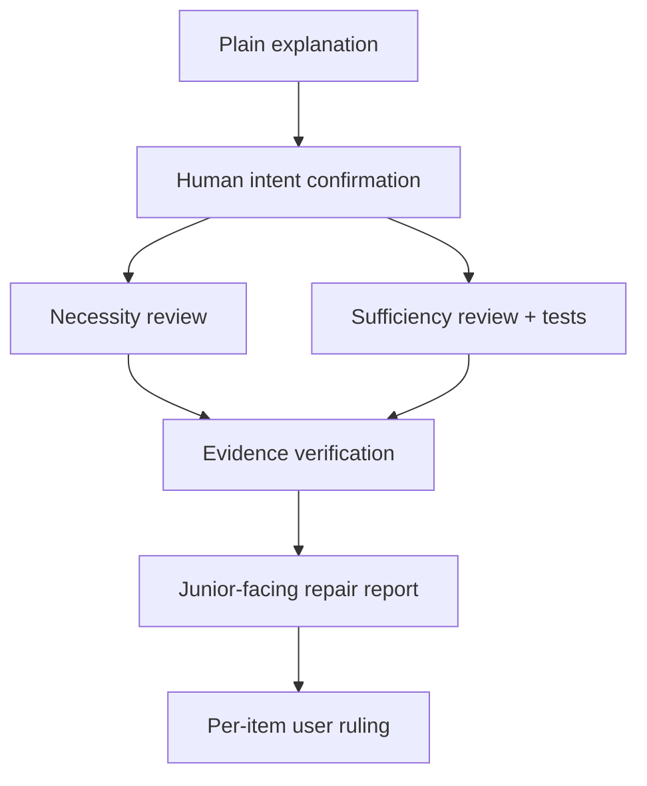

# adr-impl-review

Rather than approving the implementation outright, disprove it in the following order.



The necessity and sufficiency reviews run **in parallel**, without seeing each other's results (section 3).

This procedure is not a proof of mathematical necessity and sufficiency. It is **a disproof-based review that hunts for unnecessary changes and missing behavior from two different perspectives.** A passing test is only evidence that no counterexample was found among the cases actually executed — not a proof of completeness.

> **Language**: this skill and every other harness prompt are written in English, but talk to the user and write the review artifacts in the language the user writes in (`authoring-rules.md` "Conventions"). Any user-facing phrasing below is a guide, not a literal string.

## Invariant principles

- **Report-only**: never auto-modify code, ADRs, or the mapping. Write only the Markdown/JSON/HTML review artifacts.
- **Independent contexts**: run the explainer, the necessity reviewer, and the sufficiency reviewer each in a fresh isolated context. Never pass a reviewer the explanation document or the other reviewer's result.
- **The ADR is the behavioral spec**: right after implementation, the ADR's decision is authoritative. But implementation facts such as API names and actual field names are the code's authority, so separate those as `Impl-fact mismatch`. The reviewer agents never break this premise (that the ADR is correct) — whether the spec itself is right is asked only by the human at the section 2 gate, and if it falls short, it is routed outward (an ADR update, `adr-reviewer`) rather than fixed inside impl-review.
- **Evidence over assertion**: every finding includes the applicable basis among an ADR quote, the actual diff or code location, and a reproduction procedure or execution result. Report a conjecture you could not reproduce only as `Unverified risk`.
- **Separation of the human's role**: confirming the explanation is a gate for "is this understandable and does it match the intent?" — not an approval that the code is correct.

## 1. Fix the target and the change scope

ADR identification follows the same rules as `/adr-impl`.

- If it is a file path, use that ADR.
- If it is a category key, look it up in `docs/adr/.mapping.json`.
- With no argument, show the list of `Accepted` ADRs and take a selection.
- If it is a `Proposed` ADR, confirm once whether this is a partial-implementation review.

Determine the diff under review by this priority:

1. A PR / commit range the user supplied, or `--base`.
2. The current staged + unstaged changes.
3. For a clean worktree, the merge-base diff between the current branch and the default branch.

If the scope mixes several implementations and cannot be mapped onto the ADR, do not guess — get the base/range confirmed. After fixing the scope, prepare the following original material.

- The full ADR text and its entry in `.mapping.json`
- The raw diff and the list of changed files
- The direct call paths of the changed code and the related tests
- Whichever project conventions exist among `AGENTS.md`, `CONTRIBUTING.md`, `CLAUDE.md`
- An executable project test command

Create one review artifact directory and pass its path to every agent that follows. To avoid dirtying the repository, the default location is `${TMPDIR:-/tmp}/adr-impl-review-<adr-slug>-<timestamp>/`.

## 2. The plain implementation explanation and the human gate

Run `adr-impl-explainer` as a fresh read-only subagent.

1. If named agents are available, invoke `adr-impl-explainer`.
2. Otherwise invoke a generic read-only subagent given the full text of `${CLAUDE_PLUGIN_ROOT}/agents/adr-impl-explainer.md` as its instructions.
3. Only when subagents are unavailable should the main session carry out the same instructions, noting that isolated explanation was unavailable.

Give the explainer only the ADR, the raw diff, the changed code scope, and the related tests. Save the result as `explanation.md`, show it to the user, and confirm the following three questions.

1. Is the explanation simple enough for a junior to understand? (understandability)
2. Is the behavior described the intended implementation? (did the implementation follow the spec?)
3. Does this ADR decision (the spec) itself capture the real user problem — are any requirements, risks, or risk-tolerance criteria missing? (spec fitness)

The first two questions ask "did the code follow the spec?", but the third asks "is the spec right?" — code that satisfies necessity and sufficiency can still make a bad product if the spec itself is incomplete, so only a human can judge this axis and it is never delegated to a reviewer agent. Record the intent the user corrected and their risk-tolerance criteria in `human-baseline.md`. **Never proceed to the adversarial reviews before explicit confirmation.** If it is not understandable, fix the explanation; if the code and the intent differ, record that difference in the baseline. **If the spec itself falls short**, do not fix code inside impl-review — record it in the baseline and route to an ADR update (`/adr-new`, edit-in-place) or to `adr-reviewer` before implementation. Do not touch the code yet.

## 3. Run the two independent reviews in parallel

Give both reviewers, in common, **only the original material and `human-baseline.md`.** Do not give them `explanation.md` or the other reviewer's result. That is what keeps them from anchoring on the explainer's interpretation or the other reviewer's conclusion.

### 3.1 The necessity review

Run `adr-impl-necessity-reviewer`.

- The question: "is each change in this diff strictly necessary to achieve the ADR's goal?"
- Success condition: finding changes that can be removed or shrunk, with evidence.
- Forbidden: style preferences, a taste for future extensibility, unjustified "make it simpler". Also forbidden is filing **code that enforces a requirement the ADR records** (cap checks, counters, expiry handling, and likewise transition guards, permission checks, duplicate prevention, required-field validation) as unnecessary — whether it is a number, a value set, or a permission, that is contract.
- The core attempt: for each unit of change, test "does the ADR and the user baseline still hold if this is deleted?"

### 3.2 The sufficiency review and tests

Run `adr-impl-sufficiency-reviewer`.

- The question: "is there a counterexample that makes this implementation fail?"
- Success condition: accounting for every row of the ADR decision ledger, and reproducing omissions, boundaries, errors, races, and partial failures.
- **Compare requirement values value by value** — put each limit, quota, cycle, retention period, cap, and target the ADR records as its own ledger row and compare it directly against the number in the code. "There is limit logic" is not an accounting. A value mismatch or an unenforced value is a `Spec violation`; a self-imposed limit absent from the ADR is `Undecided behavior`.
- **Compare non-numeric requirements item by item too** — allowed value sets, transition rules, mandatory fields, permissions, visibility, ordering, uniqueness, and units are each ledger rows as well. An added or removed set member, a forbidden transition becoming allowed, and mandatory → optional are all `Spec violation`. **Split enums** — a differing identifier name is `Impl-fact mismatch` (correct the ADR), while a differing allowed set or transition rule is `Spec violation` (correct the code).
- Tests: actually run the related tests, and use a minimal reproduction where possible. Go as far as checking **whether the tests actually catch defects** — if property or mutation tooling already exists in the project, run it restricted to the core invariants and record weak tests as `Test gap`; if static or security analysis (CodeQL and the like) is already configured, use it as evidence limited to this ADR's code scope. Do not install new tooling or modify product code, and pass out-of-scope vulnerabilities to `/security-review` only.
- Create temporary reproduction files only in the artifact directory, and never change repository files.

**Run the two reviewers on different model families where possible** — the same model family shares the same assumptions, making it easy for both to miss the same defect and reach a false consensus of "looks good." Diversifying not only the perspective (necessity vs sufficiency) but also the judgment lineage is what keeps the disproof power alive. If the harness supports a model override, run the two reviewers on **the strongest reasoning models from different provider families**, each at **the highest reasoning tier.** Do not pin specific model IDs here — models are replaced faster than this skill, so pick the top reasoning model available in that harness at invocation time. If only a single family is available and diversification is impossible, run both reviewers on that family's strongest reasoning model but **record in the report that models could not be diversified, along with the model each reviewer actually used.** The explainer may use the default model.

The execution order per client is as follows.

1. If a named reviewer exists, invoke that agent.
2. Otherwise read the full text of `${CLAUDE_PLUGIN_ROOT}/agents/<agent-name>.md` and pass it to a generic read-only subagent.
3. If subagents are unavailable, the main session performs the two perspectives as **separate passes that do not read each other's results**, and states the isolation limitation.

Save the results as `necessity-review.md` and `sufficiency-review.md`.

## 4. Evidence verification and synthesis

The main session does not merge the two reviews by vote. Verify findings with these rules.

1. Merge the same problem into one, but keep every source in `perspective`.
2. Do not hide mutually contradictory conclusions — record them as a `Contradiction` finding.
3. Confirm a high-impact finding only with a test, a reproduction, or an exact code/ADR comparison.
4. Downgrade to `Unverified risk` any claim you could not execute or whose call path you could not fully confirm.
5. Distinguish the fact that a test exists from the fact that a test detects the defect.
6. A necessity PASS means "no unnecessary change was found"; a sufficiency PASS means "no counterexample was found at present and the decision ledger is accounted for."

The synthesized verdict:

- `PASS`: there is no evidence-backed must-fix, every decision-ledger row is implemented, and the required targeted tests passed.
- `FIX_REQUIRED`: there is a finding requiring concrete follow-up in the code, the ADR, or the tests.
- `INCONCLUSIVE`: an important path could not be executed or the scope could not be fixed, so PASS/FIX cannot be judged honestly.
- `BLOCK`: a fork in the decision itself, or a structural collapse, requires a human architectural decision before any individual code fix.

## 5. Generate the junior-facing repair report

Once the independent reviews and evidence verification are done, run `adr-impl-review-report-writer` as a fresh subagent. This step creates no new conclusions; it turns the verified findings into **a document a junior developer seeing this code for the first time can fix it from alone.**

1. If named agents are available, invoke `adr-impl-review-report-writer`.
2. Otherwise invoke a generic subagent given the full text of `${CLAUDE_PLUGIN_ROOT}/agents/adr-impl-review-report-writer.md` as its instructions.
3. If subagents are unavailable, the main session writes it under the same instructions.

Give the report-writer the original ADR and diff, `human-baseline.md`, all three agents' artifacts, and the verified findings and test results. Save the result as `implementation-review.md`.

The filename must be exactly `implementation-review.md`. Alternatives such as `final-review.md` or `review.md` are not allowed. Even when the report-writer is unavailable and the main session writes it, first read the full text of `${CLAUDE_PLUGIN_ROOT}/agents/adr-impl-review-report-writer.md` and follow the same output structure.

Include ample Mermaid diagrams using only relationships confirmed in the actual code.

- Overall change structure: `flowchart`
- Core request/event flow: `sequenceDiagram`
- State transitions, if there is state: `stateDiagram-v2`
- Relationships, if the data model changed: `erDiagram`
- A separate `flowchart` when the failure, retry, and rollback flow is complex

Diagrams must provide a repair map, not decoration. Tie each node to a real symbol or filename, and point clearly in the prose to where the finding occurs and the expected flow after the fix. Never guess at an edge you could not confirm in the actual code. Never use ASCII or box-drawing diagrams.

Include all of the following for each finding.

1. What the problem is and which user or operational symptom it manifests as
2. The difference between the ADR decision and the actual code
3. The order of files and symbols to read
4. The reproduction command and the current result
5. The fix steps and the scope not to touch
6. The expected behavior after the fix
7. The tests that must pass and the completion criteria
8. The confidence level and what has not been confirmed yet

At the end of the document, put a `Fix execution order` reflecting the dependency order, a `Verification checklist`, and the **seven-axis merge decision checklist** (problem fitness, functional adequacy, contract compliance, change minimality, verification strength, operational safety, maintainability) — functional adequacy is only one axis of good code, so rule on each axis by mapping it to the findings, tests, and human-gate evidence. `Contract compliance` is the axis that compares, number by number, whether the requirement values the ADR set are enforced at those values — limit logic can work while the value differs, which is a requirement violation, so keep it separate from functional adequacy. If any item would leave a junior guessing from the document alone, mark it `needs confirmation` and write the specific question to ask the owner.

## 6. Generate the per-item ruling page

Serialize the three agents' raw Markdown and the synthesized result into the following JSON.

```json
{
  "adr": "docs/adr/ordering/checkout/0001-checkout.md",
  "status": "Accepted (2026-07-10)",
  "verdict": "FIX_REQUIRED",
  "explanation": "/tmp/.../explanation.md",
  "report": "/tmp/.../implementation-review.md",
  "scope": ["src/checkout/handler.ts"],
  "conventions": "AGENTS.md",
  "findings": [
    {
      "category": "Unnecessary change",
      "perspective": "necessity",
      "summary": "the new event bus is not needed for this ADR",
      "confidence": "high",
      "adrQuote": "on cancellation, abort the upstream call",
      "code": "src/events/bus.ts:18 — the actual code fragment",
      "evidence": "the existing abort-signal path meets the same goal",
      "test": "pnpm test -- cancel",
      "testResult": "pass after excluding the new bus path",
      "fix": "remove the new event bus and its wiring"
    }
  ],
  "notes": "review limits or contradictions"
}
```

Allowed categories:

- Necessity: `Unnecessary change`, `Simpler alternative`
- Sufficiency: `Spec violation`, `Decision changed in code`, `Undecided behavior`, `Impl-fact mismatch`, `Test gap`
- Shared quality: `Best practice`, `Refactor`
- Verification state: `Unverified risk`, `Contradiction`

Build the HTML with these scripts.

```bash
node ${CLAUDE_PLUGIN_ROOT}/scripts/adr-impl-review-validate.mjs <artifact-dir>
node ${CLAUDE_PLUGIN_ROOT}/scripts/adr-impl-review-report.mjs <findings.json> --out <artifact-dir>/adr-impl-review-report.html
```

If the validator fails, do not report completion or generate the HTML. Fill the omissions it names in `implementation-review.md` or `findings.json` and re-run until the validator exits 0. In particular, fill `perspective`, `code`, `evidence`, `test`, and `testResult` for every finding, and where a test could not be run, write `NOT RUN — <reason>` rather than leaving it blank.

Open the report and summarize in chat only the verdict, the necessity/sufficiency finding counts, the tests executed, and the number of unverified risks. The user rules on each item as **apply / skip / defer** and exports `feedback.json`.

## 7. Routing after the user's ruling

This command itself remains report-only. Route the approved items in `feedback.json` to follow-up work.

- `Unnecessary change` → remove the code. Re-run the related tests after removal.
- `Simpler alternative` / `Refactor` → simplify after confirming it does not change the ADR decision.
- `Spec violation` / `Best practice` → fix the code.
- `Decision changed in code` → the user decides between updating the ADR and reverting the code.
- `Undecided behavior` → the user decides whether to add it to the ADR as a decision or remove it from the code.
- `Impl-fact mismatch` → correct the ADR's implementation facts with `/adr-sync <category>`.
- `Test gap` → add a test that detects the failure first, then fix the code.
- `Unverified risk` → reproduce it first, or explicitly accept the risk. Do not fix it straight away.
- `Contradiction` → do not fix anything before a human decides which of the two premises holds.

Once the fixes are done, run `/adr-impl-review` again to close both the necessity and sufficiency passes.

## Prohibited

- The explainer must not omit failure paths, state, or concurrency to "look simple."
- Never pass a reviewer the explanation document or the other reviewer's result.
- Never use ASCII or box-drawing diagrams instead of Mermaid in the junior-facing report.
- Never invent components or call relationships in Mermaid that were not confirmed in the actual code.
- Never state that sufficiency is proven merely because the tests passed.
- Never report an unreproduced conjecture as though it were a confirmed finding.
- Never modify product code, ADRs, the mapping, or existing tests during the review.
