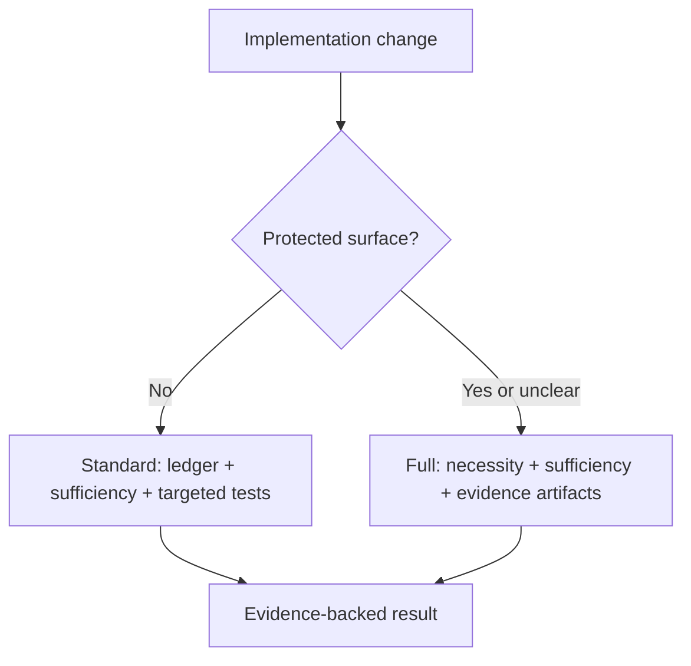

# adr-impl-review

Rather than approving the implementation outright, disprove it in the following order.



In full mode, the necessity and sufficiency reviews run **in parallel**, without seeing each other's results (section 3). Standard mode runs only the isolated sufficiency pass defined below. The user's intent and the ADR's regeneration checklist are settled before implementation; this command consumes that baseline and does not reopen it as a routine post-implementation gate.

This procedure is not a proof of mathematical necessity and sufficiency. It is **a disproof-based review that hunts for unnecessary changes and missing behavior from two different perspectives.** A passing test is only evidence that no counterexample was found among the cases actually executed — not a proof of completeness.

> **Language**: this skill and every other harness prompt are written in English, but talk to the user and write the review artifacts in the language the user writes in (`authoring-rules.md` "Conventions"). Any user-facing phrasing below is a guide, not a literal string.

## The abstraction ladder — which level owns each disagreement

Most findings in this review are a disagreement between the ADR and the code, and **every routing call below is really the question "which level owns this fact?"** So hold the principle (`authoring-rules.md` / `concepts.md` "The abstraction ladder") while reading the findings.

PRD, ADR, and code are the same system at three resolutions — like C4's context / container / component zoom — and each level exists to be **read alone**. The ADR's question is "why this decision, and what must the result honor?"; the code's is "how is it done?" That split decides every category:

| Disagreement                                          | Level that owns it          | Category                   | Route                                    |
| ----------------------------------------------------- | --------------------------- | -------------------------- | ---------------------------------------- |
| The ADR's contract is not honored in code             | ADR (the contract)          | `Spec violation`           | fix the code                             |
| Names, signatures, wire form, field names differ      | Code (implementation facts) | `Impl-fact mismatch`       | remove ADR detail via sync               |
| The code adds an ADR-worthy behavior no level decided | neither yet                 | `Undecided behavior`       | escalate only if contract choice remains |
| The code implemented a different coherent decision    | contested                   | `Decision changed in code` | escalate, then log it                    |

So the recurring judgment is **not "is the code good?" but "at which resolution does this belong?"** Two guards follow, and they are the same guards `/adr-new` writes under, seen from the other side:

- **Never absorb a contract violation as an implementation fact.** An allowed value set or transition rule differing is `Spec violation` (the ADR owns it); only the identifier name or representation is `Impl-fact mismatch`. Routing a set difference to `/adr-sync` silently rewrites the contract to match whatever the code did.
- **Never treat code that enforces a contract as removable.** Cap checks, transition guards, permission checks, and required-field validation are the code level's job of honoring the ADR level's contract, so "it passes without this" is not evidence.
- **Never promote implementation discretion into `Undecided behavior`.** Before raising extra code to the ADR, apply the ADR admission gate. Replaceable libraries, SDKs, frameworks, middleware, module layouts, credential provider chains, signers, authentication adapters, and tuning choices are expected code-level decisions when contracts and architecture/security boundaries stay unchanged. They are not findings merely because the ADR does not name them.

A note on scope: `/adr-impl-review` judges the **code** level against the ADR level. Whether the ADR itself is written at the right resolution is `/adr-review`'s question, and the implementation cycle confirms the decision and regeneration checklist before code begins. Never rewrite an ADR from inside this command to make a finding go away.

## Invariant principles

- **Report-only**: never auto-modify code, ADRs, or the mapping. Write only the Markdown/JSON/HTML review artifacts.
- **Independent contexts**: in full mode, run the explainer, necessity reviewer, and sufficiency reviewer in fresh isolated contexts. In standard mode, run the sufficiency reviewer in one fresh isolated context. Never pass a reviewer another agent's result.
- **The approved ADR is the behavioral spec**: right after implementation, the ADR's admitted decision and requirement contract are authoritative because the implementation cycle confirmed their intent and regeneration checklist before code began. Implementation facts such as API names and actual field names should not be in that spec; when they appear, separate them as `Impl-fact mismatch` and route them for removal. If review finds concrete evidence that the ADR baseline itself is incomplete or contradictory, return it as a blocking contract issue; do not perform a routine confirmation or silently fix the ADR inside impl-review.
- **Evidence over assertion**: every finding includes the applicable basis among an ADR quote, the actual diff or code location, and a reproduction procedure or execution result. Report a conjecture you could not reproduce only as `Unverified risk`.
- **Escalation is exceptional**: ask for human judgment only when the approved contract must change, premises contradict, a material risk cannot be verified, or the repair would exceed the approved scope. Evidence-backed implementation and test defects are remediation work, not approval questions.

**Provider capability gate — apply before any named or generic subagent dispatch.** If the active model provider is identified as Amazon Bedrock, treat subagents as unavailable and do not invoke either path. Codex's current Bedrock transport can reject multi-agent input before an agent starts. If provider identity was not visible in advance and an attempted dispatch returns `validation_error` with `Invalid 'input': value did not match any expected variant`, do not retry with the named agent, a generic agent, or a different review role. Mark subagents unavailable for the rest of this command and use the main-session fallback for the selected mode, recording the isolation limitation.

**Generic subagent dispatch rule**: after the provider capability gate passes, when a named agent is unavailable, resolve the corresponding `${CLAUDE_PLUGIN_ROOT}/agents/*.md` file to an **absolute path** and instruct a generic subagent to read that file completely and follow it. Do not load the agent file into the main session or paste its full text into the dispatch prompt. Pass task inputs separately, and require only the agent file's existing output contract — never an instruction echo, raw input dump, or exploratory transcript. If the subagent cannot read the absolute path, fall back once to passing the file's full text so review capability is preserved, and record that path-based context isolation was unavailable.

## 1. Fix the target and the change scope

ADR identification follows the same rules as `/adr-impl`.

- If it is a file path, use that ADR.
- If it is a category key, look it up in `docs/adr/.mapping.json`.
- With no argument, show the list of `Accepted` ADRs and take a selection.
- If it is a `Proposed` ADR invoked by `/adr-impl` after implementation, refactoring, and tests, treat it as the selected pre-promotion completion review and do not ask whether it is partial. For any other `Proposed` target, confirm once whether this is a partial-implementation review.

Determine the diff under review by this priority:

1. A PR / commit range the user supplied, or `--base`.
2. The current staged + unstaged changes.
3. For a clean worktree, the merge-base diff between the current branch and the default branch.

If the scope mixes several implementations and cannot be mapped onto the ADR, do not guess — get the base/range confirmed. After fixing the scope, prepare the following original material.

- The full ADR text and its entry in `.mapping.json`
- The raw diff and the list of changed files
- The direct call paths of the changed code and the related tests
- **The seeded rule docs the repo actually holds** — `docs/adr/concepts.md` (the abstraction ladder, the requirement gate, the source-of-truth split) and `docs/adr/authoring-rules.md`, falling back to `${CLAUDE_PLUGIN_ROOT}/templates/adr/`. These decide **which level owns a disagreement**, so a reviewer working from remembered defaults can route a contract violation as an implementation fact. A project may have hand-edited or pinned its copy, and if the stamp lags the installed plugin (`rules-doc-stale`) or `concepts.md` is missing because the repo predates the split (`rules-doc-layout-legacy`, in which case that material sits inside `README.md`), **say so in the final report's review limits** — the reviewers judged against those docs, so the reader needs to know which version.
- Whichever project conventions exist among `AGENTS.md`, `CONTRIBUTING.md`, `CLAUDE.md` — note these are the **project's own** conventions file, a different thing from `docs/adr/concepts.md` above
- An executable project test command

Create one review artifact directory and pass its path to every agent that follows. To avoid dirtying the repository, the default location is `${TMPDIR:-/tmp}/adr-impl-review-<adr-slug>-<timestamp>/`. Record the review start time when this directory is created. The final artifact records the selected mode and rationale, elapsed time, per-perspective finding counts, unverified-risk count, and executed test-command count.

### 1.1 Select the review mode

Use `full` when any of these surfaces changes: requirement values or rules, public API or wire form, schema or persistence, state or transitions, permissions or visibility, security boundaries, external fallback, concurrency, transactions, resource lifetime, or error semantics. Also use `full` for changes spanning bounded contexts or broad modules, when the user requests a full review, or whenever classification is unclear.

Use `standard` only for localized implementation or reinforcement of an existing decision that changes none of those protected surfaces. An explicit `--mode standard` never overrides the criteria; upgrade it to `full` and explain why. An explicit `--mode full` is always honored.

Record `reviewMode` and the classification evidence in the artifacts.

## Standard mode

For `standard`, execute this section and then continue at section 7. Sections 2-6 are the full-mode path.

1. Build a decision ledger containing every ADR decision and requirement-contract row relevant to the diff.
2. Run `adr-impl-sufficiency-reviewer` in one fresh isolated context with only the ADR, raw diff, changed code and tests, project rule documents, and the ledger. If subagents are unavailable, including on Amazon Bedrock, perform one separate sufficiency pass in the main session and record the isolation limitation.
3. Execute the related targeted tests and any minimal reproduction needed to account for every ledger row. An unexecuted core path makes the verdict `INCONCLUSIVE`, not `PASS`.
4. Verify and synthesize findings using section 4's evidence rules. Standard mode has no necessity pass, report-writer agent, HTML page, mandatory Mermaid, or post-implementation spec-fitness gate.
5. Write a concise `implementation-review.md` with these headings: `Review mode`, `Scope`, `Decision ledger`, `Findings`, `Tests`, and `Review limits`. Write `findings.json` with `"reviewMode": "standard"`, `necessityFindingCount: 0`, and the normal evidence fields.
6. Run the artifact validator. `PASS` requires every ledger row accounted for, all required targeted tests passing, no evidence-backed must-fix finding, and no unverified core risk.

## Full mode

The rest of sections 2-6 applies only to `full`.

## 2. Build the review baseline without a post-implementation gate

Run `adr-impl-explainer` as a fresh read-only subagent.

1. If named agents are available, invoke `adr-impl-explainer`.
2. Otherwise invoke a generic read-only subagent using the generic dispatch rule with `${CLAUDE_PLUGIN_ROOT}/agents/adr-impl-explainer.md`.
3. Only when subagents are unavailable should the main session carry out the same instructions, noting that isolated explanation was unavailable.

Give the explainer only the ADR, the raw diff, the changed code scope, and the related tests. Save the result as `explanation.md` for the repair report; do not stop to show it or ask the user to reconfirm the implementation.

Create `review-baseline.md` from:

- the current ADR and mapping summary
- the Decision, Decision Drivers, every numeric and non-numeric requirement row, explicit out-of-scope items, and recorded risk tolerance
- the pre-implementation approval summary supplied by `/adr-impl`, when available
- a regeneration checklist marking where each contract is stated in the ADR

Self-check the baseline against `authoring-rules.md` R18a/R19. A missing contract that can be recovered from the already approved ADR wording is corrected in the baseline. Concrete evidence that the ADR itself is incomplete, contradictory, or requires a new product choice is a blocking contract issue routed to ADR authoring before any code repair; it is not a reason to ask the routine three confirmation questions again. When `/adr-impl-review` is invoked standalone and no approval summary exists, record that limit and use the current ADR as the review baseline.

## 3. Run the two independent reviews in parallel

Give both reviewers, in common, **only the original material and `review-baseline.md`.** Do not give them `explanation.md` or the other reviewer's result. That is what keeps them from anchoring on the explainer's interpretation or the other reviewer's conclusion.

### 3.1 The necessity review

Run `adr-impl-necessity-reviewer`.

- The question: "is each change in this diff strictly necessary to achieve the ADR's goal?"
- Success condition: finding changes that can be removed or shrunk, with evidence.
- Forbidden: style preferences, a taste for future extensibility, unjustified "make it simpler". Also forbidden is filing **code that enforces a requirement the ADR records** (cap checks, counters, expiry handling, and likewise transition guards, permission checks, duplicate prevention, required-field validation) as unnecessary — whether it is a number, a value set, or a permission, that is contract.
- The core attempt: for each unit of change, test "does the ADR and the approved review baseline still hold if this is deleted?"

### 3.2 The sufficiency review and tests

Run `adr-impl-sufficiency-reviewer`.

- The question: "is there a counterexample that makes this implementation fail?"
- Success condition: accounting for every row of the ADR decision ledger, and reproducing omissions, boundaries, errors, races, and partial failures.
- **Compare requirement values value by value** — put each limit, quota, cycle, retention period, cap, and target the ADR records as its own ledger row and compare it directly against the number in the code. "There is limit logic" is not an accounting. A value mismatch or an unenforced value is a `Spec violation`. A self-imposed value absent from the ADR becomes `Undecided behavior` only when evidence shows it is a requirement or admitted architectural constraint; otherwise it is tuning discretion and out of scope.
- **Compare non-numeric requirements item by item too** — allowed value sets, transition rules, mandatory fields, permissions, visibility, ordering, uniqueness, and units are each ledger rows as well. An added or removed set member, a forbidden transition becoming allowed, and mandatory → optional are all `Spec violation`. **Split enums** — a differing identifier name is `Impl-fact mismatch` (correct the ADR), while a differing allowed set or transition rule is `Spec violation` (correct the code).
- Tests: actually run the related tests, and use a minimal reproduction where possible. Go as far as checking **whether the tests actually catch defects** — if property or mutation tooling already exists in the project, run it restricted to the core invariants and record weak tests as `Test gap`; if static or security analysis (CodeQL and the like) is already configured, use it as evidence limited to this ADR's code scope. Do not install new tooling or modify product code, and pass out-of-scope vulnerabilities to `/security-review` only.
- **Do the code and tests carry the explanation, rather than long comments?** `/adr-impl` step 4 caps comments at roughly three lines: past that, a one- or two-line _why_ stays at the site and the _what_ moves into tests. So for a comment block over ~3 lines that enumerates behavior (boundaries, an ordering or transition sequence, failure and fallback paths, a requirement value in prose), check whether a test covers each case — a missing case is `Test gap`, a fully covered block is `Refactor` (shorten the comment to the why). A test whose name does not read as the behavior it proves, or one asserting several unrelated behaviors, is also `Refactor`, since that is the load step 4 handed to the tests. Never propose deleting a comment whose cases are not yet covered, and never flag a comment that holds a _why_ code cannot express (an external constraint, a spec quirk, a trap that looks safe) — those are correct even beyond three lines.
- Create temporary reproduction files only in the artifact directory, and never change repository files.

**Run the two reviewers on different model families where possible** — the same model family shares the same assumptions, making it easy for both to miss the same defect and reach a false consensus of "looks good." Diversifying not only the perspective (necessity vs sufficiency) but also the judgment lineage is what keeps the disproof power alive. If the harness supports a model override, run the two reviewers on **the strongest reasoning models from different provider families**, each at **the highest reasoning tier.** Do not pin specific model IDs here — models are replaced faster than this skill, so pick the top reasoning model available in that harness at invocation time. If only a single family is available and diversification is impossible, run both reviewers on that family's strongest reasoning model but **record in the report that models could not be diversified, along with the model each reviewer actually used.** The explainer may use the default model.

The execution order per client is as follows.

1. If a named reviewer exists, invoke that agent.
2. Otherwise invoke a generic read-only subagent using the generic dispatch rule with `${CLAUDE_PLUGIN_ROOT}/agents/<agent-name>.md`.
3. If subagents are unavailable, including on Amazon Bedrock, the main session performs the two perspectives as **separate passes that do not read each other's results**, and states the isolation limitation.

Save the results as `necessity-review.md` and `sufficiency-review.md`.

## 4. Evidence verification and synthesis

The main session does not merge the two reviews by vote. Verify findings with these rules.

1. Merge the same problem into one, but keep every source in `perspective`.
2. Do not hide mutually contradictory conclusions — record them as a `Contradiction` finding.
3. Confirm a high-impact finding only with a test, a reproduction, or an exact code/ADR comparison.
4. Downgrade to `Unverified risk` any claim you could not execute or whose call path you could not fully confirm.
5. Distinguish the fact that a test exists from the fact that a test detects the defect.
6. A necessity PASS means "no unnecessary change was found"; a sufficiency PASS means "no counterexample was found at present and the decision ledger is accounted for."

The synthesized verdict:

- `PASS`: there is no evidence-backed must-fix, every decision-ledger row is implemented, and the required targeted tests passed.
- `FIX_REQUIRED`: there is a finding requiring concrete follow-up in the code, the ADR, or the tests.
- `INCONCLUSIVE`: an important path could not be executed or the scope could not be fixed, so PASS/FIX cannot be judged honestly.
- `BLOCK`: a fork in the decision itself, or a structural collapse, requires a human architectural decision before any individual code fix.

## 5. Generate the junior-facing repair report

Once the independent reviews and evidence verification are done, run `adr-impl-review-report-writer` as a fresh subagent. This step creates no new conclusions; it turns the verified findings into **a document a junior developer seeing this code for the first time can fix it from alone.**

1. If named agents are available, invoke `adr-impl-review-report-writer`.
2. Otherwise invoke a generic subagent using the generic dispatch rule with `${CLAUDE_PLUGIN_ROOT}/agents/adr-impl-review-report-writer.md`.
3. If subagents are unavailable, the main session writes it under the same instructions.

Give the report-writer the original ADR and diff, `review-baseline.md`, all three agents' artifacts, and the verified findings and test results. Save the result as `implementation-review.md`.

The filename must be exactly `implementation-review.md`. Alternatives such as `final-review.md` or `review.md` are not allowed. Even when the report-writer is unavailable and the main session writes it, first read the full text of `${CLAUDE_PLUGIN_ROOT}/agents/adr-impl-review-report-writer.md` and follow the same output structure.

Include ample Mermaid diagrams using only relationships confirmed in the actual code.

- Overall change structure: `flowchart`
- Core request/event flow: `sequenceDiagram`
- State transitions, if there is state: `stateDiagram-v2`
- Relationships, if the data model changed: `erDiagram`
- A separate `flowchart` when the failure, retry, and rollback flow is complex

Diagrams must provide a repair map, not decoration. Tie each node to a real symbol or filename, and point clearly in the prose to where the finding occurs and the expected flow after the fix. Never guess at an edge you could not confirm in the actual code. Never use ASCII or box-drawing diagrams.

Include all of the following for each finding.

1. What the problem is and which user or operational symptom it manifests as
2. The difference between the ADR decision and the actual code
3. The order of files and symbols to read
4. The reproduction command and the current result
5. The fix steps and the scope not to touch
6. The expected behavior after the fix
7. The tests that must pass and the completion criteria
8. The confidence level and what has not been confirmed yet

At the end of the document, put a `Fix execution order` reflecting the dependency order, a `Verification checklist`, and the **seven-axis merge decision checklist** (problem fitness, functional adequacy, contract compliance, change minimality, verification strength, operational safety, maintainability) — functional adequacy is only one axis of good code, so rule on each axis by mapping it to the approved ADR baseline, findings, and tests. `Contract compliance` is the axis that compares, number by number, whether the requirement values the ADR set are enforced at those values — limit logic can work while the value differs, which is a requirement violation, so keep it separate from functional adequacy. If any item lacks evidence, mark it `undetermined`; escalate only a contract-changing or material unresolved issue.

## 6. Generate the evidence page

Serialize the three agents' raw Markdown and the synthesized result into the following JSON.

```json
{
  "reviewMode": "full",
  "adr": "docs/adr/ordering/checkout/0001-checkout.md",
  "status": "Accepted (2026-07-10)",
  "verdict": "FIX_REQUIRED",
  "explanation": "/tmp/.../explanation.md",
  "report": "/tmp/.../implementation-review.md",
  "scope": ["src/checkout/handler.ts"],
  "conventions": "AGENTS.md",
  "metrics": {
    "startedAt": "2026-08-15T06:30:00.000Z",
    "completedAt": "2026-08-15T06:35:42.000Z",
    "elapsedSeconds": 342,
    "necessityFindingCount": 1,
    "sufficiencyFindingCount": 0,
    "unverifiedRiskCount": 0,
    "testCommandCount": 2
  },
  "findings": [
    {
      "category": "Unnecessary change",
      "perspective": "necessity",
      "summary": "the new event bus is not needed for this ADR",
      "confidence": "high",
      "adrQuote": "on cancellation, abort the upstream call",
      "code": "src/events/bus.ts:18 — the actual code fragment",
      "evidence": "the existing abort-signal path meets the same goal",
      "test": "pnpm test -- cancel",
      "testResult": "pass after excluding the new bus path",
      "fix": "remove the new event bus and its wiring"
    }
  ],
  "notes": "review limits or contradictions"
}
```

`reviewMode` and `metrics` are mandatory even for `PASS` with zero findings. Count the raw findings each independent perspective produced before deduplication, count `Unverified risk` entries after synthesis, and count distinct test or reproduction commands actually executed. In standard mode the necessity count is zero by definition.

Allowed categories:

- Necessity: `Unnecessary change`, `Simpler alternative`
- Sufficiency: `Spec violation`, `Decision changed in code`, `Undecided behavior`, `Impl-fact mismatch`, `Test gap`
- Shared quality: `Best practice`, `Refactor`
- Verification state: `Unverified risk`, `Contradiction`

Validate both modes with the first script. Build the HTML only in full mode.

```bash
node ${CLAUDE_PLUGIN_ROOT}/scripts/adr-impl-review-validate.mjs <artifact-dir>
node ${CLAUDE_PLUGIN_ROOT}/scripts/adr-impl-review-report.mjs <findings.json> --out <artifact-dir>/adr-impl-review-report.html
```

If the validator fails, do not report completion or generate the HTML. Fill the omissions it names in `implementation-review.md` or `findings.json` and re-run until the validator exits 0. In particular, fill `perspective`, `code`, `evidence`, `test`, and `testResult` for every finding, and where a test could not be run, write `NOT RUN — <reason>` rather than leaving it blank.

In full mode, open the report and return the verdict, necessity/sufficiency finding counts, tests executed, elapsed time, unverified-risk count, and normalized findings to the caller. In standard mode, return the concise findings with the same routing metadata. A pre-promotion invocation by `/adr-impl` must not ask the user to rule `apply / skip / defer` on ordinary evidence-backed repairs; the caller owns remediation. A standalone review remains report-only and simply presents the findings and recommended routes.

## 7. Routing and integrated remediation

This command itself remains report-only. When `/adr-impl` invoked it as the pre-promotion completion gate, return findings in these two groups:

- **Auto-remediate in the caller**: `Unnecessary change`, `Simpler alternative`, `Refactor`, `Spec violation`, `Best practice` weighted `now`, `Test gap`, and confirmed `Impl-fact mismatch`, when the fix is evidence-backed, remains within the approved scope, and does not change the ADR contract. `/adr-impl` applies them, records what changed, reruns affected tests, and reruns the same review mode.
- **Escalate**: a changed/new ADR decision, contradictory premises, a material `Unverified risk`, destructive migration, or a broad repair outside the approved scope.

Detailed routes:

- `Unnecessary change` → remove the code and re-run related tests.
- `Simpler alternative` / `Refactor` → simplify only when the ADR decision and observable behavior remain unchanged.
- `Spec violation` / `Best practice` → fix the code; minor `next-cycle` advice may remain advisory when it does not affect PASS.
- `Decision changed in code` → the user decides between updating the ADR and reverting the code. **If they choose to update the ADR, the edit is not the whole job** — a decision change of this kind is **major** by definition (replacing the adopted alternative, inverting a Driver, changing a requirement value), so it also takes **one line in the category's `decision-log.md`**, which is what preserves the old approach's rationale once the body is overwritten to current state (`authoring-rules.md` "What to log — minor vs major"). Route the edit to whichever command owns it rather than doing it here: **`/adr-impl <category>`** when the code is being reworked in the same cycle (its step 1 does the edit-in-place, the log line, and the Status handling), or **`/adr-sync <category>`** when the code already stands and only the ADR must catch up (its "intended decision change" branch). Supersede with a new ADR via `/adr-new` only when the decision topic itself forked and the old decision must stay separately referenceable (`authoring-rules.md` "Changing an ADR — edit-in-place vs supersede").
- `Undecided behavior` → first confirm the behavior passes the ADR admission gate. If it is replaceable implementation discretion, close the finding with no ADR change. Otherwise the user decides whether to add the admitted decision to the ADR or remove it from the code. Adding it goes through the same owners — `/adr-impl` or `/adr-sync` for an in-place addition, `/adr-new` when it is a separate durable decision.
- `Impl-fact mismatch` → use `/adr-sync <category>` to remove the stale implementation detail, or correct it only when it is an admitted public/architectural contract.
- `Test gap` → add a test that detects the failure first, then fix the code.
- `Unverified risk` → reproduce it first, or explicitly accept the risk. Do not fix it straight away.
- `Contradiction` → do not fix anything before a human decides which of the two premises holds.

Once automatic fixes are done, run `/adr-impl-review` again to close the selected review path. Full mode closes both necessity and sufficiency passes; standard mode closes its sufficiency pass. On `PASS`, the caller completes the Status transition and reports the fixes; no routine post-implementation approval remains.

## Prohibited

- The explainer must not omit failure paths, state, or concurrency to "look simple."
- Never pass a reviewer the explanation document or the other reviewer's result.
- Never use ASCII or box-drawing diagrams instead of Mermaid in the junior-facing report.
- Never invent components or call relationships in Mermaid that were not confirmed in the actual code.
- Never state that sufficiency is proven merely because the tests passed.
- Never report an unreproduced conjecture as though it were a confirmed finding.
- Never modify product code, ADRs, the mapping, or existing tests during the review.
