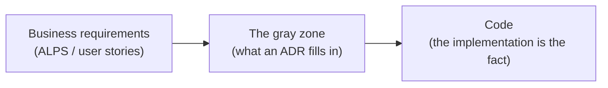
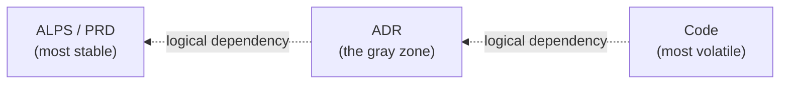
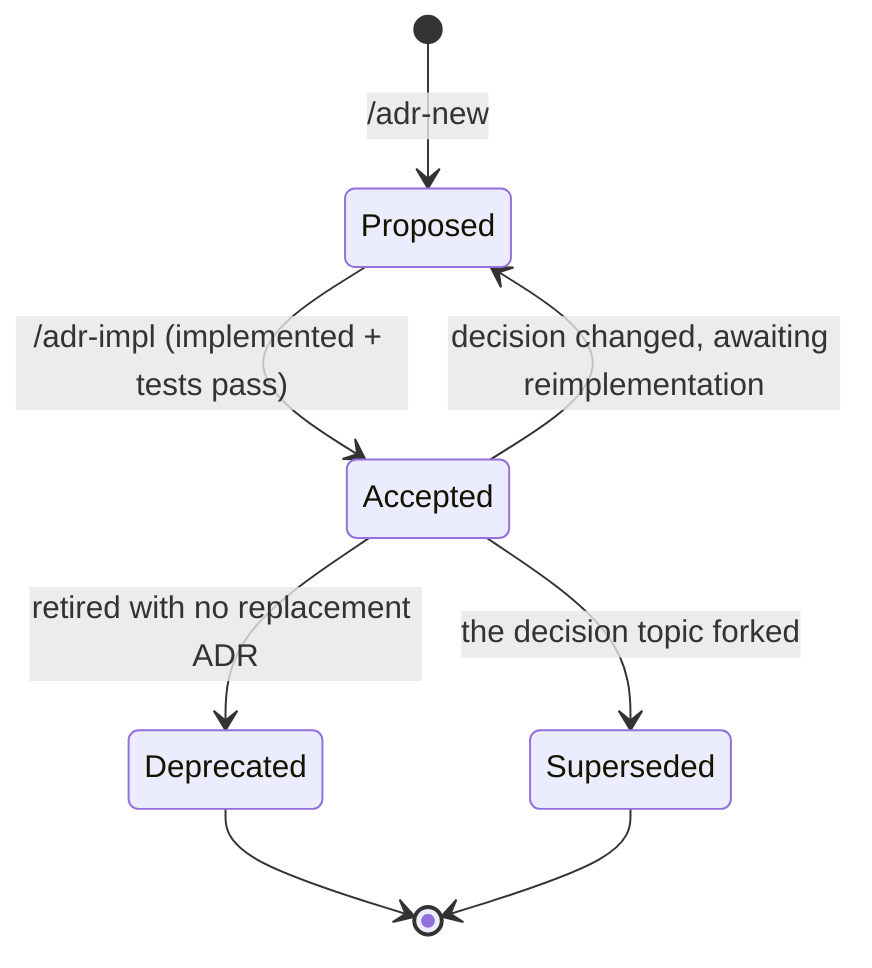

# Architecture Decision Records (ADR)

This directory documents the project's major architectural decisions. An ADR is the rationale behind the code implementation, and new decisions are written directly with `/adr-new <category>`. In a project that also has an ALPS (PRD), each Section 7 feature can be converted into an ADR in one pass with the `/feature-to-adr` helper.

This document is an index. The detailed rules and structure are split into sub-documents.

- [`authoring-rules.md`](./authoring-rules.md) — what goes into an ADR body and what stays out: the regeneration test, the requirement gate and two filters, requirement values vs implementation tuning values, code-reference depth, DB changes as one unit, and the review checklist
- [`structure.md`](./structure.md) — the DDD domain (bounded context) × feature directory layout, feature sub-folder splitting, subdomain classification, and the [`ADR registry`](./structure.md#the-adr-registry-mappingjson) (`.mapping.json` policy)

## What is an ADR?

An Architecture Decision Record (ADR) documents an important architectural decision made during software development. Each ADR contains:

- **Context**: the background and problem that required the decision
- **Decision Drivers**: the pressures, constraints, and requirements used to evaluate the options (only those that genuinely discriminate between them)
- **Decision**: the decision made and why
- **Alternatives**: **at least two** realistic alternatives and why they were not adopted
- **Consequences**: the positive and negative effects of the decision

## What an ADR covers — the gray zone between business and code

An ADR is the document that makes concrete the ambiguous area wedged between **business requirements (WHY)** and **code (WHAT/HOW)**. Only this gray zone goes into an ADR — and here the gray zone includes not just "the rationale for the decision" but **the requirement contract the result must honor** (see [the regeneration test](#the-regeneration-test--the-single-standard-for-adr-completeness) below).



**What belongs to the gray zone** — decisions whose motivation and rationale cannot be seen from the code alone, plus **the contract the result must honor.**

- Among **several approaches** that could solve the same requirement, **why this one was chosen** (the alternatives comparison and adoption rationale)
- **Cross-cutting decisions** scattered across the code that are invisible unless gathered in one place (e.g. the token rotation policy, the key design pattern, a whole state machine)
- How a business rule is **translated into system behavior** (e.g. "7-day grace period after signup" → which triggers, tables, and state values express it)
- **The requirement values the result must honor** — numbers such as max turns, count limits, retention periods, size caps, and response targets that become a requirement violation if a developer changes them at will. Record the value and its basis verbatim (conversely, do not record tuning values the implementation chose for performance — for the criteria see [`authoring-rules.md`](./authoring-rules.md#concrete-numbers--keep-requirement-values-drop-tuning-values))
- **Non-numeric requirements** — allowed value sets (the list of order states and their transition rules), mandatory fields, permission and visibility rules, ordering and uniqueness, and the unit of money or time. Requirements do not arrive only as numbers, so keep them by applying the same deciding question ("would a developer changing this at will be a violation?"). **Split enums — the allowed set and transitions belong to the ADR, the identifier name and representation to the code** ([`authoring-rules.md`](./authoring-rules.md#non-numeric-requirements--value-sets-mandatory-fields-permissions-ordering))
- **Conceptual-level relationships** between domain models (not field definitions, but at the level of "Flashcard and Vocabulary are linked by phrase hash")
- The **fallback / degradation policy** when depending on an external system or service
- The **intended trade-offs and risks** a decision carries

**What does not belong to the gray zone** — anything an agent or reviewer can learn by reading the code this ADR governs that is **also not a requirement** is not the ADR's business. Function and class responsibilities, signatures, field types, design patterns, directory layout, error message wording, env var names, pseudocode, performance tuning values, and the like have the code plus docstrings, the README, and AGENTS.md as their source of truth. Transcribing them into an ADR only adds the burden of updating the ADR on every code change and accumulates drift. For the detailed forbidden/keep tables see [`authoring-rules.md`](./authoring-rules.md#what-to-exclude-from-an-adr).

### The regeneration test — the single standard for ADR completeness

An ADR's goal is **not to reproduce the same code, but to make regenerated code satisfy the business requirements.**

> If all the code were deleted and only this ADR survived, could someone read it and rebuild code that honors the requirements exactly?

- **Implementation, structure, and names may differ** — they are not in the ADR, so they are discretionary.
- **Nothing the result must honor may be missing** — if it is, the regenerated code violates a requirement.

This test takes precedence over [the code-readthrough test](#the-code-readthrough-test-the-second-filter) below. For the full definition and the requirement gate, see [`authoring-rules.md`](./authoring-rules.md#what-an-adr-must-satisfy--the-regeneration-test).

### Requirements live in both the ADR and the code — and the ADR comes first

The fact that a requirement value or rule also lives in the code is not a reason to drop it from the ADR. The two hold different things — **the ADR is the contract** ("a chat session is capped at 7 turns — pricing policy"), and **the code is that contract's enforcement** (the logic that counts turns and cuts off past 7). From the code alone you can see "it is 7 turns today" but **not whether that is a contract to honor or a value the implementation happened to pick.**

So changing that value changes a system behavior requirement, and the order is fixed — **fix the ADR first (plus one line in `decision-log.md`, since it is major), then bring the code into line.** This holds even when it looks like a single constant. Conversely, a tuning value absent from the ADR is implementation discretion and carries no such order. For details see [`authoring-rules.md`](./authoring-rules.md#requirements-live-in-the-code-and-in-the-adr--layers-not-duplication).

### Dependencies run one way; references are written in neither direction

PRD → ADR → code is a **logical one-way dependency.** When an inner (upstream) layer changes, the outer layers follow, but never the reverse.



References are **written directly on neither edge (PRD↔ADR, ADR↔code).** PRD↔ADR is not stored at all (adr-writer does not reference ALPS), and only the linkage of categories, ADRs, and `dependsOn` lives in one external mapping layer (`.mapping.json`).

- **No ADR → code references**: never write files, functions, or line numbers in an ADR. For the detailed rule see [`authoring-rules.md`](./authoring-rules.md#code-references--folder-level-only).
- **No code → ADR references**: never leave an ADR ID or path in comments, constants, or imports. ADR numbers move through split / rollup / supersede, so code holding an ADR ID forces a cascade of code edits on a structural change even when the decision did not change.
- **No ADR → PRD references**: never write an ALPS file path, section number, or feature ID in the ADR body (Context and Related included). An ADR _absorbs_ the PRD's motivation but never _points at_ it — because if a PRD feature is split, renumbered, or restructured, that would force ADR body edits even though the decision did not change. Never copy the PRD's user stories or acceptance criteria into an ADR either (duplication → drift).
- **No PRD → ADR references**: an ALPS document never writes a specific ADR ID or path in its body. The PRD is the most stable contract and knows nothing of its downstream artifacts.
- **When an ADR decision changes, the code changes / when the PRD changes, the ADR and code change** — that is the normal flow a one-way dependency intends. The reverse (a code change dragging the ADR, or an ADR change dragging the PRD) must never happen.
- **Keep the linkage in the external mapping layer**: [`docs/adr/.mapping.json`](./structure.md#the-adr-registry-mappingjson) records the ADR index (categories → adrs, each with path, status, summary) and the `dependsOn` between categories in one place. **PRD references are not stored in the mapping** — adr-writer does not reference ALPS. ADR↔code is likewise not pointed at from the body (the code is searched for as needed), and this mapping is the only coupling point joining categories, ADRs, and dependencies.
- **Verifying the stability gradient**: change frequency must follow `Code >> ADR >> PRD`. If a change in a volatile layer drags a change in a stable one, an arrow is drawn wrong — usually because the ADR holds code detail, or the code holds an ADR ID, or the ADR holds an ALPS path.

### The code-readthrough test (the second filter)

Ask the **requirement gate** first — "if this fact were missing, could code rebuilt from the ADR alone violate a requirement?" YES means **keep it unconditionally**, without applying the filter below.

Only for lines that failed the gate (i.e. are not requirements), ask:

> "Would an agent reading the code this ADR governs discover this fact?"
>
> **YES** → leave it out of the ADR (the code is the source of truth).
> **NO** → it is a gray-zone candidate. It then has to pass [the litmus test](./authoring-rules.md#the-requirement-gate-and-two-filters) to go into the ADR.

Only what the gate kept plus what passed both filters stays in the ADR body. For the full definition of the three questions see [`authoring-rules.md`](./authoring-rules.md#the-requirement-gate-and-two-filters).

> **Caution — "the code has that value" is not grounds for dropping a requirement that passed the gate.** A requirement value or rule is naturally enforced in the code too (that is what makes it work), so it is visible on a code readthrough. But it passed the gate first, so it is not subject to this filter — see [Requirements live in both the ADR and the code](#requirements-live-in-both-the-adr-and-the-code--and-the-adr-comes-first) above. What this filter removes is what is "in the code **and also not a requirement.**"

## Kinds of decisions an ADR covers

Write an ADR when the decision falls into one of these.

| Kind                     | Examples                                                                                                                 |
| ------------------------ | ------------------------------------------------------------------------------------------------------------------------ |
| **Domain decisions**     | Authentication method, payment model, permission scheme, core domain entity relationships and state machines             |
| **Infrastructure**       | Deployment topology, caching strategy, monitoring and alerting structure, CDN/image handling policy                      |
| **Data decisions**       | DB key design (PK/SK/GSI), single-table vs multi-table, migration strategy                                               |
| **External integration** | Choosing external services (LLM, payments, mail, push) and the graceful degradation policy                               |
| **Security and ops**     | Secret management strategy, token rotation, audit log scope, backup/recovery RPO and RTO                                 |
| **UX architecture**      | Routing structure, state-management library choice, design system adoption — the tokens themselves go to the design docs |
| **Migration**            | API version transition strategy, backfill safety, acceptable downtime                                                    |

ADR folders are grouped along **two axes: DDD domain (bounded context) × feature (vertical slice)** — the top-level folder (`docs/adr/<context>/`) is the domain expert's model boundary (a bounded context), and a sub-folder (`<context>/<feature>/`) is one user action's vertical slice. An ALPS Section 7 feature maps 1:1 onto that sub-folder (or onto the flat context folder when there is only one feature). For why folders are never created per technical layer, the subdomain classification (core/supporting/generic), and the conditions for using a cross-cutting context, see [`structure.md`](./structure.md#directory-structure--ddd-domain-bounded-context--feature-vertical-slice).

## What an ADR is not (anti-patterns)

Do not turn these into ADRs. Doing so lowers ADR credibility and only increases the review burden.

- **Bug-fix decisions** — "added a null check to this function" is not an ADR reason. The code and the commit message suffice
- **Style/formatting changes** — Prettier or ESLint rule changes belong in the PR description or CONTRIBUTING.md
- **Dependency patch upgrades** — `lodash 4.17.20 → 4.17.21`. A major upgrade (`React 17 → 18`) is an ADR candidate
- **Refactoring** — from extracting a function or renaming to tidying an interface or relocating modules, a structural change that does not alter behavior is not an ADR target. The coding agent's planning step plans the change scope and caller impact as it goes, so there is no need to transcribe that plan into an ADR (a plan is meant to be volatile alongside the code; freezing it into an ADR drags the stable layer along with the refactor). But if a refactor **changes the decision itself** (replacing the adopted alternative, changing a state machine or key design, changing an external-dependency fallback), that is not a refactor but a decision change, so update the relevant ADR
- **Temporary experiments and POCs** — a "we'll decide next week" stage is written as an ADR once the decision is settled
- **Personal working guides** — conventions such as "this module always lives under internal/" belong in AGENTS.md or the README

When the judgment is ambiguous, apply [the requirement gate and two filters](./authoring-rules.md#the-requirement-gate-and-two-filters).

## ADR vs ALPS vs design documents

The three documents address the same decision **at different levels of abstraction.** Never record the same information twice.

| Document                  | The question it answers       | Example                                                                     |
| ------------------------- | ----------------------------- | --------------------------------------------------------------------------- |
| **ALPS PRD**              | WHAT / WHY (user's view)      | "Add an email signup feature. Target +10% new-signup conversion"            |
| **ADR**                   | HOW (architectural view)      | "JWT rotates as a short-lived access token plus a 7-day refresh"            |
| **Design docs / tokens**  | HOW (visual and interaction)  | "Primary color, input field height 48px, error toast pattern"               |
| **Code/AGENTS.md/README** | HOW (detailed implementation) | "File structure, function signatures, connection pool size, setup commands" |

Note that the "7-day" in the ADR row stays intact rather than being blurred — **the ADR keeps the requirement values**, while the code keeps the tuning values (pool sizes, backoff) that realize the same decision.

Rule: never copy ALPS's user stories or acceptance criteria into an ADR — per [the dependency model](#dependencies-run-one-way-references-are-written-in-neither-direction) above, an ADR absorbs ALPS's motivation but never points at the PRD (adr-writer does not reference ALPS). Design token values go to the design docs; function signatures and file paths go to the code and its docstrings.

## Status



`Superseded` names the successor ADR in the form `Superseded by [ADR XXXX](link)`.

| Status     | Meaning                                                                                                                       |
| ---------- | ----------------------------------------------------------------------------------------------------------------------------- |
| Proposed   | The ADR has been proposed to the system. Even when the decision itself is agreed, **the code implementation is not finished** |
| Accepted   | **The code implementation is complete.** The behavior the ADR describes actually exists in the codebase and passes tests      |
| Deprecated | No longer valid. Retired with no replacement ADR                                                                              |
| Superseded | Replaced by a new ADR. Names the successor in the form `Superseded by [ADR XXXX](link)`                                       |

### Automatic transition rules

Status is **not a value a human asks about and changes by hand, but one the cycle updates automatically.**

- When a new ADR is created by `/adr-new` (or `/feature-to-adr`, which delegates to it), it is always saved as `Proposed`. Never ask the user "shall I make it Accepted?"
- When `/adr-impl` implements an ADR and the tests pass, that command updates the ADR's Status to `Accepted` automatically. It does not separately confirm the promotion.
- `/adr-sync` catches Status drift by comparing the code with the ADR: if the ADR is `Accepted` but the behavior it describes is absent from the code, it reverts to `Proposed`; if the ADR is `Proposed` but the code plus tests exist, it promotes to `Accepted`. (The bar for `Accepted` is **implementation plus passing tests**, as in the status table above — never promote on the existence of code alone.)
- **When a requirement change actually changes the decision of an already-`Accepted` ADR** (even an in-place edit, if the decision's direction changed — for the judgment call see [`authoring-rules.md` "Changing an ADR — edit-in-place vs supersede"](./authoring-rules.md#changing-an-adr--edit-in-place-vs-supersede)), revert Status to `Proposed` until the new decision is reflected in code and tests. `/adr-impl` then auto-promotes `Proposed → Accepted` again. For a supersede, rather than reverting, mark the old ADR `Superseded` and start the new ADR as `Proposed`. A mere implementation-fact correction (an API table, an entity name, and so on) means the decision did not change, so it is not subject to this rule — keep `Accepted`.
- Record the date with the transition: `Accepted (YYYY-MM-DD)`, `Deprecated (YYYY-MM-DD)`. **The parentheses hold the date only** — just the single date, as in `Accepted (2026-07-09)`, with no trailing references, feature IDs, or implementation notes (`Accepted (2026-07-09) — implements F1` and `Accepted (2026-07-09, ref)` are both forbidden — `adr-structure-lint` catches them as `date-only`). `Superseded` is marked with the successor link instead of a date (`Superseded by [ADR XXXX](link)`). `Proposed` carries no date — the authoring date lives in the `Date:` at the top of the body (the time of writing, separate from the Status transition date), and the date on the Status line is recorded only on a transition.
- Never use informal statuses such as `Implemented`, `Done`, or `Completed`.

### Where evolution history lives — decision-log.md

An ADR body is **a requirements document describing the current state of the code** — no timeline narration such as "it was X at first, then changed to Y". When the same decision evolves, **overwriting the existing ADR to current state (edit-in-place) is the default**, and if that transition is major (replacing the adopted alternative, changing the core algorithm or architecture, inverting a Driver, retirement), leave one line, newest first, in the per-category `docs/adr/<category>/decision-log.md`. Create a new ADR (a supersede) only when the decision topic forks and the old decision must coexist as a separate record (for the judgment call see [`authoring-rules.md` "Changing an ADR — edit-in-place vs supersede"](./authoring-rules.md#changing-an-adr--edit-in-place-vs-supersede)).

**Three layers preserve different things**: the ADR body = current state / `decision-log.md` = the timeline of major changes / Git = the verbatim diff. The log is a **convention file** rather than an ADR, so it is not registered in `.mapping.json` and the deterministic harness does not check it — for the recording criteria and format see [`authoring-rules.md` "Decision log (decision-log.md)"](./authoring-rules.md#decision-log-decision-logmd), and for the directory and non-indexing policy see [`structure.md`](./structure.md#decision-log-decision-logmd--a-convention-file-not-registered-in-the-mapping).

## ADR template

```markdown
# ADR XXXX: title

Date: YYYY-MM-DD

## Status

Proposed | Accepted (YYYY-MM-DD) | Deprecated (YYYY-MM-DD) | Superseded by [ADR XXXX](link)

<!-- The Accepted/Deprecated parentheses hold the transition date only — no trailing references or explanations. -->

## Context

The background and problem requiring the decision. _Absorb_ the PRD's business motivation and narrate it here — never write an ALPS file path, section number, or feature ID in the body. Never point at the PRD (adr-writer does not reference ALPS).

## Decision Drivers

- The 3-5 pressures, constraints, and requirements that discriminate this decision. Not generic quality attributes ("maintainability") but only what genuinely decides between the options.
- Examples: "handle 10k concurrent users", "PII must not leave the system", "the team has Go experience only".

## Decision

The decision made and why.

### Requirement contract

(What the result must honor — so it can be rebuilt from this alone once the code is gone. Record **requirement values with their number and basis verbatim**, such as limits, quotas, cycles, retention periods, and allowed ranges. Example: "a chat session is capped at 20 turns — pricing policy". **Record non-numeric requirements here too** — allowed value sets and forbidden transitions, mandatory fields, permissions and visibility, ordering and uniqueness, units. Example: "an order is paid, shipping, delivered, or cancelled, and a cancelled order never moves to shipping". Do not record implementation tuning values (pool sizes, backoff, cache TTL) or enum identifier names.)

### Sequence diagram

If the decision involves async processing, cross-service integration, or event flow, add a Mermaid diagram.

### Alternatives

Compare **at least two** realistic alternatives. Real alternatives only — never include a strawman (an option nobody would take). Write each alternative's pros and cons against the Decision Drivers above. If it truly was the only path, reconsider whether the decision needs an ADR at all.

## Consequences

### Positive / Negative / Risks

## Implementation Notes

(An optional section — keep it only when there are architecture-level implementation considerations, and omit it otherwise.) Architecture-level considerations only. Do not include code snippets, file paths, per-field schemas, or implementation tuning values. Requirement values go in the Decision's requirement contract, not here.

## Related

- Related ADRs: [...] (links to ADRs in the same or a depended-upon category — ADR ↔ ADR references are fine)
- Schema/table documents: [...] (when there is a DB change)

> adr-writer is standalone, so an ADR body never points at the PRD — do not write an ALPS feature link here either. The mapping stores no PRD reference.
```

> The template's section headings are illustrative. Write ADR bodies in the language the user writes in (`authoring-rules.md` "Conventions") — the harness accepts either an English "Alternatives" heading or its localized equivalent.

## Where the ADR index lives

The ADR list is held solely by [`docs/adr/.mapping.json`](./structure.md#the-adr-registry-mappingjson) rather than this README — each category's `adrs[]` record carries a path, Status, and one-line summary, and the UserPromptSubmit hook renders that index every turn. So the README keeps no separate ADR list and remains a **conceptual index** only: what an ADR is, the gray-zone model, the dependency model, and the template. When you add an ADR or its body decision changes, update that one-line summary in the corresponding `adrs[]` record in `.mapping.json`.

## References

- [ADR GitHub](https://adr.github.io/) — a collection of general ADR material
- [Joel Parker Henderson — ADR templates](https://github.com/joelparkerhenderson/architecture-decision-record) — a comparison of various templates
- [Michael Nygard — Documenting Architecture Decisions](https://cognitect.com/blog/2011/11/15/documenting-architecture-decisions) — the original ADR article
- [adr-writer plugin](https://github.com/haandol/alps-writer-plugins) — this plugin itself
