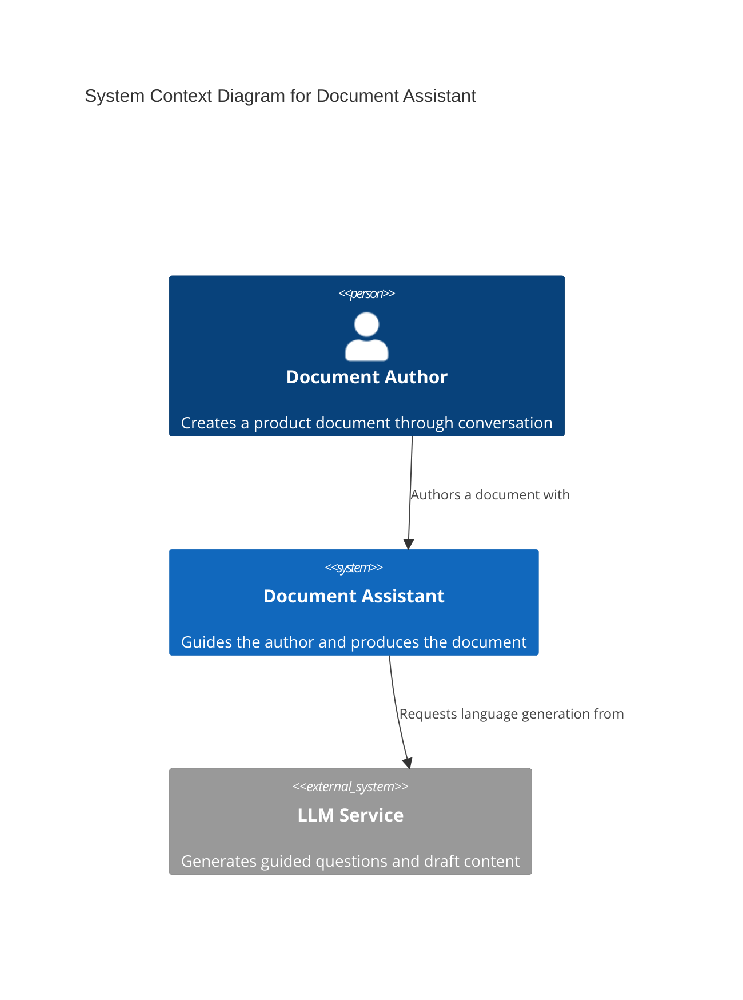
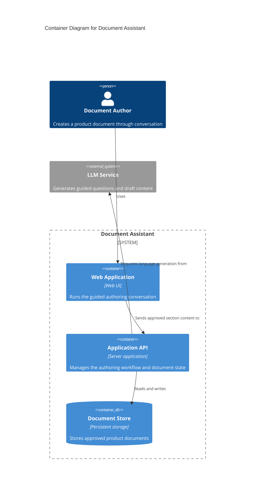

<section_guide number="4" title="High-Level Architecture">
<purpose>Describe the system architecture using C4 model Context and Container diagrams</purpose>

<scope_boundary>
Section 4 = what the system is MADE OF (topology, stack, external integrations) — cross-cutting, stated once. How each feature uses that stack belongs to Section 7.3 (per-feature vertical slice). Don't let a system-wide technical fact (auth mechanism, DB choice) be re-declared per feature in 7.3 — keep it here as the single source so the two don't drift.

Section 4.1 MUST contain both a Mermaid `C4Context` diagram and a Mermaid `C4Container` diagram. These are the only C4 levels ALPS uses. Never generate Component, Dynamic, Deployment, or Code-level C4 diagrams, and never put modules, classes, functions, files, or methods into the Container diagram.
</scope_boundary>

<questions>
1. Who uses the product, and which external systems or services interact with it? (Context)
2. What are the major independently running or deployable containers, data stores, and responsibilities inside the target system? (Container)
</questions>

<tech_stack_wizard>
Technology stack selection MUST follow this guided process for non-technical users:

Step 1 — Ask product characteristic questions (ONE at a time):

- Platform: "How will users access the product? (Web browser / Mobile app / Both)"
- Scale: "How many users do you expect at launch? (Under 100 / Hundreds / Thousands+)"
- Realtime: "Does the product need real-time features like chat or live notifications? (Yes / No / Not sure)"
- Team: "Does your development team have experience with specific technologies? If so, which ones?"
- Constraints: "Are there any infrastructure or budget constraints? (e.g., must use AWS, no paid services, etc.)"

Step 2 — Based on answers, propose 2-3 technology stack options:

- Present each option in a comparison table with columns: Option / Components / Pros / Cons
- Mark one option as "Recommended" with a clear reason
- Use non-technical analogies to explain trade-offs (e.g., "Option A is like renting a furnished apartment — quick to start but less customizable")
- If user answered "Not sure" to any question, explain what each choice implies in plain language

Step 3 — Confirm selection:

- After user picks an option, write Section 4.2 with the selected stack
- Record the Step 1 Scale answer in 4.2 as a one-line "Scale assumption" (e.g. `Scale assumption: ~1,000 total users at launch, tens concurrent at peak`). Do NOT leave it only in the conversation — it is the driver behind the stack, and Section 6.2's NFR wizard restates it when deriving the performance NFR. If the user gave a total but no concurrent figure, record the total and say the concurrent peak is still open.
- If user says "I don't know" or defers, use the recommended option and note it as "AI-recommended based on product characteristics"

IMPORTANT:

- Do NOT ask "What technology stack do you want?" directly
- Do NOT assume the user knows technical terminology
- Do NOT present more than 3 options — decision fatigue hurts non-technical users
- If the user already specified technologies (in earlier sections or conversation), respect those choices and skip the wizard
  </tech_stack_wizard>

<example>
### 4.1 System Context Diagram

### 4.1 System Container Diagram

### 4.2 Technology Stack

Scale assumption: ~500 total users at launch, under 10 concurrent at peak

| Component          | Technology                |
| ------------------ | ------------------------- |
| Frontend & Backend | Python (Chainlit)         |
| LLM API            | Amazon Bedrock, Langchain |
| Web Search API     | Tavily API                |

</example>

<completion>Include one confirmed C4 Context diagram, one confirmed C4 Container diagram, and the confirmed technology stack. Reject Component, Dynamic, Deployment, and Code-level diagrams.</completion>
</section_guide>
