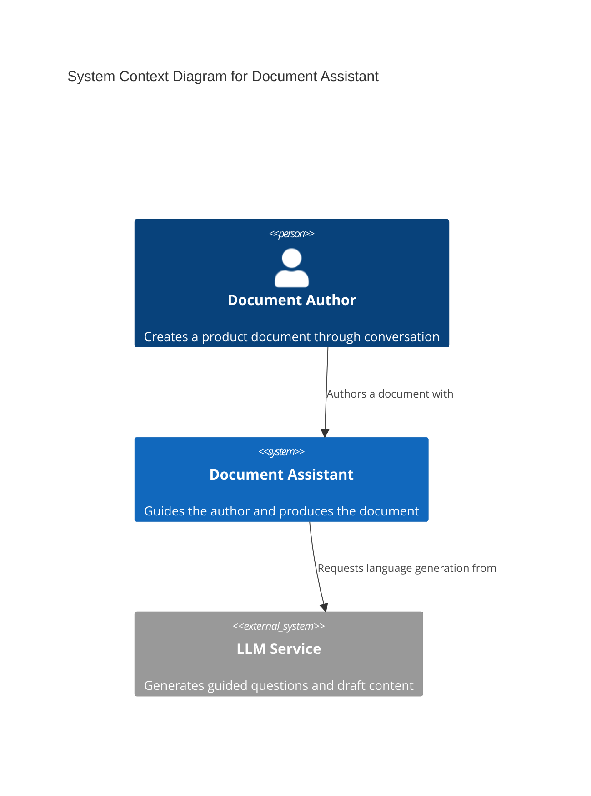
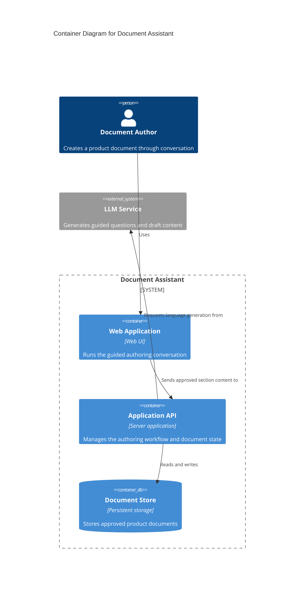

<section_guide number="4" title="High-Level Architecture">
<purpose>Describe the system architecture using C4 model Context and Container diagrams</purpose>

<inference_first>
Infer the Context, containers, scale assumption, and a recommended replaceable technology stack from
the approved product Sections, references, repository constraints, and dominant MVP defaults before
asking. Ask only about a missing constraint that would materially change a system boundary, provider,
security posture, deployment topology, budget commitment, or required scale. Mark inferred
architecture assumptions and stack choices in the approval digest.
</inference_first>

<scope_boundary>
Section 4 = what the system is MADE OF (topology, stack, external integrations) — cross-cutting, stated once inside the planning document. How each feature uses that stack belongs to Section 7.3 (per-feature vertical slice). Don't re-declare a system-wide fact per feature. Before handoff, Section 4 is the PRD's planning source for these facts; `/feature-to-adr` later classifies durable constraints into ADRs and leaves replaceable technology means to code. After successful handoff, ADRs are the implementation authority and this section may remain as legacy planning context.

Section 4.1 MUST contain both a Mermaid `C4Context` diagram and a Mermaid `C4Container` diagram. These are the only C4 levels ALPS uses. Never generate Component, Dynamic, Deployment, or Code-level C4 diagrams, and never put modules, classes, functions, files, or methods into the Container diagram.
</scope_boundary>

<questions>
1. Who uses the product, and which external systems or services interact with it? (Context)
2. What are the major independently running or deployable containers, data stores, and responsibilities inside the target system? (Container)
</questions>

<tech_stack_wizard>
Technology stack selection MUST use inference-first guidance for non-technical users:

Step 1 — Infer product characteristics before asking:

- Platform: derive from the approved user journey and product description.
- Scale: derive a pragmatic MVP assumption from the stated audience, rollout, and business context.
- Realtime: derive from the approved behavior and Demo.
- Team: use repository evidence or explicit team context when available.
- Constraints: use explicit infrastructure, provider, budget, security, or deployment constraints.

Ask one focused question only when a missing characteristic would materially change the system
boundary, provider, security posture, deployment topology, cost commitment, or required scale. Do
not ask the user to answer this entire checklist.

Step 2 — Propose the recommended stack:

- Present one recommended stack with a clear, plain-language reason.
- Mark user-unsupplied product characteristics and replaceable stack choices as `AI-inferred`.
- Present 2-3 options only when a real material trade-off remains after inference; otherwise avoid
  decision theatre.
- Explain any material trade-off without assuming technical knowledge.

Step 3 — Confirm the inferred decision:

- After approval, write Section 4.2 with the selected stack.
- Record the scale assumption in 4.2 as a one-line `Scale assumption`. Distinguish total from
  concurrent users when both matter. If a pragmatic MVP concurrency assumption is inferred, label
  it with its basis in the approval digest.
- If the user defers a replaceable stack choice, use the recommended option and note it as
  `AI-recommended based on product characteristics`.

IMPORTANT:

- Do NOT ask "What technology stack do you want?" directly
- Do NOT ask every product-characteristic question when the answer is recoverable
- Do NOT assume the user knows technical terminology
- Do NOT present more than 3 options — decision fatigue hurts non-technical users
- If the user already specified technologies, respect those choices and skip redundant analysis
  </tech_stack_wizard>

<example>
### 4.1 System Context Diagram

### 4.1 System Container Diagram

### 4.2 Technology Stack

Scale assumption: ~500 total users at launch, under 10 concurrent at peak

| Component          | Technology                |
| ------------------ | ------------------------- |
| Frontend & Backend | Python (Chainlit)         |
| LLM API            | Amazon Bedrock, Langchain |
| Web Search API     | Tavily API                |

</example>

<completion>Include one confirmed C4 Context diagram, one confirmed C4 Container diagram, and the confirmed technology stack. Reject Component, Dynamic, Deployment, and Code-level diagrams.</completion>
</section_guide>
