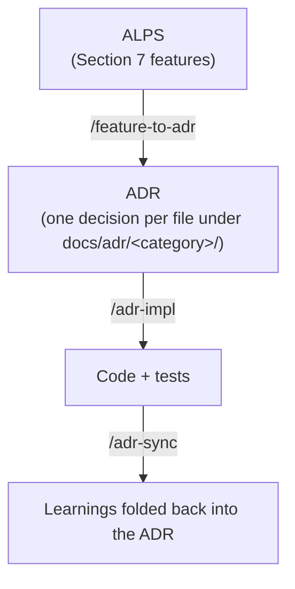

# About ALPS

**ALPS** (Agentic Lean Product Spec) is a PRD format designed for agentic development. Where a traditional PRD targets a human reader who fills in gaps from intuition, ALPS targets an AI agent that needs an unambiguous, machine-interpretable specification to write reliable code.

This document explains _what ALPS is_, _why it exists_, and _how it is structured_. ALPS Writer (this project) is the tool that drives an agent through producing one.

## The problem ALPS solves

Two recurring failure modes show up when teams ask LLMs to generate non-trivial code from a PRD:

1. **No standard format or structure.** Every team invents its own PRD shape. File layout, section names, level of detail — all up for grabs each time. Agents waste tokens guessing what the document is asserting; humans waste cycles re-deciding format instead of writing content.
2. **Quality depends on the author's skill.** A senior PO writes a PRD that constrains the agent well; a less experienced one writes a PRD the agent over-interprets. Same product, very different generated code.

ALPS attacks both: it fixes the **format** so structure is no longer a per-project decision, and it fixes the **authoring loop** so the agent — not the human — drives completeness.

## Three design principles

### 1. Format — unify everything an MVP needs

Business, design, and technical requirements are separated into distinct sections, each at an abstraction level an agent can act on. No mixing "we want users to feel delighted" with "POST /api/orders accepts an idempotency key."

### 2. Structure — built for feedback-loop development

ALPS organizes work as **vertical-slice features**. Each feature in Section 7 cuts UI → API → data store end-to-end so it can be implemented, tested, and shipped independently. Feature explanations use first-reader-friendly language so a junior developer can identify the actors, conceptual data, and visible result without opening the code. When several participants or layers make the flow easier to understand visually, ALPS recommends an optional Mermaid diagram and prefers `sequenceDiagram` for request, data, and response flow. This matches how agents actually iterate: small, verifiable units stacked into a working system.

### 3. Scope — Do and Don't are both explicit

Section 9 (Out of Scope) is not a footnote. By naming what the agent must _not_ build, ALPS keeps generated code from drifting into adjacent territory the team has deliberately deferred.

## The 9 sections

| #   | Section                     | Purpose                                                              |
| --- | --------------------------- | -------------------------------------------------------------------- |
| 1   | Overview                    | Product context, target users, problem statement                     |
| 2   | MVP Goals and Key Metrics   | What success looks like in measurable terms                          |
| 3   | Demo Scenario               | A concrete walk-through that anchors the rest of the document        |
| 4   | High-Level Architecture     | C4 Context/Container boundaries and durable architecture constraints |
| 5   | Design Specification        | UX/UI flows, component structure, error states                       |
| 6   | Requirements Summary        | Consolidated functional/non-functional requirements                  |
| 7   | Feature-Level Specification | Per-feature vertical slices plus an observable Demo checkpoint       |
| 8   | MVP Metrics                 | Instrumentation tied back to Section 2 goals                         |
| 9   | Out of Scope                | Explicit non-goals — what we are deliberately not building           |

Sections have explicit dependencies so that referenced material is reviewed before the section that depends on it. Section 7 reads both Section 3's end-to-end demo and Section 6's Feature list: each vertical slice ends its Acceptance Criteria with one sentence connecting its role in the overall demo to an observable completion result.

## How ALPS Writer authors a document

The conventional flow is _human asks the AI questions, AI answers_. The author's questioning skill caps the document quality.

ALPS Writer inverts this:

- **The agent asks**, the human answers.
- The agent walks through the 9 sections, one at a time, asking 1–2 focused questions per turn.
- The agent never auto-generates a section — every save requires the human's confirmation.
- Per-section conversation guides keep the questioning consistent across projects.

The result is a PRD whose quality is bounded by the _template_ and the _agent's questioning protocol_, not by how good a PRD writer the human happens to be.

## ALPS in the broader cycle

ALPS is the first stage of the agentic development cycle this plugin supports:

Each transferable ALPS Feature produces one or several ADRs. At least one ADR owns its reproducible requirement contract, while independent durable decisions remain separate and replaceable implementation means stay in code. Each ADR drives implementation; drift between code and ADR is detected and repaired.

The chain performs a one-way ownership handoff (PRD → ADR → code). Before handoff, ALPS owns planning intent. `/feature-to-adr` uses the regeneration test to find contracts or durable decisions that the PRD has not settled at ADR resolution, asks the user only for those gaps, and never invents requirement values or promotes replaceable implementation choices. A complete transfer moves every implementation-relevant contract into ADRs; afterward the ADR set is the only implementation authority and ALPS remains a legacy planning document. Normal implementation does not read it. If the user explicitly re-imports a changed PRD, the importer compares semantic obligations with current ADRs: equivalent input is a no-op, changed or new contracts become ADR change proposals, and removals require explicit confirmation. None of the artifacts references another in its own body — `docs/adr/.mapping.json` is the ADR index and stores no PRD reference, while related code is found by searching the repo.

## Further reading

- Project README — installation and command reference
- `templates/adr/concepts.md` — how the ADR cycle works, read after `/feature-to-adr`
- `get_alps_overview` MCP tool — runtime conversation guide consumed by the agent
