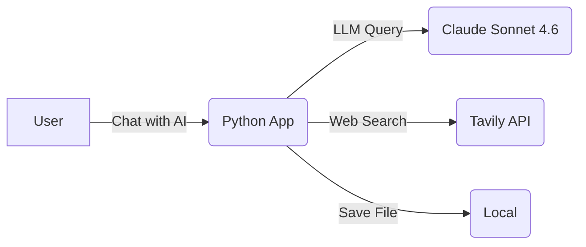

<section_guide number="4" title="High-Level Architecture">
<purpose>Describe the system architecture using C4 model Context and Container diagrams</purpose>

<questions>
1. What are the main components of the system?
2. Are there any external system/service integrations?
</questions>

<tech_stack_wizard>
Technology stack selection MUST follow this guided process for non-technical users:

Step 1 — Ask product characteristic questions (ONE at a time):
  - Platform: "How will users access the product? (Web browser / Mobile app / Both)"
  - Scale: "How many users do you expect at launch? (Under 100 / Hundreds / Thousands+)"
  - Realtime: "Does the product need real-time features like chat or live notifications? (Yes / No / Not sure)"
  - Team: "Does your development team have experience with specific technologies? If so, which ones?"
  - Constraints: "Are there any infrastructure or budget constraints? (e.g., must use AWS, no paid services, etc.)"

Step 2 — Based on answers, propose 2-3 technology stack options:
  - Present each option in a comparison table with columns: Option / Components / Pros / Cons
  - Mark one option as "Recommended" with a clear reason
  - Use non-technical analogies to explain trade-offs (e.g., "Option A is like renting a furnished apartment — quick to start but less customizable")
  - If user answered "Not sure" to any question, explain what each choice implies in plain language

Step 3 — Confirm selection:
  - After user picks an option, write Section 4.2 with the selected stack
  - If user says "I don't know" or defers, use the recommended option and note it as "AI-recommended based on product characteristics"

IMPORTANT:
- Do NOT ask "What technology stack do you want?" directly
- Do NOT assume the user knows technical terminology
- Do NOT present more than 3 options — decision fatigue hurts non-technical users
- If the user already specified technologies (in earlier sections or conversation), respect those choices and skip the wizard
</tech_stack_wizard>

<example>
### 4.1 System Diagram

### 4.2 Technology Stack

| Component          | Technology                |
| ------------------ | ------------------------- |
| Frontend & Backend | Python (Chainlit)         |
| LLM API            | Amazon Bedrock, Langchain |
| Web Search API     | Tavily API                |

</example>

<completion>Include Context/Container diagram descriptions and confirmed technology stack</completion>
</section_guide>
