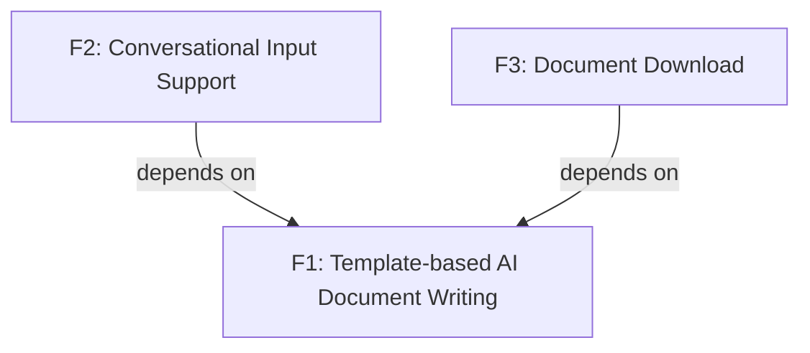

<section_guide number="6" title="Requirements Summary">
<purpose>Enumerate functional/non-functional requirements and assign priorities</purpose>

<questions>
1. List the core functional requirements
2. What is the priority of each requirement? (Must-Have / Should-Have / Nice-to-Have)
</questions>

<nfr_wizard>
Non-functional requirements MUST be guided through this process for non-technical users:

Step 1 — Ask scenario-based questions (ONE at a time) to derive NFRs:
  - Performance: "How many people do you expect to use the product at the same time? (Under 10 / Tens / Hundreds / Thousands+)"
  - Security: "Will users need to log in? Will the product handle sensitive information like payments or personal data? (Yes / No / Not sure)"
  - Availability: "If the service goes down, how quickly must it recover? (Within minutes / Within hours / Next business day is fine)"
  - Latency: "Are there any actions that must feel instant? For example, search results or page loads. (Yes, specify / No special needs)"
  - Others: "Are there any regulatory or compliance requirements? (e.g., GDPR, HIPAA, accessibility standards)"

Step 2 — Translate answers into NFRs:
  - Map each answer to a concrete non-functional requirement
  - Show the mapping: "Based on your answer about [topic], I recommend: [NFR with specific threshold]"
  - For each NFR, briefly explain:
    - What it means in plain language
    - What happens if this requirement is NOT met (risk)
    - Whether the proposed level is typical for MVP or more ambitious
  - If the user's expectation seems excessive for MVP, suggest a pragmatic alternative:
    "For MVP, [simpler level] is usually sufficient. You can tighten this in later iterations."
  - If the user's expectation seems too low, flag the risk:
    "This might cause [specific problem]. Consider raising it to [suggested level]."

Step 3 — Select top 3 and confirm:
  - If more than 3 NFRs were identified, present all and recommend the top 3 with reasoning
  - Ask user to confirm or adjust the final selection
  - Maximum 3 non-functional requirements for MVP

IMPORTANT:
- Do NOT ask "What are your non-functional requirements?" directly
- Do NOT use jargon like "SLA", "throughput", "p99 latency" without explaining
- Do NOT skip the risk explanation — non-technical users need to understand trade-offs to make informed decisions
</nfr_wizard>

<workflow>
After completing 6.1 and 6.2:
1. Analyze the features defined in 6.1 and automatically infer dependency relationships between them
2. Generate a Mermaid dependency diagram (graph TD) for Section 6.3
3. Present the generated diagram to the user and ask for confirmation or corrections
4. Do NOT ask the user to describe dependencies from scratch — propose your analysis first
</workflow>

<example>
### 6.1 Functional Requirements
- **F1: Template-based AI Document Writing** - AI generates documents based on a predefined ALPS (PRD) template, reflecting user input
- **F2: Conversational Input Support** - Users can fill in the document step by step through conversation with AI
- **F3: Document Download** - Download the completed document in Markdown format

### 6.2 Non-Functional Requirements

- **NF1: Performance** - Support 1,000 concurrent users, document generation within 30 seconds
- **NF2: Security** - OAuth authentication via AWS Cognito

### 6.3 Feature Dependency Diagram

</example>

<important>Assign a unique ID to each functional requirement (F1, F2, ...)</important>
<completion required="true">Confirm after all requirements have been assigned IDs</completion>
</section_guide>
