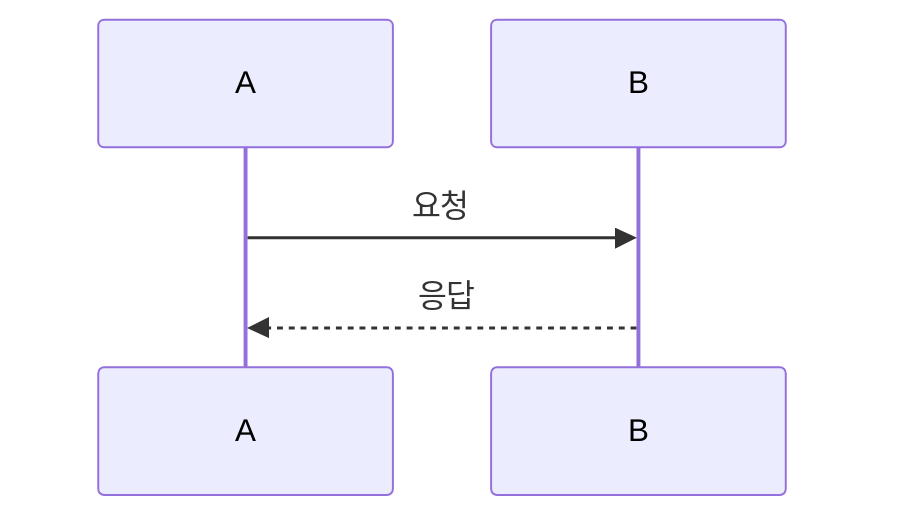

# Architecture Decision Records (ADR)

이 디렉토리는 프로젝트의 주요 아키텍처 결정을 문서화합니다. ALPS (PRD) Section 7의 각 feature는 한 개 이상의 ADR로 변환되어 코드 구현의 근거가 됩니다.

## 디렉토리 구조

```
docs/adr/
├── README.md         # 인덱스 + 작성 규칙 (source of truth)
├── .mapping.json     # ALPS feature ↔ ADR ↔ code paths 매핑 (hook이 참조)
└── <category>/       # ALPS feature 또는 도메인 단위 카테고리
    └── NNNN-kebab-title.md
```

- 카테고리는 ALPS Section 7의 feature 단위로 만든다 (예: `auth/`, `billing/`, `chat/`)
- 파일명: `NNNN-kebab-case-title.md`. 번호는 카테고리 내에서 순차 증가
- `Updated:` 날짜는 의미 있는 변경이 있을 때만 갱신

## 상태

| Status     | 의미                                                  |
| ---------- | ----------------------------------------------------- |
| Proposed   | 검토 중. 아직 합의되지 않은 결정                      |
| Accepted   | 합의 완료. 구현 여부와 무관하게 결정이 확정           |
| Deprecated | 더 이상 유효하지 않음. 대체 ADR 없이 폐기             |
| Superseded | `Superseded by [ADR XXXX](link)` 형태로 후속 ADR 명시 |

`Accepted`는 "구현 완료"가 아니라 "결정 확정"을 의미한다. 구현 상태는 코드와 커밋 히스토리로 추적한다.

## 작성 규칙

ADR은 **아키텍처 결정**(Context, Decision, Consequences)을 기록하는 문서다. 코드를 변경할 때마다 ADR을 같이 고쳐야 하는 부담을 줄이기 위해, **구현 세부사항은 ADR에 포함하지 않는다.**

### 리트머스 테스트

> "이 값/세부사항이 코드에서 바뀌면, 아키텍처 결정 자체가 바뀌는가?"
> **NO** → ADR에 넣지 않는다. **YES** → ADR에 유지한다.

### 코드 참조 깊이 — 폴더 단위까지만

ADR 안에서 코드를 가리킬 때는 **폴더(디렉토리) 단위**까지만 허용한다.

- 허용: `packages/api/handlers/`, `apps/web/src/components/`
- 금지: `apps/web/src/components/Login.tsx`, `services/auth/auth_service.go`
- 금지: 파일명·줄 번호 인용

본문, 표, Mermaid 다이어그램 모두에 동일하게 적용된다.

### 포함하지 않는 것

| 금지                     | 예                                | 대안                          |
| ------------------------ | --------------------------------- | ----------------------------- |
| 파일 경로 또는 그 이하   | `apps/web/src/Login.tsx`          | 폴더 단위까지만               |
| 코드 스니펫              | 함수 시그니처, 인터페이스, 구조체 | 코드가 source of truth        |
| 엔티티 상세 필드 표      | `phraseHash \| S \| ...`          | `docs/tables/`로 위임         |
| 구현 상수/튜닝값         | `MAX_RETRY = 3`                   | "재시도는 제한된다" 식 개념만 |
| 마이그레이션/운영 명령어 | `pnpm migrate ...`                | 스크립트 자체에 문서화        |
| 전체 API JSON 응답 예시  | 20줄짜리 응답                     | 목적·핵심 파라미터만 1-2문장  |

### 유지하는 것

- 문제 배경과 동기 (WHY)
- 결정 요약과 대안 비교
- 엔티티 관계 (개념 수준)
- 행동 규칙과 상태 전이
- 시스템 간 연동 방식
- Mermaid 다이어그램 (sequenceDiagram / stateDiagram / flowchart)
- Consequences (긍정/부정/리스크)
- DB 키 디자인과 액세스 패턴 (해당 시)

## 템플릿

````markdown
# ADR NNNN: 제목

Date: YYYY-MM-DD

## Status

Proposed | Accepted | Deprecated | Superseded by [ADR XXXX](link)

## Context

결정이 필요한 배경과 문제.

## Decision

내린 결정과 그 이유.

### 시퀀스 다이어그램 (선택)


````

## Consequences

### Positive

### Negative

### Risks

## Implementation Notes

아키텍처 수준의 구현 고려사항만. 코드 스니펫·파일 경로·필드별 스키마·구현 상수는 포함하지 않는다.

## Related

- ALPS feature: `prd/<doc>.alps.xml` Section 7 #<feature-id>
- 관련 ADR: [...]

````

## ALPS ↔ ADR 매핑

이 플러그인은 `docs/adr/.mapping.json`에 ALPS feature와 ADR, 영향 받는 코드 경로의 관계를 저장한다. PreToolUse hook이 이 파일을 읽어, 코드 수정이 매핑된 ADR보다 새로우면 ADR 동기화를 환기한다.

```json
{
  "$schema": "https://raw.githubusercontent.com/haandol/alps-writer-mcp/main/templates/adr/mapping.schema.json",
  "alpsDocument": "prd/example.alps.xml",
  "categories": {
    "auth": {
      "feature": "User Authentication",
      "alpsFeatureId": "F-AUTH-01",
      "codePaths": ["packages/api/auth/**", "apps/web/src/auth/**"],
      "adrs": ["docs/adr/auth/0001-jwt-rotation.md"],
      "tableDocs": ["docs/tables/users.md"]
    }
  }
}
````

매핑 파일은 `/feature-to-adr` 명령으로 생성·갱신된다.

## 카테고리별 ADR 목록

새 ADR을 추가하면 이 섹션에 한 줄 요약을 직접 추가한다. 자동 생성하지 않는다.

<!-- 예시:
### Auth
- [0001: JWT Rotation](./auth/0001-jwt-rotation.md) — Accepted. Refresh token rotation, 7일 만료
-->
